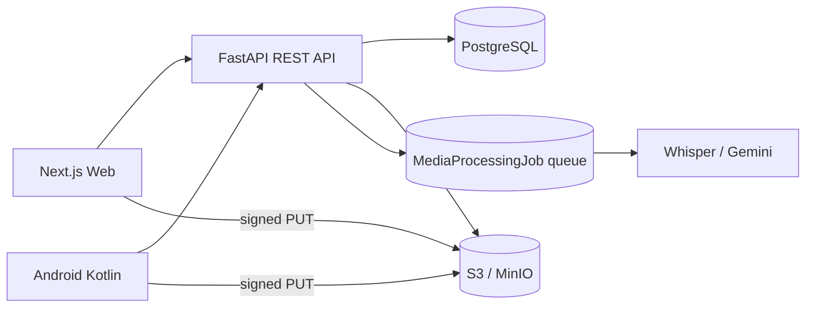

# Field Documentation Repository

Full-stack, API-first repository for field teams documenting artisans, crafts, workshops, products, tools, media, GPS locations and review decisions.

The app is split into:

- `backend/`: Python FastAPI REST API, JWT auth, Prisma ORM schema/client, PostgreSQL metadata, S3-compatible signed uploads, CSV export.
- `frontend/`: Next.js TypeScript + Tailwind CSS web interface for admins and researchers.
- `android/`: Kotlin + Jetpack Compose Android client using the same REST API.
- `docker-compose.yml`: local PostgreSQL and MinIO object storage.

## Architecture

PostgreSQL stores structured records, media metadata and durable media-processing jobs. In production this can be Supabase Postgres by setting the backend `DATABASE_URL` to the Supabase PostgreSQL connection string. Images, video, audio and PDFs are uploaded directly to S3-compatible storage using signed PUT URLs. The database stores object keys, URLs, MIME type, size, uploaded-by user, linked record IDs, optional GPS metadata, transcript state and queued AI processing state.

This keeps the backend API-first and reusable by both the web client and the Android client.

Detailed Mermaid diagrams are in [docs/ARCHITECTURE.md](docs/ARCHITECTURE.md).



## Local Setup

### 1. Start Infrastructure

```powershell
docker compose up -d
docker compose ps
```

This starts:

- PostgreSQL at `localhost:55432` on the host, mapped to `5432` inside the container
- MinIO API at `localhost:9000`
- MinIO console at `localhost:9001`
- A one-shot bucket initializer for `field-repository`

### 2. Configure And Run Backend

```powershell
cd backend
if (-not (Test-Path .env)) { Copy-Item .env.example .env }
python -m venv .venv
.\.venv\Scripts\Activate.ps1
pip install -e .
python -m prisma generate --schema=prisma/schema.prisma
python -m prisma migrate dev --schema=prisma/schema.prisma --name init
python scripts/seed_admin.py
uvicorn app.main:app --reload --port 8000
```

Backend checks:

```powershell
Invoke-RestMethod http://127.0.0.1:8000/health
```

Open API docs at `http://127.0.0.1:8000/docs`.

### 3. Configure And Run Frontend

```powershell
cd frontend
if (-not (Test-Path .env.local)) { Copy-Item .env.example .env.local }
npm install
npm run dev
```

Open the web app at `http://127.0.0.1:3000/login`.

### 4. Run Both Apps In Separate Terminals

Terminal A:

```powershell
cd backend
.\.venv\Scripts\Activate.ps1
uvicorn app.main:app --reload --host 127.0.0.1 --port 8000
```

Terminal B:

```powershell
cd frontend
npm run dev -- -H 127.0.0.1 -p 3000
```

### 5. Open Local Tools

- Web app: `http://localhost:3000`
- API docs: `http://localhost:8000/docs`
- MinIO console: `http://localhost:9001`

Default local admin credentials come from `backend/.env`:

- Email: `admin@example.com`
- Password: `ChangeMe123!`

Change them before using real data.

## Android App

The Kotlin Android app lives in `android/` and uses the same backend:

- Emulator base URL: `http://10.0.2.2:8000/api/`
- Physical device base URL: add an ignored `apiBaseUrl` line to `android/local.properties`, for example `apiBaseUrl=http://192.168.1.20:8000/api/`, and run the backend with `--host 0.0.0.0`.
- Package name: `com.fieldrepository.app`
- Google sign-in: Android Credential Manager requests a Google ID token with the same web OAuth client ID used by the Next.js app, then posts it to `POST /api/auth/login`.

Run from Android Studio:

1. Open the `android/` folder.
2. Let Gradle sync.
3. Start the backend on `127.0.0.1:8000`.
4. Run the `app` configuration on an emulator.
5. Log in with the admin email and password from your private `.env`, or use Google sign-in after OAuth is configured.

Command-line build, if Android SDK is installed:

```powershell
cd android
.\gradlew.bat :app:assembleDebug
```

The Android client supports email/password login, Google login, dashboard summary, and full field capture at parity with the web app through the same REST endpoints:

- Craft, artisan, workshop, product, tool and questionnaire forms capture the complete field set the backend accepts (not just a few columns), including local names, dimensions, costs, market demand, maker/tradition type, status and remarks.
- Every record form embeds native media capture (pick files, take photo, record video, record audio) that links uploaded media to the record automatically, plus one-tap GPS tagging.
- Craft and artisan dropdown pickers (with a free-text fallback) auto-fill linked names; workshops and questionnaires use an artisan multi-select; workshops use native start/end date pickers.
- Product and tool forms accept an optional grid-sheet measurement image that is uploaded with a `MEASUREMENT` processing request so the backend Gemini worker can estimate empty length/breadth.
- Audio uploaded from any form sends a `TRANSCRIPTION` processing request, queuing Whisper transcription on the backend.

## Google OAuth Setup

Backend verification and web sign-in use the web OAuth client ID only. The web client secret is not required for this ID-token login flow and should not be committed.

Local ignored env values:

```powershell
# backend/.env
GOOGLE_CLIENT_ID=<google-web-client-id>

# frontend/.env.local
NEXT_PUBLIC_GOOGLE_CLIENT_ID=<google-web-client-id>
```

For Android Google sign-in, create an Android OAuth client in Google Cloud Console with:

- Package name: `com.fieldrepository.app`
- SHA-1 certificate fingerprint: the debug or release signing certificate fingerprint for the build you run
- Android OAuth client ID: `614092441670-5rckig6t1al6plbfll8irn9prcmp446t.apps.googleusercontent.com`

Get the local debug SHA-1 with:

```powershell
keytool -list -v -keystore "$env:USERPROFILE\.android\debug.keystore" -alias androiddebugkey -storepass android -keypass android
```

The Android app keeps the web OAuth client ID in `android/app/build.gradle.kts` as `GOOGLE_WEB_CLIENT_ID` because Credential Manager uses it as the server client ID.

## Roles And Permissions

- `MASTER_ADMIN`: reserved for the email configured in `MASTER_ADMIN_EMAIL`; has complete user, review, edit and delete rights.
- `ADMIN`: junior admin; can review, delete records and manage users.
- `RESEARCHER`: can create records, see all repository entries, edit their own ordinary records, and add/edit questionnaire interviews.

The backend enforces these rules. The web UI hides delete controls from non-admin users.

## Field Capture, AI And Media

Media capture is embedded in the craft, artisan, workshop, product, tool and questionnaire workflows instead of being a primary menu destination. These record forms support:

- precise browser geolocation capture;
- MapTiler coordinate picking with `NEXT_PUBLIC_MAPTILER_API_KEY`;
- multiple images, videos, audio files and documents in one batch;
- camera/video capture through mobile browser file inputs;
- browser audio recording with a live level meter;
- original-file upload so image EXIF data is retained;
- EXIF summaries in remarks/metadata where image metadata is readable;
- queued OpenAI transcription for audio via `OPENAI_API_KEY`;
- collapsed transcript display for completed audio transcripts.

The product and tool forms support grid-sheet measurement images alongside manual `lengthInches` and `breadthInches`. The uploaded grid image is persisted first, then a `MediaProcessingJob` queues Gemini measurement. If `GEMINI_API_KEY` is configured, the worker estimates dimensions and fills empty dimension fields without overwriting manual values. If it is missing, the upload still works and the UI shows a yellow manual-entry caution.

### Durable Media Queue

`POST /api/media/complete` can include `processingRequests`, currently `TRANSCRIPTION` for audio and `MEASUREMENT` for grid-sheet images. The backend stores a `MediaProcessingJob` row before any AI request is attempted. The FastAPI lifespan starts a background worker that:

- recovers stale `PROCESSING` jobs after worker interruption;
- downloads the already-saved object from S3-compatible storage;
- calls Whisper or Gemini only after metadata is durable;
- retries transient failures with backoff;
- records unavailable API-key states without deleting uploaded media.

## Questionnaire

The questionnaire module is seeded from `2nd Workshop_Interview Questions.docx` into reusable questions. Run this after migrations:

```powershell
cd backend
.\.venv\Scripts\Activate.ps1
python scripts/seed_questionnaire.py
```

Researchers can create questionnaire interviews, link one interview to many artisans, answer any subset of the questions, and edit questionnaire interviews. Admin users can delete questionnaire interviews.

## Core API Endpoints

- `POST /api/auth/login`
- `POST /api/auth/logout`
- `GET /api/me`
- `CRUD /api/users` for admins
- `CRUD /api/artisans`
- `CRUD /api/crafts`
- `CRUD /api/workshops`
- `CRUD /api/products`
- `CRUD /api/tools`
- `POST /api/media/presign`
- `POST /api/media/complete`
- `GET /api/media`
- `GET /api/media/jobs`
- `POST /api/media/jobs/process`
- `POST /api/media/jobs/{jobId}/retry`
- `GET /api/dashboard/stats`
- `GET /api/search`
- `POST /api/review/{recordType}/{recordId}/approve`
- `POST /api/review/{recordType}/{recordId}/reject`
- `GET /api/export/products.csv`
- `GET /api/export/tools.csv`

Researchers can create and manage their own submissions. Admins can view all records, manage users, review submissions and export CSV.

## Signed Media Upload Flow

1. Client calls `POST /api/media/presign` with file name, MIME type, media type and size.
2. API returns a signed S3-compatible PUT URL and object key.
3. Client uploads the file directly to object storage with PUT.
4. Client calls `POST /api/media/complete` to store metadata in PostgreSQL and link it to a craft, artisan, workshop, product, tool or questionnaire interview.
5. For audio or measurement requests, the API writes a durable `MediaProcessingJob` row.
6. The backend worker processes queued jobs and patches transcript or measurement fields when available.

## Environment Variables

Required backend variables:

- `DATABASE_URL`
- `JWT_SECRET`
- `AWS_ACCESS_KEY_ID`
- `AWS_SECRET_ACCESS_KEY`
- `AWS_REGION`
- `AWS_S3_BUCKET`
- `AWS_S3_ENDPOINT`
- `NEXT_PUBLIC_APP_URL`

Useful optional variables:

- `AWS_S3_PUBLIC_BASE_URL` for preview/export links.
- `BACKEND_CORS_ORIGINS` comma-separated frontend origins.
- `GOOGLE_CLIENT_ID` to verify Google OAuth ID tokens.
- `GOOGLE_ANDROID_CLIENT_ID` to also accept Android OAuth audience tokens if needed.
- `MASTER_ADMIN_EMAIL` is required and should be set to the master administrator's Google account.
- `MASTER_ADMIN_NAME` defaults to `Ankit Kumar`.
- `OPENAI_API_KEY`, `OPENAI_TRANSCRIPTION_MODEL`, `GEMINI_API_KEY`, `NEXT_PUBLIC_MAPTILER_API_KEY` for optional transcription, measurement and map picking.
- `MEDIA_QUEUE_WORKER_ENABLED`, `MEDIA_QUEUE_INTERVAL_SECONDS`, `MEDIA_QUEUE_BATCH_SIZE`, `MEDIA_QUEUE_JOB_MAX_ATTEMPTS` for the background media-processing queue.
- `SUPABASE_REST_URL`, `SUPABASE_PUBLISHABLE_KEY`, `SUPABASE_SECRET_KEY` only when a deployment also needs Supabase REST/Admin access. The secret key must stay in private runtime secrets.
- `ADMIN_EMAIL`, `ADMIN_NAME`, `ADMIN_PASSWORD` for seeding the first admin. Keep the password only in private `.env` files or deployment secrets.

Required frontend variables:

- `NEXT_PUBLIC_API_URL`
- `NEXT_PUBLIC_APP_URL`

Optional frontend variable:

- `NEXT_PUBLIC_GOOGLE_CLIENT_ID`
- `NEXT_PUBLIC_MAPTILER_API_KEY`

## Supabase Postgres

To use Supabase for Postgres, set `DATABASE_URL` in `backend/.env` or the deployment environment to the PostgreSQL connection string from the Supabase dashboard. Use the pooled or direct database URL supplied under database connection settings, not the Supabase REST URL. If your direct host resolves only to IPv6, use Supabase's session/transaction pooler URL for local machines or CI runners without IPv6.

After switching `DATABASE_URL`, run:

```powershell
cd backend
python -m prisma migrate deploy --schema=prisma/schema.prisma
python scripts/seed_admin.py
python scripts/seed_questionnaire.py
```

Clients still call the FastAPI backend. They should not write directly to Supabase REST because backend validation, review state, role checks, media metadata and JWT authorization live in the API.

### Supabase Keep-Alive

The repository includes `.github/workflows/keep-supabase-active.yml`, which runs daily and calls `npm run keep-alive`. Add `SUPABASE_DATABASE_URL` as a GitHub repository secret, preferably using the Supabase pooler URL for reliable IPv4-compatible CI access. Set `SUPABASE_DB_SSL=true` only if that database endpoint requires SSL.

## Android Data Flow Notes

The Android app uses the same REST endpoints and JWT bearer auth:

- Email/password and Google login both call `POST /api/auth/login`.
- The returned access token is stored locally and sent as `Authorization: Bearer <token>` on protected API calls.
- Create forms submit directly to `/api/crafts`, `/api/artisans`, `/api/workshops`, `/api/products`, `/api/tools`, and `/api/questionnaire/interviews`.
- Native media capture uses the same presign-upload-complete sequence so files do not pass through the backend server.
- Audio uploaded from Android sends `processingRequests=["TRANSCRIPTION"]`, which queues Whisper transcription on the backend.
- Keep GPS capture in a separate location object and submit it with artisan/product/tool/workshop/media payloads.

## Cost Notes

- PostgreSQL stores relational data, JSONB metadata and S3 keys only.
- Object storage holds large media files.
- Signed uploads prevent backend bandwidth from scaling with media size.
- Pagination is implemented for list/search endpoints.
- Cloudflare R2, Backblaze B2, MinIO or AWS S3 can be used behind the same S3-compatible utility.
- Add object storage lifecycle rules for old/raw media and future thumbnail/transcription worker outputs.
