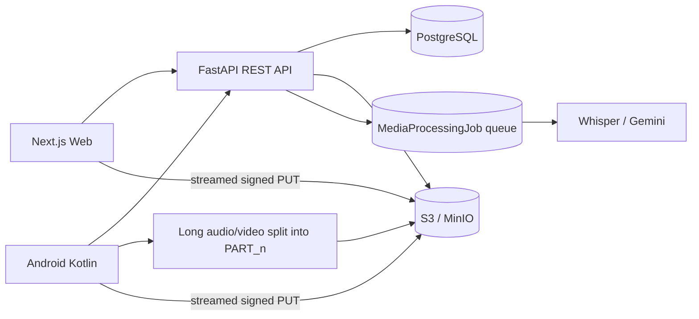

# Field Documentation Repository

Full-stack, API-first repository for field teams documenting artisans, crafts, workshops, products, tools, media, GPS locations and review decisions.

> **Live:** the backend runs on AWS (EC2 at `15.207.145.174`) and is served over HTTPS through
> CloudFront at **https://d2b34i3e92al6i.cloudfront.net/api/** (Terraform in `infra/terraform/`,
> auto-deployed by `.github/workflows/deploy-backend.yml`). CloudFront is dual-stack, so the API is
> reachable on IPv6-only mobile networks where the IPv4-only origin is not. To hand the app to researchers see
> [docs/RESEARCHER_GUIDE.md](docs/RESEARCHER_GUIDE.md); the backend deployment runbook is
> [backend/DEPLOY_AWS.md](backend/DEPLOY_AWS.md), the web one is
> [docs/DEPLOYMENT_VERCEL.md](docs/DEPLOYMENT_VERCEL.md); every environment variable is tabulated in
> [docs/ENVIRONMENT.md](docs/ENVIRONMENT.md); known failure modes are in
> [docs/QA_AUDIT.md](docs/QA_AUDIT.md).

The app is split into:

- `backend/`: Python FastAPI REST API, JWT auth, Prisma ORM schema/client, PostgreSQL metadata, S3-compatible signed uploads, CSV export.
- `frontend/`: Next.js TypeScript + Tailwind CSS web interface for admins and researchers.
- `android/`: Kotlin + Jetpack Compose Android client using the same REST API.
- `docker-compose.yml`: local PostgreSQL and MinIO object storage.

## Architecture

PostgreSQL stores structured records, media metadata and durable media-processing jobs. In production this can be Supabase Postgres by setting the backend `DATABASE_URL` to the Supabase PostgreSQL connection string. Images, video, audio and PDFs are uploaded directly to S3-compatible storage using signed PUT URLs. The database stores object keys, URLs, MIME type, size, uploaded-by user, linked record IDs, optional GPS metadata, transcript state and queued AI processing state.

This keeps the backend API-first and reusable by both the web client and the Android client.

Detailed Mermaid diagrams are in [docs/ARCHITECTURE.md](docs/ARCHITECTURE.md).


```mermaid
flowchart LR
  web[Next.js Web] --> api[FastAPI REST API]
  android[Android Kotlin] --> api
  api --> db[(PostgreSQL)]
  api --> s3[(S3 / MinIO)]
  api --> queue[(MediaProcessingJob queue)]
  queue --> ai[Whisper / Gemini]
  split[Long audio/video split into PART_n] --> s3
  web -->|streamed signed PUT| s3
  android --> split
  android -->|streamed signed PUT| s3
```

## Local Setup

### 1. Start Infrastructure

```powershell
docker compose up -d
docker compose ps
```

This starts:

- PostgreSQL at `localhost:55432` on the host, mapped to `5432` inside the container
- MinIO API at `localhost:9000`
- MinIO console at `localhost:9001`
- A one-shot bucket initializer for `field-repository`

### 2. Configure And Run Backend

```powershell
cd backend
if (-not (Test-Path .env)) { Copy-Item .env.example .env }
python -m venv .venv
.\.venv\Scripts\Activate.ps1
pip install -e .
python -m prisma generate --schema=prisma/schema.prisma
python -m prisma migrate dev --schema=prisma/schema.prisma --name init
python scripts/seed_admin.py
uvicorn app.main:app --reload --port 8000
```

Backend checks:

```powershell
Invoke-RestMethod http://127.0.0.1:8000/health
```

Open API docs at `http://127.0.0.1:8000/docs`.

### 3. Configure And Run Frontend

```powershell
cd frontend
if (-not (Test-Path .env.local)) { Copy-Item .env.local.example .env.local }
npm install
npm run dev
```

`.env.local.example` carries the localhost defaults; `.env.example` documents the production shape
of the same four variables. `NEXT_PUBLIC_API_URL` is the backend **origin only** — `lib/api.ts`
appends `/api` itself, so a trailing `/api` makes every request 404.

Open the web app at `http://127.0.0.1:3000/login`.

### 4. Run Both Apps In Separate Terminals

Terminal A:

```powershell
cd backend
.\.venv\Scripts\Activate.ps1
uvicorn app.main:app --reload --host 127.0.0.1 --port 8000
```

Terminal B:

```powershell
cd frontend
npm run dev -- -H 127.0.0.1 -p 3000
```

### 5. Open Local Tools

- Web app: `http://localhost:3000`
- API docs: `http://localhost:8000/docs`
- MinIO console: `http://localhost:9001`

Default local admin credentials come from `backend/.env`:

- Email: `admin@example.com`
- Password: `ChangeMe123!`

Change them before using real data.

## Android App

The Kotlin Android app lives in `android/` and uses the same backend:

- Default (production) base URL: `https://d2b34i3e92al6i.cloudfront.net/api/` — the API fronted by **CloudFront over HTTPS**. CloudFront is **dual-stack** (publishes a native IPv6 `AAAA` record), so the app connects on IPv6-only mobile networks (common with Jio/Airtel). The IPv4-only EC2 origin — whether addressed by its bare IP `15.207.145.174` or its AWS hostname `ec2-15-207-145-174.ap-south-1.compute.amazonaws.com` — works on Wi-Fi but fails on such cellular networks ("Failed to connect" for the IP, "No address associated with hostname" for the hostname, because `AI_ADDRCONFIG` drops an IPv4-only name when the phone has no IPv4 and there is no DNS64/NAT64). HTTPS also clears the web app's mixed-content block. Media uploads/reads use the **dual-stack S3 endpoint** (`s3.dualstack.ap-south-1.amazonaws.com`) for the same reason. A live device that still has IPv4 on cellular can be forced by setting the APN protocol to `IPv4/IPv6`.
- Emulator base URL: set `apiBaseUrl=http://10.0.2.2:8000/api/` in `android/local.properties`.
- Other physical device / LAN: set an ignored `apiBaseUrl` line in `android/local.properties`, for example `apiBaseUrl=http://192.168.1.20:8000/api/`, and run the backend with `--host 0.0.0.0`.
- Package name: `com.fieldrepository.app`
- Google sign-in: Android Credential Manager requests a Google ID token with the same web OAuth client ID used by the Next.js app, then posts it to `POST /api/auth/login`.

Run from Android Studio:

1. Open the `android/` folder.
2. Let Gradle sync.
3. Start the backend on `127.0.0.1:8000`.
4. Run the `app` configuration on an emulator.
5. Log in with the admin email and password from your private `.env`, or use Google sign-in after OAuth is configured.

Command-line build, if Android SDK is installed:

```powershell
cd android
.\gradlew.bat :app:assembleDebug
```

The Android client supports email/password login, Google login, dashboard summary, and full field capture at parity with the web app through the same REST endpoints:

- Craft, artisan, workshop, product, tool, process and questionnaire forms capture the complete field set the backend accepts (not just a few columns), including local names, dimensions, costs, market demand, maker/tradition type, status and remarks.
- Every record form embeds native media capture (pick files, take photo, record video, record audio) that links uploaded media to the record automatically, plus one-tap GPS tagging.
- Craft and artisan dropdown pickers (with a free-text fallback) auto-fill linked names; the process form cascades artisan → that artisan's products; tools/products cascade craft → that craft's artisans; workshops and questionnaires use an artisan multi-select; workshops use native start/end date pickers.
- Process documentation records how a product is made: ordered steps (sequential or grouped), per-step media, and an optional "record additional information" notes box per step.
- "Document using grid" reads **length and breadth from a single top-down photo** and height from a separate side-on photo (Gemini `gemini-2.5-flash-lite`), auto-filling the measurement fields; the grid photos are also stored as media.
- Long audio/video is **split into `PART_1`, `PART_2`, …** by re-muxing at sync frames before upload, so each part stays under the transcription/upload limits; uploads stream from the content URI so large videos never exhaust the device heap.
- Previously-uploaded media shows on edit forms with uploader/date provenance and a **Save to device** action; audio uploaded from any form sends a `TRANSCRIPTION` request, queuing Whisper transcription on the backend.

## Google OAuth Setup

Backend verification and web sign-in use the web OAuth client ID only. The web client secret is not required for this ID-token login flow and should not be committed.

Local ignored env values:

```powershell
# backend/.env
GOOGLE_CLIENT_ID=<google-web-client-id>

# frontend/.env.local
NEXT_PUBLIC_GOOGLE_CLIENT_ID=<google-web-client-id>
```

For Android Google sign-in, create an Android OAuth client in Google Cloud Console with:

- Package name: `com.fieldrepository.app`
- SHA-1 certificate fingerprint: the debug or release signing certificate fingerprint for the build you run
- Android OAuth client ID: `614092441670-5rckig6t1al6plbfll8irn9prcmp446t.apps.googleusercontent.com`

Get the local debug SHA-1 with:

```powershell
keytool -list -v -keystore "$env:USERPROFILE\.android\debug.keystore" -alias androiddebugkey -storepass android -keypass android
```

The Android app keeps the web OAuth client ID in `android/app/build.gradle.kts` as `GOOGLE_WEB_CLIENT_ID` because Credential Manager uses it as the server client ID.

## Roles And Permissions

Six-tier role ladder, strictly ordered by privilege. Each tier inherits everything below it;
per-user grantable booleans (`canManageQuestionnaire`, `canManageCrafts`, `canManageWorkshops`,
`canReview`, `canViewProvenance`, `canDownloadDataset`) can additionally lift a single capability
for a lower tier.

| Tier | Rank | Powers |
| --- | --- | --- |
| `MASTER_ADMIN` | 60 | Reserved for `MASTER_ADMIN_EMAIL` (ankits1802@gmail.com). Everything, including settings, OTA releases, and managing admins. |
| `ADMIN` | 50 | Manage users below their tier and promote up to ADMIN; review; delete records; full data access. |
| `PROFESSOR` | 40 | Everything a researcher can do, plus implicit questionnaire/craft/workshop management, review rights, and dataset download. No user management, no deletes. |
| `RESEARCHER` | 30 | Create and edit their own records, contribute to others' (fill-empty), run questionnaire interviews. |
| `FIELD_CONTRIBUTOR` | 20 | Capture-focused: create artisans/products/tools/processes and upload media; edit only their own records. |
| `CROWDSOURCE_VOLUNTEER` | 10 | Lowest tier and the default for new self-registered Google accounts (`DEFAULT_SIGNUP_ROLE`). Can upload media, answer questionnaires, and comment — cannot create core records. |

Promotion rules: you can assign roles **at or below your own tier**, and manage (edit/delete)
only users **below** your tier — so one admin can never rewrite another admin's account; only the
master admin manages peers. The backend enforces all of this; the web UI mirrors it.

## Field Capture, AI And Media

Media capture is embedded in the craft, artisan, workshop, product, tool and questionnaire workflows instead of being a primary menu destination. These record forms support:

- precise browser geolocation capture;
- MapTiler coordinate picking with `NEXT_PUBLIC_MAPTILER_API_KEY`;
- multiple images, videos, audio files and documents in one batch;
- camera/video capture through mobile browser file inputs;
- browser audio recording with a live level meter;
- original-file upload so image EXIF data is retained;
- EXIF summaries in remarks/metadata where image metadata is readable;
- queued audio transcription through the STT provider chain (see below);
- collapsed transcript display for completed audio transcripts.

### Transcription Provider Chain

Speech-to-text walks a provider chain in priority order, using whichever keys are configured and
failing over automatically on provider errors:

1. **ElevenLabs Scribe** (`ELEVENLABS_API_KEY`, model `scribe_v1`) — auto language detection,
   accepts files up to ~1 GB, no chunking needed.
2. **Deepgram Nova-3** (`DEEPGRAM_API_KEY`, model `nova-3`, `language=multi`) — code-switched
   Hindi + English handled natively.
3. **OpenAI Whisper** (`OPENAI_API_KEY`, `whisper-1`) — fallback only; files over 24 MB are split
   into 10-minute chunks and stitched.

The OpenAI key's primary role is **refinement and translation**: raw transcripts are rewritten into
clean interviewer/interviewee dialogue and translated to English per the master-admin
`transcriptionMode` setting (`RAW` / `REFINED` / `REFINED_TRANSLATED`). Provider throttling
(HTTP 429/503) still requeues jobs without burning attempts, exactly as before.

The product and tool forms support a "Document using grid" capture alongside manual `lengthInches`, `breadthInches` and height. Tick **Length & breadth** to read both from one top-down photo, and/or **Height** to read it from a side-on photo; each photo is analysed synchronously by Gemini (`GEMINI_MEASUREMENT_MODEL`, default `gemini-2.5-flash-lite`) and the returned inches auto-fill the matching fields (still editable). The grid photos are also stored as media on the record. If `GEMINI_API_KEY` is missing, the fields stay manual.

Decimal columns (measurements, costs) are returned by the API as JSON **strings**; the Android and web clients read them as strings so a record with a measurement never breaks list parsing.

The Tools page also has an **Assign a tool to multiple artisans** section: pick a tool, multi-select crafts, then tick the artisans of those crafts to assign the same documented tool to several artisans across the same or different crafts (`ToolArtisan` join), instead of re-entering the tool per craft.

### Durable Media Queue

`POST /api/media/complete` can include `processingRequests`, currently `TRANSCRIPTION` for audio and `MEASUREMENT` for grid-sheet images. The backend stores a `MediaProcessingJob` row before any AI request is attempted. The FastAPI lifespan starts a background worker that:

- recovers stale `PROCESSING` jobs after worker interruption;
- downloads the already-saved object from S3-compatible storage;
- calls Whisper or Gemini only after metadata is durable;
- retries transient failures with backoff;
- records unavailable API-key states without deleting uploaded media.

## Questionnaire

The questionnaire module is seeded from `2nd Workshop_Interview Questions.docx` into reusable questions. Run this after migrations:

```powershell
cd backend
.\.venv\Scripts\Activate.ps1
python scripts/seed_questionnaire.py
```

Researchers can create questionnaire interviews, link one interview to many artisans, answer any subset of the questions, and edit questionnaire interviews. Admin users can delete questionnaire interviews.

## Core API Endpoints

- `POST /api/auth/login`
- `POST /api/auth/logout`
- `GET /api/me`
- `CRUD /api/users` for admins
- `CRUD /api/artisans`
- `CRUD /api/crafts`
- `CRUD /api/workshops`
- `CRUD /api/products`
- `CRUD /api/tools`
- `GET/POST/DELETE /api/tools/{toolId}/artisans` — assign one tool to many artisans (many-to-many)
- `CRUD /api/processes` — process documentation with ordered steps (each step has optional notes)
- `POST /api/media/analyze-measurement?dimension=` — grid measurement (no dimension = length+breadth; `height` = single value)
- `POST /api/media/presign`
- `POST /api/media/complete`
- `GET /api/media`
- `GET /api/media/jobs`
- `POST /api/media/jobs/process`
- `POST /api/media/jobs/{jobId}/retry`
- `GET /api/dashboard/stats`
- `GET /api/search`
- `POST /api/review/{recordType}/{recordId}/approve`
- `POST /api/review/{recordType}/{recordId}/reject`
- `GET /api/export/products.csv` — dataset-download permission required
- `GET /api/export/tools.csv` — dataset-download permission required
- `GET /api/data/tree?path=` — admin data browser: one level of the virtual file system
  (workshops → artisans → products/tools/questionnaire/misc; users → uploads by type; media-types)
- `GET /api/data/manifest?path=&include=` — flattened subtree manifest filtered by
  `text,images,videos,audios,transcripts,documents,other`; client zips in the browser
- `GET /api/data/media/{id}/download?format=mp4` — single file; audio is converted to `.mp4` (AAC)

Researchers can create and manage their own submissions. Admins can view all records, manage users, review submissions and export CSV.

### Data Browser

Users with the dataset-download permission (Professor and above, or an explicit grant) get a
**Data Browser** (`/data` on the web) that presents the whole repository as a browsable virtual
file system with three roots:

- **workshops/** → per-workshop → per-artisan → `products/` (with per-product `processes/`),
  `tools/`, `questionnaire/`, `misc/` — plus generated `details.txt`/`answers.txt` files;
- **users/** → per-uploader → their uploads grouped by record type;
- **media-types/** → `images/`, `videos/`, `audios/`, `documents/`, `other/`.

Any folder can be browsed online (image previews, audio playback, inline transcripts) or
downloaded as a zip assembled in the browser, filtered by content type (text, images, videos,
audios, transcripts, documents, other — any combination). **Audio downloads are converted to
`.mp4` (AAC) server-side**, with automatic fallback to the original file if conversion fails.
The web front-end and the landing page are Vercel-ready (static prerender, no route handlers, no
server actions, no `fs` access, no `output: "standalone"`). Step-by-step deploy, the environment
variables to set in the dashboard, the matching backend CORS change and a troubleshooting section
are in [docs/DEPLOYMENT_VERCEL.md](docs/DEPLOYMENT_VERCEL.md).

## Signed Media Upload Flow

1. On Android, long audio/video is first split into `PART_1`, `PART_2`, … so each segment stays within transcription/upload limits (fail-safe: if the codec can't be re-muxed it uploads whole).
2. Client calls `POST /api/media/presign` (per file / per part) with file name, MIME type, media type and size.
3. API returns a signed S3-compatible PUT URL and object key.
4. Client streams the file directly to object storage with PUT (64 KB chunks, retried on transient errors so it never buffers the whole file in memory).
5. Client calls `POST /api/media/complete` to store metadata in PostgreSQL and link it to a craft, artisan, workshop, product, tool, process step or questionnaire interview.
6. For audio or measurement requests, the API writes a durable `MediaProcessingJob` row.
7. The backend worker processes queued jobs and patches transcript or measurement fields when available.

## Environment Variables

**[docs/ENVIRONMENT.md](docs/ENVIRONMENT.md) is the complete reference** — one table per service
listing every variable with its default, whether it is required, and whether it is a secret, plus a
triage table for the usual misconfigurations. Annotated templates: `backend/.env.example`,
`frontend/.env.example`, `frontend/.env.local.example`, and the aggregate `.env.example` at the
repository root. The summary below is the short version.

Required backend variables (the app refuses to start without them):

- `DATABASE_URL` — Supabase **session** pooler URL (`:5432`); runtime queries are re-routed to the transaction pooler automatically.
- `JWT_SECRET`
- `AWS_ACCESS_KEY_ID`
- `AWS_SECRET_ACCESS_KEY`
- `AWS_S3_BUCKET`
- `MASTER_ADMIN_EMAIL` — the master administrator's Google account.

Useful optional backend variables:

- `AWS_REGION` (default `us-east-1`; production `ap-south-1`) and `AWS_S3_PUBLIC_BASE_URL` for preview/export links — use the **dual-stack** host so media loads on IPv6-only mobile networks.
- `AWS_S3_ENDPOINT` only for MinIO or other non-AWS storage; leave it unset on real AWS.
- `DATABASE_USE_TRANSACTION_POOLER`, `DATABASE_CONNECTION_LIMIT` (default `10` per worker — raising it exhausted the pooler), `DATABASE_POOL_TIMEOUT`.
- `NEXT_PUBLIC_APP_URL` and `BACKEND_CORS_ORIGINS` — comma-separated **exact** frontend origins, no trailing slash or wildcard.
- `GOOGLE_CLIENT_ID` to verify Google OAuth ID tokens; `GOOGLE_ANDROID_CLIENT_ID` to also accept Android OAuth audience tokens if needed.
- `MASTER_ADMIN_NAME` defaults to `Ankit Kumar`; `DEFAULT_SIGNUP_ROLE` defaults to `CROWDSOURCE_VOLUNTEER`.
- `ELEVENLABS_API_KEY`/`ELEVENLABS_STT_MODEL`, `DEEPGRAM_API_KEY`/`DEEPGRAM_STT_MODEL`, `OPENAI_API_KEY`/`OPENAI_TRANSCRIPTION_MODEL`/`OPENAI_CHAT_MODEL`, `GEMINI_API_KEY`/`GEMINI_API_KEYS`/`GEMINI_MEASUREMENT_MODEL` (default `gemini-2.5-flash-lite`), `NEXT_PUBLIC_MAPTILER_API_KEY` for optional transcription, refinement, measurement and map picking.
- `MEDIA_QUEUE_WORKER_ENABLED` (set **false** on the production web process — the separate `fieldrepo-queue` service drains the queue), `MEDIA_QUEUE_INTERVAL_SECONDS`, `MEDIA_QUEUE_BATCH_SIZE`, `MEDIA_QUEUE_JOB_MAX_ATTEMPTS`.
- `SUPABASE_REST_URL`, `SUPABASE_PUBLISHABLE_KEY`, `SUPABASE_SECRET_KEY` only when a deployment also needs Supabase REST/Admin access. The secret key must stay in private runtime secrets.
- `ADMIN_EMAIL`, `ADMIN_NAME`, `ADMIN_PASSWORD` for seeding the first admin. Keep the password only in private `.env` files or deployment secrets.
- Security knobs, all safe at their defaults: `JWT_ALGORITHM` (`HS256`; HS-family only), `ALLOW_WEAK_JWT_SECRET` (local dev only), `DATABASE_REQUIRE_SSL` (unset = `sslmode=require` for remote hosts only), `AWS_S3_SSE_ALGORITHM` (`AES256`; empty for MinIO), and `SECURITY_HSTS_ENABLED`/`SECURITY_HSTS_MAX_AGE`/`SECURITY_FORCE_HSTS` — **set `SECURITY_FORCE_HSTS=true` in production**, because nginx overwrites `X-Forwarded-Proto` and the app otherwise never sees that the viewer used TLS. Details in [docs/SECURITY.md](docs/SECURITY.md).

Frontend variables — all four are `NEXT_PUBLIC_*`, so they are **inlined into the browser bundle at
build time**: none can be a secret, and changing one on Vercel needs a redeploy to take effect.

- `NEXT_PUBLIC_API_URL` (required) — backend **origin only**, e.g. `https://d2b34i3e92al6i.cloudfront.net`. `frontend/lib/api.ts` appends `/api`, so a trailing `/api` or `/` turns every call into a 404.
- `NEXT_PUBLIC_APP_URL` (optional in the web build) — public origin of the web app itself. No code under `frontend/` reads it; it shares its name with the **backend** variable so one value can feed both. The origin that actually has to be configured is `BACKEND_CORS_ORIGINS` on the API.
- `NEXT_PUBLIC_GOOGLE_CLIENT_ID` (optional) — blank hides the Google button.
- `NEXT_PUBLIC_MAPTILER_API_KEY` (optional) — blank falls back to manual latitude/longitude entry.

## Supabase Postgres

To use Supabase for Postgres, set `DATABASE_URL` in `backend/.env` or the deployment environment to the PostgreSQL connection string from the Supabase dashboard. Use the pooled or direct database URL supplied under database connection settings, not the Supabase REST URL. If your direct host resolves only to IPv6, use Supabase's session/transaction pooler URL for local machines or CI runners without IPv6.

After switching `DATABASE_URL`, run:

```powershell
cd backend
python -m prisma migrate deploy --schema=prisma/schema.prisma
python scripts/seed_admin.py
python scripts/seed_questionnaire.py
```

Clients still call the FastAPI backend. They should not write directly to Supabase REST because backend validation, review state, role checks, media metadata and JWT authorization live in the API.

### Supabase Keep-Alive

The repository includes `.github/workflows/keep-supabase-active.yml`, which runs daily and calls `npm run keep-alive`. Add `SUPABASE_DATABASE_URL` as a GitHub repository secret, preferably using the Supabase pooler URL for reliable IPv4-compatible CI access. Set `SUPABASE_DB_SSL=true` only if that database endpoint requires SSL.

## Android Data Flow Notes

The Android app uses the same REST endpoints and JWT bearer auth:

- Email/password and Google login both call `POST /api/auth/login`.
- The returned access token is stored locally and sent as `Authorization: Bearer <token>` on protected API calls.
- Create forms submit directly to `/api/crafts`, `/api/artisans`, `/api/workshops`, `/api/products`, `/api/tools`, and `/api/questionnaire/interviews`.
- Native media capture uses the same presign-upload-complete sequence so files do not pass through the backend server.
- Audio uploaded from Android sends `processingRequests=["TRANSCRIPTION"]`, which queues Whisper transcription on the backend.
- Keep GPS capture in a separate location object and submit it with artisan/product/tool/workshop/media payloads.

## Cost Notes

- PostgreSQL stores relational data, JSONB metadata and S3 keys only.
- Object storage holds large media files.
- Signed uploads prevent backend bandwidth from scaling with media size.
- Pagination is implemented for list/search endpoints.
- Cloudflare R2, Backblaze B2, MinIO or AWS S3 can be used behind the same S3-compatible utility.
- Add object storage lifecycle rules for old/raw media and future thumbnail/transcription worker outputs.
