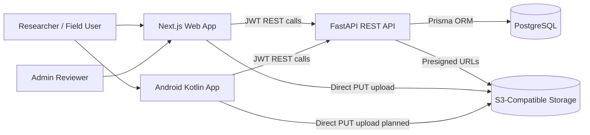
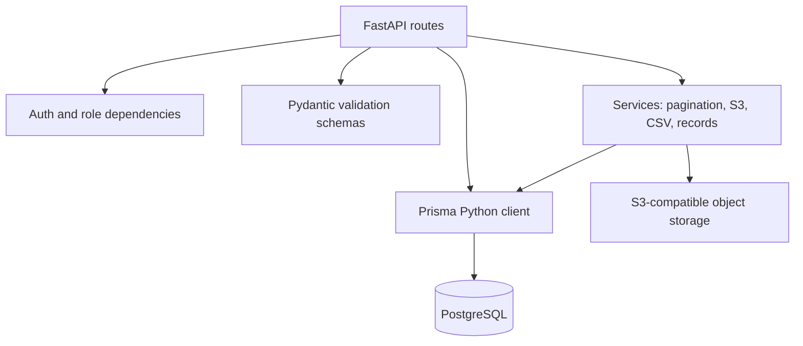
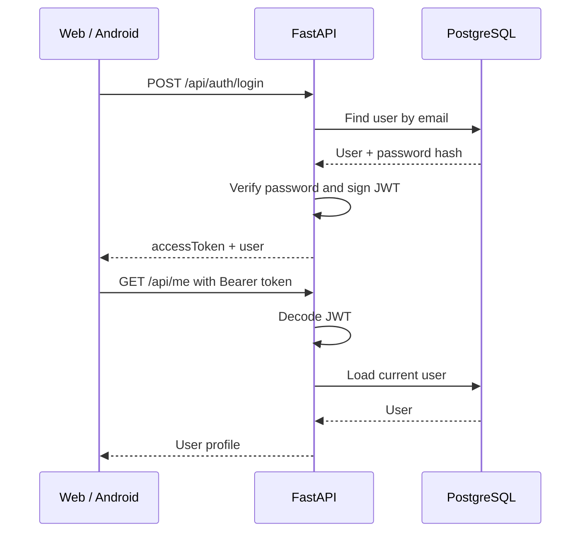
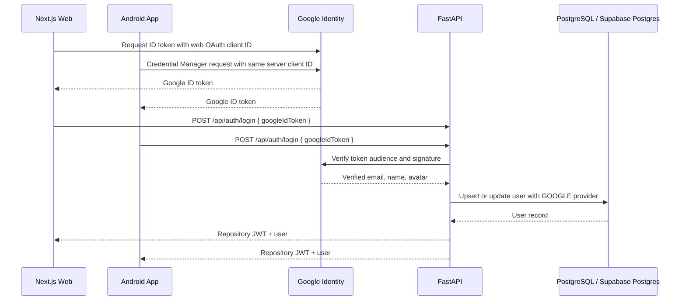
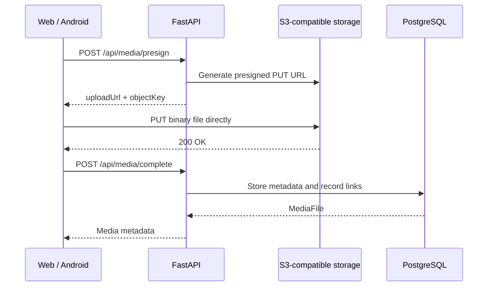
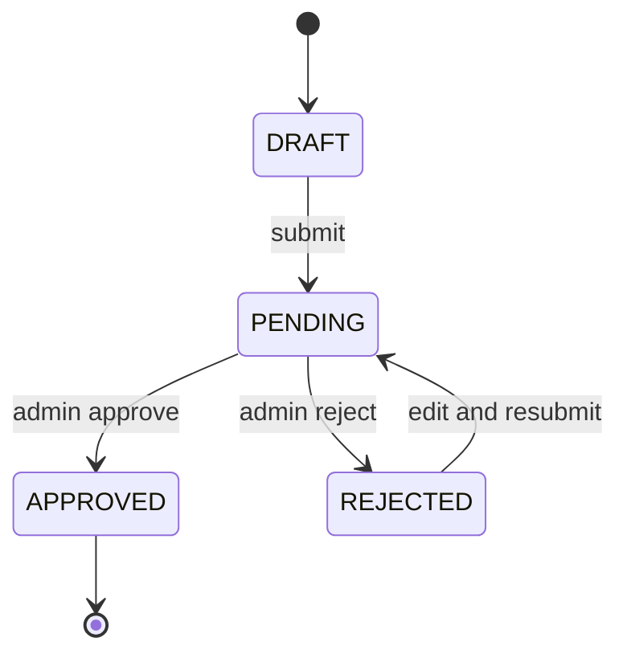
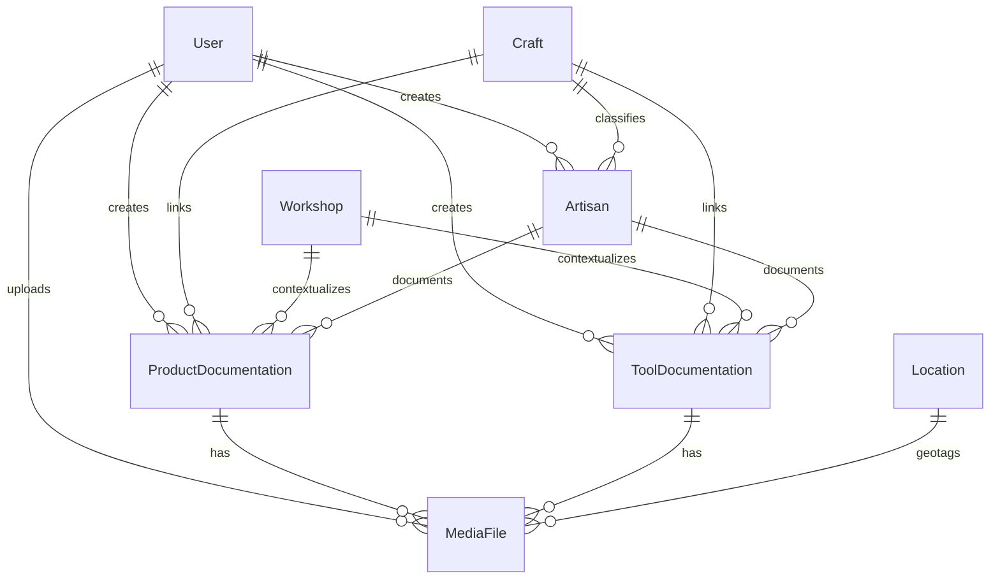
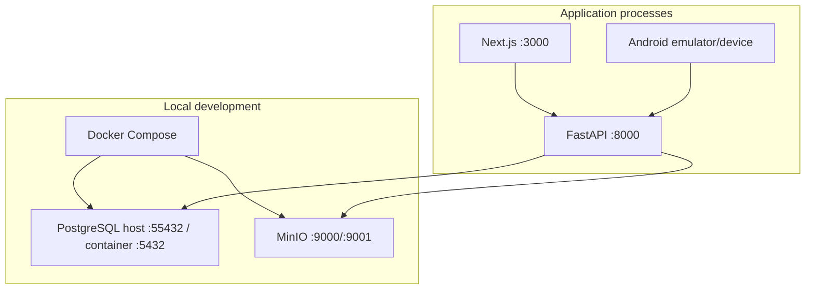
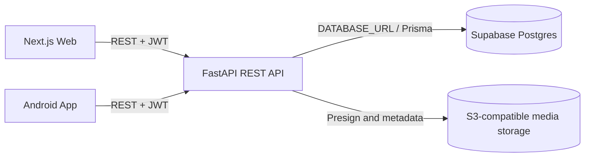

# Architecture

This repository is designed around one API-first backend used by both the web app and the Android app. PostgreSQL owns structured records and review state. S3-compatible object storage owns large media binaries.

## System Context

## Backend Module Flow

## Authentication Flow

## Google OAuth Flow

## Signed Media Upload Flow

## Record Lifecycle

## Core Data Relationships

## Deployment Shape

## Supabase Postgres Shape

