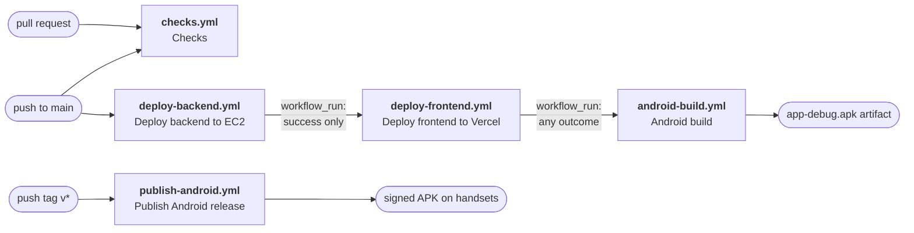

# Continuous integration and delivery

Everything that happens automatically when you open a pull request or push to `main`, why it happens
in that order, and every secret it needs. Sister documents:

- [docs/RELEASING.md](RELEASING.md) — cutting a signed Android release. The tag-driven publish
  pipeline is described there in full; this document only says where it sits.
- [docs/DEPLOYMENT_VERCEL.md](DEPLOYMENT_VERCEL.md) — the Vercel project itself (env vars, domains).
- [backend/DEPLOY_AWS.md](../backend/DEPLOY_AWS.md) — the EC2/S3/CloudFront side.
- [docs/ENVIRONMENT.md](ENVIRONMENT.md) — every environment variable, per service.

---

## 1. The pipeline

**Seven workflow files, in four groups that do not talk to each other.** Only the first group is a
chain; the rest are named here rather than counted, because a count is the one fact a new file
falsifies silently.

1. **The deploy chain** — three workflows, chained. One push to `main` walks the whole chain.
2. **The checks** — `checks.yml`, on **every** pull request and every push to `main`. Runs the tests.
   Deploys nothing.
3. **The release** — `publish-android.yml`, on a `v*` **tag** only. The only thing in this repository
   that can reach a handset.
4. **The crons** — `keep-supabase-active.yml` and `backup-db.yml`. Neither asserts anything about the
   code.



Note what that diagram does **not** contain: an arrow from `checks.yml` into the deploy chain. There
is none, and that is a real gap rather than a simplification — see **The checks** below, under
"it runs; it does not gate".

| # | Workflow | File | Trigger | What it does |
|---|---|---|---|---|
| 1 | Deploy backend to EC2 | `.github/workflows/deploy-backend.yml` | `push` to `main` | rsync → write `.env` → `prisma migrate deploy` → restart `fieldrepo` + `fieldrepo-queue` → poll `/health` |
| 2 | Deploy frontend to Vercel | `.github/workflows/deploy-frontend.yml` | `workflow_run` on **1** completing | `vercel pull` → **assert the pulled env carries what the app needs** → `vercel build --prod` → **assert those values actually reached the bundle** → `vercel deploy --prebuilt --prod` → smoke-check the alias → **assert the bundle the CDN serves is the one that was verified** |
| 3 | Android build | `.github/workflows/android-build.yml` | `workflow_run` on **2** completing, plus `pull_request` filtered to `android/**` | JDK 17 → `compileDebugKotlin` → `testDebugUnitTest` → `lintDebug` (advisory) → `assembleDebug` → upload APK. **Debug variants only.** Nothing it produces can install over a release build, and nothing it produces reaches a phone. |
| 4 | Checks | `.github/workflows/checks.yml` | `pull_request`, `push` to `main`, manual | Three independent jobs: the backend suite, the web typecheck/lint/unit specs, the documentation check. **No `paths:` filter.** See **The checks** below.  |
| 5 | Publish Android release | `.github/workflows/publish-android.yml` | `push` of a `v*` **tag**, plus a manual dry run | Builds and **signs** the release APK on the runner, proves the signer against `ANDROID_RELEASE_CERT_SHA256`, uploads it, and `POST`s `/api/app/release` so the in-app updater offers it. See [RELEASING.md](RELEASING.md). |
| 6 | Keep Supabase active | `.github/workflows/keep-supabase-active.yml` | nightly cron | Pings Postgres so Supabase does not pause the free-tier project. |
| 7 | Back up the database | `.github/workflows/backup-db.yml` | scheduled | `pg_dump` to S3. |

**Rows 3 and 5 are the two halves of one rule worth stating plainly: `android-build.yml` builds
DEBUG and only debug, and `publish-android.yml` is the only workflow that reaches a handset.** A
debug-signed APK cannot install over a release-signed one and the in-app updater will not offer it;
a release is a deliberate act with a tag behind it, a key on the runner, and a signer check. The
currently fielded build is the exception that motivated all of this — it was signed with the Android
**debug** key by hand, which [RELEASING.md §0](RELEASING.md) explains at length.

### Why the order is a dependency, not a preference

**Backend before frontend.** The browser calls the FastAPI box **directly**; there is no Next.js
proxy or rewrite in front of it (DEPLOYMENT_VERCEL.md §0). So the bundle Vercel publishes assumes
every endpoint it calls already exists. A single commit routinely adds a page *and* the API route
that page reads — if the Vercel deploy wins that race, the live site spends the gap calling routes
that answer `404`, which users see as empty lists, failed saves and "Failed to fetch" toasts. The
window is not theoretical: the backend deploy **stops the `fieldrepo` service** before running
`prisma migrate deploy`, so there is a real interval where the API is down and a freshly-shipped
frontend would be pointing straight at it. Backend first, frontend second, always.

**Android last, and unconditional.** Stage 3 builds a **debug** APK; it deploys nothing. (Getting a
build onto phones is a separate deliberate act with its own workflow and its own trigger: the in-app
OTA updater compares `versionCode` against a *release-signed* APK, and `publish-android.yml` is the
only thing that can produce one. Nothing in **this chain** can reach a device.) It is ordered
last only because it is the cheapest and least urgent stage, and running it first would delay the
deploys. It deliberately has **no success gate**: a build gate's inputs are the source tree, not the
state of the servers, so "does the Android app still compile?" is a question you want answered *more*
urgently when a deploy just failed, not less. Gating it would hide a Kotlin compile break behind an
unrelated infrastructure failure.

### What actually runs, per kind of change

The backend workflow has **no `paths:` filter** — it starts on every push to `main` and decides for
itself whether to touch EC2. That is the fix for the obvious `workflow_run` dead-lock: if stage 1
were filtered to `backend/**`, a frontend-only push would never start it, so stage 2 would never be
triggered and the frontend would never ship. Instead, stage 1's `changes` job diffs the push range,
publishes the result as the `pipeline-changes` artifact, and stages 1 and 2 skip their own work when
their area is untouched.

| Push touches | 1 · backend deploy | 2 · frontend deploy | 3 · Android build | 4 · Checks |
|---|---|---|---|---|
| `backend/**` only | **runs** | skipped (nothing to publish) | runs | **all three jobs** |
| `frontend/**` only | skipped (run still succeeds) | **runs** | runs | **all three jobs** |
| `android/**` only | skipped | skipped | **runs** | **all three jobs** |
| several areas | **runs** | **runs**, after 1 is green | runs | **all three jobs** |
| docs only | skipped | skipped | runs | **all three jobs** |
| backend deploy **fails** | ❌ red | **refuses to deploy**, says why in the summary | still runs | unaffected |

Anything the diff cannot be computed for — manual dispatch, the first push of a branch, a force-push
that orphaned the previous head — is treated as "everything changed". The pipeline over-deploys
rather than silently skipping a real change.

The Checks column has one value on purpose. `checks.yml` carries no `paths:` filter and never skips a
job, which is the difference between it and everything else in that table; the reasoning is in the
next section and, at length, in the header of the workflow itself.

**On a pull request, only rows 3 and 4 are reachable at all** — the deploys fire on `push`/
`workflow_run`, so nothing in columns 1 and 2 runs before a merge. And row 3 is path-filtered
(`android-build.yml:31-33`), so a pull request that touches only `backend/` or `frontend/` gets
exactly one workflow: this one.

### The three assertions stage 2 makes about the environment

Added after a green pipeline shipped a live site nobody could log in to. Each is a separate step,
and each fails the run loudly:

1. **After `vercel pull`** — every variable the app cannot run without is present in the pulled
   environment. A variable typed **Sensitive** in the dashboard is withheld from `vercel pull` by
   design; because the build happens on a GitHub runner rather than on Vercel, Next.js then inlines
   `undefined` and *both the build and the deploy still succeed*.
2. **After `vercel build`** — those values are actually present in the compiled output. The pull
   succeeding does not prove the build consumed them.
3. **After deploy** — the bundle the CDN is serving is the one that was verified. The step fetches
   `/login`, walks its JavaScript chunks, and confirms the API host appears in them.

Assertion 3 is the one that catches a class the other two cannot: a correct build published behind a
stale alias. Together they turn "the site is live but nobody can log in" from a support ticket days
later into a red run in five minutes.

### The checks

`.github/workflows/checks.yml`. Until it landed, **this repository ran no test automatically** — the
1000-plus backend cases, the web unit specs and the Kotlin suite all existed, all passed, and nothing
executed any of them unless a human typed the command. A pull request could break any of them and
still show a clean list of checks.

Three jobs, deliberately independent, so one red does not hide another's answer:

| Job (the name branch protection needs) | Where it runs | What it runs |
|---|---|---|
| **Backend tests** | `backend/` | Python 3.12 → `pip install -e ".[dev]"` → `python -m prisma generate` → `python -m pytest -rf --durations=15` |
| **Web typecheck, lint and unit specs** | `frontend/` | Node 22 → `npm ci` → `npx tsc --noEmit` → `npm run lint` → `npm run test:unit` |
| **Docs check** | repository root | Node 22 → `node docs/tools/check-docs.mjs` |

Measured on the tree the workflow landed with (2026-09-14, on a laptop — a runner will differ):
pytest 1019 passed in 54 s, `tsc` clean, `eslint` clean, 104 unit specs in 8 s, check-docs in about a
second. Every one of those commands is exactly what the workflow runs, from exactly the directory it
runs it in, so **anything the workflow reports you can reproduce in one line** — see §4.

**There is no `paths:` filter, and one must never be added.** A filter is why `android-build.yml`
cannot see the change that breaks it (next paragraph); the property that makes this workflow worth
having is that *every* pull request runs it.

**No secrets.** The backend job exports six obviously-fake placeholder values because
`app.core.config.Settings` refuses to build without `DATABASE_URL`, `JWT_SECRET`, the three `AWS_*`
values and `MASTER_ADMIN_EMAIL` (`backend/app/core/config.py:78`, `:101`, `:167-171`, `:187`) and
`backend/.env` is gitignored, so on a runner there is nothing else for them to come from. Without
them a plain `pytest` does not fail a few tests, it fails to **collect**. The DSN names `ci.invalid`
— a hostname RFC 2606 guarantees can never resolve — and the whole suite passes against it, which is
the measurement that proves nothing in the suite opens a connection. **Do not make any of those
values real, and do not add a database service container.**

#### It runs; it does not gate

Two things this workflow does **not** do, spelled out because a green tick read as more than it is
costs more than no tick at all:

1. **It does not block a merge** until `Backend tests`, `Web typecheck, lint and unit specs` and
   `Docs check` are named as required status checks on `main` (**Settings → Branches**). That is
   console state; nothing in a checkout can prove it. **UNVERIFIED from here.**
2. **It does not block a deploy.** `deploy-backend.yml` fires on its own `push: main` trigger, and
   one workflow cannot `needs:` a job in another — so on `main` the checks and the deploy start
   together and the deploy usually wins the race, because an rsync starts faster than a minute of
   pytest. The ordinary case is therefore a breaking commit reaching production with the red tick
   arriving afterwards. **The fix is a `wait-for-checks` job inside each deploy workflow** that polls
   for the Checks run at the exact SHA being shipped and refuses to hand over until those three jobs
   are green; the sibling repository runs exactly that. It is not done here because those two files
   belong to another workstream — it is the single most valuable thing left on the §5 list.

#### What is licensed to fail, and how the ratchets work

Neither the test suite nor the documentation set was green on the day this workflow landed, and a job
that is red on day one is a job somebody disables. Both jobs therefore carry an **explicit,
by-name list of the pre-existing failures** — never a `|| true`, never a `--deselect`, never a bare
count. Everything runs; the listed failures are not fatal; **anything else is red**.

**Backend — four tests, expected to be two on a runner:**

| Test | Why it fails |
|---|---|
| `test_public_census.py::test_the_census_is_mounted_at_the_public_path_the_cdn_rule_would_be_scoped_to` | Reads `api_router.routes` expecting flattened route objects. Current FastAPI stores a lazy `_IncludedRouter` per `include_router`, which has no `.path`. |
| `test_public_census.py::test_the_census_asks_for_no_token` | Same cause; its `next(...)` raises `StopIteration`. The route is fine — the file's HTTP-level tests pass. |
| `test_manifest_stream.py::test_the_declared_size_refuses_before_a_byte_moves` | **Interpreter-dependent, and expected to PASS in CI.** On Python 3.13+ `import pydub` fails (PEP 594 removed `audioop`), so `backend/app/api/routes/data_browser.py:3059` answers 503 before the 413 check. The job pins 3.12, where it does not. |
| `test_manifest_stream.py::test_the_real_length_refuses_what_the_column_lied_about` | Same cause. |

Measured both ways on 2026-09-14: on the 3.14 laptop the suite is 1019 passed / 4 failed; with
`audioop` restored and nothing else changed it is **1021 passed / 2 failed**. So the first green CI
run should delete the two `test_manifest_stream` lines from the list — the job prints a `::warning`
and a run-summary line telling you exactly that.

The census pair is worth reading twice, because it is not a code change: **it is a dependency
upgrade**. `backend/` has no lock file — every dependency is a `>=` range — so each CI run installs
whatever the index offers that day. A green branch can turn red overnight with no commit behind it.
Compiling a `requirements.lock` for `backend/` is on the §5 list.

**Docs — four problems:** `docs/REPO_FACTS.md is out of date`, two documents with no
"How this document is kept true" section (`DATASET_API.md`, `DESIGN-claude.md`), and one broken link
in `docs/README.md`. None of them belongs to the change that added the workflow, and a gate whose
green depends on edits to four documents owned by other people arrives red and gets switched off in a
week.

**The recommendation, so it is not lost: fix all four and empty that list.** They are small. The
REPO_FACTS one is a single command — `node docs/tools/check-docs.mjs --write` — and it is the most
valuable of the four, because that generated file is badly stale: it still reports the backend suite
as 14 files and 260 cases (it is 54 files and over 1000 cases), still says there are no Android tests
(there are eight test files), and still tells the reader that neither suite is a CI gate, which this
workflow has just made false.

**Both lists may only shrink, and that is enforced asymmetrically on purpose.** A *new* failure is an
error and fails the job. A listed failure that starts passing is a `::warning` and a line in the run
summary naming the exact line to delete — not an error, because "your tree got better" must never be
the thing that turns a pull request red. Deleting a line is a one-line reviewable diff; **adding**
one is the thing to argue about in review.

#### What it deliberately does not run

- **No Android job.** `android-build.yml` already compiles Kotlin and runs `:app:testDebugUnitTest`
  on a pull request, and a second Gradle job would spend five more minutes to learn the same thing.
  **What is missing is two lines in that file, not a job here:** its `pull_request` trigger is
  filtered to `android/**` (`android-build.yml:31-33`), and the Android suite reads the *web* tree —
  `android/app/src/test/java/com/fieldrepository/app/ui/WalkthroughStepsTest.kt:385` names
  `frontend/components/guide/steps.ts` and asserts the Kotlin and web walkthroughs declare the same
  steps in the same order; `RecordPickersTest.kt` and `AccessRosterTest.kt` name their own web twins
  the same way. So a frontend-only pull request can break an Android test that nothing will run.
  Adding `frontend/**` to that filter closes it.
- **No `ruff`.** It is installed (it is in the `dev` extra) but `[tool.ruff]` in
  `backend/pyproject.toml` sets only `line-length` and `target-version` — there is no rule selection,
  so a lint job today would gate on whatever the default rule set happens to be rather than on
  anything anybody chose. Choose the rules first, then add the step.
- **No Playwright end-to-end, no backend integration tests.** Both need a running app, a database and
  real credentials. See §5.

---

## 2. Required repository secrets

**Settings → Secrets and variables → Actions → New repository secret.** Names are case-sensitive.

| Secret | Used by | Where to get the value |
|---|---|---|
| `EC2_HOST` | backend | Public/Elastic IP of the API box. `cd infra/terraform && terraform output api_public_ip`, or EC2 console → Instances → the `fieldrepo` instance → Public IPv4. Currently `15.207.145.174`. |
| `EC2_SSH_KEY` | backend | The **entire** private key file for the instance's key pair, `-----BEGIN…` through `-----END…` inclusive, with the trailing newline: `infra/terraform/fieldrepo-deploy.pem`. Paste the file contents, not the path. `*.pem` is gitignored — never commit it. |
| `BACKEND_ENV` | backend | The full contents of the production `backend/.env`: `DATABASE_URL`, `JWT_SECRET`, `AWS_*`, `OPENAI_API_KEY`, `GEMINI_API_KEYS`, `ELEVENLABS_*`, `DEEPGRAM_*`, `BACKEND_CORS_ORIGINS`, … Every key and its meaning is in [ENVIRONMENT.md](ENVIRONMENT.md). Easiest source of truth: `ssh ubuntu@$EC2_HOST cat /home/ubuntu/app/backend/.env`. The workflow pipes it over the SSH tunnel; it is never on a command line. |
| `VERCEL_TOKEN` | frontend | <https://vercel.com/account/tokens> → **Create Token**. Scope it to the **team that owns `field-repository`**, not "Personal Account", or the CLI 403s. Set an expiry you will actually remember — the deploy starts failing with `Error: Not authorized` the day it lapses. This is the only genuinely sensitive value of the three Vercel ones. |
| `VERCEL_ORG_ID` | frontend | `team_pcTf4Alb2DCIwq2IZcdu00dS`. Also at Vercel → Team Settings → General → **Team ID**, or in `frontend/.vercel/project.json` (`orgId`) after a local `vercel link`. An identifier, not a credential. |
| `VERCEL_PROJECT_ID` | frontend | `prj_EzXN8hhGKpMciFBrZRdxpcgUUzN0`. Also at Vercel → Project `field-repository` → Settings → General → **Project ID**, or `frontend/.vercel/project.json` (`projectId`). An identifier, not a credential. |
| `SUPABASE_DATABASE_URL` *or* `DATABASE_URL` | keep-alive cron | The Supabase Postgres connection string (Supabase → Project → Connect). Pre-existing; unrelated to deploys. |

`GITHUB_TOKEN` is **not** something you create — GitHub injects it per run. Stage 2 uses it only to
download stage 1's change-detection artifact (`permissions: actions: read`).

**The Vercel project is deliberately NOT linked to the GitHub repository.** It was, and every push
produced a second, competing build: Vercel's own Git integration cloning the repo and building it
with no knowledge of this pipeline's ordering. Twelve of those failed outright with `No Next.js
version detected`, because the project's Root Directory was unset and Vercel was building the
repository root, whose `package.json` has no `next` in it. Setting Root Directory to `frontend`
fixed the error; `frontend/vercel.json`'s `ignoreCommand` then turned the builds into cancellations
rather than failures — but a cancelled build is still a deployment record and still an email, for
work that was never wanted. So the link is removed outright: `DELETE /v9/projects/{id}/link`.

GitHub Actions is the only publisher, it authenticates with `VERCEL_TOKEN` rather than with the
repository connection, and `vercel deploy --prebuilt` does not need the project to know about GitHub
at all — verified by deploying successfully immediately after unlinking. The cost is that pull
requests no longer get automatic preview deployments; if those are ever wanted back, re-link in the
dashboard and rely on `ignoreCommand` to keep Git builds off `main`.

**Until the three Vercel secrets exist, stage 2 skips instead of failing.** Its gate job checks for
`VERCEL_TOKEN` and, when it is absent, writes the table above into the run summary and reports
`should_deploy=false`. The run stays green, stage 3 still fires, and the backend deploy's tick keeps
meaning "the backend deployed". This is deliberate: a red X that everyone knows to ignore is worse
than no X at all.

> **UNVERIFIED:** which secrets the repository currently holds cannot be read from a checkout. An
> earlier version of this document asserted the set was `BACKEND_ENV`, `DATABASE_URL`, `EC2_HOST` and
> `EC2_SSH_KEY` only; the Vercel project has since been unlinked and deployed successfully through
> the CLI, which is only possible with `VERCEL_TOKEN` present, so that list is stale. Read the real
> one at **Settings → Secrets and variables → Actions**, or `gh secret list`. Do not restate it here
> — the value of this paragraph is the *mechanism*, and the inventory belongs in the console.

**`android-build.yml` needs no secrets at all** and still does not: it produces a debug-signed APK,
and debug signing uses the auto-generated debug keystore. **`checks.yml` needs no secrets either** —
its backend job exports obviously-fake placeholders instead, for the reason given in *The checks*
above, and a secret in a workflow that runs on every pull request would be a secret exposed to every
pull request.

What has changed is that **the release key is now in CI**, in exactly one workflow. `publish-android.yml`
reads `ANDROID_RELEASE_KEYSTORE_BASE64`, `ANDROID_RELEASE_KEYSTORE_PASSWORD`,
`ANDROID_RELEASE_KEY_ALIAS`, `ANDROID_RELEASE_KEY_PASSWORD` and `ANDROID_RELEASE_CERT_SHA256` to
build and sign the release APK, and `APP_PUBLISH_EMAIL` / `APP_PUBLISH_PASSWORD` to authenticate the
`POST /api/app/release` that tells the fleet a new build exists. That workflow's own preflight refuses
to start when any of them is missing, naming the one it could not find — **a missing secret on a
release path is a failure, never a skip**, which is the lesson §2's Vercel paragraph above was
written from. [RELEASING.md](RELEASING.md) is the document for all of it: what each secret is, how
the key was generated, who holds it, and what to do when one needs rotating.

> **UNVERIFIED, and expected-for-now:** as of 2026-09-14 the five `ANDROID_RELEASE_*` values had been
> created and `APP_PUBLISH_EMAIL` / `APP_PUBLISH_PASSWORD` had **not**. So the first tagged release
> will stop at that preflight, red, naming those two — which is the designed behaviour and not a
> fault. The account `APP_PUBLISH_EMAIL` names must be a **master admin**, because
> `POST /api/app/release` is `Depends(require_master_admin)`
> (`backend/app/api/routes/app_release.py`). As always with secrets: read the real inventory at
> **Settings → Secrets and variables → Actions** or with `gh secret list`, never from this table.

### Not GitHub secrets: the `NEXT_PUBLIC_*` values

`NEXT_PUBLIC_API_URL`, `NEXT_PUBLIC_GOOGLE_CLIENT_ID`, `NEXT_PUBLIC_MAPTILER_API_KEY` and friends are
**build-time** variables that live in the Vercel project (Project → Settings → Environment
Variables, DEPLOYMENT_VERCEL.md §2). `vercel pull` fetches them into the runner before
`vercel build`, so the Vercel dashboard stays the single source of truth and you do not maintain the
same value in two places. Change one there and re-run this workflow (or push) to pick it up.

---

## 3. One-time setup

1. **Add the three `VERCEL_*` secrets** above. The other secrets already exist.

2. **Ensure Vercel is not also publishing.** ~~This is not optional and it is the easiest thing to
   miss.~~ **Already done, and done more thoroughly than this step described:** the Vercel project
   has been **unlinked from the GitHub repository** outright (`DELETE /v9/projects/{id}/link`), so
   there is no Git integration left to race the pipeline. See the "deliberately NOT linked"
   paragraph in §2 for why cancelling builds was not enough.

   The belt-and-braces layers behind that are still in place and should stay: `ignoreCommand:
   "exit 0"` in `frontend/vercel.json`, and `gitProviderOptions.createDeployments` disabled at the
   project level. If the link is ever restored for PR previews, those two are what keep Git builds
   off `main`.

3. **Merge these workflow files to `main`.** `workflow_run` only fires for workflow files that exist
   **on the default branch** — on a feature branch, stages 2 and 3 will not trigger no matter what
   stage 1 does. Stage 3 still builds on pull requests, so PR feedback works before the merge.

4. **First run:** push a no-op commit to `main` (or `workflow_dispatch` the backend workflow) and
   watch all three go green in order before trusting the chain.

5. **Make the checks required.** *Settings → Branches → branch protection rule for `main` → Require
   status checks to pass* → tick **Backend tests**, **Web typecheck, lint and unit specs** and
   **Docs check**. Until this is done `checks.yml` reports and blocks nothing, which is the state
   described under *The checks* in §1. The names must match exactly; renaming a job silently
   un-requires it.

6. **Clear the two ratchets.** On the first green run, read the run summary: it will name any entry
   in the workflow's expected-failure or known-problem lists that no longer describes anything. Delete
   those lines. Both lists are meant to reach zero — see *What is licensed to fail* in §1.

---

## 4. Running things by hand

| Goal | How |
|---|---|
| Deploy the backend now | Actions → *Deploy backend to EC2* → **Run workflow**. Manual dispatch always deploys (it skips change detection). Stage 2 does **not** chain off a manual dispatch of stage 1 unless the run completes on `main`. |
| Deploy the frontend now | Actions → *Deploy frontend to Vercel* → **Run workflow**. Leave `force` = true to deploy regardless of what changed. This bypasses the backend gate — that is the escape hatch, use it knowing why. |
| Build the APK now | Actions → *Android build* → **Run workflow**, or open a PR touching `android/**`. |
| Re-deploy after changing a Vercel env var | Re-run *Deploy frontend to Vercel*. `NEXT_PUBLIC_*` values are baked at build time; changing them in the dashboard does nothing until something rebuilds. |
| Get the APK | The run's **Artifacts** section → `app-debug-<sha>`. Debug-signed: sideload-only, and Android will refuse to install it over a release-signed build. |
| Run the checks now | Actions → *Checks* → **Run workflow**. Or just open a pull request: it runs on every one, with no path filter. |
| Ship a signed build to handsets | Not from this page. Push a `v*` tag — [RELEASING.md](RELEASING.md) §2 is the procedure, and it is the only route to a device. |

**Every check, reproduced locally, in the same directory the job uses.** These are the exact commands
the workflow runs; if CI is red and one of these is green, the difference is the environment, and the
first thing to check is the Python version (3.12 in CI) and the fact that CI installs from the index
rather than from your venv:

```bash
# Backend — from backend/, with the same placeholder environment the job exports.
DATABASE_URL='postgresql://ci:ci@ci.invalid:5432/no_such_database' \
JWT_SECRET='ci-placeholder-not-a-secret-0123456789abcdef' \
AWS_ACCESS_KEY_ID=ci-placeholder AWS_SECRET_ACCESS_KEY=ci-placeholder \
AWS_S3_BUCKET=ci-placeholder MASTER_ADMIN_EMAIL=ci@example.invalid \
python -m pytest -rf --durations=15

# Web — from frontend/.
npx tsc --noEmit && npm run lint && npm run test:unit

# Docs — from the repository root. Add --write to regenerate REPO_FACTS.md.
node docs/tools/check-docs.mjs
```

A `backend/.env` holding the same placeholders does the same job as those six variables and is what
most people here have; the variables are written out because they are what the runner does, and
because a `.env` that is quietly pointed at a real database is a much worse way to run a test suite.

---

## 5. Known limits, and things that are deliberately not gates

> **Three entries left this list on 2026-09-14** when `checks.yml` landed: the backend suite, the
> Playwright unit specs and the web typecheck/lint now all run on every pull request and every push
> to `main`. What follows is what is *still* true. A row leaves this list when a workflow gains the
> step — so re-read it against the workflow files, never against memory.

- **The checks run, but nothing is required yet.** Branch protection has to name the three job names
  before a red Checks run can block a merge (§3.5). **UNVERIFIED from a checkout** — console state.
- **The checks do not gate the deploy, and on `main` they lose the race.** `deploy-backend.yml`
  starts on the same push, an rsync starts faster than a minute of pytest, and one workflow cannot
  `needs:` a job in another. **This is the most valuable thing left on this list.** The fix is a
  `wait-for-checks` job at the top of `deploy-backend.yml` and of `deploy-frontend.yml` that polls
  the Checks run for the exact SHA being shipped and refuses to hand over until the three jobs are
  green. Both stages need it: a frontend-only push does not deploy the backend, so the backend's copy
  structurally cannot see that case.
- **Eight backend tests' worth of failure is licensed, in two named lists.** Four pre-existing
  pytest failures and four pre-existing documentation problems are listed by name in `checks.yml` and
  do not fail their jobs; anything else does. Both lists are ratchets that may only shrink, and the
  section *What is licensed to fail* in §1 says what each entry is and how to remove it. **They are
  meant to be empty within days, not carried for months.**
- **`backend/` has no lock file, so CI installs a different dependency set every day.** Every
  dependency in `backend/pyproject.toml` is a `>=` range. Two of the four licensed test failures are
  a FastAPI upgrade, not a code change — a green branch can turn red overnight with no commit behind
  it, and the backend on the EC2 box, in CI, and in your venv are three different installs. Compile a
  `requirements.lock` in `backend/` (`pip-compile --extra dev` inside a `python:3.12` container so the
  interpreter that resolves it is the one that runs it) and install from it in both the CI job and
  `deploy-backend.yml`.
- **The Android tests cannot see the change that breaks them.** `android-build.yml`'s `pull_request`
  trigger is filtered to `android/**` (`android-build.yml:31-33`), and the Kotlin suite reads the web
  tree: `WalkthroughStepsTest.kt:385` names `frontend/components/guide/steps.ts` and asserts both
  walkthroughs declare the same steps in the same order, and `RecordPickersTest.kt` and
  `AccessRosterTest.kt` name their own web twins. Add `frontend/**` to that filter — a two-line
  change in a file `checks.yml` deliberately does not duplicate.
- **No actions are pinned, and there is no Dependabot config in `.github/`.** Every `uses:` in every
  workflow here names a mutable tag (`actions/checkout@v4`), so whoever controls that repository
  decides what runs. Pinning by SHA is the fix, but a hand-pinned SHA with nothing to refresh it rots
  silently: add the Dependabot config (github-actions ecosystem, `directory: "/"`) **and** pin all
  seven workflows in the same commit, or do neither.
- **The Playwright end-to-end suite is still not a gate.** `checks.yml` runs only the eight
  `*-unit.spec.ts` files, which touch no server. The rest of `frontend/e2e/` signs in against a real
  API and drives real records, and `frontend/scripts/pw-smoke.mjs` is a login-and-visit smoke run.
  They need a running app and credentials, so they are a genuinely larger job — but "not wired up" is
  the current state, not "not worth wiring up".
- **No `ruff` gate.** `ruff` is installed by the CI job (it is in the `dev` extra) and never run,
  because `[tool.ruff]` in `backend/pyproject.toml` selects no rules — a lint gate today would
  enforce a default nobody chose. Choose the rule set first, with a dated per-file baseline for what
  is already there, then add the step to the backend job.
- **Android Lint is advisory.** `./gradlew :app:lintDebug` on the current tree reports
  *1 error, 44 warnings* and aborts. The error is pre-existing and unrelated to any code change:
  `AndroidManifest.xml:6 PermissionImpliesUnsupportedChromeOsHardware` — `CAMERA` is requested with
  no matching `<uses-feature android:name="android.hardware.camera" android:required="false"/>`.
  Making lint a hard gate today would fail every run and train everyone to ignore red. The HTML/XML
  report is uploaded on every run. Fix the manifest (or commit a `lint-baseline.xml`), then delete
  `continue-on-error` from the lint step and it becomes a real gate.
- **~~There are no Android tests.~~ There are now, and `android-build.yml` runs them.**
  `android/app/src/test/` holds eight Kotlin test files; the step's own guard checks for sources at
  runtime and only warns when it finds none, so it started enforcing them the moment they landed —
  but the prose comment beside it still describes the empty tree and is stale. **Instrumented** tests
  are still absent and still not run: they need an emulator, and that is a separate job with an
  emulator action, not a line bolted onto this one.
- **Don't chain a fourth stage.** GitHub caps how deep `workflow_run` chains can go (documented at
  three levels); this pipeline already uses two hops. A fourth stage should be a job with `needs:`
  inside an existing workflow, not another `workflow_run` link.
- **`concurrency.cancel-in-progress` is off for both deploys, and off for the release.** Cancelling
  a backend run mid-deploy can leave `fieldrepo` stopped between the service stop and the migrate,
  with no restart step left to run; cancelling a publish can leave an uploaded APK with no release
  row, or kill the proof step after the row was written. Overlapping runs queue instead. **The
  Android build and the Checks are the two that cancel** — neither mutates anything outside the
  runner, and a superseded commit's test result is noise.

---

## 6. Troubleshooting

**`Docs check` is red and I did not touch a document.** Read the `FAIL` lines in the log. The usual
one is `docs/REPO_FACTS.md is out of date`, which is not about prose at all: that file is *generated*
from the repository, so adding a route, a Prisma model or a test file moves it. Run
`node docs/tools/check-docs.mjs --write` and commit the diff. (That exact problem is on the licensed
list today, so it will not fail the job until somebody regenerates the file once and deletes the
line — after which it becomes a real gate. Doing that is step 6 of §3.)

**`Docs check` is red on a document somebody else added.** Correct behaviour, and the point of the
list: a new document with no "How this document is kept true" section is a new problem, not a
pre-existing one. Add the section, or — if it genuinely belongs to another workstream — that decision
belongs in `docs/tools/check-docs.mjs`'s own `OWNED_ELSEWHERE` set (`check-docs.mjs:43-52`), where
it becomes a warning, and **not** in the workflow's licensed list.

**`Backend tests` is red on a test that passes on my machine.** Three known causes, in order of
likelihood. **(1) The interpreter.** CI pins Python 3.12 to match the EC2 box; on 3.13+ `import
pydub` fails outright (PEP 594 removed `audioop`) and the two `test_manifest_stream` size-refusal
tests fail with a 503 instead of a 413. **(2) The dependency set.** There is no lock file, so CI
installs today's versions of everything while your venv holds whatever it was built with — that is
what broke the two `test_public_census` tests, and the next one will arrive the same way. **(3)
Cross-module pollution.** The job runs the whole suite; run the named module by itself before you
believe the attribution, and believe the verdict either way.

**`Backend tests` is red with dozens of collection errors.** Almost always the environment, not the
code: `Settings` refuses to build without its six required values (§1, *The checks*) and every module
that imports `app.core.config` then fails to import. If it happens in CI, the `env:` block of that
job has lost a value. If it happens locally, you are missing `backend/.env` or the variables in §4.

**A run is green but the job you expected is missing.** `checks.yml` has no `paths:` filter and never
skips, so a missing job means the workflow did not run at all — check that the file exists on the
branch you pushed, and that the run is not queued behind the `concurrency` group.

**Stage 2 never starts.** `workflow_run` fires only for workflow files on the **default branch**,
and only for runs whose head branch is `main` (the trigger is filtered to `branches: [main]`). Check
that both files are merged. Also check stage 1 actually *ran* — with change detection it may show a
skipped `deploy` job, which is normal and still triggers stage 2.

**Stage 2 says "Backend deploy concluded 'failure' — refusing to publish the frontend".** Working as
designed. Fix the backend deploy, re-run it, and stage 2 will follow automatically. If you must ship
the frontend anyway, dispatch it manually (§4) and know that the site may call endpoints that are
not there yet.

**`Error: Not authorized` / `Forbidden` from the Vercel CLI.** `VERCEL_TOKEN` expired, was revoked,
or is scoped to a personal account instead of the team that owns the project. Re-issue it (§2).

**`Vercel project Root Directory is '', expected 'frontend'`.** Someone cleared Root Directory in
the dashboard. The workflow fails fast on this on purpose, because the alternative is a confusing
`No Next.js version detected` sixty lines into a build. Restore it: Project → Settings → General →
Root Directory = `frontend`. Every Vercel CLI command in the workflow runs from the **repository
root** precisely because that setting is what points the build at `frontend/`; do not "fix" a
root-directory error by adding `working-directory: frontend`, which makes the CLI look for
`frontend/frontend`.

**`Invalid vercel.json - should NOT have additional property '//'`.** JSON has no comments, and the
Vercel CLI validates the file strictly — but only on `deploy`, not on `build`. A `//` key therefore
survives the whole build and fails at the very last step, after several minutes. Keep
`frontend/vercel.json` to schema keys only and put the prose here.

**Why `frontend/vercel.json` sets `ignoreCommand: "exit 0"`.** It stops Vercel's own Git
integration from building this project. Two publishers for one site is the bug: a Git build starts
the moment `main` moves, which is *before* the backend has deployed and migrated, so the live site
spends that window calling endpoints that answer 404. GitHub Actions is the single publisher and it
waits for the backend. The Ignored Build Step is a Git-integration feature only — `vercel build` and
`vercel deploy --prebuilt` from CI never run it, so this cannot block the pipeline. Git-triggered
deployments are *also* disabled at the project level (`gitProviderOptions.createDeployments`), so
this is belt and braces.

**`npm ci can only install packages when … in sync`.** `frontend/package-lock.json` is stale. Run
`npm install` in `frontend/` and commit the lockfile (DEPLOYMENT_VERCEL.md §7.5).

**Two production deployments per push.** Vercel's Git integration has been re-linked. It was removed
outright (§2); if two deployments appear again, that is what happened. Unlink it, or at minimum
restore the Ignored Build Step — see §3.2.

**The deploy is green and the live site cannot log anyone in.** This should now be impossible: the
three assertions in §1 fail the run instead. If it happens anyway, the assertions have a hole and
that hole is the bug — do not just fix the variable. Start at
[DEPLOYMENT_VERCEL.md §2.2](DEPLOYMENT_VERCEL.md).

**Android build fails on the SDK.** The workflow installs `platforms;android-35` and
`build-tools;35.0.0` explicitly because runner images drift. If `compileSdk` in
`android/app/build.gradle.kts` moves, update that step and the JDK pin together — the JDK 17 pin
tracks `sourceCompatibility`/`jvmTarget` in the same file.

**A deploy hangs on the health poll.** Stage 1 polls `http://127.0.0.1:8000/health` 40 times at 2 s
and dumps `journalctl -u fieldrepo -n 80` on failure. Read that output first; the usual causes are a
bad `BACKEND_ENV` value and Supabase pooler connection exhaustion — both covered in
[QA_AUDIT.md](QA_AUDIT.md).

Note the path: **`/health`, not `/api/health`.** The health routes are declared on the app rather
than on the API router, so they sit outside the `/api` prefix and `/api/health` 404s. Any monitor
pointed at the `/api` form is measuring a 404, not the service.

---

## How this document is kept true

Everything here describes seven YAML files, so almost all of it is mechanically checkable — and the
parts that are not are exactly the parts that were wrong before.

| Claim class | Kept true by |
|---|---|
| The seven workflows, their triggers and their step order | `.github/workflows/*.yml`. `grep -n "^name:\|^on:\|    - name:" .github/workflows/deploy-frontend.yml` renders the shape of a workflow in one command. The §1 table is a *list*, not a count, for the same reason the workflow headers are: a new file falsifies a count silently. |
| The secrets **table** (names and purposes) | `grep -ho 'secrets\.[A-Z_]*' .github/workflows/*.yml \| sort -u` lists every secret the workflows read. Anything in that output missing from §2 is undocumented. |
| Which secrets **exist** | **Not checkable from a checkout, and deliberately not stated.** `gh secret list`, or the Actions settings page. A previous version asserted an inventory here and it went stale within days. |
| The three job names in §1 and §3.5 | `grep -n "    name:" .github/workflows/checks.yml`. These are the strings branch protection matches; if they stop agreeing with this document, the required checks are silently matching nothing. |
| What the checks actually run | The `run:` lines of `.github/workflows/checks.yml`. §4 repeats each command so it can be pasted — if a job's command and §4's disagree, §4 is the one that is wrong. |
| The two licensed-failure lists | The heredocs inside `checks.yml` (`expected-failures.txt`, `known-doc-problems.txt`) are the authority; §1's tables describe them. **Both may only shrink.** Re-run the two commands in §4 to see the real current sets — and note that the workflow itself warns on every run about any entry that no longer describes anything, so the lists cannot rot quietly the way this prose can. |
| The §5 non-gates | The absence of a job. A row leaves that list when a workflow gains the step — so re-read §5 against the workflow files, not against memory. Three rows left it on 2026-09-14. |
| The measured figures in §1 (`1019 passed`, `104 specs`, `4 problems`) | Dated, and measured on a laptop rather than a runner. Totals move the day anybody adds a test or a document; re-run the §4 commands and re-date them, or delete them. The only numbers the workflow itself enforces are floors, not targets. |
| Vercel project settings (Root Directory, Git link, `createDeployments`) | **UNVERIFIED from here** — dashboard state. §3 and §6 say what they must be; the workflow's own "Assert the project is still rooted at frontend/" step is the only thing that actually checks one of them, and it checks it at deploy time. |
| Branch protection: whether the checks are required | **UNVERIFIED from here** — console state, and the single most load-bearing unverifiable claim on this page. Nothing in `.github/` can assert it. **Settings → Branches**, or `gh api repos/:owner/:repo/branches/main/protection`. |
| Everything about cutting a release | [RELEASING.md](RELEASING.md), which owns it. This document states only where `publish-android.yml` sits in the pipeline and which secrets it reads; if the two disagree about anything else, RELEASING.md wins. |

**Review triggers:** any change under `.github/workflows/`, `frontend/vercel.json`, or
`infra/terraform/user_data.sh` (which defines the services stage 1 restarts). Also: any change to the
two licensed-failure lists in `checks.yml`, because shrinking one is exactly the event that makes
§1's tables wrong.

**The failure mode to watch for in this document specifically:** it accumulates entries about
console state — a Vercel toggle, a secret, an Ignored Build Step — that nobody can verify from the
repository and everybody assumes is still true. Each such claim is marked **UNVERIFIED**. When one
turns out to be wrong, do not just correct the value: ask whether the claim belongs here at all, or
whether the pipeline should be asserting it at runtime the way §1's three environment assertions now
do.
