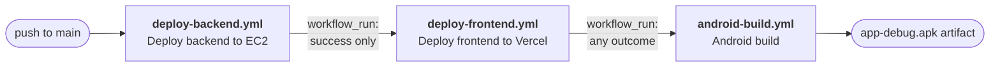

# Continuous integration and delivery

Everything that happens automatically when you push to `main`, why it happens in that order, and
every secret it needs. Sister documents:

- [docs/DEPLOYMENT_VERCEL.md](DEPLOYMENT_VERCEL.md) — the Vercel project itself (env vars, domains).
- [backend/DEPLOY_AWS.md](../backend/DEPLOY_AWS.md) — the EC2/S3/CloudFront side.
- [docs/ENVIRONMENT.md](ENVIRONMENT.md) — every environment variable, per service.

---

## 1. The pipeline

Three workflows, chained. One push to `main` walks the whole chain.

| # | Workflow | File | Trigger | What it does |
|---|---|---|---|---|
| 1 | Deploy backend to EC2 | `.github/workflows/deploy-backend.yml` | `push` to `main` | rsync → write `.env` → `prisma migrate deploy` → restart `fieldrepo` + `fieldrepo-queue` → poll `/health` |
| 2 | Deploy frontend to Vercel | `.github/workflows/deploy-frontend.yml` | `workflow_run` on **1** completing | `vercel pull` → **assert the pulled env carries what the app needs** → `vercel build --prod` → **assert those values actually reached the bundle** → `vercel deploy --prebuilt --prod` → smoke-check the alias → **assert the bundle the CDN serves is the one that was verified** |
| 3 | Android build | `.github/workflows/android-build.yml` | `workflow_run` on **2** completing, plus `pull_request` | JDK 17 → `compileDebugKotlin` → `testDebugUnitTest` → `lintDebug` (advisory) → `assembleDebug` → upload APK |

There is also `.github/workflows/keep-supabase-active.yml` — an unrelated nightly cron that pings
Postgres so Supabase does not pause the free-tier project.

### Why the order is a dependency, not a preference

**Backend before frontend.** The browser calls the FastAPI box **directly**; there is no Next.js
proxy or rewrite in front of it (DEPLOYMENT_VERCEL.md §0). So the bundle Vercel publishes assumes
every endpoint it calls already exists. A single commit routinely adds a page *and* the API route
that page reads — if the Vercel deploy wins that race, the live site spends the gap calling routes
that answer `404`, which users see as empty lists, failed saves and "Failed to fetch" toasts. The
window is not theoretical: the backend deploy **stops the `fieldrepo` service** before running
`prisma migrate deploy`, so there is a real interval where the API is down and a freshly-shipped
frontend would be pointing straight at it. Backend first, frontend second, always.

**Android last, and unconditional.** Stage 3 builds an APK; it deploys nothing. (Getting a build
onto phones is a separate deliberate act — the in-app OTA updater compares `versionCode` against a
*release-signed* APK uploaded by a master admin. Nothing in CI can reach a device.) It is ordered
last only because it is the cheapest and least urgent stage, and running it first would delay the
deploys. It deliberately has **no success gate**: a build gate's inputs are the source tree, not the
state of the servers, so "does the Android app still compile?" is a question you want answered *more*
urgently when a deploy just failed, not less. Gating it would hide a Kotlin compile break behind an
unrelated infrastructure failure.

### What actually runs, per kind of change

The backend workflow has **no `paths:` filter** — it starts on every push to `main` and decides for
itself whether to touch EC2. That is the fix for the obvious `workflow_run` dead-lock: if stage 1
were filtered to `backend/**`, a frontend-only push would never start it, so stage 2 would never be
triggered and the frontend would never ship. Instead, stage 1's `changes` job diffs the push range,
publishes the result as the `pipeline-changes` artifact, and stages 1 and 2 skip their own work when
their area is untouched.

| Push touches | 1 · backend deploy | 2 · frontend deploy | 3 · Android build |
|---|---|---|---|
| `backend/**` only | **runs** | skipped (nothing to publish) | runs |
| `frontend/**` only | skipped (run still succeeds) | **runs** | runs |
| `android/**` only | skipped | skipped | **runs** |
| several areas | **runs** | **runs**, after 1 is green | runs |
| docs only | skipped | skipped | runs |
| backend deploy **fails** | ❌ red | **refuses to deploy**, says why in the summary | still runs |

Anything the diff cannot be computed for — manual dispatch, the first push of a branch, a force-push
that orphaned the previous head — is treated as "everything changed". The pipeline over-deploys
rather than silently skipping a real change.

### The three assertions stage 2 makes about the environment

Added after a green pipeline shipped a live site nobody could log in to. Each is a separate step,
and each fails the run loudly:

1. **After `vercel pull`** — every variable the app cannot run without is present in the pulled
   environment. A variable typed **Sensitive** in the dashboard is withheld from `vercel pull` by
   design; because the build happens on a GitHub runner rather than on Vercel, Next.js then inlines
   `undefined` and *both the build and the deploy still succeed*.
2. **After `vercel build`** — those values are actually present in the compiled output. The pull
   succeeding does not prove the build consumed them.
3. **After deploy** — the bundle the CDN is serving is the one that was verified. The step fetches
   `/login`, walks its JavaScript chunks, and confirms the API host appears in them.

Assertion 3 is the one that catches a class the other two cannot: a correct build published behind a
stale alias. Together they turn "the site is live but nobody can log in" from a support ticket days
later into a red run in five minutes.

---

## 2. Required repository secrets

**Settings → Secrets and variables → Actions → New repository secret.** Names are case-sensitive.

| Secret | Used by | Where to get the value |
|---|---|---|
| `EC2_HOST` | backend | Public/Elastic IP of the API box. `cd infra/terraform && terraform output api_public_ip`, or EC2 console → Instances → the `fieldrepo` instance → Public IPv4. Currently `15.207.145.174`. |
| `EC2_SSH_KEY` | backend | The **entire** private key file for the instance's key pair, `-----BEGIN…` through `-----END…` inclusive, with the trailing newline: `infra/terraform/fieldrepo-deploy.pem`. Paste the file contents, not the path. `*.pem` is gitignored — never commit it. |
| `BACKEND_ENV` | backend | The full contents of the production `backend/.env`: `DATABASE_URL`, `JWT_SECRET`, `AWS_*`, `OPENAI_API_KEY`, `GEMINI_API_KEYS`, `ELEVENLABS_*`, `DEEPGRAM_*`, `BACKEND_CORS_ORIGINS`, … Every key and its meaning is in [ENVIRONMENT.md](ENVIRONMENT.md). Easiest source of truth: `ssh ubuntu@$EC2_HOST cat /home/ubuntu/app/backend/.env`. The workflow pipes it over the SSH tunnel; it is never on a command line. |
| `VERCEL_TOKEN` | frontend | <https://vercel.com/account/tokens> → **Create Token**. Scope it to the **team that owns `field-repository`**, not "Personal Account", or the CLI 403s. Set an expiry you will actually remember — the deploy starts failing with `Error: Not authorized` the day it lapses. This is the only genuinely sensitive value of the three Vercel ones. |
| `VERCEL_ORG_ID` | frontend | `team_pcTf4Alb2DCIwq2IZcdu00dS`. Also at Vercel → Team Settings → General → **Team ID**, or in `frontend/.vercel/project.json` (`orgId`) after a local `vercel link`. An identifier, not a credential. |
| `VERCEL_PROJECT_ID` | frontend | `prj_EzXN8hhGKpMciFBrZRdxpcgUUzN0`. Also at Vercel → Project `field-repository` → Settings → General → **Project ID**, or `frontend/.vercel/project.json` (`projectId`). An identifier, not a credential. |
| `SUPABASE_DATABASE_URL` *or* `DATABASE_URL` | keep-alive cron | The Supabase Postgres connection string (Supabase → Project → Connect). Pre-existing; unrelated to deploys. |

`GITHUB_TOKEN` is **not** something you create — GitHub injects it per run. Stage 2 uses it only to
download stage 1's change-detection artifact (`permissions: actions: read`).

**The Vercel project is deliberately NOT linked to the GitHub repository.** It was, and every push
produced a second, competing build: Vercel's own Git integration cloning the repo and building it
with no knowledge of this pipeline's ordering. Twelve of those failed outright with `No Next.js
version detected`, because the project's Root Directory was unset and Vercel was building the
repository root, whose `package.json` has no `next` in it. Setting Root Directory to `frontend`
fixed the error; `frontend/vercel.json`'s `ignoreCommand` then turned the builds into cancellations
rather than failures — but a cancelled build is still a deployment record and still an email, for
work that was never wanted. So the link is removed outright: `DELETE /v9/projects/{id}/link`.

GitHub Actions is the only publisher, it authenticates with `VERCEL_TOKEN` rather than with the
repository connection, and `vercel deploy --prebuilt` does not need the project to know about GitHub
at all — verified by deploying successfully immediately after unlinking. The cost is that pull
requests no longer get automatic preview deployments; if those are ever wanted back, re-link in the
dashboard and rely on `ignoreCommand` to keep Git builds off `main`.

**Until the three Vercel secrets exist, stage 2 skips instead of failing.** Its gate job checks for
`VERCEL_TOKEN` and, when it is absent, writes the table above into the run summary and reports
`should_deploy=false`. The run stays green, stage 3 still fires, and the backend deploy's tick keeps
meaning "the backend deployed". This is deliberate: a red X that everyone knows to ignore is worse
than no X at all.

> **UNVERIFIED:** which secrets the repository currently holds cannot be read from a checkout. An
> earlier version of this document asserted the set was `BACKEND_ENV`, `DATABASE_URL`, `EC2_HOST` and
> `EC2_SSH_KEY` only; the Vercel project has since been unlinked and deployed successfully through
> the CLI, which is only possible with `VERCEL_TOKEN` present, so that list is stale. Read the real
> one at **Settings → Secrets and variables → Actions**, or `gh secret list`. Do not restate it here
> — the value of this paragraph is the *mechanism*, and the inventory belongs in the console.

The Android workflow needs **no secrets at all**. It produces a debug-signed APK, and debug signing
uses the auto-generated debug keystore. The release key is deliberately not in CI.

### Not GitHub secrets: the `NEXT_PUBLIC_*` values

`NEXT_PUBLIC_API_URL`, `NEXT_PUBLIC_GOOGLE_CLIENT_ID`, `NEXT_PUBLIC_MAPTILER_API_KEY` and friends are
**build-time** variables that live in the Vercel project (Project → Settings → Environment
Variables, DEPLOYMENT_VERCEL.md §2). `vercel pull` fetches them into the runner before
`vercel build`, so the Vercel dashboard stays the single source of truth and you do not maintain the
same value in two places. Change one there and re-run this workflow (or push) to pick it up.

---

## 3. One-time setup

1. **Add the three `VERCEL_*` secrets** above. The other secrets already exist.

2. **Ensure Vercel is not also publishing.** ~~This is not optional and it is the easiest thing to
   miss.~~ **Already done, and done more thoroughly than this step described:** the Vercel project
   has been **unlinked from the GitHub repository** outright (`DELETE /v9/projects/{id}/link`), so
   there is no Git integration left to race the pipeline. See the "deliberately NOT linked"
   paragraph in §2 for why cancelling builds was not enough.

   The belt-and-braces layers behind that are still in place and should stay: `ignoreCommand:
   "exit 0"` in `frontend/vercel.json`, and `gitProviderOptions.createDeployments` disabled at the
   project level. If the link is ever restored for PR previews, those two are what keep Git builds
   off `main`.

3. **Merge these workflow files to `main`.** `workflow_run` only fires for workflow files that exist
   **on the default branch** — on a feature branch, stages 2 and 3 will not trigger no matter what
   stage 1 does. Stage 3 still builds on pull requests, so PR feedback works before the merge.

4. **First run:** push a no-op commit to `main` (or `workflow_dispatch` the backend workflow) and
   watch all three go green in order before trusting the chain.

---

## 4. Running things by hand

| Goal | How |
|---|---|
| Deploy the backend now | Actions → *Deploy backend to EC2* → **Run workflow**. Manual dispatch always deploys (it skips change detection). Stage 2 does **not** chain off a manual dispatch of stage 1 unless the run completes on `main`. |
| Deploy the frontend now | Actions → *Deploy frontend to Vercel* → **Run workflow**. Leave `force` = true to deploy regardless of what changed. This bypasses the backend gate — that is the escape hatch, use it knowing why. |
| Build the APK now | Actions → *Android build* → **Run workflow**, or open a PR touching `android/**`. |
| Re-deploy after changing a Vercel env var | Re-run *Deploy frontend to Vercel*. `NEXT_PUBLIC_*` values are baked at build time; changing them in the dashboard does nothing until something rebuilds. |
| Get the APK | The run's **Artifacts** section → `app-debug-<sha>`. Debug-signed: sideload-only, and Android will refuse to install it over a release-signed build. |

---

## 5. Known limits, and things that are deliberately not gates

- **The backend test suite is not a gate, and it should be.** `backend/tests/` holds a substantial
  pure-Python suite (count in [REPO_FACTS.md](REPO_FACTS.md); **294 cases passing in 8.7 s**, measured
  2026-07-27) with **no** database fixture, no test client and no secrets — `conftest.py` does
  nothing but extend `sys.path`. Nothing in any workflow runs it, so a commit that breaks it deploys.
  This is the cheapest real improvement available to this pipeline: a job running
  `cd backend && python -m pytest -q`, which stage 1 `needs:`. It costs nine seconds and needs no
  services.
- **The Playwright suite is not a gate either.** `frontend/e2e/` holds real specs and
  `frontend/scripts/pw-smoke.mjs` a login-and-visit smoke run. Neither is wired into a workflow. They
  need a running app, so they are a genuinely larger job than the backend one — but "not wired up" is
  the current state, not "not worth wiring up".
- **Android Lint is advisory.** `./gradlew :app:lintDebug` on the current tree reports
  *1 error, 44 warnings* and aborts. The error is pre-existing and unrelated to any code change:
  `AndroidManifest.xml:6 PermissionImpliesUnsupportedChromeOsHardware` — `CAMERA` is requested with
  no matching `<uses-feature android:name="android.hardware.camera" android:required="false"/>`.
  Making lint a hard gate today would fail every run and train everyone to ignore red. The HTML/XML
  report is uploaded on every run. Fix the manifest (or commit a `lint-baseline.xml`), then delete
  `continue-on-error` from the lint step and it becomes a real gate.
- **There are no Android tests.** `android/app/src` contains only `main/` — no unit or instrumented
  source set. `:app:testDebugUnitTest` is wired in anyway and currently reports `NO-SOURCE`;
  the step prints a warning so a green tick is never mistaken for "the tests passed". The first unit
  test anyone adds is enforced the moment it lands, with no CI change. Instrumented tests are not
  run at all — they need an emulator; add a separate job with an emulator action if that changes.
- **No web typecheck/lint gate of its own.** `vercel build` runs `next build`, which fails on
  TypeScript and ESLint errors, so a broken frontend cannot reach production — but the failure
  surfaces as a build failure *after the backend has already deployed*. `frontend/package.json` has
  both `typecheck` and `lint` scripts ready; add `npm ci && npm run typecheck && npm run lint` as a
  separate job that stage 2 `needs:` to catch it before the backend moves.
- **Don't chain a fourth stage.** GitHub caps how deep `workflow_run` chains can go (documented at
  three levels); this pipeline already uses two hops. A fourth stage should be a job with `needs:`
  inside an existing workflow, not another `workflow_run` link.
- **`concurrency.cancel-in-progress` is off for both deploys.** Cancelling a backend run mid-deploy
  can leave `fieldrepo` stopped between the service stop and the migrate, with no restart step left
  to run. Overlapping pushes queue instead. Only the Android build is cancellable — nothing outside
  the runner is mutated there.

---

## 6. Troubleshooting

**Stage 2 never starts.** `workflow_run` fires only for workflow files on the **default branch**,
and only for runs whose head branch is `main` (the trigger is filtered to `branches: [main]`). Check
that both files are merged. Also check stage 1 actually *ran* — with change detection it may show a
skipped `deploy` job, which is normal and still triggers stage 2.

**Stage 2 says "Backend deploy concluded 'failure' — refusing to publish the frontend".** Working as
designed. Fix the backend deploy, re-run it, and stage 2 will follow automatically. If you must ship
the frontend anyway, dispatch it manually (§4) and know that the site may call endpoints that are
not there yet.

**`Error: Not authorized` / `Forbidden` from the Vercel CLI.** `VERCEL_TOKEN` expired, was revoked,
or is scoped to a personal account instead of the team that owns the project. Re-issue it (§2).

**`Vercel project Root Directory is '', expected 'frontend'`.** Someone cleared Root Directory in
the dashboard. The workflow fails fast on this on purpose, because the alternative is a confusing
`No Next.js version detected` sixty lines into a build. Restore it: Project → Settings → General →
Root Directory = `frontend`. Every Vercel CLI command in the workflow runs from the **repository
root** precisely because that setting is what points the build at `frontend/`; do not "fix" a
root-directory error by adding `working-directory: frontend`, which makes the CLI look for
`frontend/frontend`.

**`Invalid vercel.json - should NOT have additional property '//'`.** JSON has no comments, and the
Vercel CLI validates the file strictly — but only on `deploy`, not on `build`. A `//` key therefore
survives the whole build and fails at the very last step, after several minutes. Keep
`frontend/vercel.json` to schema keys only and put the prose here.

**Why `frontend/vercel.json` sets `ignoreCommand: "exit 0"`.** It stops Vercel's own Git
integration from building this project. Two publishers for one site is the bug: a Git build starts
the moment `main` moves, which is *before* the backend has deployed and migrated, so the live site
spends that window calling endpoints that answer 404. GitHub Actions is the single publisher and it
waits for the backend. The Ignored Build Step is a Git-integration feature only — `vercel build` and
`vercel deploy --prebuilt` from CI never run it, so this cannot block the pipeline. Git-triggered
deployments are *also* disabled at the project level (`gitProviderOptions.createDeployments`), so
this is belt and braces.

**`npm ci can only install packages when … in sync`.** `frontend/package-lock.json` is stale. Run
`npm install` in `frontend/` and commit the lockfile (DEPLOYMENT_VERCEL.md §7.5).

**Two production deployments per push.** Vercel's Git integration has been re-linked. It was removed
outright (§2); if two deployments appear again, that is what happened. Unlink it, or at minimum
restore the Ignored Build Step — see §3.2.

**The deploy is green and the live site cannot log anyone in.** This should now be impossible: the
three assertions in §1 fail the run instead. If it happens anyway, the assertions have a hole and
that hole is the bug — do not just fix the variable. Start at
[DEPLOYMENT_VERCEL.md §2.2](DEPLOYMENT_VERCEL.md).

**Android build fails on the SDK.** The workflow installs `platforms;android-35` and
`build-tools;35.0.0` explicitly because runner images drift. If `compileSdk` in
`android/app/build.gradle.kts` moves, update that step and the JDK pin together — the JDK 17 pin
tracks `sourceCompatibility`/`jvmTarget` in the same file.

**A deploy hangs on the health poll.** Stage 1 polls `http://127.0.0.1:8000/health` 40 times at 2 s
and dumps `journalctl -u fieldrepo -n 80` on failure. Read that output first; the usual causes are a
bad `BACKEND_ENV` value and Supabase pooler connection exhaustion — both covered in
[QA_AUDIT.md](QA_AUDIT.md).

Note the path: **`/health`, not `/api/health`.** The health routes are declared on the app rather
than on the API router, so they sit outside the `/api` prefix and `/api/health` 404s. Any monitor
pointed at the `/api` form is measuring a 404, not the service.

---

## How this document is kept true

Everything here describes four YAML files, so almost all of it is mechanically checkable — and the
parts that are not are exactly the parts that were wrong before.

| Claim class | Kept true by |
|---|---|
| The three workflows, their triggers and their step order | `.github/workflows/*.yml`. `grep -n "^name:\|^on:\|    - name:" .github/workflows/deploy-frontend.yml` renders the shape of a workflow in one command. |
| The secrets **table** (names and purposes) | `grep -ho 'secrets\.[A-Z_]*' .github/workflows/*.yml \| sort -u` lists every secret the workflows read. Anything in that output missing from §2 is undocumented. |
| Which secrets **exist** | **Not checkable from a checkout, and deliberately not stated.** `gh secret list`, or the Actions settings page. A previous version asserted an inventory here and it went stale within days. |
| The §5 non-gates | The absence of a job. A row leaves that list when a workflow gains the step — so re-read §5 against the workflow files, not against memory. |
| The measured pytest figure in §5 | Dated. Re-run `cd backend && python -m pytest -q` and re-date it, or delete it. |
| Vercel project settings (Root Directory, Git link, `createDeployments`) | **UNVERIFIED from here** — dashboard state. §3 and §6 say what they must be; the workflow's own "Assert the project is still rooted at frontend/" step is the only thing that actually checks one of them, and it checks it at deploy time. |

**Review triggers:** any change under `.github/workflows/`, `frontend/vercel.json`, or
`infra/terraform/user_data.sh` (which defines the services stage 1 restarts).

**The failure mode to watch for in this document specifically:** it accumulates entries about
console state — a Vercel toggle, a secret, an Ignored Build Step — that nobody can verify from the
repository and everybody assumes is still true. Each such claim is marked **UNVERIFIED**. When one
turns out to be wrong, do not just correct the value: ask whether the claim belongs here at all, or
whether the pipeline should be asserting it at runtime the way §1's three environment assertions now
do.
