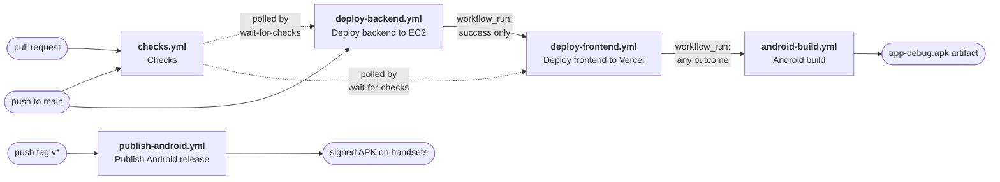

# Continuous integration and delivery

Everything that happens automatically when you open a pull request or push to `main`, why it happens
in that order, and every secret it needs. Sister documents:

- [docs/RELEASING.md](RELEASING.md) — cutting a signed Android release. The tag-driven publish
  pipeline is described there in full; this document only says where it sits.
- [docs/DEPLOYMENT_VERCEL.md](DEPLOYMENT_VERCEL.md) — the Vercel project itself (env vars, domains).
- [backend/DEPLOY_AWS.md](../backend/DEPLOY_AWS.md) — the EC2/S3/CloudFront side.
- [docs/ENVIRONMENT.md](ENVIRONMENT.md) — every environment variable, per service.

---

## 1. The pipeline

**Seven workflow files, in four groups that do not talk to each other.** Only the first group is a
chain; the rest are named here rather than counted, because a count is the one fact a new file
falsifies silently.

1. **The deploy chain** — three workflows, chained. One push to `main` walks the whole chain.
2. **The checks** — `checks.yml`, on **every** pull request and every push to `main`. Runs the tests.
   Deploys nothing.
3. **The release** — `publish-android.yml`, on a `v*` **tag** only. The only thing in this repository
   that can reach a handset.
4. **The crons** — `keep-supabase-active.yml` and `backup-db.yml`. Neither asserts anything about the
   code.


```mermaid
flowchart LR
    PR([pull request]) --> C["<b>checks.yml</b><br/>Checks"]
    P([push to main]) --> C
    P --> B["<b>deploy-backend.yml</b><br/>Deploy backend to EC2"]
    C -.->|polled by<br/>wait-for-checks| B
    B -->|workflow_run:<br/>success only| F["<b>deploy-frontend.yml</b><br/>Deploy frontend to Vercel"]
    C -.->|polled by<br/>wait-for-checks| F
    F -->|workflow_run:<br/>any outcome| A["<b>android-build.yml</b><br/>Android build"]
    A --> R([app-debug.apk artifact])
    T([push tag v*]) --> V["<b>publish-android.yml</b><br/>Publish Android release"]
    V --> H([signed APK on handsets])
```

~~Note what that diagram does **not** contain: an arrow from `checks.yml` into the deploy chain.~~
**The two dotted arrows are a WAIT, not a trigger.** A workflow still cannot `needs:` a job in another
workflow file. Instead each deploy workflow carries a `wait-for-checks` job that polls the REST API
for the `checks.yml` run at the exact SHA it is about to ship, and refuses to hand over to its
`deploy` job until `Backend tests`, `Web typecheck, lint and unit specs` and `Docs check` are green.
The backend's copy landed first (`deploy-backend.yml`) and runs only when `backend/` changed. The
frontend's copy landed on 2026-10-09 and covers the push the backend's cannot see: a frontend-only
push, which until then was published without anything waiting on Checks. Both skip the wait on a
manual dispatch, which is the documented emergency override (§4). A Checks run that was
**cancelled** is not a failed one (since 2026-10-09): when a newer push to `main` cancels it, the wait
ends green as *superseded* and the newer commit's own run ships both (§6). See **The checks** below,
under "it runs; it does not gate", for what this still does not cover.

| # | Workflow | File | Trigger | What it does |
|---|---|---|---|---|
| 1 | Deploy backend to EC2 | `.github/workflows/deploy-backend.yml` | `push` to `main` | `wait-for-checks` → python3.14 on the box, and the venv built from `backend/requirements.lock` **beside** the live one (2026-10-09) → rsync → write `.env` → install the project and generate the Prisma client into the new venv → `prisma migrate deploy` → **point `backend/.venv` at the new venv** → restart `fieldrepo` + `fieldrepo-queue` → poll `/health`. [backend/DEPLOY_AWS.md](../backend/DEPLOY_AWS.md) §9 has the layout on the box and the rollback. |
| 2 | Deploy frontend to Vercel | `.github/workflows/deploy-frontend.yml` | `workflow_run` on **1** completing | gate → `wait-for-checks` (2026-10-09) → `vercel pull` → **refuse any project but `field-repository`** → **assert the pulled env carries what the app needs** (every `NEXT_PUBLIC_*`, `[SENSITIVE]` placeholders included), and *warn* when the project's Node.js Version is not the build's major → `vercel build --prod` → **assert those values actually reached the bundle** → `vercel deploy --prebuilt --prod` → **prove the production domain resolves to the new deployment, and `vercel promote` it when a rollback has turned auto-assignment off** (2026-10-09) → smoke-check the alias → **assert the bundle the CDN serves is the one that was verified**, starting with which deployment it is |
| 3 | Android build | `.github/workflows/android-build.yml` | `workflow_run` on **2** completing, plus `pull_request` filtered to `android/**` | JDK 17 → `compileDebugKotlin` → `testDebugUnitTest` → `lintDebug` (advisory) → `assembleDebug` → upload APK. **Debug variants only.** Nothing it produces can install over a release build, and nothing it produces reaches a phone. |
| 4 | Checks | `.github/workflows/checks.yml` | `pull_request`, `push` to `main`, manual | Three independent jobs: the backend suite, the web typecheck/lint/unit specs, the documentation check. **No `paths:` filter.** See **The checks** below.  |
| 5 | Publish Android release | `.github/workflows/publish-android.yml` | `push` of a `v*` **tag**, plus a manual dry run | Builds and **signs** the release APK on the runner, proves the signer against `ANDROID_RELEASE_CERT_SHA256`, uploads it, and `POST`s `/api/app/release` so the in-app updater offers it. See [RELEASING.md](RELEASING.md). |
| 6 | Keep Supabase active | `.github/workflows/keep-supabase-active.yml` | nightly cron | Pings Postgres so Supabase does not pause the free-tier project. |
| 7 | Back up the database | `.github/workflows/backup-db.yml` | scheduled | `pg_dump` to S3. |

**Rows 3 and 5 are the two halves of one rule worth stating plainly: `android-build.yml` builds
DEBUG and only debug, and `publish-android.yml` is the only workflow that reaches a handset.** A
debug-signed APK cannot install over a release-signed one and the in-app updater will not offer it;
a release is a deliberate act with a tag behind it, a key on the runner, and a signer check. The
currently fielded build is the exception that motivated all of this — it was signed with the Android
**debug** key by hand, which [RELEASING.md §0](RELEASING.md) explains at length.

### Why the order is a dependency, not a preference

**Backend before frontend.** The browser calls the FastAPI box **directly**; there is no Next.js
proxy or rewrite in front of it (DEPLOYMENT_VERCEL.md §0). So the bundle Vercel publishes assumes
every endpoint it calls already exists. A single commit routinely adds a page *and* the API route
that page reads — if the Vercel deploy wins that race, the live site spends the gap calling routes
that answer `404`, which users see as empty lists, failed saves and "Failed to fetch" toasts. The
window is not theoretical: the backend deploy **stops the `fieldrepo` service** before running
`prisma migrate deploy`, so there is a real interval where the API is down and a freshly-shipped
frontend would be pointing straight at it. Backend first, frontend second, always.

**Android last, and unconditional.** Stage 3 builds a **debug** APK; it deploys nothing. (Getting a
build onto phones is a separate deliberate act with its own workflow and its own trigger: the in-app
OTA updater compares `versionCode` against a *release-signed* APK, and `publish-android.yml` is the
only thing that can produce one. Nothing in **this chain** can reach a device.) It is ordered
last only because it is the cheapest and least urgent stage, and running it first would delay the
deploys. It deliberately has **no success gate**: a build gate's inputs are the source tree, not the
state of the servers, so "does the Android app still compile?" is a question you want answered *more*
urgently when a deploy just failed, not less. Gating it would hide a Kotlin compile break behind an
unrelated infrastructure failure.

### What actually runs, per kind of change

The backend workflow has **no `paths:` filter** — it starts on every push to `main` and decides for
itself whether to touch EC2. That is the fix for the obvious `workflow_run` dead-lock: if stage 1
were filtered to `backend/**`, a frontend-only push would never start it, so stage 2 would never be
triggered and the frontend would never ship. Instead, each stage decides for itself.

**Neither stage asks the per-push question any more — changed 2026-09-20.** Stage 1's `changes` job
used to diff the PUSH RANGE alone and publish the answer as the `pipeline-changes` artifact, which
stage 2 then downloaded and skipped on. That made deploy eligibility a pure function of ONE PUSH,
with nothing comparing it against what is deployed — and when a deploy fails, the next push silently
inherits a wrong answer in the dangerous direction. Stage 1 now UNIONS the push range with the range
from the last commit it actually deployed (a run whose `deploy` job itself concluded success, since
a run that skipped its deploy also goes green). Stage 2 reads the commit the Vercel production alias
is serving (`meta.deployedCommitSha`, stamped by its own deploy step) and diffs that against what it
would publish. Anything either cannot determine — API down, first deploy, force-pushed history —
**deploys**.

The `pipeline-changes` artifact is still UPLOADED by stage 1 and is now read by nobody. It is kept
rather than deleted because removing a producer is its own change with its own readers to check;
if it is ever wired to a gate again it may only turn a deploy ON, never off.

| Push touches | 1 · backend deploy | 2 · frontend deploy | 3 · Android build | 4 · Checks |
|---|---|---|---|---|
| `backend/**` only | **runs**, after Checks is green on that SHA | skipped (nothing to publish) | runs | **all three jobs** |
| `frontend/**` only | skipped (run still succeeds) | **runs**, after Checks is green on that SHA | runs | **all three jobs** |
| `android/**` only | skipped | skipped | **runs** | **all three jobs** |
| several areas | **runs**, after Checks is green | **runs**, after 1 is green *and* Checks is green | runs | **all three jobs** |
| docs only | skipped | skipped | runs | **all three jobs** |
| backend deploy **fails** | ❌ red | **refuses to deploy**, says why in the summary | still runs | unaffected |
| **Checks red** | **refuses to deploy** *if `backend/` was touched*: its wait is scoped to that | **refuses to deploy** whatever changed (since 2026-10-09) | still runs — `android-build.yml` has no conclusion filter | ❌ red |

Anything the diff cannot be computed for — manual dispatch, the first push of a branch, a force-push
that orphaned the previous head — is treated as "everything changed". The pipeline over-deploys
rather than silently skipping a real change.

The Checks column has one value on purpose. `checks.yml` carries no `paths:` filter and never skips a
job, which is the difference between it and everything else in that table; the reasoning is in the
next section and, at length, in the header of the workflow itself.

**On a pull request, only rows 3 and 4 are reachable at all** — the deploys fire on `push`/
`workflow_run`, so nothing in columns 1 and 2 runs before a merge. And row 3 is path-filtered
(`android-build.yml:31-33`), so a pull request that touches only `backend/` or `frontend/` gets
exactly one workflow: this one.

### The three assertions stage 2 makes about the environment

Added after a green pipeline shipped a live site nobody could log in to. Each is a separate step,
and each fails the run loudly:

1. **After `vercel pull`** — every variable the app cannot run without is present in the pulled
   environment. A variable typed **Sensitive** in the dashboard is withheld from `vercel pull` by
   design; because the build happens on a GitHub runner rather than on Vercel, Next.js then inlines
   `undefined` and *both the build and the deploy still succeed*.
2. **After `vercel build`** — those values are actually present in the compiled output. The pull
   succeeding does not prove the build consumed them.
3. **After deploy** — the bundle the CDN is serving is the one that was verified. The step fetches
   `/login`, walks its JavaScript chunks, and confirms the API host appears in them.

Assertion 3 is the one that catches a class the other two cannot: a correct build published behind a
stale alias. Together they turn "the site is live but nobody can log in" from a support ticket days
later into a red run in five minutes.

**A host search cannot tell one good build from another, so since 2026-10-09 identity is asserted
first.** After an Instant Rollback (the dashboard button, or `vercel rollback`), Vercel turns **off**
auto-assignment of production domains: every later `vercel deploy --prod` is *staged*, never receives
`field-repository.vercel.app`, and still exits 0, while the site stays on the rolled-back build until a
deployment is promoted ([Vercel: Undo a rollback](https://vercel.com/docs/instant-rollback#undo-a-rollback)).
That build answers 200 and carries the same API host, so the smoke check and assertion 3 both passed
it, and production would have frozen behind green runs. The step *Prove production is serving this
deployment* now reads which deployment the domain resolves to, through the same Vercel API call the
gate already makes, and compares it with the upload. If they differ it runs `vercel promote` on the
new deployment, which moves the domains and turns auto-assignment back on, reads again, and fails the
run if production is still elsewhere. Assertion 3 repeats the identity read before it searches the
bundle.

### The checks

`.github/workflows/checks.yml`. Until it landed, **this repository ran no test automatically** — the
1000-plus backend cases, the web unit specs and the Kotlin suite all existed, all passed, and nothing
executed any of them unless a human typed the command. A pull request could break any of them and
still show a clean list of checks.

Three jobs, deliberately independent, so one red does not hide another's answer:

| Job (the name branch protection needs) | Where it runs | What it runs |
|---|---|---|
| **Backend tests** | `backend/` | Python 3.14 (`check-latest`) → `pip install -r requirements.lock` → `pip install --no-deps -e .` → `pip check` → `python -m prisma generate` → `python -m pytest -rf --durations=15` |
| **Web typecheck, lint and unit specs** | `frontend/` | Node 22 → `npm ci` → `npx tsc --noEmit` → `npm run lint` → `npm run test:unit` |
| **Docs check** | repository root | Node 22 → `node docs/tools/check-docs.mjs` |

Measured on the tree the workflow landed with (2026-09-14, on a laptop — a runner will differ):
pytest 1019 passed in 54 s, `tsc` clean, `eslint` clean, 104 unit specs in 8 s, check-docs in about a
second. Every one of those commands is exactly what the workflow runs, from exactly the directory it
runs it in, so **anything the workflow reports you can reproduce in one line** — see §4.

**There is no `paths:` filter, and one must never be added.** A filter is why `android-build.yml`
cannot see the change that breaks it (next paragraph); the property that makes this workflow worth
having is that *every* pull request runs it.

**No secrets.** The backend job exports six obviously-fake placeholder values because
`app.core.config.Settings` refuses to build without `DATABASE_URL`, `JWT_SECRET`, the three `AWS_*`
values and `MASTER_ADMIN_EMAIL` (`backend/app/core/config.py:78`, `:101`, `:167-171`, `:187`) and
`backend/.env` is gitignored, so on a runner there is nothing else for them to come from. Without
them a plain `pytest` does not fail a few tests, it fails to **collect**. The DSN names `ci.invalid`
— a hostname RFC 2606 guarantees can never resolve — and the whole suite passes against it, which is
the measurement that proves nothing in the suite opens a connection. **Do not make any of those
values real, and do not add a database service container.**

#### It runs; it does not gate

Two things this workflow does **not** do, spelled out because a green tick read as more than it is
costs more than no tick at all:

1. **It does not block a merge** until `Backend tests`, `Web typecheck, lint and unit specs` and
   `Docs check` are named as required status checks on `main` (**Settings → Branches**). That is
   console state; nothing in a checkout can prove it. **UNVERIFIED from here.**
2. ~~**It does not block a deploy.**~~ **It now blocks both deploys, and it did not used to.**
   `deploy-backend.yml` fires on its own `push: main` trigger, and one workflow cannot `needs:` a
   job in another, so on `main` the checks and the deploy start together and the deploy used to win
   the race: an rsync starts faster than a minute of pytest. The fix this item asked for is in
   place. A `wait-for-checks` job inside each deploy workflow polls for the Checks run at the exact
   SHA being shipped and refuses to hand over until those three jobs are green. The backend's copy
   came first, and the frontend's followed on 2026-10-09 (the diagram above). **What it still does
   not do is block a MERGE**, which is item 1, and a manual dispatch skips both waits by design (§4).

#### What is licensed to fail, and how the ratchets work

Neither the test suite nor the documentation set was green on the day this workflow landed, and a job
that is red on day one is a job somebody disables. Both jobs therefore carry an **explicit,
by-name list of the pre-existing failures** — never a `|| true`, never a `--deselect`, never a bare
count. Everything runs; the listed failures are not fatal; **anything else is red**.

**Backend — none since 2026-10-09. The list is empty, like the docs one, and that is the state to
defend.** It began at four, and both pairs were fixed and their lines deleted on 2026-10-09:

| Test | What was wrong, and the fix |
|---|---|
| `test_public_census.py::test_the_census_is_mounted_at_the_public_path_the_cdn_rule_would_be_scoped_to` | Read `api_router.routes` expecting flattened route objects. Since FastAPI 0.137 that list holds one `_IncludedRouter` per `include_router`, with no `.path`. The tests now ask FastAPI's public `iter_route_contexts`, added in 0.137.2 for exactly this. |
| `test_public_census.py::test_the_census_asks_for_no_token` | Same cause, same fix; the effective route it finds carries router-level dependencies, which is what the test inspects. |
| `test_manifest_stream.py::test_the_declared_size_refuses_before_a_byte_moves` | On Python 3.13+ `import pydub` failed (PEP 594 removed `audioop`), so `backend/app/api/routes/data_browser.py:3059` answered 503 before the 413 check. `audioop-lts` is now a dependency (marker `python_version >= '3.13'`), and the job runs 3.14 like production. |
| `test_manifest_stream.py::test_the_real_length_refuses_what_the_column_lied_about` | Same cause, same fix. |

The census pair is worth reading twice, because it was not a code change: **it was a dependency
upgrade** reaching CI through a `>=` range, with no commit behind it. That is the failure
`backend/requirements.lock` exists to stop (see *The backend dependency lock* below).

**Docs — none. The list is empty, and that is the state to defend.** It began at four:
`docs/REPO_FACTS.md is out of date`, two documents with no "How this document is kept true" section
(`DATASET_API.md`, `DESIGN-claude.md`), and one broken link in `docs/README.md`. None of them
belonged to the change that added the workflow, and the reasoning for licensing them rather than
blocking on them still holds for the next such case: a gate whose green depends on edits to four
documents owned by other people arrives red and gets switched off in a week.

**All four were fixed on 2026-09-14 and their lines deleted.** REPO_FACTS.md was regenerated with
`node docs/tools/check-docs.mjs --write`, which was indeed the most valuable of the four — that
generated file had been reporting the backend suite as 14 files and 260 cases against a real 56 files
and 832 `def test_`, claiming there were no Android tests when there are eight test files, and
telling the reader that neither suite is a CI gate, which this workflow had already made false. The
two missing sections were written; `docs/README.md`'s link to `../DESIGN-claude.md` was repointed
after that document moved into `docs/`, which also turned up the fact that `DATASET_API.md` had never
been in the documentation index at all.

**So `Docs check` is now an ordinary gate: the first `FAIL` line of any kind fails the job.** Adding
a line back to the licensed list is not forbidden, but it is the thing to argue about in review —
for a document that genuinely belongs to another workstream the cheaper mechanism already exists and
is not this list, it is `OWNED_ELSEWHERE` in `docs/tools/check-docs.mjs` (§6), where a finding
becomes a warning that everybody can still see.

**Both lists may only shrink, and that is enforced asymmetrically on purpose.** A *new* failure is an
error and fails the job. A listed failure that starts passing is a `::warning` and a line in the run
summary naming the exact line to delete — not an error, because "your tree got better" must never be
the thing that turns a pull request red. Deleting a line is a one-line reviewable diff; **adding**
one is the thing to argue about in review.

#### What it deliberately does not run

- **No Android job.** `android-build.yml` already compiles Kotlin and runs `:app:testDebugUnitTest`
  on a pull request, and a second Gradle job would spend five more minutes to learn the same thing.
  **What is missing is two lines in that file, not a job here:** its `pull_request` trigger is
  filtered to `android/**` (`android-build.yml:31-33`), and the Android suite reads the *web* tree —
  `android/app/src/test/java/com/fieldrepository/app/ui/WalkthroughStepsTest.kt:385` names
  `frontend/components/guide/steps.ts` and asserts the Kotlin and web walkthroughs declare the same
  steps in the same order; `RecordPickersTest.kt` and `AccessRosterTest.kt` name their own web twins
  the same way. So a frontend-only pull request can break an Android test that nothing will run.
  Adding `frontend/**` to that filter closes it.
- **No `ruff`.** It is installed (it is in the `dev` extra, and so in the lock) but `[tool.ruff]` in
  `backend/pyproject.toml` sets only `line-length` and `target-version` — there is no rule selection,
  so a lint job today would gate on whatever the default rule set happens to be rather than on
  anything anybody chose. That default is no longer small: ruff 0.16.10 reports 424 findings on this
  tree at target `py314` (398 at the old `py311`; measured 2026-10-09). Choose the rules first, then
  add the step.
- **No Playwright end-to-end, no backend integration tests.** Both need a running app, a database and
  real credentials. See §5.

### The backend dependency lock

`backend/requirements.lock` (since 2026-10-09) is the pinned resolution every machine installs from:
`checks.yml`'s backend job, the EC2 deploy and `backend/Dockerfile` alike. CI and the box both run

```bash
pip install -r requirements.lock
pip install --no-deps -e .
pip check
```

and the Dockerfile runs the first line only (it puts `app/` on `PYTHONPATH` instead of installing
the project; its comment says why). `--no-deps` on the editable install keeps the lock
authoritative — without it pip re-resolves `pyproject.toml`'s `>=` floors and can quietly lift a pin
— and `pip check` is what notices when those floors have outgrown the lock. Before the lock, CI took
whatever the index offered each day while the box sat on the versions of its first install, June's,
security advisories included; the two ran different `anthropic` majors.

**Refresh it deliberately, never as a side effect of something else**, in a container, so the Python
that resolves it is the Python that runs it everywhere (3.14):

```bash
docker run --rm -v "$PWD/backend:/w" -w /w python:3.14 sh -c \
  "pip install -q pip-tools && pip-compile -q --strip-extras --extra dev \
   --output-file requirements.lock pyproject.toml"
```

It is the same recipe the sister repository uses, and the same two traps apply:

* **`--extra dev`, and NOT `--all-extras`.** The `ai-local` extra pulls `rembg` and `onnxruntime` —
  roughly 400 MB of wheels that `backend/pyproject.toml` forbids on the API box.
* **Do not paste the command out of the lock's own `pip-compile` header** if it ever records
  `--no-index`: passing that for real resolves against no index at all, and the refresh fails.

Two things to know about the result. It is resolved for Linux: `uvloop` (from `uvicorn[standard]`)
is in it, and uvloop does not install on Windows, so a Windows venv installs the lock without that
one line. And Dependabot cannot refresh it (`.github/dependabot.yml` says why): a pip pull request
raises a floor in `pyproject.toml`, and the lock is recompiled by hand in the same pull request —
`pip check` fails Backend tests until it is.

---

## 2. Required repository secrets

**Settings → Secrets and variables → Actions → New repository secret.** Names are case-sensitive.

| Secret | Used by | Where to get the value |
|---|---|---|
| `EC2_HOST` | backend | Public/Elastic IP of the API box. `cd infra/terraform && terraform output api_public_ip`, or EC2 console → Instances → the `fieldrepo` instance → Public IPv4. Currently `15.207.145.174`. |
| `EC2_SSH_KEY` | backend | The **entire** private key file for the instance's key pair, `-----BEGIN…` through `-----END…` inclusive, with the trailing newline: `infra/terraform/fieldrepo-deploy.pem`. Paste the file contents, not the path. `*.pem` is gitignored — never commit it. |
| `BACKEND_ENV` | backend | The full contents of the production `backend/.env`: `DATABASE_URL`, `JWT_SECRET`, `AWS_*`, `OPENAI_API_KEY`, `GEMINI_API_KEYS`, `ELEVENLABS_*`, `DEEPGRAM_*`, `BACKEND_CORS_ORIGINS`, … Every key and its meaning is in [ENVIRONMENT.md](ENVIRONMENT.md). Easiest source of truth: `ssh ubuntu@$EC2_HOST cat /home/ubuntu/app/backend/.env`. The workflow pipes it over the SSH tunnel; it is never on a command line. |
| `VERCEL_TOKEN` | frontend | <https://vercel.com/account/tokens> → **Create Token**. Scope it to the **team that owns `field-repository`**, not "Personal Account", or the CLI 403s. Set an expiry you will actually remember — the deploy starts failing with `Error: Not authorized` the day it lapses. This is the only genuinely sensitive value of the three Vercel ones. **Measured 2026-10-09 (token metadata, never the value):** the token this repository uses had USER scope and NO expiry, so a leak would give permanent control of every project on the account. Replacing it with a team-scoped, expiring one, then revoking the old one, is an open owner decision; record the expiry date here when it is made. |
| `VERCEL_ORG_ID` | frontend | `team_pcTf4Alb2DCIwq2IZcdu00dS`. Also at Vercel → Team Settings → General → **Team ID**, or in `frontend/.vercel/project.json` (`orgId`) after a local `vercel link`. An identifier, not a credential. |
| `VERCEL_PROJECT_ID` | frontend | `prj_EzXN8hhGKpMciFBrZRdxpcgUUzN0`. Also at Vercel → Project `field-repository` → Settings → General → **Project ID**, or `frontend/.vercel/project.json` (`projectId`). An identifier, not a credential. |
| `SUPABASE_DATABASE_URL` *or* `DATABASE_URL` | keep-alive cron | The Supabase Postgres connection string (Supabase → Project → Connect). Pre-existing; unrelated to deploys. |

`GITHUB_TOKEN` is **not** something you create — GitHub injects it per run. ~~Stage 2 uses it only to
download stage 1's change-detection artifact.~~ Stage 2 no longer downloads that artifact (2026-09-20).
It uses the token, with `permissions: actions: read`, to ask whether the run that published what is
live concluded success, and, since 2026-10-09, to read the Checks run and its jobs for the commit it
is about to publish.

**The Vercel project is deliberately NOT linked to the GitHub repository.** It was, and every push
produced a second, competing build: Vercel's own Git integration cloning the repo and building it
with no knowledge of this pipeline's ordering. Twelve of those failed outright with `No Next.js
version detected`, because the project's Root Directory was unset and Vercel was building the
repository root, whose `package.json` has no `next` in it. Setting Root Directory to `frontend`
fixed the error; `frontend/vercel.json`'s `ignoreCommand` then turned the builds into cancellations
rather than failures — but a cancelled build is still a deployment record and still an email, for
work that was never wanted. So the link is removed outright: `DELETE /v9/projects/{id}/link`.

GitHub Actions is the only publisher, it authenticates with `VERCEL_TOKEN` rather than with the
repository connection, and `vercel deploy --prebuilt` does not need the project to know about GitHub
at all — verified by deploying successfully immediately after unlinking. The cost is that pull
requests no longer get automatic preview deployments; if those are ever wanted back, re-link in the
dashboard and rely on `ignoreCommand` to keep Git builds off `main`.

~~**Until the three Vercel secrets exist, stage 2 skips instead of failing.**~~ **Since 2026-10-09,
stage 2 FAILS when `VERCEL_TOKEN` is missing.** Its gate job checks for the secret and, when it is
absent, writes the table above into the run summary, reports `should_deploy=false` and exits 1. The
paragraph that stood here defended a green skip ("a red X that everyone knows to ignore is worse than
no X at all"). The sister repository's copy of that skip concluded `success` on 2026-08-23 while
publishing nothing, and the owner found out by looking for changes the live site had never received.
A green run that published nothing is the more expensive lie. Stage 3 still fires either way,
because `android-build.yml` chains on completion, not success.

> **UNVERIFIED:** which secrets the repository currently holds cannot be read from a checkout. An
> earlier version of this document asserted the set was `BACKEND_ENV`, `DATABASE_URL`, `EC2_HOST` and
> `EC2_SSH_KEY` only; the Vercel project has since been unlinked and deployed successfully through
> the CLI, which is only possible with `VERCEL_TOKEN` present, so that list is stale. Read the real
> one at **Settings → Secrets and variables → Actions**, or `gh secret list`. Do not restate it here
> — the value of this paragraph is the *mechanism*, and the inventory belongs in the console.

**`android-build.yml` needs no secrets at all** and still does not: it produces a debug-signed APK,
and debug signing uses the auto-generated debug keystore. **`checks.yml` needs no secrets either** —
its backend job exports obviously-fake placeholders instead, for the reason given in *The checks*
above, and a secret in a workflow that runs on every pull request would be a secret exposed to every
pull request.

What has changed is that **the release key is now in CI**, in exactly one workflow. `publish-android.yml`
reads `ANDROID_RELEASE_KEYSTORE_BASE64`, `ANDROID_RELEASE_KEYSTORE_PASSWORD`,
`ANDROID_RELEASE_KEY_ALIAS`, `ANDROID_RELEASE_KEY_PASSWORD` and `ANDROID_RELEASE_CERT_SHA256` to
build and sign the release APK, and `APP_PUBLISH_EMAIL` / `APP_PUBLISH_PASSWORD` to authenticate the
`POST /api/app/release` that tells the fleet a new build exists. That workflow's own preflight refuses
to start when any of them is missing, naming the one it could not find — **a missing secret on a
release path is a failure, never a skip**, which is the lesson §2's Vercel paragraph above was
written from. [RELEASING.md](RELEASING.md) is the document for all of it: what each secret is, how
the key was generated, who holds it, and what to do when one needs rotating.

> **UNVERIFIED, and expected-for-now:** as of 2026-09-14 the five `ANDROID_RELEASE_*` values had been
> created and `APP_PUBLISH_EMAIL` / `APP_PUBLISH_PASSWORD` had **not**. So the first tagged release
> will stop at that preflight, red, naming those two — which is the designed behaviour and not a
> fault. The account `APP_PUBLISH_EMAIL` names must be a **master admin**, because
> `POST /api/app/release` is `Depends(require_master_admin)`
> (`backend/app/api/routes/app_release.py`). As always with secrets: read the real inventory at
> **Settings → Secrets and variables → Actions** or with `gh secret list`, never from this table.

### Not GitHub secrets: the `NEXT_PUBLIC_*` values

`NEXT_PUBLIC_API_URL`, `NEXT_PUBLIC_GOOGLE_CLIENT_ID`, `NEXT_PUBLIC_MAPTILER_API_KEY` and friends are
**build-time** variables that live in the Vercel project (Project → Settings → Environment
Variables, DEPLOYMENT_VERCEL.md §2). `vercel pull` fetches them into the runner before
`vercel build`, so the Vercel dashboard stays the single source of truth and you do not maintain the
same value in two places. Change one there and re-run this workflow (or push) to pick it up.

---

## 3. One-time setup

1. **Add the three `VERCEL_*` secrets** above. The other secrets already exist.

2. **Ensure Vercel is not also publishing.** ~~This is not optional and it is the easiest thing to
   miss.~~ **Already done, and done more thoroughly than this step described:** the Vercel project
   has been **unlinked from the GitHub repository** outright (`DELETE /v9/projects/{id}/link`), so
   there is no Git integration left to race the pipeline. See the "deliberately NOT linked"
   paragraph in §2 for why cancelling builds was not enough.

   The belt-and-braces layers behind that are still in place and should stay: `ignoreCommand:
   "exit 0"` in `frontend/vercel.json`, and `gitProviderOptions.createDeployments` disabled at the
   project level. If the link is ever restored for PR previews, those two are what keep Git builds
   off `main`.

3. **Merge these workflow files to `main`.** `workflow_run` only fires for workflow files that exist
   **on the default branch** — on a feature branch, stages 2 and 3 will not trigger no matter what
   stage 1 does. Stage 3 still builds on pull requests, so PR feedback works before the merge.

4. **First run:** push a no-op commit to `main` (or `workflow_dispatch` the backend workflow) and
   watch all three go green in order before trusting the chain.

5. **Make the checks required.** *Settings → Branches → branch protection rule for `main` → Require
   status checks to pass* → tick **Backend tests**, **Web typecheck, lint and unit specs** and
   **Docs check**. Until this is done `checks.yml` reports and blocks nothing, which is the state
   described under *The checks* in §1. The names must match exactly; renaming a job silently
   un-requires it.

6. **Clear the two ratchets.** On the first green run, read the run summary: it will name any entry
   in the workflow's expected-failure or known-problem lists that no longer describes anything. Delete
   those lines. Both lists are meant to reach zero — see *What is licensed to fail* in §1.

---

## 4. Running things by hand

| Goal | How |
|---|---|
| Deploy the backend now | Actions → *Deploy backend to EC2* → **Run workflow**. Manual dispatch always deploys (it skips change detection and the wait for Checks). Stage 2 does **not** chain off a manual dispatch of stage 1 unless the run completes on `main`. |
| Deploy the frontend now | Actions → *Deploy frontend to Vercel* → **Run workflow**. A manual dispatch bypasses the backend gate whatever `force` says. Leave `force` = true to deploy regardless of what changed: it also skips the comparison with the live site and, **since 2026-10-09, the wait for Checks on that SHA** — that is the escape hatch, use it knowing why. **Untick `force` to keep those two.** |
| Build the APK now | Actions → *Android build* → **Run workflow**, or open a PR touching `android/**`. |
| Re-deploy after changing a Vercel env var | Re-run *Deploy frontend to Vercel*. `NEXT_PUBLIC_*` values are baked at build time; changing them in the dashboard does nothing until something rebuilds. |
| Get the APK | The run's **Artifacts** section → `app-debug-<sha>`. Debug-signed: sideload-only, and Android will refuse to install it over a release-signed build. |
| Run the checks now | Actions → *Checks* → **Run workflow**. Or just open a pull request: it runs on every one, with no path filter. |
| Ship a signed build to handsets | Not from this page. Push a `v*` tag — [RELEASING.md](RELEASING.md) §2 is the procedure, and it is the only route to a device. |

**Every check, reproduced locally, in the same directory the job uses.** These are the exact commands
the workflow runs; if CI is red and one of these is green, the difference is the environment, and the
first thing to check is the Python version (3.14 in CI) and whether your venv holds what
`backend/requirements.lock` pins (`pip install -r requirements.lock && pip install --no-deps -e .`
from `backend/`, as CI does):

```bash
# Backend — from backend/, with the same placeholder environment the job exports.
DATABASE_URL='postgresql://ci:ci@ci.invalid:5432/no_such_database' \
JWT_SECRET='ci-placeholder-not-a-secret-0123456789abcdef' \
AWS_ACCESS_KEY_ID=ci-placeholder AWS_SECRET_ACCESS_KEY=ci-placeholder \
AWS_S3_BUCKET=ci-placeholder MASTER_ADMIN_EMAIL=ci@example.invalid \
python -m pytest -rf --durations=15

# Web — from frontend/.
npx tsc --noEmit && npm run lint && npm run test:unit

# Docs — from the repository root. Add --write to regenerate REPO_FACTS.md.
node docs/tools/check-docs.mjs
```

A `backend/.env` holding the same placeholders does the same job as those six variables and is what
most people here have; the variables are written out because they are what the runner does, and
because a `.env` that is quietly pointed at a real database is a much worse way to run a test suite.

---

## 5. Known limits, and things that are deliberately not gates

> **Three entries left this list on 2026-09-14** when `checks.yml` landed: the backend suite, the
> Playwright unit specs and the web typecheck/lint now all run on every pull request and every push
> to `main`. What follows is what is *still* true. A row leaves this list when a workflow gains the
> step — so re-read it against the workflow files, never against memory.

- **The checks run, but nothing is required yet.** Branch protection has to name the three job names
  before a red Checks run can block a merge (§3.5). **UNVERIFIED from a checkout** — console state.
- ~~**The checks do not gate the deploy, and on `main` they lose the race.**~~ **BUILT, in both
  stages.** The `wait-for-checks` job this bullet asked for polls the Checks run for the exact SHA
  being shipped and refuses to hand over until the three jobs are green. `deploy-backend.yml`'s copy
  came first and is scoped to pushes that touch `backend/`. `deploy-frontend.yml`'s landed on
  2026-10-09 and covers the frontend-only push the backend's copy structurally cannot see (§1). What
  is left is the merge (the bullet above) and the manual-dispatch override, which skips both waits
  on purpose (§4).
- ~~**Eight backend tests' worth of failure is licensed, in two named lists.**~~ **Both lists are
  EMPTY**: the four documentation problems were fixed on 2026-09-14 and the four pytest failures on
  2026-10-09. The mechanism stays in `checks.yml` for the next day-one red, a ratchet that may only
  shrink; *What is licensed to fail* in §1 says what each former entry was.
- ~~**`backend/` has no lock file, so CI installs a different dependency set every day.**~~ **DONE on
  2026-10-09.** `backend/requirements.lock`, compiled on `python:3.14` with `--extra dev`, is what CI,
  the EC2 deploy and the Docker image install (§1, *The backend dependency lock*). The same change
  moved CI and the box to Python 3.14 and rebuilt the box's venv from the lock, which retired the
  June-vintage versions production had been running.
- **The Android tests cannot see the change that breaks them.** `android-build.yml`'s `pull_request`
  trigger is filtered to `android/**` (`android-build.yml:31-33`), and the Kotlin suite reads the web
  tree: `WalkthroughStepsTest.kt:385` names `frontend/components/guide/steps.ts` and asserts both
  walkthroughs declare the same steps in the same order, and `RecordPickersTest.kt` and
  `AccessRosterTest.kt` name their own web twins. Add `frontend/**` to that filter — a two-line
  change in a file `checks.yml` deliberately does not duplicate.
- ~~**Most actions are still on mutable tags.**~~ **DONE on 2026-10-09, in every workflow.** A tag
  (`actions/checkout@v4`) lets whoever controls that repository decide what runs; a commit SHA does
  not. This bullet asked for the Dependabot config and the pins together, because a hand-pinned SHA
  with nothing to refresh it rots silently, and both landed that day: `.github/dependabot.yml`, and a
  SHA on every `uses:` in `android-build.yml`, `checks.yml`, `deploy-backend.yml`,
  `deploy-frontend.yml`, `keep-supabase-active.yml` and `publish-android.yml`, with its release in a
  trailing comment (`backup-db.yml` uses no action; `webfactory/ssh-agent` in `deploy-backend.yml` is
  the one action from outside `actions/`). Five workflows were pinned that morning to the commit their
  old tag resolved to, so nothing that ran changed; `deploy-backend.yml`'s pins waited for a real
  backend change, because any edit to that file redeploys the backend, and went in with the move to
  Python 3.14 the same day. That change also moved every pin to its action's **latest** release —
  checkout v7.0.1, setup-python v7.0.0, setup-node v7.1.0, setup-java v6.0.1, upload-artifact
  v7.0.2, download-artifact v8.0.2, ssh-agent v0.10.0 — and every job to `runs-on: ubuntu-26.04`.
  Dependabot now also watches npm, pip, gradle, docker, docker-compose and terraform (monthly,
  minor and patch grouped). **Deliberately still unpinned:** the Vercel CLI, which
  `deploy-frontend.yml` installs as `vercel@latest` (its comment says why). How to check a pin, or
  redo one by hand, is in *How this document is kept true*.
- **The Playwright end-to-end suite is still not a gate.** `checks.yml` runs only the eight
  `*-unit.spec.ts` files, which touch no server. The rest of `frontend/e2e/` signs in against a real
  API and drives real records, and `frontend/scripts/pw-smoke.mjs` is a login-and-visit smoke run.
  They need a running app and credentials, so they are a genuinely larger job — but "not wired up" is
  the current state, not "not worth wiring up".
- **No `ruff` gate.** `ruff` is installed by the CI job (it is in the `dev` extra) and never run,
  because `[tool.ruff]` in `backend/pyproject.toml` selects no rules — a lint gate today would
  enforce a default nobody chose. Choose the rule set first, with a dated per-file baseline for what
  is already there, then add the step to the backend job.
- **Android Lint is advisory.** `./gradlew :app:lintDebug` on the current tree reports
  *1 error, 44 warnings* and aborts. The error is pre-existing and unrelated to any code change:
  `AndroidManifest.xml:6 PermissionImpliesUnsupportedChromeOsHardware` — `CAMERA` is requested with
  no matching `<uses-feature android:name="android.hardware.camera" android:required="false"/>`.
  Making lint a hard gate today would fail every run and train everyone to ignore red. The HTML/XML
  report is uploaded on every run. Fix the manifest (or commit a `lint-baseline.xml`), then delete
  `continue-on-error` from the lint step and it becomes a real gate.
- **~~There are no Android tests.~~ There are now, and `android-build.yml` runs them.**
  `android/app/src/test/` holds eight Kotlin test files; the step's own guard checks for sources at
  runtime and only warns when it finds none, so it started enforcing them the moment they landed —
  but the prose comment beside it still describes the empty tree and is stale. **Instrumented** tests
  are still absent and still not run: they need an emulator, and that is a separate job with an
  emulator action, not a line bolted onto this one.
- **Don't chain a fourth stage.** GitHub caps how deep `workflow_run` chains can go (documented at
  three levels); this pipeline already uses two hops. A fourth stage should be a job with `needs:`
  inside an existing workflow, not another `workflow_run` link.
- **`concurrency.cancel-in-progress` is off for both deploys, and off for the release.** Cancelling
  a backend run mid-deploy can leave `fieldrepo` stopped between the service stop and the migrate,
  with no restart step left to run; cancelling a publish can leave an uploaded APK with no release
  row, or kill the proof step after the row was written. Overlapping runs queue instead. **The
  Android build and the Checks are the two that cancel** — neither mutates anything outside the
  runner, and a superseded commit's test result is noise.

---

## 6. Troubleshooting

**`Docs check` is red and I did not touch a document.** Read the `FAIL` lines in the log. The usual
one is `docs/REPO_FACTS.md is out of date`, which is not about prose at all: that file is *generated*
from the repository, so adding a route, a Prisma model or a test file moves it. Run
`node docs/tools/check-docs.mjs --write` and commit the diff. (It **is** a real gate now: that
problem was licensed when this workflow landed and is not any more, so it fails the job like any
other. The diff it produces is reviewable — a generated file changing is a fact about the tree, not a
number somebody retyped.)

**`Docs check` is red on a document somebody else added.** Correct behaviour, and the point of the
list: a new document with no "How this document is kept true" section is a new problem, not a
pre-existing one. Add the section, or — if it genuinely belongs to another workstream — that decision
belongs in `docs/tools/check-docs.mjs`'s own `OWNED_ELSEWHERE` set (`check-docs.mjs:43-52`), where
it becomes a warning, and **not** in the workflow's licensed list.

**`Backend tests` is red on a test that passes on my machine.** Three known causes, in order of
likelihood. **(1) The dependency set.** CI installs exactly `backend/requirements.lock`; a venv built
any other way holds whatever the index offered when it was built, which is how two
`test_public_census` tests once went red with no commit behind them. Reinstall from the lock (§4).
**(2) The interpreter.** CI runs Python 3.14, as the EC2 box does; an older local Python is not
supported (`requires-python = ">=3.14"`). **(3) Cross-module pollution.** The job runs the whole
suite; run the named module by itself before you believe the attribution, and believe the verdict
either way.

**`Backend tests` is red at `pip check`.** `backend/pyproject.toml` asks for a newer version of
something than `backend/requirements.lock` pins — usually a Dependabot pull request that raised a
floor, which it cannot follow by recompiling the lock. Recompile it (§1, *The backend dependency
lock*) in the same pull request.

**Stage 1 is red on "Put Python 3.14 on the box, and build the venv from the lock beside the live
one".** Nothing the API can see has changed: that step runs before the code sync, the API is still
serving from its old venv, and `fieldrepo-queue` was started again on the way out. Read the apt or
pip error in the log, fix the cause (a lock that does not install, an apt mirror or the deadsnakes
PPA unreachable), and re-run the deploy. The half-built venv has no `.complete` and is rebuilt.

**`Backend tests` is red with dozens of collection errors.** Almost always the environment, not the
code: `Settings` refuses to build without its six required values (§1, *The checks*) and every module
that imports `app.core.config` then fails to import. If it happens in CI, the `env:` block of that
job has lost a value. If it happens locally, you are missing `backend/.env` or the variables in §4.

**A run is green but the job you expected is missing.** `checks.yml` has no `paths:` filter and never
skips, so a missing job means the workflow did not run at all — check that the file exists on the
branch you pushed, and that the run is not queued behind the `concurrency` group.

**Stage 2 never starts.** `workflow_run` fires only for workflow files on the **default branch**,
and only for runs whose head branch is `main` (the trigger is filtered to `branches: [main]`). Check
that both files are merged. Also check stage 1 actually *ran* — with change detection it may show a
skipped `deploy` job, which is normal and still triggers stage 2.

**Stage 2 says "Backend deploy concluded 'failure' — refusing to publish the frontend".** Working as
designed. Fix the backend deploy, re-run it, and stage 2 will follow automatically. If you must ship
the frontend anyway, dispatch it manually (§4) and know that the site may call endpoints that are
not there yet.

**Stage 1 or 2 is red on "Wait for Checks on this commit".** Working as designed since 2026-10-09.
Read the error, because there are three:

- *Checks failed* — a gating job is red on that commit. The job summary links the Checks run. Fix the
  commit; the next push ships it.
- *Checks … was CANCELLED, not failed* — the Checks run was cancelled while that commit was still
  `main`'s tip, and nothing re-ran it within twenty minutes. Re-run that Checks run (or dispatch Checks
  on `main`), then re-run the deploy. A gating job that hits its own `timeout-minutes` also ends as
  cancelled, so look at the job before assuming a person cancelled it.
- *Timed out* — no verdict at all within twenty minutes.

In an emergency, dispatch stage 2 with `force=true`, which skips the wait (§4); a manual dispatch of
stage 1 always skips it.

**A deploy run is green with a "Superseded by a newer commit on main" notice and nothing shipped.**
Working as designed since 2026-10-09. `checks.yml` cancels a run in progress when a newer push to
`main` starts its own, and the wait used to report that as *Checks failed*, a red run with a false
diagnosis on any two merges a few minutes apart. It now reads `main`'s tip: when `main` has moved past
the commit, the newer commit's own run ships both, so this one ends green, writes `superseded=true`,
and its `deploy` job is skipped. Look at the newer run. The wait also prefers a run for the SHA that
was not cancelled, so a dispatch of Checks on `main`, which cancels the push run beside it, is graded
by its own result. Both stages' waits do this since 2026-10-09.

**Stage 2 warns "Production did not move onto this deployment".** Almost always the project was in
Vercel's rolled-back state (§1, the three assertions): after an Instant Rollback, `--prod` deployments
are staged and never receive the domain. The step promoted the new deployment, which moves the domain
and turns auto-assignment back on, and the run carried on only because production then resolved to
it. Nothing to do, but find out who rolled back and why: the push after a rollback is meant to be the
fix or a revert. (Its sibling warning, "Could not read which deployment production serves", means the
Vercel API did not answer; the same promote-and-read-again follows.)

**Stage 2 is red on "Prove production is serving this deployment…".** The deployment was uploaded and
is **not** live. Either `vercel promote` was refused (the error names the deployment production still
serves: promote the new one by hand with **Undo Rollback** on the production tile, or `vercel promote
<url>`), or the Vercel API never said which deployment the domain resolves to (check that
`VERCEL_TOKEN` can still read the project, then re-run).

**Stage 2 is red on "Assert the bundle the CDN is serving is the one that was verified".** That build
is already live, so restore the site first: `vercel alias set <last-good-deployment-url>
field-repository.vercel.app`, with the URL from **Project → Deployments** or
`vercel ls field-repository --prod`. Instant Rollback works too, but it turns off auto-assignment of
production domains until a deployment is promoted; the next run's promote step turns it back on. Then
make the next push to `main` the fix or a revert, and do not re-run the failed workflow: every run
compares `main` with what production serves, so a re-run or any other push publishes the same
frontend again (and now promotes it).

**Stage 2 is red on "Refuse to publish to any project but field-repository".** `VERCEL_PROJECT_ID`
resolves to some other Vercel project. Nothing was uploaded. Compare the secret with §2's row; if it
names `designer-repository`, it is the sister repository's, and publishing would have replaced that
product's live site.

**Stage 2 warns "Production runs a different Node major from CI".** The project's Node.js Version is
not the major `checks.yml` and the build run on. Set it in the dashboard
([DEPLOYMENT_VERCEL.md](DEPLOYMENT_VERCEL.md) §1); the next publish picks it up.

**`Error: Not authorized` / `Forbidden` from the Vercel CLI.** `VERCEL_TOKEN` expired, was revoked,
or is scoped to a personal account instead of the team that owns the project. Re-issue it (§2).

**`Vercel project Root Directory is '', expected 'frontend'`.** Someone cleared Root Directory in
the dashboard. The workflow fails fast on this on purpose, because the alternative is a confusing
`No Next.js version detected` sixty lines into a build. Restore it: Project → Settings → General →
Root Directory = `frontend`. Every Vercel CLI command in the workflow runs from the **repository
root** precisely because that setting is what points the build at `frontend/`; do not "fix" a
root-directory error by adding `working-directory: frontend`, which makes the CLI look for
`frontend/frontend`.

**`Invalid vercel.json - should NOT have additional property '//'`.** JSON has no comments, and the
Vercel CLI validates the file strictly — but only on `deploy`, not on `build`. A `//` key therefore
survives the whole build and fails at the very last step, after several minutes. Keep
`frontend/vercel.json` to schema keys only and put the prose here.

**Why `frontend/vercel.json` sets `ignoreCommand: "exit 0"`.** It stops Vercel's own Git
integration from building this project. Two publishers for one site is the bug: a Git build starts
the moment `main` moves, which is *before* the backend has deployed and migrated, so the live site
spends that window calling endpoints that answer 404. GitHub Actions is the single publisher and it
waits for the backend. The Ignored Build Step is a Git-integration feature only — `vercel build` and
`vercel deploy --prebuilt` from CI never run it, so this cannot block the pipeline. Git-triggered
deployments are *also* disabled at the project level (`gitProviderOptions.createDeployments`), so
this is belt and braces.

**`npm ci can only install packages when … in sync`.** `frontend/package-lock.json` is stale. Run
`npm install` in `frontend/` and commit the lockfile (DEPLOYMENT_VERCEL.md §7.5).

**Two production deployments per push.** Vercel's Git integration has been re-linked. It was removed
outright (§2); if two deployments appear again, that is what happened. Unlink it, or at minimum
restore the Ignored Build Step — see §3.2.

**The deploy is green and the live site cannot log anyone in.** This should now be impossible: the
three assertions in §1 fail the run instead. If it happens anyway, the assertions have a hole and
that hole is the bug — do not just fix the variable. Start at
[DEPLOYMENT_VERCEL.md §2.2](DEPLOYMENT_VERCEL.md).

**Android build fails on the SDK.** The workflow installs `platforms;android-35` and
`build-tools;35.0.0` explicitly because runner images drift. If `compileSdk` in
`android/app/build.gradle.kts` moves, update that step and the JDK pin together — the JDK 17 pin
tracks `sourceCompatibility`/`jvmTarget` in the same file.

**A deploy hangs on the health poll.** Stage 1 polls `http://127.0.0.1:8000/health` 40 times at 2 s
and dumps `journalctl -u fieldrepo -n 80` on failure. Read that output first; the usual causes are a
bad `BACKEND_ENV` value and Supabase pooler connection exhaustion — both covered in
[QA_AUDIT.md](QA_AUDIT.md).

Note the path: **`/health`, not `/api/health`.** The health routes are declared on the app rather
than on the API router, so they sit outside the `/api` prefix and `/api/health` 404s. Any monitor
pointed at the `/api` form is measuring a 404, not the service.

---

## How this document is kept true

Everything here describes seven YAML files, so almost all of it is mechanically checkable — and the
parts that are not are exactly the parts that were wrong before.

| Claim class | Kept true by |
|---|---|
| The seven workflows, their triggers and their step order | `.github/workflows/*.yml`. `grep -n "^name:\|^on:\|    - name:" .github/workflows/deploy-frontend.yml` renders the shape of a workflow in one command. The §1 table is a *list*, not a count, for the same reason the workflow headers are: a new file falsifies a count silently. |
| The secrets **table** (names and purposes) | `grep -ho 'secrets\.[A-Z_]*' .github/workflows/*.yml \| sort -u` lists every secret the workflows read. Anything in that output missing from §2 is undocumented. |
| Which secrets **exist** | **Not checkable from a checkout, and deliberately not stated.** `gh secret list`, or the Actions settings page. A previous version asserted an inventory here and it went stale within days. |
| The three job names in §1 and §3.5 | `grep -n "    name:" .github/workflows/checks.yml`. These are the strings branch protection matches; if they stop agreeing with this document, the required checks are silently matching nothing. |
| What the checks actually run | The `run:` lines of `.github/workflows/checks.yml`. §4 repeats each command so it can be pasted — if a job's command and §4's disagree, §4 is the one that is wrong. |
| The two licensed-failure lists | The heredocs inside `checks.yml` (`expected-failures.txt`, `known-doc-problems.txt`) are the authority; §1's tables describe them. **Both may only shrink.** Re-run the two commands in §4 to see the real current sets — and note that the workflow itself warns on every run about any entry that no longer describes anything, so the lists cannot rot quietly the way this prose can. |
| The §5 non-gates | The absence of a job. A row leaves that list when a workflow gains the step — so re-read §5 against the workflow files, not against memory. Three rows left it on 2026-09-14. |
| The measured figures in §1 (`1019 passed`, `104 specs`, `4 problems`) | Dated, and measured on a laptop rather than a runner. Totals move the day anybody adds a test or a document; re-run the §4 commands and re-date them, or delete them. The only numbers the workflow itself enforces are floors, not targets. |
| Vercel project settings (Root Directory, Git link, `createDeployments`, Node.js Version) | **UNVERIFIED from here** — dashboard state. §3 and §6 say what they must be. At deploy time the workflow **asserts** Root Directory and the project's name (since 2026-10-09, only `field-repository` may be published to), and **warns** on a Node.js Version whose major differs from the build's; the Git link and `createDeployments` are checked by nothing. |
| The two `wait-for-checks` copies | `GATING_JOBS` in `deploy-backend.yml` and `deploy-frontend.yml` must hold the same three names as `checks.yml`'s jobs (`grep -n "GATING_JOBS" .github/workflows/*.yml`). A renamed job makes both waits time out, with every poll in the log naming the job it is still waiting for, which is loud, not silent. Their run selection, verdict program and `cancelled` branch are byte-identical to each other and to the sister repository's two copies as of 2026-10-09: `grep -n superseded` over `.github/workflows/deploy-backend.yml` and `.github/workflows/deploy-frontend.yml` finds, in each, the job's output, the branch that writes it and the `deploy` job's refusal. Fix a defect in one copy, fix it in all four. |
| The production domain serving the new deployment | Asserted after every publish, not measured here: the deploy job reads which deployment `field-repository.vercel.app` resolves to, promotes the upload out of a rollback, and fails if production is still elsewhere (§1, the three assertions). That a rollback turns auto-assignment off is Vercel's documented behaviour, linked there; that `field-repository.vercel.app` is a project domain rather than a hand-set alias was measured on 2026-10-09 (**Project → Settings → Domains**). |
| The action pins (§5) | `grep -nE "^\s*(- )?uses:" .github/workflows/*.yml` — every hit must read `owner/repo@<40-hex SHA> # vX.Y.Z`. To check one against its comment, or to redo one by hand: `gh api repos/<owner>/<repo>/git/ref/tags/<vX.Y.Z> --jq .object`. A `commit` object's `sha` is the pin; a `tag` object is an annotated tag, so read the commit it points at with `gh api repos/<owner>/<repo>/git/tags/<sha> --jq .object`. Only the SHA runs and only the comment gets read, so a comment that names a different release from its SHA is the bug. |
| The backend dependency lock (§1) | `backend/requirements.lock` is generated: its header names the Python that compiled it (3.14) and the command. Re-run the command in §1 and diff — an empty diff on the same day means it is current. `grep -n "requirements.lock" .github/workflows/checks.yml .github/workflows/deploy-backend.yml backend/Dockerfile` finds every place that installs it. |
| The runner image | `grep -n "runs-on" .github/workflows/*.yml` — every job names `ubuntu-26.04` (since 2026-10-09), never `ubuntu-latest`, so an image move is a reviewed diff rather than a GitHub announcement. |
| Branch protection: whether the checks are required | **UNVERIFIED from here** — console state, and the single most load-bearing unverifiable claim on this page. Nothing in `.github/` can assert it. **Settings → Branches**, or `gh api repos/:owner/:repo/branches/main/protection`. |
| Everything about cutting a release | [RELEASING.md](RELEASING.md), which owns it. This document states only where `publish-android.yml` sits in the pipeline and which secrets it reads; if the two disagree about anything else, RELEASING.md wins. |

**Review triggers:** any change under `.github/workflows/`, `frontend/vercel.json`, or
`infra/terraform/user_data.sh` (which defines the services stage 1 restarts). Also: any change to the
two licensed-failure lists in `checks.yml`, because shrinking one is exactly the event that makes
§1's tables wrong.

**The failure mode to watch for in this document specifically:** it accumulates entries about
console state — a Vercel toggle, a secret, an Ignored Build Step — that nobody can verify from the
repository and everybody assumes is still true. Each such claim is marked **UNVERIFIED**. When one
turns out to be wrong, do not just correct the value: ask whether the claim belongs here at all, or
whether the pipeline should be asserting it at runtime the way §1's three environment assertions now
do.
