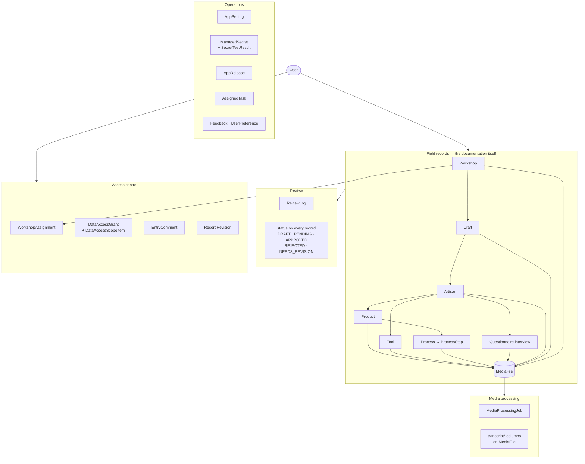
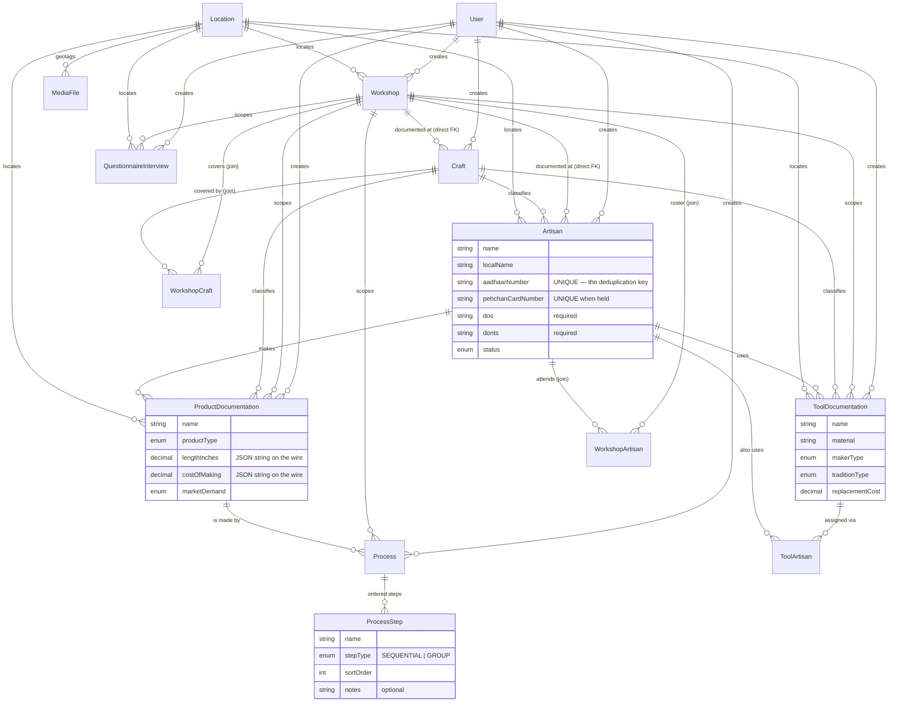
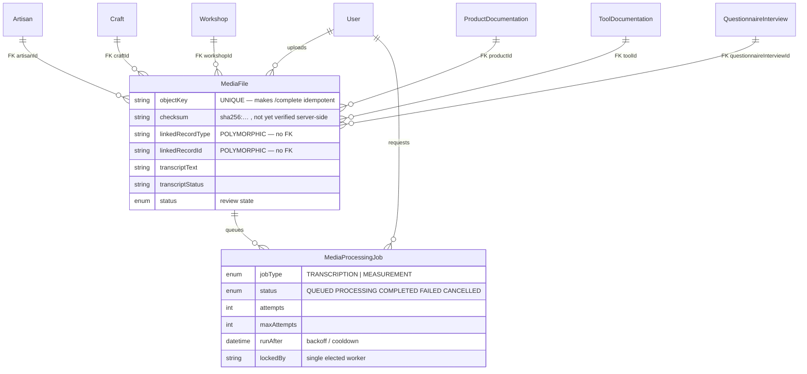
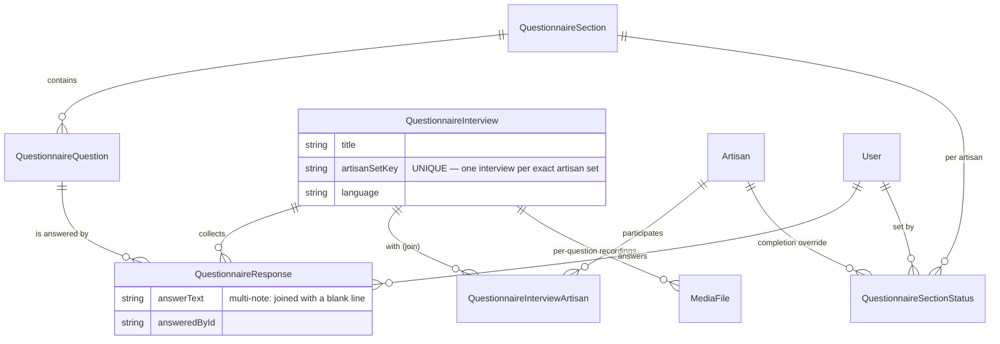
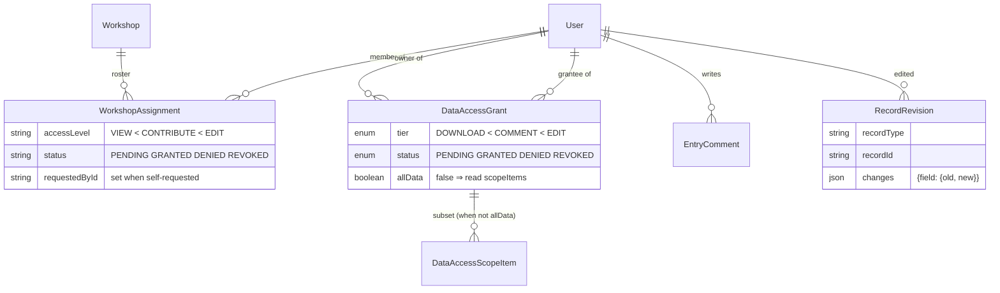

# The data model

The shape of everything the repository stores, why each relationship exists, and the four places
where the schema does something a reader would not predict from the field names.

Source of truth is `backend/prisma/schema.prisma` — a single file, heavily commented, and the only
definition of the database. Model and enum **counts** are not written here; they are generated into
[REPO_FACTS.md](REPO_FACTS.md), because a count in prose is wrong the first time anyone adds a table.

Sister documents: [ARCHITECTURE.md](ARCHITECTURE.md) for how requests reach these tables,
[PERMISSIONS.md](PERMISSIONS.md) for who may write to them, [SCALABILITY.md](SCALABILITY.md) for what
the indexes are for.

---

## 1. The one-line shape

**Workshop → Craft → Artisan → { Product → Process → ProcessStep, Tool, Questionnaire } → Media.**

Everything else in the schema is one of four supporting systems: review, media processing, access
control, or operations (settings, secrets, releases, tasks, feedback).



Read that as: a `User` is the author of everything in `core`; `acl` decides which users may see or
change another user's rows; `review` and `proc` are state machines that run *over* core records
rather than beside them.

---

## 2. Field records

The tables a researcher actually fills in. Attribute lists below are the load-bearing columns, not
every column — the schema has the full list with a comment on each non-obvious one.



### 2.1 Workshop is linked twice, on purpose

`Craft` and `Artisan` each carry **both** a direct `workshopId` column and a row in the
`WorkshopCraft` / `WorkshopArtisan` join table. That is not redundancy left behind by a migration.
The join answers "which crafts did this workshop cover", which is many-to-many and always was; the
direct column answers "which workshop was this record *documented at*", which is single-valued and is
what every workshop-scoped permission check and every Data Browser folder reads. The two are written
in lock-step (`link_workshop_artisan` / `link_workshop_craft` in
`backend/app/services/workshop_access.py`), and the column is nullable so rows recorded before it
existed keep working.

### 2.2 One tool, many artisans

The same documented tool recurs across crafts. `ToolArtisan` exists so it is entered once and then
assigned, rather than re-entered per craft — which is also why `ToolDocumentation` keeps its own
single `artisanId` (the artisan it was *documented with*) alongside the join.

### 2.3 Decimals are strings on the wire

Every `Decimal` column — measurements, costs, prices — is serialised by the API as a **JSON string**,
not a number. Clients must type them as strings. This has emptied a dropdown twice by being
forgotten; see the note in [ARCHITECTURE.md](ARCHITECTURE.md).

### 2.4 `Location` is two answers to two different questions

The largest comment in the schema is on this model, and it is worth reading in full. Briefly:

| Group | Columns | Means | Written by |
|---|---|---|---|
| **Provenance** | `latitude`, `longitude`, `altitude`, `accuracy`, `capturedAt`, `placeName`, `address` | where the **device** was when the record was typed | automatically, by the capture UI |
| **Stated address** | `state`, `district`, `village`, `pincode`, `subjectLatitude`, `subjectLongitude` | where the **subject** is, as a statement by the researcher | only ever by a person |

The split exists because every artisan on the live database with a location sits within a few hundred
metres of one point in Kharagpur, West Bengal, while the places their researchers typed are Bagru,
Balotra, Kutch, Rudraprayag, Ballupur, Sanganer and Kappaladoddi. The coordinates are not wrong —
they are genuine GPS fixes, with real accuracy values, **of the desk the record was typed at**. The
schema previously had nowhere to say that, so the fix got read as the artisan's address. Nothing was
backfilled; the mismatch is flagged in the form rather than guessed at in the database.

> **In flux.** The geocoding service (`backend/app/services/address.py`), the reference endpoint and
> both clients' `LocationFields` are being changed by another workstream as this is written. The
> table above is the schema's shape, which is settled; the UI wording around it may not match yet.

---

## 3. Media, and the polymorphic link

`MediaFile` is the one table almost everything points at, and it uses **two different linking
mechanisms** — which is the single most confusing thing in the schema if you meet it by accident.



**Six parents are real foreign keys.** Artisan, craft, workshop, product, tool and questionnaire
interview each have a nullable column on `MediaFile`, with `onDelete: SetNull` — deleting a product
orphans its photographs rather than destroying them.

**Process and process-step media are not.** There is no `processId` or `processStepId` column on
`MediaFile`. Those attachments are carried by the polymorphic pair `linkedRecordType` +
`linkedRecordId` (`"process"`, `"processstep"`), as `backend/app/api/routes/processes.py` says
explicitly. Anything that walks media by parent must handle both mechanisms — the Data Browser and
the XLSX export both do, via their `_MEDIA_TAG_SLOTS` / `_OWNER_TAGS` lists.

> If you are drawing this relationship for a paper, draw it as two mechanisms. Earlier versions of
> `ARCHITECTURE.md` drew `ProcessStep ||--o{ MediaFile` as an ordinary relation; there is no such
> relation in the database, and a reader who trusts it will write a join that cannot be written.

`linkedRecordType`/`linkedRecordId` is also how Miscellaneous Media attaches to anything at all, and
how `EntryComment` and `RecordRevision` address a record without one FK per table.

---

## 4. Questionnaire



Three things here that are not obvious:

- **`artisanSetKey` is unique.** There is exactly one interview per *exact* set of artisans. Saving
  answers for a set that already has an interview folds into it rather than creating a second one —
  which is why `POST /questionnaire/interviews` is the one route that cannot decide from its
  signature whether it is a create (see `assert_can_create_records`).
- **Completion is derived, then overridden.** The artisans × sections matrix is computed from the
  responses that exist; `QuestionnaireSectionStatus` stores an *admin override* on top, for the
  legitimate case of a section that will never be answered.
- **A response belongs to its answerer.** `answeredById` is why a question already answered by
  somebody else cannot be silently overwritten by the next contributor.

---

## 5. Access control

Three separate systems, deliberately not merged, because they answer three different questions.



| System | Question it answers | Granted by |
|---|---|---|
| Role (`User.role`) | what *kind* of thing may you do at all | a professor or admin, on the Users page |
| `WorkshopAssignment` | may you work **in this workshop** | an admin — either by assigning, or by deciding a user's own request |
| `DataAccessGrant` | may you see **another researcher's** records | that researcher, the record owner |

`WorkshopAssignment` and `DataAccessGrant` are both two-sided: a row can start as an admin's grant or
as the subject's own request (`requestedById` distinguishes them), and a refusal is kept as `DENIED`
rather than deleted, so nobody can re-request their way quietly around a "no".

`RecordRevision` is append-only and stores `{field: {old, new}}`, which is what lets an admin
reconstruct a record's original values after a cross-researcher edit. It is written on the contribute
path, so an edit that goes through the normal PATCH is captured; a direct database write is not.

---

## 6. Operations

| Model | Holds | Notes |
|---|---|---|
| `AppSetting` | repository-wide settings | includes `transcriptionMode` (`RAW`/`REFINED`/`REFINED_TRANSLATED`) and the STT provider order |
| `ManagedSecret` | runtime-editable provider keys | value is **Fernet-encrypted at rest**; never returned in full, only a masked preview |
| `SecretTestResult` | the last reachability check per key | so "is this key working" has an answer that is not a guess |
| `AppRelease` | published Android APKs | the OTA channel; `versionCode` is what devices compare |
| `AssignedTask` | one row per assignee | a batch of five researchers is five rows sharing a `batchId` |
| `Feedback`, `UserPreference` | one row per user each | |
| `ReviewLog` | one row per review decision | append-only; an edit-then-approve writes two rows |

---

## 7. Enums

Every enum, and the thing to know about each. The list of names is generated into
[REPO_FACTS.md](REPO_FACTS.md); this is what they *mean*.

| Enum | Values | Note |
|---|---|---|
| `UserRole` | the six tiers | strictly ordered — see [PERMISSIONS.md](PERMISSIONS.md) |
| `AuthProvider` | `LOCAL`, `GOOGLE` | a Google account has no password hash at all |
| `RecordStatus` | `DRAFT`, `PENDING`, `APPROVED`, `REJECTED`, `NEEDS_REVISION` | `NEEDS_REVISION` is the "sent back with comments" state |
| `ReviewRecordType` | artisan, workshop, product, tool, process, questionnaire, media | processes and interviews are reviewable because the late-submission gate can pin them `PENDING` |
| `MediaType` | image, video, audio, pdf, document, other | |
| `MediaProcessingJobType` | `TRANSCRIPTION`, `MEASUREMENT` | |
| `MediaProcessingJobStatus` | queued, processing, completed, failed, cancelled | a throttled job returns to `QUEUED` **without** spending an attempt |
| `ProcessStepType` | `SEQUENTIAL`, `GROUP` | ordered stage versus things done together |
| `DataAccessTier` | `DOWNLOAD` < `COMMENT` < `EDIT` | ordered; each includes the ones below |
| `DataAccessStatus` | pending, granted, denied, revoked | only `GRANTED` confers anything |
| `ProductType`, `MarketDemand`, `MakerType`, `TraditionType` | field vocabularies | |

Note that two ordered ladders — `WorkshopAssignment.accessLevel` and `AssignedTask.status` — are
**plain `String` columns, not enums**, for client compatibility. Treat them as enums in code; the
database will not.

---

## How this document is kept true

| Claim class | Kept true by |
|---|---|
| Model and enum counts, index counts, the model list | Generated. `node docs/tools/check-docs.mjs --write` rewrites [REPO_FACTS.md](REPO_FACTS.md); the check fails if it is stale. No count appears in this file. |
| The relationships in every `erDiagram` | Hand-written against `backend/prisma/schema.prisma`. Re-derive with the one-liner below and diff the result against §2–§5. |
| Column semantics and the four surprises (§2.1, §2.3, §2.4, §3) | The schema comments. Each is quoted from a comment that lives next to the column; if the comment and this file disagree, the schema wins and this file is wrong. |
| Paths and line references | `node docs/tools/check-docs.mjs` resolves every path mentioned here. |

Re-derive the relation graph after any migration:

```bash
python - <<'EOF'
import re
src = open('backend/prisma/schema.prisma', encoding='utf-8').read()
models = re.findall(r'^model (\w+) \{(.*?)^\}', src, re.S | re.M)
names = {n for n, _ in models}
for name, body in models:
    rels = [f"{m[1]}:{m[2]}" for line in body.splitlines()
            if (m := re.match(r'\s*(\w+)\s+(\w+)(\[\])?\??\s', line + ' ')) and m[2] in names]
    print(f"{name}: {', '.join(rels) or '-'}")
EOF
```

**Review trigger:** any file under `backend/prisma/migrations/`. A new migration means this document
needs a human read, not just a regenerated count — a new column is a fact, but what the column
*means* is the part only a person can write.
