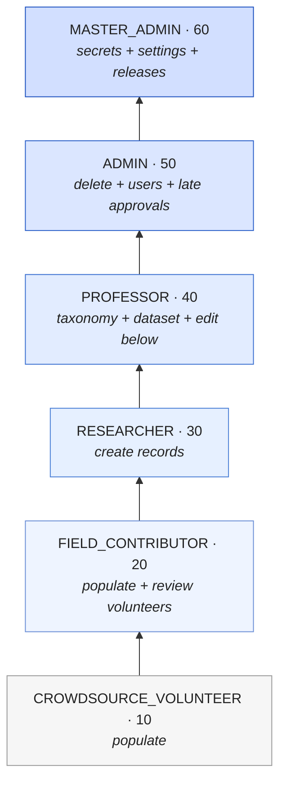
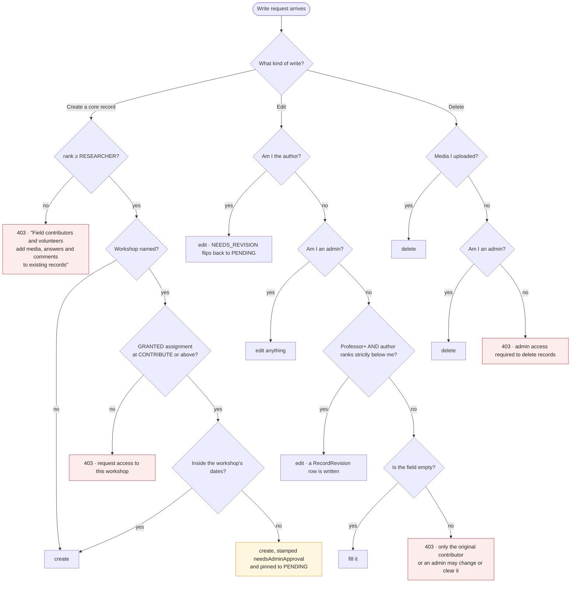
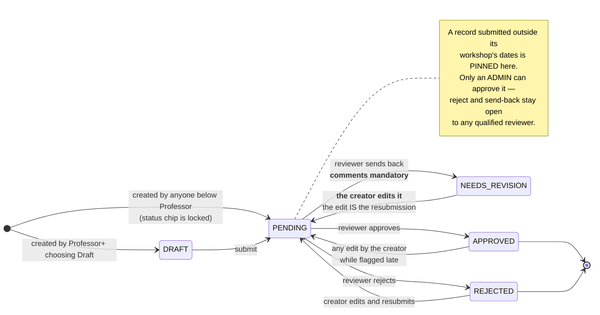
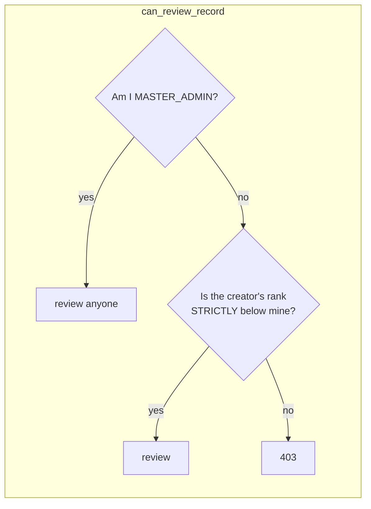
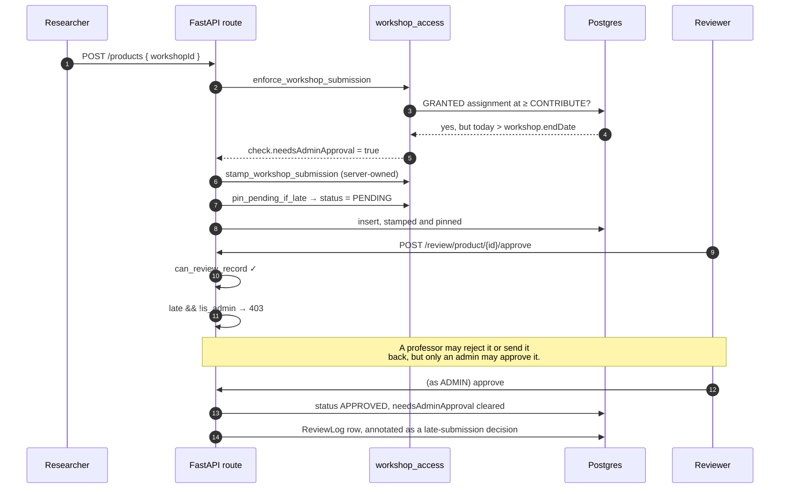
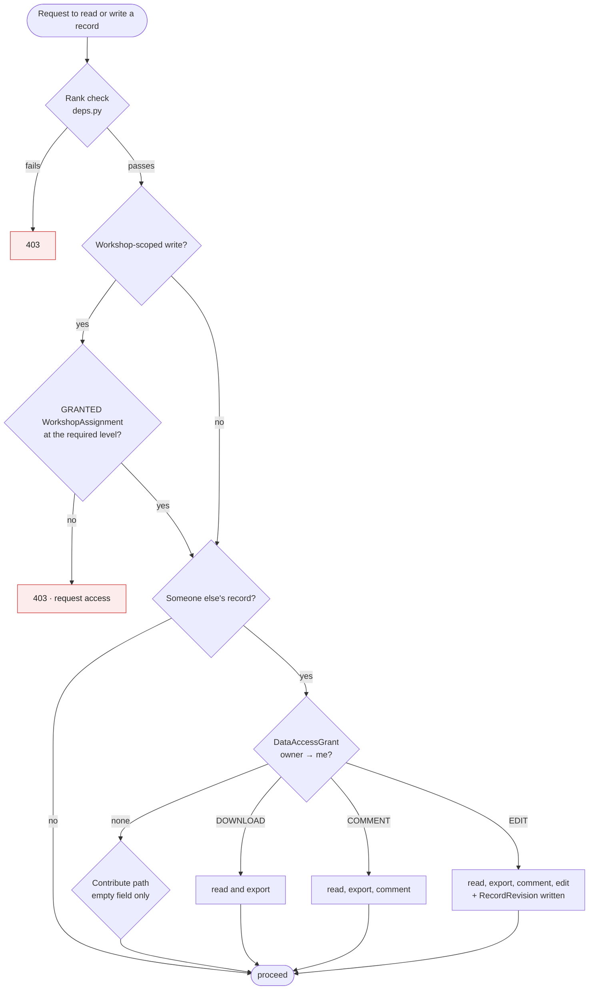

# Permissions: who may do what, and the review state machine

The complete authorisation model — the six-tier ladder, the capability matrix, the three access
systems that layer on top of it, and the exact state machine every record moves through.

**Source of truth is `backend/app/core/deps.py`.** The web client mirrors it in
`frontend/lib/permissions.ts` and the Android client in `MainActivity.kt`; both mirrors are advisory
UI, and neither is a control. Every rule below is enforced server-side, and the client copies exist
only so a user is not offered a button that will 403.

Sister documents: [SECURITY.md](SECURITY.md) for how the identity behind these checks is
established, [DATA_MODEL.md](DATA_MODEL.md) for the tables, [WALKTHROUGH.md](WALKTHROUGH.md) for what
this feels like to a researcher.

---

## 1. The ladder

Six tiers, strictly ordered. Each inherits **everything** below it. The ranks themselves are
generated into [REPO_FACTS.md](REPO_FACTS.md).



The single most-misdocumented line in this repository, stated plainly:

> **A Field Contributor cannot create records.** `can_create_records` requires **Researcher**
> (rank 30). The two tiers below *populate* records that already exist — uploading media, answering
> questions in an open interview, commenting. That is the reason those tiers exist, and none of those
> three paths passes through the create gate.

Earlier versions of `README.md`, `SECURITY.md` and `RESEARCHER_GUIDE.md` all said Field Contributors
create records. They did not, and do not.

### 1.1 Grantable capabilities

A master admin can lift one specific power for a lower tier without promoting the account. Three of
the six columns on `User` still do that; **two are deliberately no longer read.**

| Column | Read? | Effect |
|---|---|---|
| `canReview` | **yes** | opens the review queue below Field Contributor |
| `canDownloadDataset` | **yes** | dataset download and the Data Browser below Professor |
| `canManageQuestionnaire` | **yes** | edit the questionnaire structure below Professor |
| `canViewProvenance` | **yes** (client-side) | shows created-by and per-field edit history; `isAdmin \|\| canViewProvenance` |
| `canManageCrafts` | **NO — ignored** | craft management is Professor **by rank alone** |
| `canManageWorkshops` | **NO — ignored** | workshop management is Professor **by rank alone** |

The last two were removed from the decision, not from the schema. The reasoning is in
`can_manage_crafts`' docstring and is worth repeating: a grant that lifts a researcher over the
*taxonomy itself* is the one clause that lets someone the permission matrix places underneath the
vocabulary rewrite it — and because a grant does not change the role column, nobody auditing the user
table can see who holds it. The columns stay (dropping them is neither safe nor reversible, and no
live account below Professor holds either), simply unread. Restoring the old behaviour is putting one
clause back in each function.

**`canManageQuestionnaire` DOES NOT OPEN THE WORKBOOK, AND THE TWO GATES ARE DIFFERENT KINDS OF
PREDICATE.** This is the one asymmetry in this document most likely to be filed as a bug, so it is
written down rather than left to be discovered:

* `can_manage_questionnaire` (`deps.py:67-70`) is a **RANK FLOOR** — `has_rank(user, "PROFESSOR")
  or user.canManageQuestionnaire`. It opens the section and question editor on `/questionnaire`:
  adding one question, renaming one section, switching one question off. Each of those is a single,
  visible, reversible act against a row the person is looking at.
* `is_admin` (`deps.py:59-60`) is **SET MEMBERSHIP** over `{"MASTER_ADMIN", "ADMIN"}`. It is what
  guards every questionnaire **workbook** route, because one spreadsheet re-states the WHOLE
  instrument: a professor who downloaded the questionnaire, deleted the rows they were not
  interested in and uploaded the file would retire every question they deleted, across twenty-two
  sections, against interviews already recorded by forty researchers. Nothing is LOST — the
  edit-after-answers rule sees to that — but the blast radius of one press is the difference.

The consequence of a floor beside a set is that **any rank inserted between PROFESSOR (40) and ADMIN
(50) gains the editor automatically and is refused the workbook automatically**, whatever it is
called. That is deliberate. Changing it means widening the set literal in `is_admin`, which is a
decision, and `backend/tests/test_permission_matrix.py` asserts both halves so that it has to be made
on purpose.

---

## 2. The capability matrix

Read across: ✅ allowed, ⬜ refused, and a note where the rule is conditional. This is the whole
gate list; each row names the function in `deps.py` that decides it.

| Capability | Gate | VOL 10 | FIELD 20 | RESEARCH 30 | PROF 40 | ADMIN 50 | MASTER 60 |
|---|---|:--:|:--:|:--:|:--:|:--:|:--:|
| Sign in, read lists and search | `get_current_user` | ✅ | ✅ | ✅ | ✅ | ✅ | ✅ |
| Upload media, answer an open interview, comment | `get_current_user` | ✅ | ✅ | ✅ | ✅ | ✅ | ✅ |
| **Create** artisan / product / tool / process / interview | `require_record_creator` | ⬜ | ⬜ | ✅ | ✅ | ✅ | ✅ |
| Edit **own** record | ownership | ✅ | ✅ | ✅ | ✅ | ✅ | ✅ |
| Fill an **empty** field on someone else's record | `assert_can_contribute_fields` | ✅ | ✅ | ✅ | ✅ | ✅ | ✅ |
| Change or clear a **populated** field on someone else's record | `assert_can_contribute_fields` | ⬜ | ⬜ | ⬜ | ⬜¹ | ✅ | ✅ |
| Edit a record created by someone **ranked below** | `can_edit_others_record` | ⬜ | ⬜ | ⬜ | ✅ | ✅ | ✅ |
| Open the **review queue** | `require_reviewer` | grant | ✅ | ✅ | ✅ | ✅ | ✅ |
| Approve / reject / send back a **specific** record | `can_review_record` | ⬜ | vol only | below only | below only | below only | ✅ everyone |
| Approve a **late** (out-of-window) submission | `set_review_status` | ⬜ | ⬜ | ⬜ | ⬜ | ✅ | ✅ |
| Create or edit a **craft** | `require_craft_manager` | ⬜ | ⬜ | ⬜ | ✅ | ✅ | ✅ |
| Create or edit a **workshop** | `require_workshop_manager` | ⬜ | ⬜ | ⬜ | ✅ | ✅ | ✅ |
| Edit the **questionnaire structure** | `require_questionnaire_manager` | grant | grant | grant | ✅ | ✅ | ✅ |
| Create / rename / retire a **questionnaire** | `require_questionnaire_manager` | grant | grant | grant | ✅ | ✅ | ✅ |
| **Assign a questionnaire to a workshop** | `require_admin` | ⬜ | ⬜ | ⬜ | ⬜ | ✅ | ✅ |
| **Set the default questionnaire** | `require_admin` | ⬜ | ⬜ | ⬜ | ⬜ | ✅ | ✅ |
| **Download the dataset** / Data Browser | `require_dataset_downloader` | grant | grant | grant | ✅ | ✅ | ✅ |
| View the **user table**, promote / demote | `require_professor` | ⬜ | ⬜ | ⬜ | ✅ | ✅ | ✅ |
| **Create** or **delete** a user account | `require_admin` | ⬜ | ⬜ | ⬜ | ⬜ | ✅ | ✅ |
| **Delete** any record | `assert_can_delete` | ⬜ | ⬜ | ⬜ | ⬜ | ✅ | ✅ |
| Delete **media you uploaded** | route-local | ✅ | ✅ | ✅ | ✅ | ✅ | ✅ |
| Grant / decide **workshop access** | `require_admin` | ⬜ | ⬜ | ⬜ | ⬜ | ✅ | ✅ |
| Assign **tasks** to users below your tier | `require_admin` + `assert_assignable` | ⬜ | ⬜ | ⬜ | ⬜ | ✅ | ✅ |
| Assign a **task to yourself** | `assert_assignable` | ⬜ | ⬜ | ⬜ | ⬜ | ✅ | ✅ |
| Mark your own task **finished** (lands on `SUBMITTED`) | `update_task` assignee branch | own² | own² | own² | own² | own² | own² |
| **Approve** a submitted task (`SUBMITTED` → `DONE`) | `update_task` manager test | creator³ | creator³ | creator³ | creator³ | ✅ | ✅ |
| **Override** anyone's task status (mark done / reopen) | `update_task` manager test | creator³ | creator³ | creator³ | creator³ | ✅ | ✅ |
| Rank the **transcription providers** | `require_admin` | ⬜ | ⬜ | ⬜ | ⬜ | ✅ | ✅ |
| Read / set **API key values** | `require_master_admin` | ⬜ | ⬜ | ⬜ | ⬜ | ⬜ | ✅ |
| Repository **app settings** | `require_master_admin` | ⬜ | ⬜ | ⬜ | ⬜ | ⬜ | ✅ |
| Publish an **Android OTA release** | `require_master_admin` | ⬜ | ⬜ | ⬜ | ⬜ | ⬜ | ✅ |

¹ A Professor may change a populated field on a record created by someone **ranked strictly below**
them, via `can_edit_others_record`. On a peer's or a superior's record they are refused like anyone
else. "grant" = refused by rank, allowed if the matching `can*` column is set.

² "own" = the assignee may move their OWN task between OPEN, IN_PROGRESS and `SUBMITTED` and report
`progressCount`. They may **not** write `DONE` — a request for it is rewritten to `SUBMITTED` — and
once a task IS `DONE` they may not move its status at all, because by then it carries somebody
else's decision. CANCELLED is excluded from all of it: withdrawing an assignment is the creator's or
the master admin's (`delete_task_batch`), never the assignee's.

³ "creator" = whoever created the task passes `update_task`'s manager test (`createdById == me OR
is_admin(me)`) whatever their rank, so a demoted admin keeps approving and reopening the rows they
handed out. Approving and overriding are the SAME code path: an admin marking a never-submitted task
`DONE` and an admin approving a `SUBMITTED` one write the identical field. An admin who assigned work
to themselves goes down the manager branch too, so their own "Mark done" lands directly on `DONE` —
a second click by the same person with the same authority would be theatre, not review.

Several asymmetries in that table are deliberate and easy to misread:

- **An admin cannot edit another admin's record.** `can_edit_others_record` composes
  `has_rank(PROFESSOR)` **and** `can_review_record`, and `can_review_record` requires *strictly*
  below. Rank 50 is not strictly below rank 50. Only the master admin can act on a peer's work. The
  same is true of user management: `canManageUser` refuses equals.
- **The review ladder reaches one tier further down than the edit ladder.** A Field Contributor may
  *review* a volunteer's record but may not *rewrite* it — reviewing is a judgement, editing is
  authorship, and `can_edit_others_record` narrows to Professor and above for exactly that reason.
- **An admin may assign a task to themselves; nobody below them may.** Until 2026-09-14
  `assert_assignable` refused every self-assignment, master admin included, and the refusal read
  "You cannot assign a task to yourself". Both creation routes are `require_admin`, so the only
  accounts that could ever reach that clause on a create were the two it turned away — the rule
  protected nobody and only stopped an administrator recording their own workload on the board they
  hold everybody else to. It is now lifted for ADMIN and MASTER_ADMIN and kept for everyone else,
  and "everyone else" is genuinely reachable: a demoted admin still manages the tasks they created
  (`update_task`'s manager test is `createdById == me OR is_admin(me)`) and can still send
  `PATCH /tasks/{id} {"assigneeId": <their own id>}` through the same helper. The visible
  consequence is that the accountability rollup now contains rows whose "assigned by" and "assigned
  to" are the same person, and that is deliberate: `GET /tasks/progress` excludes nobody, so an
  admin's own overdue task is counted in the overdue total exactly like everybody else's.
- **Finishing a task and approving one are two acts by two people, since 2026-09-14.** An assignee's
  "Mark done" writes `SUBMITTED`, not `DONE`; `DONE` is what a manager writes when they agree the
  work happened. The row stays on the assignee's list while it waits (`isOutstanding`) wearing the
  label "Under review" (`statusLabel`) rather than disappearing, because the owner's "for it to not
  pop up next time" is a statement about what happens *after* approval. Three consequences are easy
  to get wrong and are pinned by `tests/test_task_review.py`:
  - **`SUBMITTED` is deliberately NOT in `LIVE_STATUSES`.** That set is what `is_overdue` reads. Put
    the review state in it and work handed in on the 1st and approved on the 12th flips to overdue on
    the 8th — the board would publish the *reviewer's* backlog as the *researcher's* lateness. The
    new `OUTSTANDING_STATUSES` carries the "still on their screen" meaning instead, and every counter
    now names which of the two it meant.
  - **An assignee sending `"DONE"` is rewritten, not refused.** Android updates over the air and
    researchers are offline for days; a 422 would brick "Mark done" on every build older than this
    change, out where nobody can fix it. The response carries `status: "SUBMITTED"` back, so even an
    old client is never left believing its word landed.
  - **`completedAt` is stamped on submission and never re-stamped on approval.** It therefore still
    means "when the work was finished", and `completedAt > dueAt` stays a fact about the person who
    did the work. No column was added; the cost, stated rather than discovered later, is that the
    moment of *approval* is recorded nowhere (`updatedAt` is bumped by every write and cannot answer
    it).
- **Marking a task done and overriding one are the same endpoint and different acts.** There is no
  separate override route and no `overriddenById` column: an admin PATCHing another person's task to
  DONE writes exactly what that person's own "Mark done" writes — `status` and `completedAt`, nothing
  more. Every claim about *who* performed a completion is therefore unsupported by the data, which
  is why the accountability board's override control says so on screen rather than showing an
  "overridden by" line it cannot honour after a reload. The one number it does move is
  `progressCount`: `update_task` fills a quota to its target when the task is finished, so an
  override on a "0 of 10" row silently makes it read "10 of 10", and the confirmation states both
  figures before the press. Since the review state that fill happens at the SUBMISSION rather than at
  the approval, because the submission is the claim and this field is the claim's number — an
  approver comparing "says 10" against "the repository found 2" needs both present at the moment they
  are asked to decide.
- **Building a questionnaire and choosing WHICH questionnaire are two different tiers.** Since
  2026-09-13 there is more than one questionnaire, and the three new rows above split accordingly.
  Creating, renaming, retiring an instrument and editing its sections and questions all stay at
  `require_questionnaire_manager` — a Professor who can build the form must not lose the ability to
  build it. Setting the **default** and binding one to a **workshop** are `require_admin`, because
  neither is an edit to a form: the default is where every client that names no questionnaire lands
  (including Android builds that predate the field, and offline payloads queued before them), and a
  workshop binding decides which questions every researcher at that event is shown. The narrowing is
  applied to exactly those two routes and `tests/test_permission_matrix.py` asserts it did not leak
  onto `POST /questionnaire/sections`.

### 2.1 Create, edit, delete — as a decision tree



Note the shape of the edit branch: the *contribute* path (fill an empty field) is the widest, and it
is checked **last**, after ownership and rank have both failed. That ordering is what makes an
unprivileged contribution possible without ever letting it overwrite somebody's work — and the guard
covers clearing a populated field as well as changing it, because an earlier version skipped incoming
empty values and let anyone blank a field out.

---

## 3. The review and approval state machine

Every record type except `Craft` carries a `status`. `Craft` has none — it is shared vocabulary, not
a submission.



### 3.1 Who may move a record, and how status changes actually work

There are **three** distinct mechanisms, and conflating them is how a privilege bug gets written.

| Mechanism | Function | Behaviour on refusal |
|---|---|---|
| Explicit review action | `POST /review/{type}/{id}/{approve\|reject\|revise}` | **403** — a loud, deliberate refusal |
| Status sent on an ordinary edit | `apply_status_policy_update` | **silently dropped** — see below |
| Automatic resubmission | `resubmit_status` | not a permission at all |

The middle row is the subtle one. Old clients always echo the record's current status back on every
PATCH, so treating an unauthorised status field as an error would 403 every save. Instead the field
is *popped* from the payload and the stored value is untouched. A status change on an edit sticks
only when the editor is Professor-or-above **and** is either the record's creator or outranks the
creator on the review ladder.

`resubmit_status` then does the thing researchers actually notice: when the **creator** edits a record
sitting in `NEEDS_REVISION`, and sends no explicit status, the edit itself flips it back to `PENDING`.
Other editors — an admin tidying up, a contributor filling a gap — never flip it.

### 3.2 Who may review which record



So: an admin reviews everyone beneath, a professor reviews researchers and below, a researcher
reviews field contributors and volunteers, a field contributor reviews volunteers, and a volunteer
reviews nobody. A record whose creator has no role on file is treated as a researcher's work.

Opening the **queue** (`require_reviewer`) is a separate, wider check than acting on a **record**
(`can_review_record`): the queue opens for Field Contributor and above, and then shows only what that
reviewer may act on. A user granted `canReview` with nobody beneath them gets an empty queue, which
review.py handles explicitly rather than leaving as a puzzle.

### 3.3 The late-submission gate

The most intricate rule in the system, and the one worth understanding before changing anything near
it. A record created or re-pointed into a workshop **after that workshop's end date** is stamped
`extraMetadata.workshopSubmission.needsAdminApproval = true` and pinned to `PENDING`.



Four properties of that flag are load-bearing, and each closes a specific way round it:

1. **It is server-owned.** A `workshopSubmission` key arriving in the caller's `extraMetadata` is
   replaced, never trusted. Otherwise a creator could PATCH the flag away and then self-approve.
2. **It is carried forward on every update.** Provenance rebuilds `extraMetadata` from the incoming
   payload, so a stamp that was not explicitly carried would vanish on the next edit.
3. **It survives a re-link.** Re-pointing a late record at a workshop that happens to be in-window
   produces a fresh "not late" check, which would otherwise launder the flag. Being moved does not
   make late work on-time.
4. **`pin_pending_if_late` runs after the status policy**, so it *overrides* the submitter's own
   rights. A professor who documents a workshop after it ended cannot approve their own record.

Three bypasses, all deliberate: **admins** pass the whole gate (`pin_pending_if_late` is a no-op for
them); a record with **no workshop** is never late; and `Craft`, having no status column, is never
pinned.

### 3.4 Reviewer edit

A reviewer can fix a record in place instead of bouncing it back — the misspelt village, the craft
name in the wrong column. `POST /review/{type}/{id}/edit` runs under the same authority as the other
review actions, validates the payload against **the record type's own update schema** so it cannot
bypass a rule the ordinary PATCH enforces, and refuses a fixed set of keys outright:

`status` (an edit must not be a back-door approval), `extraMetadata` (holds the server-owned late
stamp), `workshopId` (moving a record between workshops has its own checks), and the relation lists
and `location` (separate writes, not column updates).

`approve: true` runs the ordinary approval immediately afterwards as a **second, separately logged**
action, so the audit trail shows the edit and the approval as two decisions and the approval still
passes the admin gate.

---

## 4. The three access systems layered on top

Rank says what *kind* of thing you may do. It does not say *whose* data, or *which workshop*.



### 4.1 Workshop assignment — two-sided

`WorkshopAssignment` carries an ordered `accessLevel` (`VIEW` < `CONTRIBUTE` < `EDIT`) and a
`status` (`PENDING` / `GRANTED` / `DENIED` / `REVOKED`). A row can begin either way:

- an admin **assigns** somebody (`POST /workshops/{id}/assignments`, status `GRANTED`);
- a user **requests** access (`POST /workshops/access-requests`, status `PENDING`,
  `requestedById` set), and an admin decides it.

`DENIED` and `REVOKED` rows are kept rather than deleted, so a refusal is auditable and nobody can
quietly re-request their way around it. Only `GRANTED` confers anything.

A workshop with **no** assignment rows is *uncurated* and open to any qualified user; the first
assignment curates it, and from then on the roster is the gate. That is what
`workshop_is_curated` decides, and it is what stops adding the feature from locking everyone out of
every existing workshop.

### 4.2 Cross-researcher data access — three tiers

`DataAccessGrant` is owner-to-grantee, one row per pair (`@@unique([ownerId, granteeId])`), and it is
the record **owner** who grants — not an admin.

| Tier | The grantee may |
|---|---|
| `DOWNLOAD` | see and export the owner's records |
| `COMMENT` | the above, plus leave `EntryComment`s |
| `EDIT` | the above, plus change fields — and every change writes a `RecordRevision` |

`allData: false` narrows a grant to a **subset**, listed in `DataAccessScopeItem` rows. Like workshop
access it is two-sided: `POST /data-access/requests` asks, `POST /data-access/grants` gives, and
`/grants/{id}/decide` and `/revoke` close the loop.

### 4.3 Provenance and the audit trail

`RecordRevision` stores `{field: {old, new}}` per edit, append-only, and is what makes cross-researcher
editing safe to offer at all — an admin can reconstruct the original values and see who changed each
one. It is written on the contribute path, so it captures edits made through the API. A direct
database write is invisible to it, as it is to everything else in this document.

Who may *see* provenance is `canViewProvenance`: admins always, plus anyone the master admin grants
it. The admin-view toggle can hide it from an admin browsing as an ordinary user; a grantee keeps it.

---

## 5. Route guards on the web client

The client's half of gating is declared **once**, in `ROUTE_GUARDS` in `frontend/lib/permissions.ts`,
and enforced by `AppShell` for the entire `(protected)` tree. A hidden nav entry is not a guard —
every one of these routes is reachable by typing the URL.

| Route | Client gate | Backend dependency it mirrors |
|---|---|---|
| `/users` | `canManageUsers` | `require_professor` |
| `/admin` | `isAdmin` | `require_admin` |
| `/settings/api-keys` | `isAdmin` (key **values** are master-admin inside the page) | `require_admin` / `require_master_admin` |
| `/settings/tasks` | `canAssignTasks` | `require_admin` |
| `/admin/access-roster` | `canManageAccessRoster` | `require_admin` |
| `/questionnaire/workbooks` | `isAdmin` | `require_admin` |
| `/review` | `canReview` | `require_reviewer` |
| `/data` | `canDownloadDataset` | `require_dataset_downloader` |
| `/artisans/new`, `/products/new`, `/tools/new` | `canCreateRecords` | `require_record_creator` |

Anything unlisted is open to any signed-in user, which is the correct default for read surfaces.
Matching is by path segment and the **longest** rule wins, so `/artisans/new` can be stricter than
`/artisans`. Admin-view is deliberately not consulted — it is a display preference, not a permission,
and must never lock an admin out of a URL the API would serve.

`/questionnaire/workbooks` is the one row where the longest-match rule is load-bearing rather than
convenient. `/questionnaire` itself is **open to every signed-in user** — a crowdsource volunteer
answering an interview is what the app is for — and is deliberately absent from this table. Only the
workbook leaf is admin-gated, because uploading one spreadsheet re-states the whole instrument and
everything absent from the file is removed by rule. Adding or editing ONE question stays at
`require_questionnaire_manager`. See §1.1's note below for why those two gates are not the same
KIND of predicate.

`ROUTE_REDIRECTS` handles the different case where a page *has* an ordinary-user twin: a researcher
opening `/workshop-access/manage` is sent to `/workshop-access/request`, because a padlock would be
hiding a page they are fully entitled to.

---

## 6. Verifying a permission claim yourself

Do not trust this table over the code, including when this table is right. To check one rule:

```bash
# 1. What does the backend actually gate this route with?
grep -n "@router\.\|Depends(require_" backend/app/api/routes/products.py

# 2. What does that dependency decide?
grep -n "def require_record_creator" -A 4 backend/app/core/deps.py

# 3. Does the web client agree?
grep -n "canCreateRecords" -A 3 frontend/lib/permissions.ts

# 4. Is there a test?
grep -rn "record_creator\|can_create_records" backend/tests/
```

`backend/tests/test_permission_matrix.py` exists precisely so the matrix in §2 has something
mechanical standing behind it.

---

## How this document is kept true

| Claim class | Kept true by |
|---|---|
| Role names and ranks | Generated into [REPO_FACTS.md](REPO_FACTS.md), and `docs/tools/check-docs.mjs` **fails** if `ROLE_RANK` in `backend/app/core/deps.py` and `frontend/lib/permissions.ts` ever disagree. That parity check is the one piece of this document that cannot silently rot. |
| The §2 capability matrix | `backend/tests/test_permission_matrix.py`. Run `python -m pytest -q backend/tests/test_permission_matrix.py`. Every ⬜/✅ should correspond to a case there; a row with no test is a row to distrust. |
| The gate named in each matrix row | Re-derive with §6's step 1 across `backend/app/api/routes/*.py`. A route whose dependency changed but whose row did not is the failure mode this column exists to catch. |
| The state machine (§3) | `RecordStatus` in `backend/prisma/schema.prisma` for the states; `set_review_status`, `apply_status_policy_update` and `resubmit_status` for the transitions. |
| The late-submission gate (§3.3) | `backend/app/services/workshop_access.py` — `enforce_workshop_submission`, `stamp_workshop_submission`, `pin_pending_if_late`. The four numbered properties are each a docstring paragraph there. |
| The route-guard table (§5) | `ROUTE_GUARDS` is a single literal array; diff it against the table. |

**Review triggers** — this document needs a human read whenever any of these change:
`backend/app/core/deps.py`, `backend/app/services/access.py`,
`backend/app/services/workshop_access.py`, `backend/app/api/routes/review.py`,
`frontend/lib/permissions.ts`, or the `UserRole` / `RecordStatus` / `DataAccessTier` enums.

**Known unverified:** the Android client's mirror of these rules is asserted from
`MainActivity.kt` (`canViewProvenance`, the admin Danger-zone controls) but is **not** covered by the
parity check the web client has — there is no Kotlin equivalent of the `ROLE_RANK` diff. Treat the
Android column of any permission question as "believed to match, not proven to".
