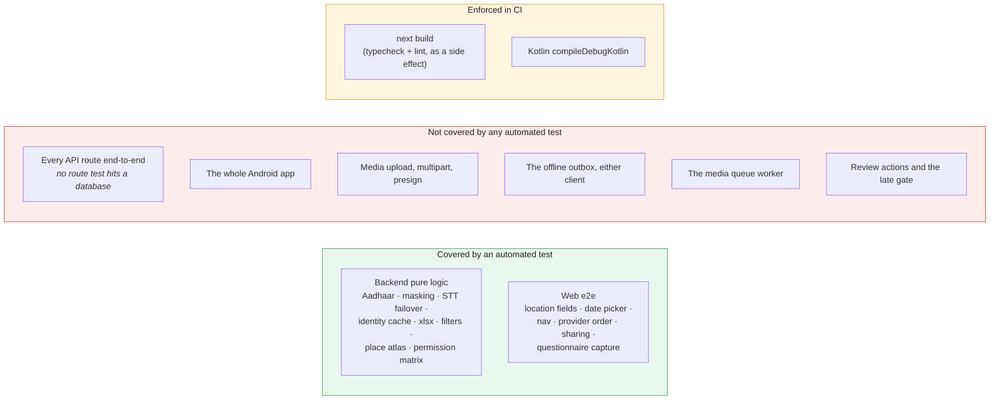

# QA audit — what is tested, what is not, and how this breaks

**Audit date: 2026-07-27.** Everything below is either a result measured on that date or a property
read out of the code on that date. Anything that could not be checked is marked **UNVERIFIED** rather
than asserted — a QA document that guesses is worse than no QA document.

Test counts, per surface, are generated into [REPO_FACTS.md](REPO_FACTS.md).

Sister documents: [CI.md](CI.md) for what runs automatically, [SECURITY.md](SECURITY.md) for the
security risk register, [SCALABILITY.md](SCALABILITY.md) for what breaks under load.

---

## 1. Test coverage, honestly



**Measured 2026-07-27:** `python -m pytest -q` from `backend/` → **294 passed, 2 warnings, 8.72 s**.

The suite is fast because it is entirely **pure**: `backend/tests/conftest.py` does nothing but put
the backend root on `sys.path`. There is no database fixture, no test client, no transaction rollback
harness. Everything it covers is logic that can be exercised without I/O.

That is a real and useful suite, and it is also the shape of the gap. **No test in this repository
sends an HTTP request to a route.** The permission matrix is tested at the level of
`can_review_record(reviewer, role)`, not at the level of "does `POST /review/product/{id}/approve`
actually 403". Both are worth having; only one of them is here.

### 1.1 A trap in the pytest configuration

`backend/pyproject.toml` sets `asyncio_mode = "auto"`, but **`pytest-asyncio` is not installed** —
pytest reports `PytestConfigWarning: Unknown config option: asyncio_mode` on every run.

Today this is harmless: there are **zero** `async def test_` functions, and the eight test files that
exercise async code call `asyncio.run(...)` explicitly. But the first person to write a bare
`async def test_something()` will get a test that **does not run**, behind a warning that already
appears on every run and is therefore already being ignored.

**Fix:** either add `pytest-asyncio` to the dev dependencies, or delete the `asyncio_mode` line so the
configuration stops promising something it does not deliver. Leaving it is the worst of the three.

### 1.2 Web end-to-end

`frontend/e2e/` holds Playwright specs (count in [REPO_FACTS.md](REPO_FACTS.md)) covering the areas
that were hardest to get right in the browser: location fields, the floating date picker, nav sheet
scrolling, provider ordering, sharing multi-select, questionnaire capture, searchable selects.

There is also the older `frontend/scripts/pw-smoke.mjs`, a login-and-visit-every-page smoke script
(`PW_BASE`, `PW_EMAIL`, `PW_PASSWORD` from the shell).

**Neither runs in CI.** See §4.

> **Corrected:** the previous version of this document said the smoke run covered "all 11 protected
> pages". The `(protected)` tree now has far more than eleven route files, and no automated run
> visits all of them. The claim is withdrawn rather than updated, because nobody re-measured it.

### 1.3 Android

No `src/test`, no `src/androidTest`. `:app:testDebugUnitTest` is wired into CI and reports
`NO-SOURCE`; the step prints a warning so a green tick is never mistaken for "the tests passed". The
only real Android gate is that it **compiles**.

Given that the Android app is the largest single body of code in the repository by line count (see
[REPO_FACTS.md](REPO_FACTS.md)), this is the largest coverage gap by some distance.

---

## 2. Open failure modes, ranked

Ranked by what a user actually loses. Each row names where the mitigation lives, so "mitigated" can
be checked rather than believed.

### F1 — Media objects are readable by anyone with the URL · **open**

`media/*` is world-readable in the bucket policy. Object URLs sit in the database, in exports, and in
comments. A leaked URL is a permanent, unauthenticated read of an interview recording or a
photograph of a person.

*Impact:* the most serious data-exposure path in the system. *Mitigation:* none in code today; the
console actions are P0 in [SECURITY.md](SECURITY.md). Treat every media URL as public.

### F2 — `/docs`, `/redoc` and `/openapi.json` are publicly reachable · **fixed in tree, NOT deployed**

**Verified live, 2026-07-27:**

```
/health        200
/api/health    404      ← this path does not exist; see F8
/docs          200      ← unauthenticated
/redoc         200      ← unauthenticated
/openapi.json  200      ← 190 KB, every route and every field
```

The schema names every route, every query parameter and every field of every model, including the
ones behind admin-only roles. It is worth nothing to the researchers this app is for.

*Mitigation:* `BACKEND_EXPOSE_DOCS` now defaults to **false**, so the next backend deploy closes all
three. Until that deploy lands, they are open. Local development opts back in with
`BACKEND_EXPOSE_DOCS=true`.

### F3 — CloudFront → EC2 origin hop is plaintext HTTP · **open**

The viewer's TLS ends at CloudFront; the request crosses the AWS network to nginx on port 80 in the
clear, bearer token included. Risk P1 in [SECURITY.md](SECURITY.md), with the console fix.

### F4 — Upload 504 on slow links · **mitigated, depends on a console setting**

CloudFront's default origin response timeout is 30 s. A large upload that keeps the origin busy longer
than that returns 504 to the client even though the origin is working.

*Mitigation:* a single elected queue worker plus client-side retry, and the origin timeout raised in
the CloudFront console. The nginx side is already generous (`proxy_read_timeout 300s`,
`client_max_body_size 200M`, in `infra/terraform/user_data.sh`). **UNVERIFIED:** whether the console
value is currently ≥ 60 s cannot be read from this repository. Check it — [CDN.md](CDN.md) documents
the setting and the symptom.

### F5 — Supabase pooler connection exhaustion · **mitigated, fragile**

Two distinct incidents, same root, both fixed:

- `DATABASE_CONNECTION_LIMIT` raised to 40 tripped the pooler's client ceiling (`EMAXCONN`) and
  crash-looped startup. It is back to **10 per worker** and must stay there.
- `--workers 2` ran a uvicorn supervisor that `SIGKILL`ed a busy child, orphaning its Prisma query
  engine, which kept holding pooler connections until every request 500'd. Now **one** web worker
  plus a separate `fieldrepo-queue` systemd unit.

*How it recurs:* anyone who "scales up" by adding a uvicorn worker or raising the connection limit
reproduces it exactly. The reasoning is a comment in `infra/terraform/user_data.sh` for that reason.

### F6 — Every list endpoint is slow · **partly fixed**

Measured on live production 2026-07-27, before the fix deployed: artisans 3.3 s, tools 4.6 s, search
8.9 s, dashboard 10.6 s. The cause is not row count — it is **relations resolved sequentially against
a cross-region database**, so cost tracks the number of relations. Full analysis in
[SCALABILITY.md](SCALABILITY.md), summary in [ARCHITECTURE.md §2.2](ARCHITECTURE.md).

*Mitigation:* relation loading is now waved (artisans 6→3-4 waves, tools 8→4-5, interviews 12→5-6),
and the 69-statement questionnaire save is down to 14. **UNVERIFIED:** the post-fix production
numbers. The improvements were measured on an isolated clone behind a 200 ms proxy, not on
production, and nobody has re-run the live table since deploying.

### F7 — Web auth token in `localStorage` · **accepted**

Any successful XSS on the frontend origin reads the token and impersonates the user for up to seven
days. There is no revocation. Risk P4 in [SECURITY.md](SECURITY.md); the fix is `HttpOnly` cookies
plus CSRF protection on both clients.

### F8 — `/api/health` does not exist · **documentation hazard, not a bug**

The health endpoints are `/health` and `/health/ready`, declared on the app rather than on the API
router, so they are **not** under the `/api` prefix. `/api/health` 404s.

This is listed as a failure mode because it has already produced a wrong measurement: a "154 ms API
floor" that was really the latency of a 404. Any monitor, uptime check or benchmark pointed at
`/api/health` is measuring nothing. The real floor is `/health` at ~129 ms.

### F9 — Android dataset download on API < 29 · **open, low reach**

The public-Downloads fallback needs `WRITE_EXTERNAL_STORAGE`, which is not requested, so saving fails
on Android 8–9. Caught and surfaced through `onError` rather than crashing. `minSdk` is 26, so those
devices are supported; most are API ≥ 29 and take the MediaStore path.

### F10 — Token expiry looks like a bug to users · **by design**

The JWT lasts `JWT_EXPIRES_MINUTES` (default 7 days) and cannot be revoked. A stale token yields 401,
which the user experiences as an unexplained error until they sign in again. A pre-login `/api/me`
401 in the console is benign.

### F11 — No direct SSH to the API box · **environmental**

Port 22 is blocked by the ISP on the development network. The box is managed through GitHub Actions
and AWS SSM Session Manager. Not a defect; it is a fact that shapes every runbook here.

---

## 3. Regressions found and fixed in this cycle

Kept because the shape of a bug is the best predictor of the next one, and because two of these were
*documented as working* while broken.

| # | Symptom | Root cause | Class |
|---|---|---|---|
| R1 | The offline outbox **duplicated a record on every sync pass** while the signal stayed bad | A replay was create-then-upload with no write-back, so a pass that died during the media upload re-created the record. Now `created` / `createdId` / `uploadedBatches` are written back per step. | data loss / duplication |
| R2 | The outbox **deleted the record and its photographs** and reported success | A 409 was read as "already saved, we lost the response". No endpoint means that: 409 from `/artisans` is a clashing Aadhaar, from `/crafts` a name clash, from `/questionnaire/interviews` an existing artisan set. Now surfaced as a conflict with everything kept. | **silent data loss** |
| R3 | Every text search 500'd | A pasted NUL byte reached Postgres. | availability |
| R4 | "Show in folders" 500'd for every questionnaire recording | Data-browser path resolution. | availability |
| R5 | Aadhaar numbers leaked into shared surfaces | Masking was applied at call sites rather than at the encoder. Now `mask_aadhaar` at the encoder. | **PII disclosure** |
| R6 | Non-Latin artisan names broke the data browser, then broke downloads when kept | Name handling in path construction. | correctness |
| R7 | Approving a pending questionnaire 500'd | | availability |
| R8 | A second dashboard total kept the first one's filter (Android) | | correctness |

R1 and R2 are the two to internalise: **both were in the code path that exists specifically to
prevent data loss**, both were invisible to the user, and both had the worst possible timing — they
fired precisely when the network was bad, which is the only reason the entry was queued at all.

---

## 4. What CI does not gate

From [CI.md](CI.md), restated here because a QA document should say plainly what is not checked:

| Not gated | Consequence |
|---|---|
| **Backend tests** | The 294-case suite is not in any workflow. A commit that breaks it deploys. |
| **Web e2e / smoke** | Playwright specs exist and nothing runs them. |
| **Web typecheck / lint as a separate step** | `next build` fails on TS and ESLint errors, so a broken frontend cannot reach production — but it fails **after the backend has already deployed**. |
| **Android lint** | Advisory. One pre-existing error (`PermissionImpliesUnsupportedChromeOsHardware` — `CAMERA` with no matching optional `<uses-feature>`) would fail every run if it were a gate. |
| **Android tests** | None exist. |

The cheapest real improvement available: add `cd backend && python -m pytest -q` as a job that stage
1 `needs:`. The suite is pure and runs in nine seconds — it needs no database, no secrets, and no
services.

---

## 5. How to reproduce the checks in this document

```bash
# Backend suite. Pure; no database, no network. ~9s.
cd backend && ./.venv/Scripts/python.exe -m pytest -q

# Backend lint.
cd backend && ./.venv/Scripts/ruff.exe check app

# Web typecheck and lint.
cd frontend && npx tsc --noEmit && npx eslint .

# Android compiles.
cd android && ./gradlew :app:compileDebugKotlin -q

# Documentation itself: paths, citations, count drift, and role-ladder parity across the two clients.
node docs/tools/check-docs.mjs

# The live surface claims in F2 and F8. READ-ONLY — safe against production.
for u in /health /api/health /docs /redoc /openapi.json; do
  printf "%-16s " "$u"
  curl -s -o /dev/null -w "%{http_code}  %{time_total}s\n" "https://d2b34i3e92al6i.cloudfront.net$u"
done
```

**Never** point a write test at production. `backend/.env` on a development machine is configured
against the **live** database; a test that writes, migrates, or enables the media queue worker writes
to real field data.

---

## How this document is kept true

The failure of a QA document is that it describes the state of the world on the day it was written
and then stops. Two defences:

1. **Every claim carries a date or a command.** §1's pass count is dated and reproducible in nine
   seconds. §2's F2 and F8 are reproducible with the `curl` loop in §5. Anything neither dated nor
   reproducible is marked **UNVERIFIED**, and there are three of those (F4's console timeout, F6's
   post-fix production numbers, and any Android runtime claim).
2. **A row leaves §2 only when someone re-runs its check.** "Mitigated" states where the mitigation
   lives so the claim can be checked; "fixed in tree, not deployed" is its own status because the
   difference matters operationally and is the state F2 is in right now.

| Section | Re-check by |
|---|---|
| §1 counts and pass total | `node docs/tools/check-docs.mjs --write` regenerates the counts; re-run pytest and **re-date** the pass total. |
| §1.1 the pytest-asyncio trap | Gone when `grep asyncio_mode backend/pyproject.toml` returns nothing, or `pytest-asyncio` appears in the dev dependencies. |
| §2 F2, F8 | The `curl` loop in §5. F2 closes on the first backend deploy carrying the `BACKEND_EXPOSE_DOCS` default. |
| §2 F5 | `grep -n "workers\|connection_limit" infra/terraform/user_data.sh backend/app/core/db.py`. |
| §2 F6 | Re-run the latency table in [ARCHITECTURE.md §2.1](ARCHITECTURE.md) and **date it**. |
| §3 regressions | Historical. Append, never edit — the value is the pattern, not the current state. |
| §4 CI gates | `.github/workflows/*.yml`. A new job means a row leaves this table. |

**Review trigger:** every production deploy, plus any change under `backend/tests/`,
`frontend/e2e/`, or `.github/workflows/`.

**Audit cadence:** re-walk §2 top to bottom before each field deployment. That is the moment the cost
of a stale entry is highest — a researcher 300 km from a signal cannot read a mitigation that turned
out not to be in place.
