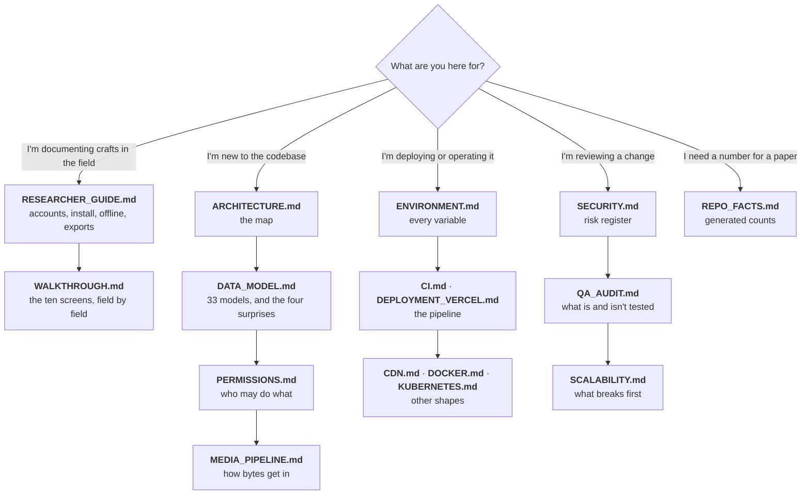

# Documentation

Start here. Every document below states, in its own final section, **how it is kept true** — what
regenerates it, what to diff it against, and which changes should trigger a human re-read. A document
with no such section does not meet the bar and is listed as a gap.

---

## Where to start, by what you are doing



---

## Every document

### The field team

| Document | Answers | Audience |
|---|---|---|
| [RESEARCHER_GUIDE.md](RESEARCHER_GUIDE.md) | How do I get an account, install the app, work with no signal, and get my data back out? | Craft scholars and field researchers |
| [WALKTHROUGH.md](WALKTHROUGH.md) | What does each of the ten screens ask for, and in what order? | Same. Also mirrored in-app at `/guide` |

### The system

| Document | Answers |
|---|---|
| [ARCHITECTURE.md](ARCHITECTURE.md) | What are the pieces, how does a request travel, where is the latency, how does transcription fail over, how does the offline outbox replay? |
| [DATA_MODEL.md](DATA_MODEL.md) | What is stored, how does it relate, and which four parts of the schema are not what they look like? |
| [PERMISSIONS.md](PERMISSIONS.md) | The six-tier ladder, the full capability matrix, the review state machine, the late-submission gate, and the three access systems layered on top |
| [MEDIA_PIPELINE.md](MEDIA_PIPELINE.md) | Every tactic both clients use to get a photograph off a phone on a bad network without losing it |
| [SECURITY.md](SECURITY.md) | Transport, secrets, PII and Aadhaar handling, the authorisation model's security properties, and the open risk register |

### Operating it

| Document | Answers |
|---|---|
| [ENVIRONMENT.md](ENVIRONMENT.md) | Every environment variable, per service: required? default? secret? what breaks without it? |
| [CI.md](CI.md) | What happens on a push to `main`, in what order, and why the order is a dependency |
| [DEPLOYMENT_VERCEL.md](DEPLOYMENT_VERCEL.md) | The web deploy, and the two traps that ship a green pipeline over a broken site |
| [CDN.md](CDN.md) | CloudFront caching, the origin timeout that has already broken this system, and the invalidation runbook |
| [DOCKER.md](DOCKER.md) | Running the whole stack in containers |
| [KUBERNETES.md](KUBERNETES.md) | Running it on a cluster, and the connection ceiling that governs how far it scales |

### Engineering results

| Document | Answers |
|---|---|
| [SCALABILITY.md](SCALABILITY.md) | What breaks first, what it costs to fix, and the measured finding that relations — not rows — drive the latency |
| [QA_AUDIT.md](QA_AUDIT.md) | What is tested, what is not, the open failure modes, and the regressions that were documented as working while broken |
| [AI_FEATURES.md](AI_FEATURES.md) | Background removal, layer separation, vectorisation: providers, costs, and how to turn one on |
| [REPO_FACTS.md](REPO_FACTS.md) | **Generated.** Model and enum counts, the API surface, the role ladder, test counts, code volume |

Also in the repository, outside `docs/`: [`../README.md`](../README.md) (orientation and local
setup), [`../backend/DEPLOY_AWS.md`](../backend/DEPLOY_AWS.md) (the EC2/S3/CloudFront runbook),
[`../DESIGN-claude.md`](../DESIGN-claude.md) (the visual design system).

---

## The rule about counts

**No hand-written document in this set states a count.** Not the number of models, not the number of
endpoints, not lines of code. Those all live in [REPO_FACTS.md](REPO_FACTS.md), which is generated
from the working tree, and prose links to it.

The reason is that a count is wrong the first time anybody adds a table, and it is wrong *silently* —
nothing about "32 models" looks stale. Centralising them means a migration makes exactly one file
wrong, and one command makes it right:

```bash
node docs/tools/check-docs.mjs --write
```

If you find a count written into prose anywhere in this set, that is a bug in the documentation, not
a detail to update.

---

## The checker

```bash
node docs/tools/check-docs.mjs           # verify — exit 1 on any failure
node docs/tools/check-docs.mjs --write   # regenerate REPO_FACTS.md, then verify
node docs/tools/check-docs.mjs --quiet   # failures only
```

It verifies the four things about documentation that *can* be verified:

| Check | Catches |
|---|---|
| **Generated counts are current** | A migration or a new route that nobody re-ran the generator for |
| **Every repository path mentioned exists** | A service or component path that a rename left behind. Paths resolve against the repo root and against `backend/`, `frontend/`, `android/`, because a runbook writes commands from the directory it told you to be in |
| **Line citations land inside their file** | `media.py:198-264` after the file shrank. It also *counts* citations per document and warns, because a citation that still fits is only possibly right — the durable fix is to cite symbol names |
| **The backend and web role ladders agree** | `ROLE_RANK` drifting between `backend/app/core/deps.py` and `frontend/lib/permissions.ts`. This is the one genuine correctness check in the set |
| **Every document has a maintenance section** | A new document shipping with no story for how it stays true |
| **Mermaid blocks are structurally sane** | An unclosed fence, a block with no diagram type, and the specific bug that broke a diagram here: a **semicolon inside a sequence-diagram message**, which Mermaid reads as a statement separator so everything after it parses as a new statement and the whole diagram renders as a red error box |

It deliberately does **not** check whether a sentence is true. Nothing can. That is what each
document's own maintenance table is for.

**Mermaid, for certainty.** The lint above is structural. A real parse needs `mermaid` itself, which
is not a dependency of this repository, so it is run out-of-tree when diagrams change:

```bash
mkdir /tmp/mmd && cd /tmp/mmd && npm init -y && npm i mermaid jsdom
# Set window/document/DOMParser/Element/Node/HTMLElement/SVGElement/NodeFilter/getComputedStyle
# from a JSDOM instance, then for each fenced block:  await mermaid.parse(block)
```

Two things that run found and the structural lint would not have: a semicolon inside a sequence
message, and HTML entities (`&lt;`) inside one. **Normalise CRLF before matching** — half these files
are CRLF, and a `\n`-anchored regex silently finds zero blocks in them, which is exactly how ten
diagrams went unvalidated while the run looked green.

**All 45 blocks in this documentation set parse as of 2026-07-27.**

Findings in documents owned by another workstream are reported as **warnings**, not failures, so the
exit code speaks for the documents whose owner can act on it.

---

## Known gaps

Honest about its own state, since that is the standard the rest of the set is held to.

| Gap | Status |
|---|---|
| `SCALABILITY.md`, `DOCKER.md`, `KUBERNETES.md`, `CDN.md`, `AI_FEATURES.md`, `RESEARCH_NOTES.md` have no maintenance section | Owned by another workstream. The checker warns rather than failing; move each name out of `OWNED_ELSEWHERE` in `docs/tools/check-docs.mjs` as its owner adds one. |
| `SCALABILITY.md` pins 38 line numbers | They will drift. The checker reports the count so it cannot grow unnoticed. `MEDIA_PIPELINE.md` has been converted to symbol names; that is the pattern. |
| Android has no equivalent of the role-ladder parity check | The Kotlin client's permission mirror is believed to match and is not proven to. Noted in [PERMISSIONS.md](PERMISSIONS.md). |
| Console state — CloudFront, S3, Vercel, Google Cloud — cannot be verified from a checkout | Every such claim is marked **UNVERIFIED**. The better fix, where it is possible, is the one [CI.md §1](CI.md) took: assert it at deploy time instead of documenting it. |

---

## How this document is kept true

It is an index, so it has exactly two ways to be wrong: a document exists and is not listed, or a
document is listed and does not exist.

The second is checked — `docs/tools/check-docs.mjs` resolves every relative link here and fails on a
broken one. The first is not, and is the one to watch: **a new document must be added to the tables
above in the same commit that creates it.** `ls docs/*.md` against this page's tables is the check,
and it takes ten seconds.

The "Known gaps" table is kept true by being embarrassing. Each row names the thing that closes it.
