# Releasing the Android app

How a build becomes the build every handset in the field is offered — and, once, what it costs to
change the key that signs it.

Everything here is about `android/`. The backend and the web client deploy on a push to `main` (see
[CI.md](CI.md)); the app does not, and must not. Publishing is a deliberate act, and the only way to
perform it is to push a tag.

---

## 0. Read this first: the fielded app is signed with the Android debug key

`GET /api/app/download` serves **v1.1.20**, and that APK is signed with the key every Android SDK
installation generates for itself:

```
Signer #1 certificate DN: CN=Android Debug, O=Android, C=US
Signer #1 certificate SHA-256 digest:
  691257a01e834122645488888798d6816479490e22b379692c83d98c09232c74
```

That is a reading off the live artefact with `apksigner verify --print-certs`, not an inference. It
happened because `android/app/build.gradle.kts` had no `signingConfigs` block at all: `assembleRelease`
produced an unsigned APK, so whoever cut the release built a **debug** APK and uploaded it through
the web panel. Nothing in that path asked which key had signed it.

**Why it matters.** The debug keystore is not secret and is not unique. Anyone can produce an APK
signed by *a* debug key, and Android's update rule is "same package name, same signing certificate" —
so anybody who can get a handset to accept a download can publish an update this app treats as
genuine. There is no server-side check that would notice.

There is now a real key, this repository holds the machinery to use it, and **§6 is the price of
switching.** It is a one-off, it is irreversible, and it costs one uninstall on every handset in the
field. Read §6 before you cut the first signed release, not afterwards.

---

## 1. What the pipeline is, and what it replaces

The fleet-update backend already existed and is unchanged by any of this:

| Piece | Where |
|---|---|
| The release row | `AppRelease` in `backend/prisma/schema.prisma` |
| Publishing a release | `POST /api/app/release` — `Depends(require_master_admin)` |
| What "current" means | `GET /api/app/release/latest` — highest `versionCode`, `publishedAt` breaks a tie |
| The download address | `GET /api/app/download` — unauthenticated, redirects to the newest object |
| The web download button | `frontend/components/settings/GetTheAppPanel.tsx` |
| The web upload panel | `frontend/components/settings/PublishAppUpdatePanel.tsx` |

All of that lives in `backend/app/api/routes/app_release.py`. What changed is only **who uploads the
APK and what is proved about it first**. The panel still works and is still the fallback; it just
cannot answer which key signed the file, which API base is compiled into it, or which commit it came
from, because nobody ever told it.

```mermaid
flowchart LR
  T["git push origin v1.1.21"] --> W[".github/workflows/publish-android.yml"]
  W --> G1["GUARD 1<br/>tag == built version"]
  G1 --> G3["GUARD 3<br/>the API is ours"]
  G3 --> B["assembleRelease<br/>on the runner"]
  B --> G2["GUARD 2<br/>signer fingerprint"]
  G2 --> A["artefact assertions<br/>package, version, API base"]
  A --> G5["GUARD 5<br/>fits one PUT"]
  G5 --> L["login as MASTER_ADMIN"]
  L --> G4["GUARD 4<br/>versionCode above published"]
  G4 --> U["presign + PUT to S3"]
  U --> P["POST /api/app/release"]
  P --> G6["GUARD 6<br/>prove it is visible"]
```



`.github/workflows/android-build.yml` is untouched and still builds **debug only**. Nothing in it can
reach a phone, and that stays true.

---

## 2. Cutting a release

### Before you start

- The version you are about to publish must derive a `versionCode` **strictly above** the published
  one. Devices compare codes, not names. The formula, in `android/app/build.gradle.kts` and again
  server-side in `_derive_version_code`, is `major * 1_000_000 + minor * 1_000 + patch`.
- v1.1.20 is published, so its code is `1001020`. **The next release is v1.1.21 or higher.** Tagging
  the tree as it stands would rebuild 1.1.20 and GUARD 4 would refuse it, correctly.
- `.github/workflows/publish-android.yml` must already be **on `main`**. A `push: tags:` workflow
  runs the file *as of the tagged commit*, unlike the `workflow_run` stages, which are read from the
  default branch. Tag a commit that does not contain this file and nothing happens at all — no run,
  no red X, silence.

### The five steps

1. **Bump the version.** One line in `android/app/build.gradle.kts`:

   ```kotlin
   val appVersionName = "1.1.21"
   ```

   The `versionCode` is derived from it. There is nothing else to change.

2. **Merge that to `main`.** The tag must point at the commit that carries the bump, not at its
   parent.

3. **Tag it, annotated.**

   ```bash
   git tag -a v1.1.21 -m "What changed, in a sentence somebody will read in six months."
   git push origin v1.1.21
   ```

   The tag name must be `v` + the exact version string. `v1.1.21` over a tree building `1.1.20` is
   GUARD 1's whole reason to exist.

4. **Watch the run.** Actions → *Publish Android release*. It builds, signs, verifies, uploads and
   publishes; the step summary says what happened and, on a failure, which guard stopped it and what
   to do about it.

5. **Install it on a real handset and use it.** No runner has a device, this repository runs no
   instrumented tests, and a green run means *built, signed and published* — never *working*. Sign
   in, capture one record, go offline, sync. That is the check nothing in CI performs.

### Rehearsing without publishing

Actions → *Publish Android release* → **Run workflow**. `dry_run` defaults to **ticked**, and a dry
run does everything except `POST /api/app/release`: it still builds, still signs, still checks the
signer, still logs in, still checks the version ceiling and **still uploads the bytes**. The uploaded
object is orphaned by design — no release row, no `MediaFile` row — so it is invisible to the product
and costs only storage.

A dry run started from a **branch** has no tag, so GUARD 1 cannot run. That is allowed (a guard that
cannot run is honest about it) and publishing from a branch is refused outright.

### If a release goes wrong

There is no un-publish. A release row cannot be deleted through the API, and a handset that has
already installed a build will not go backwards — Android refuses a downgrade. **The way forward is
always a higher version.** Republishing the same `versionCode` is refused by GUARD 4 on purpose: see
§3.

---

## 3. The guards, and the failure each one closes

Each is a step in `.github/workflows/publish-android.yml` named `GUARD n — …`, and each carries its
full argument at the step. Summarised here so the set can be read in one place.

### GUARD 1 — the tag must name the version this tree builds

Tagging `v1.1.21` over a tree whose `appVersionName` is still `1.1.20` builds 1.1.20 and publishes it
under the name 1.1.21. The website then offers "1.1.21", the release row says 1.1.21, and every
handset that installs it reports 1.1.20 — because **the version is compiled in** and nothing
downstream can correct it. The derived `versionCode` would also be the already-published `1001020`,
which GUARD 4 would then refuse for a reason that looks unrelated.

It runs *before* the build, so a mistyped tag costs seconds rather than a full Gradle run. It also
validates the version against the **server's** rules — three dot-separated parts, digits only, each
at most 999 — because outside them `_derive_version_code` returns `None` and the server keeps the
client's number instead, leaving two definitions of the one number every device compares.

### GUARD 2 — the signer must be the expected key, and there must *be* one

`apksigner verify --print-certs` on the built APK, compared against `ANDROID_RELEASE_CERT_SHA256`.
Three ways to fail, and the second is the one this repository has already lived through:

- **Unsigned.** `apksigner` exits non-zero, which is the cryptographic version of "the key did not
  resolve" and cannot be fooled by a filename.
- **The debug key.** The fingerprint in §0 is checked for *by name*, so this failure reads as a
  sentence rather than as two hex strings to compare by eye.
- **A different real key.** Refused, with the fingerprint read from the artefact printed and the
  expected one not.

The expected value never enters the log, on success or on failure. **This key can never be rotated**
(§6), so a wrong key must not merely warn — it must be impossible to publish.

A separate step ahead of GUARD 2 reads the Gradle build log for the three near-silent outcomes of
`buildTypes.release`: `release: UNSIGNED`, the half-configured `release signing: … is not usable`
warning, and `release: signing with the DEBUG keystore`. All three leave the build **succeeding**.
GUARD 2 would catch every one of them a step later; that step exists because it names *which* of the
four signing inputs went missing, which a fingerprint mismatch cannot tell you.

### GUARD 3 — the API must be *this* product's

There are two CloudFront distributions in this AWS account and their ids differ by a glance:
`d2b34i3e92al6i` is ours ([CDN.md](CDN.md)'s first table is the register) and `d3ekigkotd1xa2` is the
Design Prototype Workshop's. That product was forked from this one, so it has the same auth, the same
`/api/app/release`, the same `/api/media/presign` and its own master admins. **Publishing against it
would succeed** and would push this app over another product's app.

Two unauthenticated probes, measured rather than assumed:

| Request | Ours | The sibling's |
|---|---|---|
| `GET /api/access-roster` | **401** (the route exists and wants an admin token) | 404 (its roster is mounted at `/api/access`) |
| `GET /api/design-workshops` | **404** (`backend/app/api/router.py` mounts no such router) | 401 |

Both must agree before a signing key is decoded or anything is uploaded. A **200** on the first is as
wrong as a 404: it would mean the roster route lost its guard, which is a security finding and not a
green light.

### GUARD 4 — the new `versionCode` must be above the published one

The quietest failure in the set. A release at or below the published code is **accepted** by the API:
it returns 201, the row is written, the run goes green — and it reaches nobody, because
`_latest_release()` orders by `versionCode` descending and the phone's side of the comparison is
strict (`android/app/src/main/java/com/fieldrepository/app/MainActivity.kt:1008` offers an update only
when `latest.versionCode > installedVersionCode` **and** the release carries a non-blank URL).

An **equal** code is refused here, with no escape hatch. The sibling repository allows one behind a
`[republish]` marker in the tag message; that is deliberately not copied, because the first release
through this pipeline is a signing-key change (§6) and during that window "the same version, different
bytes" is the most dangerous thing that could be published — half the fleet on one artefact and half
on another, both reporting the same code, with no way to tell them apart. If a reissue is genuinely
needed, bump the patch number. It costs nothing.

A 401 or 403 from `/api/app/release/latest` is called out as its own failure rather than read as
"nothing is published yet": an auth failure produces a body with no `versionCode` in it, which a naive
parse cannot tell from an empty release list, and it would wave through a release that is too low.

### GUARD 5 — the APK must fit the single-PUT upload path

The workflow uploads as **one presigned PUT**, which is valid below 64 MiB. Above that,
`frontend/lib/media.ts` switches to an S3 multipart upload and the Android client's threshold matches.
**That flow is not implemented in the workflow**, so this is a refusal boundary rather than a branch:
a single PUT of an over-size object leaves a truncated file in the bucket with a published release row
pointing at it, which is a broken download for every user and cannot be taken back.

There is real headroom. A `:app:assembleRelease` on this tree measures **18,138,730 bytes**, about
46 MB under the line, and the step emits a notice while several megabytes remain — so the multipart
path can be built before it is urgent rather than at 03:00 on a release night. The backend already
serves it
(`/api/media/multipart/create`, `/presign-parts`, `/complete`, `/abort` in
`backend/app/api/routes/media.py`) and `uploadInParts` in `frontend/lib/media.ts` is the reference.

> **The release APK is smaller than the published one, and that is not a mistake.** v1.1.20 on
> `/api/app/download` is 26,097,941 bytes because it is a *debug* build (§0): debug carries
> `debugImplementation("androidx.compose.ui:ui-tooling")` and the debug instrumentation that release
> does not. Both figures are `stat` on real files. The floor in this step is keyed to the **release**
> figure, because keying it to the larger published one would fire on a correct build.

The same step enforces a **floor**. A build that dies mid-package leaves an output *file* behind, and
a script that checks only for the file reports success over nothing. Presence is not a measurement.

### GUARD 6 — it must prove it published

A 201 proves a row was written. It does not prove that "latest" is now this build, that the object key
points at real bytes, or that the download resolves. So the run grades what the world receives:

1. **`GET /api/app/release/latest` must report this version**, polled rather than asked once. This is
   the authoritative check — it is the direct counterpart to GUARD 4.
2. **`GET /api/app/download` must answer a redirect**, unauthenticated, because that is what a
   browser link and every phone actually do. A **503** there means the row exists but its object key
   does not resolve in storage: a published release with no bytes behind it.

The order matters and should not be swapped. **This product already has a published release**, so the
download address answered a redirect before the run and will answer one after it whatever happens. In
the sibling repository that endpoint returned 404 until its first publish, so a redirect was itself
proof; here it is not, and a GUARD 6 that only polled for a redirect would pass over a publish that
never landed.

> **A live caching risk, recorded because this is where it will surface.**
> `backend/app/api/routes/app_release.py` sets `Cache-Control: no-store, max-age=0` on the **redirect
> only**. The 404 and 503 arms raise `HTTPException` and carry no such header, so an intermediary is
> free to cache either. [CDN.md](CDN.md) records that this distribution caches nothing, which is why
> this is survivable today. If that ever changes, GUARD 6 starts producing false "production is
> broken" failures on correct releases. The fix then is to set the header on those two arms — not to
> soften the guard.

### And one that is not numbered

Between GUARD 2 and GUARD 5 the workflow unpacks the APK and reads what is compiled into it. It does
**not** blacklist hostnames. It enumerates every URL in the artefact that ends in `/api/` — which is
the shape `apiBaseUrl` has, and only that shape, because unlike the web's `NEXT_PUBLIC_API_URL` this
one carries the trailing `/api/` ([ENVIRONMENT.md](ENVIRONMENT.md)) — and requires the set to be
exactly one entry: ours, over HTTPS. So any cleartext base fails, whatever host it names, and any
second HTTPS base fails, including the sibling's, without anyone having to keep a list current.

`android/local.properties` is gitignored and absent on a runner, so a laptop URL cannot reach the
build. The assertion exists anyway, because "cannot happen" is what the debug-signed fleet build
looked like too.

> **Why not just grep for `localhost`.** Because it goes red on a correct build, and that was
> measured rather than guessed. `android/app/src/main/res/xml/network_security_config.xml` lists
> `localhost`, `10.0.2.2` and `127.0.0.1` as cleartext-permitted development domains and that resource
> ships inside the APK — so the bare word is expected. The narrower `://localhost` looks safe and is
> not: a real `assembleRelease` output on this tree carries `http://localhost/` inside `classes4.dex`,
> in **OkHttp's own string pool**, as an internal placeholder. It is in every build that links OkHttp.
> A check that cries wolf on the happy path is a check somebody deletes, which is worse than never
> having written it.

---

## 4. Verifying a build's signer by hand

Do this on anything you are about to install, and on anything somebody hands you claiming it is a
release. It takes one command and needs no credentials.

```bash
# Wherever the Android SDK build-tools live; 35.0.0 is what CI installs.
APKSIGNER="$ANDROID_HOME/build-tools/35.0.0/apksigner"

"$APKSIGNER" verify --verbose --print-certs app-release.apk
```

Read three lines of the output:

| Line | What it must say |
|---|---|
| `Number of signers` | `1`. More than one is a different identity to Android, and "one of them is right" is not a property devices check. |
| `Verified using v2 scheme` / `v3 scheme` | at least one `true`. A v1-only APK is what an old signing path produces; modern Android validates v2/v3. |
| `Signer #1 certificate SHA-256 digest` | the release fingerprint below — **not** the debug one in §0. |

The expected release fingerprint, which is also the value held in the `ANDROID_RELEASE_CERT_SHA256`
repository secret:

```
9bd95f763743de0046e7e83974d381b8f5d7b2faf5bbbaaba4e609b5cc485f3e
```

> **UNVERIFIED on the machine that wrote this document.** The keystore is password-protected and the
> password is held only in the Actions secret and in the institution's custody, so this fingerprint
> and the SHA-1 in §5 are recorded as supplied and could not be re-derived here. The command that
> settles both, for whoever holds the password, is
> `keytool -list -v -keystore fieldrepo-release.p12 -storetype PKCS12 -alias fieldrepo-release`.
> GUARD 2 is the enforcing check either way: it compares the artefact against the secret, and neither
> value is printed.

A certificate digest is **not a secret** — it is inside every copy of the APK, which is exactly why it
can be written down here. It is stored as an Actions secret anyway, for two reasons that have nothing
to do with confidentiality: GitHub's log masking then covers it, and a value behind the secrets UI is
one nobody edits casually.

### Also worth reading

```bash
aapt2 dump badging app-release.apk | head -n 1
```

`package` must be `com.fieldrepository.app`. A wrong package is not a bad release, it is a *different
app*: Android keys installs and update eligibility by (package, signature), so it would install
alongside the real one and the in-app updater would never offer it.

---

## 5. Google sign-in: a new OAuth client, and no code change

Google issues an ID token to an Android app identified by the pair **(package name, signing
certificate SHA-1)**. Changing the signing key therefore breaks Google sign-in on the new build until
a new Android OAuth client exists in the Google Cloud project — and this is **console work only**.

**No code changes.** `android/app/src/main/java/com/fieldrepository/app/data/GoogleAuthClient.kt:17`
calls `setServerClientId(BuildConfig.GOOGLE_WEB_CLIENT_ID)` — the **web** client id, which is what the
backend verifies the token against. The Android client id is never named in any Kotlin file. (There is
a `GOOGLE_ANDROID_CLIENT_ID` field in `android/app/build.gradle.kts`; nothing reads it.) The Android
OAuth client exists purely so that Google will issue a token *to an app with that package and that
signature* at all.

### What to add

In the Google Cloud console, APIs & Services → Credentials → **Create credentials → OAuth client ID →
Android**:

| Field | Value |
|---|---|
| Package name | `com.fieldrepository.app` |
| SHA-1 certificate fingerprint | `60:51:B3:8C:46:A7:6F:97:E5:2C:F8:BE:8A:98:07:AB:E1:98:11:23` |

### What to keep

**Do not delete the existing Android OAuth client.** It carries the debug keystore's SHA-1, and it is
what makes sign-in work in every `assembleDebug` build — which is what `android-build.yml` produces,
what every developer installs, and what anybody debugging a sign-in problem will reach for. Two
Android clients for one package is normal and supported: Google matches on the pair, so a debug build
matches one and a release build matches the other.

Until the release client exists, a release-key build reaches the sign-in screen, opens the credential
sheet, and fails at the point Google decides which app is asking. That failure looks like a broken
app, not like a missing console entry, so add the client **before** the first signed build goes to
anybody.

---

## 6. The one-off cost: every handset must be uninstalled and reinstalled

This is the part to plan around, and it is not negotiable — it is a property of Android.

**An app can never change its signing certificate.** Android identifies an installed app by (package
name, signing certificate), and an APK signed by a different key is refused as an update, for ever,
with no override. The only way onto a device already carrying the debug-signed v1.1.20 is to
**uninstall it first**. There is no partial migration and no flag.

This cost is paid **once**, on the move from the debug key to the real one. Every release after that
is an ordinary in-app update.

### And an uninstall deletes the unsent outbox

`android/app/src/main/java/com/fieldrepository/app/data/Offline.kt:123-125` keeps the offline queue at

```
<filesDir>/outbox/queue.json
```

`filesDir` is the app's private storage. **Uninstalling the app deletes it**, and with it every record
captured offline that has not yet reached the server. That is the whole premise of the product — a
researcher in a village with no signal — so on some handsets this file is days of work.

> ### The sequence, and it is not optional
>
> 1. **Every handset syncs to empty, and is seen to.** Not "was told to sync" — the outbox screen must
>    show nothing pending, on that device, with somebody looking at it.
> 2. Only then, uninstall.
> 3. Install the release-signed APK from `GET /api/app/download`, or from the run artifact attached to
>    the publish workflow run.
> 4. Sign in and confirm it works, which is also the check that §5's OAuth client is in place.
>
> Reverse steps 1 and 2 on one phone and that researcher's unsent records are gone, with nothing to
> recover them from. There is no copy anywhere else — that is what "offline-first" means.

### What this implies for scheduling

- Do it when the field team is reachable and not mid-visit.
- Do it on **one** handset first, all four steps, before asking anyone else to start. That one device
  is the only evidence that exists that the new APK installs, signs in, and syncs.
- The run artifact on the publish workflow run holds the exact bytes that were published, which is what
  to hand to somebody whose phone cannot download.

### Keeping the key

The keystore is the one secret in this project that **cannot be rotated**. Losing it means no further
update can ever reach the fleet — every handset would need another uninstall/reinstall cycle, with
another sync-to-empty, to move to a replacement key. It lives in the Actions secrets (base64) and in
whatever the institution uses for long-term custody. `.gitignore` refuses `*.p12`, `*.jks`,
`*.keystore` and `fieldrepo-release.*` outright; do not weaken those lines.

---

## 7. Repository secrets

Settings → Secrets and variables → Actions. Names are case-sensitive, and the workflow **fails** —
never skips — when one is missing.

| Secret | What it is |
|---|---|
| `ANDROID_RELEASE_KEYSTORE_BASE64` | base64 of `fieldrepo-release.p12`. `base64 -w0 fieldrepo-release.p12` on Linux; `[Convert]::ToBase64String([IO.File]::ReadAllBytes("fieldrepo-release.p12"))` in PowerShell. |
| `ANDROID_RELEASE_KEYSTORE_PASSWORD` | the store password. |
| `ANDROID_RELEASE_KEY_ALIAS` | `fieldrepo-release`. |
| `ANDROID_RELEASE_KEY_PASSWORD` | **Optional and deliberately absent.** Absent means "the same as the store password", which is what this key uses. An unset secret renders as an empty environment variable, and `android/app/build.gradle.kts` treats empty as unset, so absence is safe by construction rather than by anyone remembering. |
| `ANDROID_RELEASE_CERT_SHA256` | the expected signer fingerprint (§4). Colons and case are tolerated. |
| `APP_PUBLISH_EMAIL` | a **MASTER_ADMIN** account. `POST /api/app/release` is `Depends(require_master_admin)` and the workflow checks the role at login, before anything is uploaded. |
| `APP_PUBLISH_PASSWORD` | that account's password. |

A missing secret is a **failed run**, not a skipped step. `deploy-frontend.yml` deliberately skips
when `VERCEL_TOKEN` is absent and argues for it — "a red X that everyone knows to ignore is worse than
no X at all" — and that argument does not carry here. A web deploy that did not happen is re-runnable
and visible on the site; a release is a row that cannot be un-published and a version code that can
never be reused.

### Building a signed release locally

You do not need to, and mostly should not — the runner's build is the publishable one precisely
because it has no `android/local.properties`. If you do, put four lines in that gitignored file:

```properties
releaseKeystore=C:/path/to/fieldrepo-release.p12
releaseKeystorePassword=...
releaseKeyAlias=fieldrepo-release
apiBaseUrl=https://d2b34i3e92al6i.cloudfront.net/api/
```

That last line matters more than it looks: whatever `apiBaseUrl` your file already holds gets compiled
into `BuildConfig.DEFAULT_API_BASE_URL`, and an emulator URL produces an APK that installs, opens and
reaches nothing.

There is also `debugSignRelease=true`, which signs the release variant with the **debug** keystore so a
release build can be put on a handset without the real key. It is for on-device testing only and the
APK it produces is not distributable. A real key always wins over it, and
`android/app/build.gradle.kts` **throws** if the flag is found while `GITHUB_ACTIONS` or `CI` is set —
so it cannot reach an automated pipeline even if somebody writes a `local.properties` onto a runner.

---

## 8. What a green run does not tell you

| Not checked | Why |
|---|---|
| That the app works | No runner has a device or an emulator, and this repository runs no instrumented tests anywhere. A green run means built, signed and published. |
| That sign-in works on the release key | It depends on a Google Cloud console entry (§5) that no checkout can see. |
| That the handsets can install it | The first release-key build cannot be installed over v1.1.20 at all (§6). That is expected, and it is a human sequence. |
| That the values in the secrets are the right ones | The workflow proves the *artefact* matches `ANDROID_RELEASE_CERT_SHA256`. If that secret itself were wrong, the check would be internally consistent and externally useless. §4 is how a person settles it independently. |

---

## How this document is kept true

| What | How, and when to re-check |
|---|---|
| The guards | Each is a named step in `.github/workflows/publish-android.yml` whose comment block is the long-form version of §3. Diff the step names against the headings here whenever a guard is added, renamed or removed; the workflow is the authority and this page is the summary. |
| The signing arrangement | `android/app/build.gradle.kts` — the block above `signingConfigs` and the one inside `buildTypes.release`. A change to the property names, the fallback ordering or the CI refusal makes §7 wrong. |
| The API contract | `backend/app/schemas/app_release.py` and `backend/app/api/routes/app_release.py`. `AppReleasePublishRequest` is `extra="forbid"`, so a field added or removed there changes what the workflow may send; §3's GUARD 4 and GUARD 6 both describe behaviour of `_latest_release` and `download_latest_apk`. |
| Fingerprints and version numbers | Re-read them off artefacts, never from memory: `apksigner verify --print-certs` for a signer, `aapt2 dump badging` for a version, `curl -sSL -o - .../api/app/download \| wc -c` for a size. §0's debug fingerprint and §5's SHA-1 are the two values a reader is most likely to act on. |
| The uninstall consequence | `android/app/src/main/java/com/fieldrepository/app/data/Offline.kt` — if the outbox ever moves out of `filesDir`, or gains a server-side mirror, §6 changes completely. That is the one section where being out of date costs somebody's data. |
| Which CloudFront distribution is which | [CDN.md](CDN.md) and [ENVIRONMENT.md](ENVIRONMENT.md). GUARD 3 asserts it at publish time, which is the better half of the answer — a document cannot be wrong about something the pipeline refuses to do. |

**The check that is not automated:** §6 is the only part of this page that describes a sequence of
human actions, and nothing verifies that anybody followed it. Re-read it out loud before the first
signed release, and again before any future key change.
