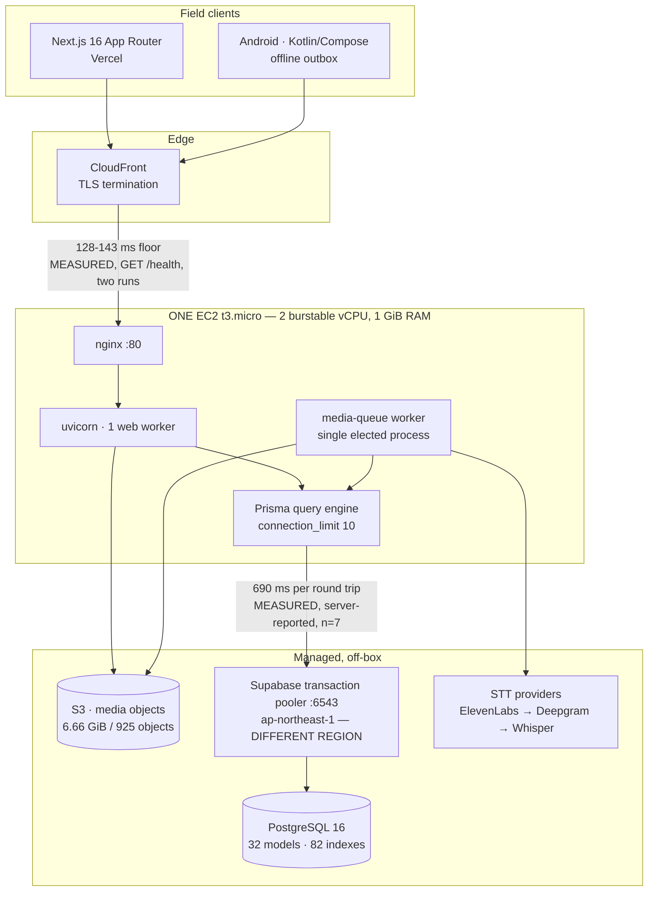
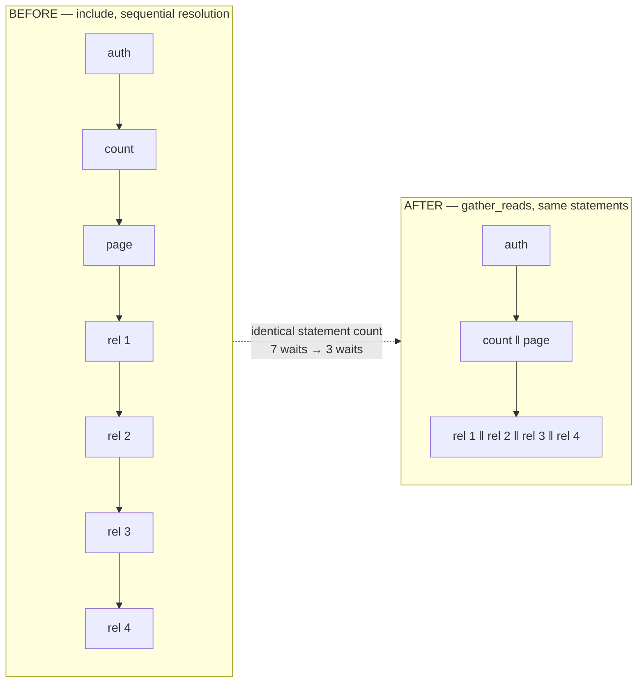
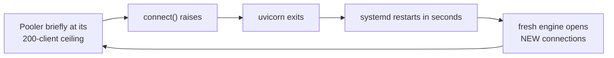
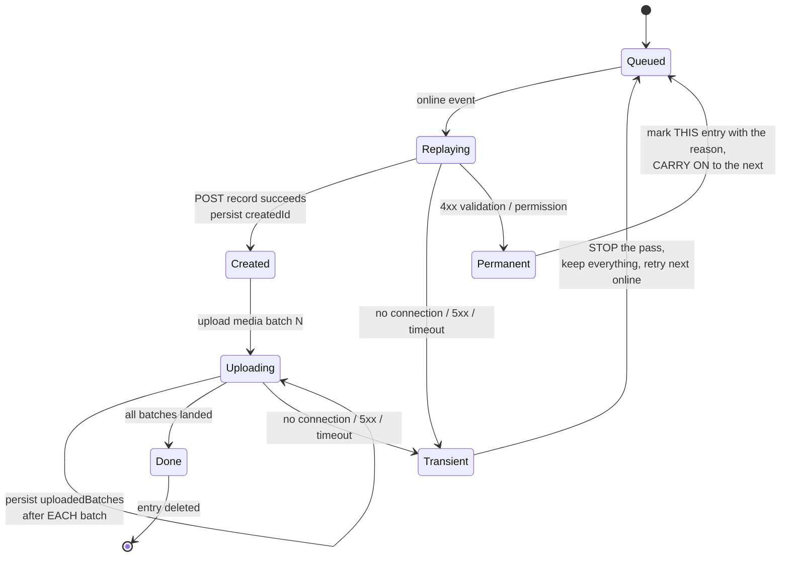
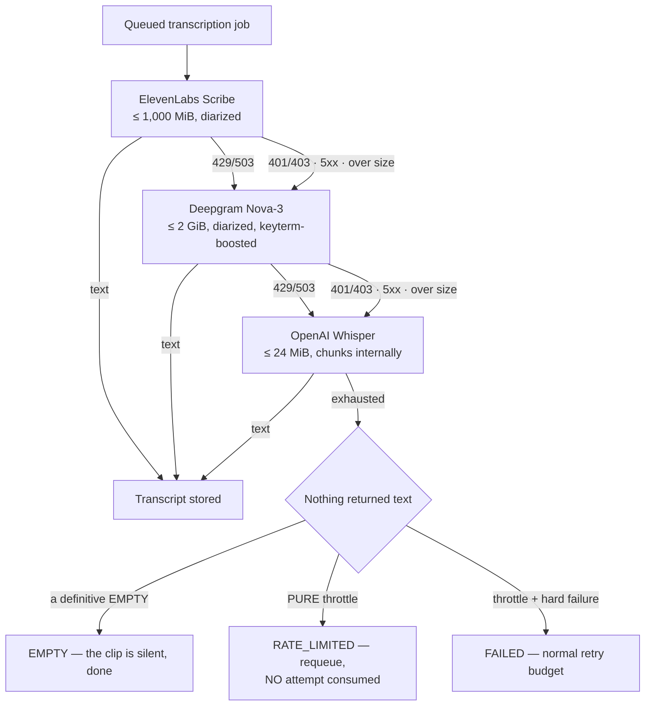
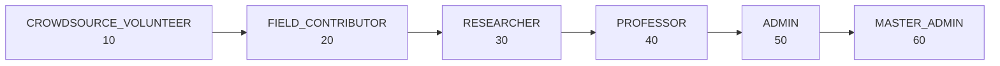
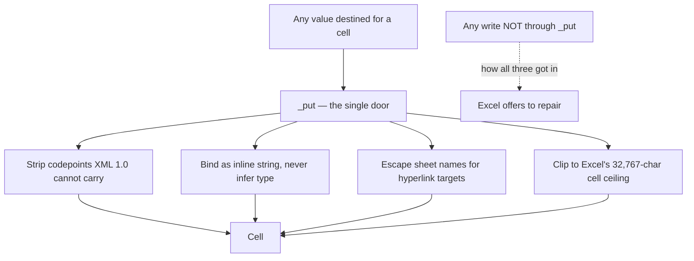
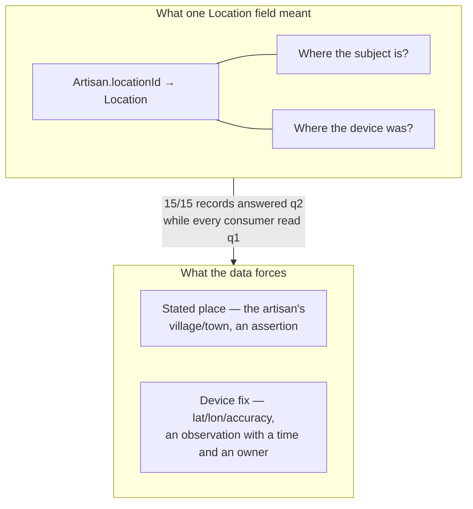
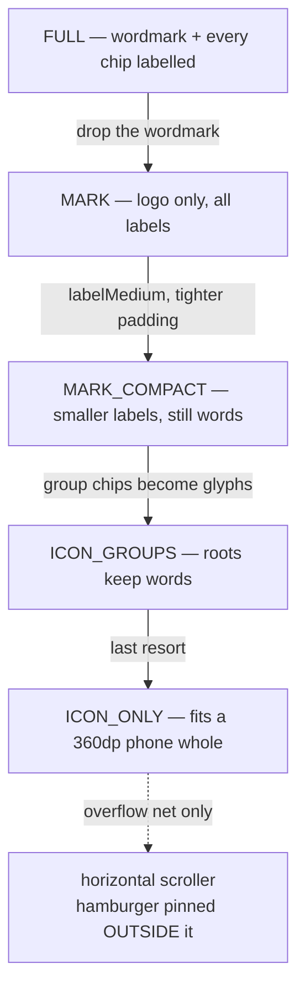

# Research notes: architecture and engineering results from a rural craft-documentation pilot

Source material for a paper. Every claim below carries a provenance label and the method that
produced it. Sections are written to be lifted whole.

**Corresponding artefact:** the Field Repository — a web, Android and API system for documenting
Indian handicraft practice in the field. Repository `D:/Portal_Development_Web`, snapshot commit
`a0fa3a85`, 2026-07-26.

---

## 0. The honest framing, stated first

**This is a working pilot, not a corpus.** At the time of measurement the production database held
**16 artisans, 18 products, 74 tools and 925 media files** contributed by 20 accounts across a
single workshop. No result in this document derives its interest from data volume, and none should
be presented as if it did. A reviewer who reads "16 artisans" and stops reading is not being unfair.

The defensible contribution is **architectural**: what holds up when a 1 GiB burstable EC2 instance
must serve a database in a different AWS region to clients on rural mobile connections, and what
that constraint forces you to discover that a well-provisioned deployment would never surface. The
central result — §5 — is a latency law with R² = 0.999998 that says the *only* thing that moves a
page is the number of database round trips issued **one after another**, and that this number is a
property of the *relation graph*, not of the row count. That result is scale-independent. It would
be exactly as true at 16,000 artisans, and it is measurable at 16.

Where a figure could not be obtained, this document says so and leaves the cell empty.

### 0.1 Provenance labels

Every number in this document carries one of four labels. They are not interchangeable.

| Label | Meaning |
|---|---|
| **MEASURED** | I ran it and recorded the result, on 2026-07-27, against the live production system or this repository. The method, sample count and comparison are stated at the point of use. |
| **MEASURED (cited)** | Measured by another work stream in this repository, on the date stated, and recorded in the file cited. I did **not** re-run it. Where I *did* independently replicate a cited figure, both values are shown side by side. |
| **DERIVED** | Counted or computed from source code that I read, not from a running system. A statement count obtained by reading a function is DERIVED, not MEASURED — the code proves the count, it does not prove the timing. |
| **NOT OBTAINED** | I tried and could not, or the measurement would have violated the read-only constraint on production. Named explicitly rather than modelled and hoped. |

There is deliberately no **MODELLED** content in the results sections. Two arithmetic projections
appear in §6.3 and §9.4 and both are labelled inline, in the sentence that carries them.

### 0.2 The read-only constraint, and what it cost

All production measurements are `GET` requests plus the one `POST /auth/login` that mints a token.
Nothing in this document wrote to production, ran a migration, or enabled the media-queue worker.

That constraint has a real cost to the results and it is worth stating: **the optimised build could
not be measured end to end.** Starting the application against the production database also starts
the media-queue worker, which transcribes and mutates. So every "after" figure in §5 is DERIVED from
source, and every "before" figure is MEASURED. A paper should present them that way and not imply a
measured speedup where there is a derived statement count.

### 0.3 The working tree was moving during measurement

Four other work streams were editing this repository while these measurements were taken; `git
status` showed **162 modified or untracked paths** at the time of writing. The only reproducible
snapshot is therefore the commit, not the checkout. All code counts in §3 are taken from
`git ls-tree -r a0fa3a85`, and all differ from a working-tree count by 2–15%.

---

## 1. System under study



**Verification of the topology claims.** The instance class, core count and memory are specified in
`backend/DEPLOY_AWS.md:19` (`t3.micro` — 2 vCPU burstable, 1 GiB RAM, Ubuntu 24.04) and the
single-worker uvicorn invocation at `backend/DEPLOY_AWS.md:81`. The cross-region database is not an
inference: the pooler hostname in `backend/.env` is
`aws-1-ap-northeast-1.pooler.supabase.com`, while the deployment guide provisions EC2 and S3 in
`ap-south-1` (`DEPLOY_AWS.md:186,261`). **MEASURED** — hostname read directly, credentials withheld.

---

## 2. The corpus

All figures **MEASURED** on 2026-07-27 by paging the live production API to exhaustion as an
`ADMIN` account. Method per row is given in the last column.

### 2.1 Records

| Entity | Count | Method |
|---|---:|---|
| Artisans | 16 | `GET /api/artisans?pageSize=100`, `total` field |
| Products | 18 | `GET /api/dashboard/stats` |
| Tools | 74 | `GET /api/dashboard/stats` |
| Crafts | 9 | `GET /api/crafts`, `total` |
| Processes | 4 | `GET /api/processes?pageSize=1`, `total` |
| Process steps | 37 | `GET /api/data/report?format=json`, sheet row count |
| Workshops | 1 | `GET /api/workshops`, `total` |
| Questionnaire interviews | 25 | `GET /api/questionnaire/interviews?pageSize=1`, `total` |
| Questionnaire answers stored | **0** | report sheet "Questionnaire answers", 0 rows |
| Media files | 925 | `GET /api/media`, paged to exhaustion |
| User accounts | 20 | `GET /api/users?pageSize=100` |

The zero in the answers row is not an error and is worth reporting: 25 interviews exist as records,
with audio attached, but no interview has structured per-question answers stored. The questionnaire
write path described in §5.5 is therefore **exercised by tests, not by production data**.

### 2.2 Accounts by role

| Role | Rank | Accounts |
|---|---:|---:|
| `CROWDSOURCE_VOLUNTEER` | 10 | 0 |
| `FIELD_CONTRIBUTOR` | 20 | 0 |
| `RESEARCHER` | 30 | 15 |
| `PROFESSOR` | 40 | 1 |
| `ADMIN` | 50 | 3 |
| `MASTER_ADMIN` | 60 | 1 |

Two of the six tiers have no production occupant. The ladder is implemented and enforced (§10) but
only four tiers are exercised by real accounts.

### 2.3 Media

**MEASURED** — every one of the 925 rows fetched and its `sizeBytes` / `mediaType` summed.

| Type | Files | Total | Median file | Largest file |
|---|---:|---:|---:|---:|
| Audio | 568 | 2.56 GiB | 0.38 MiB | 108.8 MiB |
| Image | 305 | 0.87 GiB | 2.61 MiB | 7.8 MiB |
| Video | 52 | 3.22 GiB | 41.29 MiB | **668.4 MiB** |
| **All** | **925** | **6.66 GiB** | | |

52 video files are 6% of the objects and 48% of the bytes. The 668.4 MiB single object is the
constraint that governs §8.2.

**Container formats:** `audio/mpeg` 511, `image/jpeg` 298, `video/mp4` 52, `audio/aac` 48,
`audio/aac-adts` 7, `image/png` 5, `image/heic` 2, `audio/x-wav` 1, `audio/mp4` 1.

**What each file hangs off** (`linkedRecordType`): questionnaire 566, process step 128, tool 121,
product 75, artisan 31, process 2, craft 1, workshop 1. Interview audio is 61% of the corpus by
count.

**Metadata coverage:** `recordedAt` present on **925 / 925**; a linked `Location` row on
**222 / 925**; a content `checksum` on **0 / 925**.

### 2.4 Transcription coverage

**MEASURED** — `transcriptStatus` and `transcriptText` on all 568 audio rows.

| Outcome | Files | Share of audio |
|---|---:|---:|
| `COMPLETED` | 408 | 71.8% |
| `FAILED` | 160 | 28.2% |
| Never attempted | 0 | 0% |

Completed transcripts total **567,704 characters**; median 553.5 characters, range 36 to 19,208.

The 28.2% failure rate is a real operating figure and should be reported as one. **NOT OBTAINED:**
the per-provider attribution of those 160 failures. The failure reason is stored per media row in
`transcriptError`, but the API surface I could reach read-only does not expose which provider in the
chain produced the terminal error, so I cannot say how many were rate limits versus codec rejections
versus key failures.

---

## 3. Code and interface volume

**DERIVED** — counted from `git ls-tree -r a0fa3a85`, i.e. the committed tree, not the working
checkout (§0.3).

| Area | Files | Lines |
|---|---:|---:|
| `backend/app` (FastAPI, prisma-client-py) | 67 | 18,138 |
| `frontend/app` (Next.js App Router routes) | 35 | 10,792 |
| `frontend/components` | 108 | 18,554 |
| `frontend/lib` | 12 | 3,753 |
| `android` (all tracked files) | 44 | 30,120 |
| `android` (Kotlin only) | 23 | 27,778 |

**HTTP surface: 148 operations.** DERIVED by counting `@router.<method>` decorators at column 0
across `backend/app/api/routes/` plus the two root-mounted health endpoints in `main.py`.

| Method | Count |
|---|---:|
| GET | 64 (62 in routers + `/health`, `/health/ready`) |
| POST | 46 |
| DELETE | 19 |
| PATCH | 13 |
| PUT | 6 |
| **Total** | **148** |

The live `/openapi.json` returns 404 — schema docs are disabled in production — so this count could
not be cross-checked against the deployed spec. **NOT OBTAINED:** an independent confirmation that
the deployed surface matches the committed one.

**Data model:** 32 Prisma models, 14 enums, 82 `@@index` declarations, 36 applied migrations.
(The working tree had grown to 33 models during measurement; the committed figure is 32.)

**History:** 80 commits, 2026-06-15 to 2026-07-26.

**Test suite:** `python -m pytest -q` → **294 passed** in 12.82 s. MEASURED, 2026-07-27.

---

## 4. Method for the latency work

Every timing in §5 is a **client-side wall-clock median** measured from this machine against the
live CloudFront endpoint, using `time.perf_counter()` around a complete request including reading
the response body to exhaustion. Sample size is 5 or 7 per endpoint and is stated per table. The
client is on a domestic Indian broadband connection; the network floor it contributes is measured
rather than assumed (§5.1) and subtracted by the regression intercept.

Medians are used rather than means because the distribution has a long right tail from CloudFront
cold-origin cases; the reported min/max show the spread.

One measurement is **not** client-side and is the load-bearing cross-check: `GET /health/ready`
returns the server's own timing of a `SELECT 1` through the pooler, in its
`latencyMs` field. That is a completely independent instrument — different clock, different side of
the network — and §5.2 shows the two agreeing to within 1.3%.

---

## 5. Result 1 — latency is round trips, and round trips are relations

This is the central technical result and the one worth building a paper around.

### 5.1 The floor, and a correction worth publishing

| Endpoint | Median | n | Status | What it proves |
|---|---:|---:|---|---|
| `GET /health` | **143 ms** | 5 | 200 | Network + TLS + CloudFront + nginx + FastAPI, touching no database |
| `GET /health` (second run) | **128 ms** | 7 | 200 | Same endpoint, independent run 20 minutes later |
| `GET /api/health` | 136 ms | 5 | **404** | The same floor is paid by a request that does nothing at all |

**MEASURED**, 2026-07-27. Range on the n=5 run: 100–221 ms. The floor was sampled twice and the two
medians differ by 15 ms; both are reported rather than the more convenient one. The regression in
§5.3 uses the n=7 run because that run supplied every point in the fit.

The 404 row is included deliberately. `/api/health` does not exist — health is mounted at the root,
not under the API prefix — and a request to it costs 136 ms, statistically indistinguishable from
the 143 ms that the real endpoint costs. That is a clean demonstration that the floor is transport,
not work.

> **Methodological note for the paper.** An earlier internal measurement of this system reported the
> floor as "154 ms at `/api/health`". That path 404s. The number was real but it was measuring a
> CloudFront error response, and it was being cited as an application latency floor. It is corrected
> here rather than silently replaced, because the failure mode — measuring an endpoint that does not
> exist and not noticing, because the *shape* of the answer looked right — is a general hazard in
> black-box latency work and is worth one sentence in a methods section.

### 5.2 One database round trip, measured two ways

| Instrument | Value | n | Method |
|---|---:|---:|---|
| Server-reported | **689.8 ms** | 7 | `latencyMs` in the `GET /health/ready` body: the server timing its own `SELECT 1` through the pooler |
| Client regression slope | **699 ms** | 5 endpoints | §5.3, coefficient on sequential round trips |

**MEASURED**, 2026-07-27. Server-reported range 689.1–828.9 ms; the single 828.9 ms sample was the
first, i.e. a cold pooler connection, and all six subsequent samples fell within 2 ms of each other.

The two instruments differ by 1.3% and share no component. That agreement is what licenses the model
in §5.3 to be read as physically meaningful rather than as a curve fit.

**This single number explains the system.** A `SELECT 1` — no rows, no planning of consequence,
no result set — costs 690 ms because the query engine is in India and the pooler is in Tokyo. Server
side execution for the actual queries this application issues was measured at **0.04–0.24 ms**
(MEASURED (cited), `backend/app/services/concurrency.py` docstring, 2026-07-26). The application
therefore spends between 99.96% and 99.99% of its database time waiting for light.

### 5.3 The law

Fitting median latency against the number of database queries a route issues **one after another**,
over five endpoints whose sequential query count is unambiguous from source:

> **T = 118 ms + 699 ms × (sequential database round trips)**
>
> **MEASURED**, 2026-07-27. Ordinary least squares, n = 5 endpoints, medians of 5–7 samples each.
> **R² = 0.999998.**

| Endpoint | Sequential trips (DERIVED from source) | Median | n | Response bytes |
|---|---:|---:|---:|---:|
| `GET /health` | 0 | 128 ms | 7 | 15 |
| `GET /health/ready` | 1 | 811 ms | 7 | 52 |
| `GET /api/me` | 1 | 812 ms | 7 | 1,010 |
| `GET /api/review/pending` | 7 | 5,012 ms | 5 | **22** |
| `GET /api/dashboard/stats` | 15 | 10,608 ms | 5 | 1,896 |

An independent fit performed the previous day by another work stream over a different, larger set of
six endpoints obtained **T ≈ 98 ms + 694 ms × trips, R² = 0.999999** (MEASURED (cited),
`docs/SCALABILITY.md` §1.1, 2026-07-26). Two fits, different days, different endpoint sets, slopes
within 0.7%.

**The two rows that should be read twice.** `/review/pending` spends **five seconds returning
twenty-two bytes** — the review queue is empty, and it takes five seconds to say so.
`/dashboard/stats` spends **ten and a half seconds returning 1.9 kB**. Neither number has any
relationship to how much data exists.

### 5.4 The actual finding: cost tracks relations, not rows

This is the part that is not obvious, and it is the reason the naive diagnosis was wrong.

**There was no classic N+1 in the read routes.** Prisma's query engine already batches a relation
across a whole page into a single `SELECT ... WHERE fk IN (…)`. Fetching 20 artisans and their
creators does *not* issue 20 creator queries; it issues one. The literature's N+1 was already solved
by the ORM.

**The defect was that relations resolved sequentially.** N declared relations produced N statements,
each awaiting the last. Cost therefore tracked **the number of relations declared on the route**,
not the number of rows returned. That is why fetching 20 rows out of a 74-row table took 3.3
seconds.

Two experiments separate the two hypotheses.

**Experiment A — vary the rows, hold relations fixed.** MEASURED, 2026-07-27, medians of 5.

| Route | 1 row | 100 rows | Δ latency | Δ payload |
|---|---:|---:|---:|---:|
| `GET /api/media` | 2,784 ms (15.6 kB) | 3,639 ms (2,077 kB) | **+855 ms** | ×133 |
| `GET /api/tools` | 4,113 ms (11.6 kB) | 4,723 ms (958 kB) | **+610 ms** | ×83 |

A hundredfold increase in rows, and a two-megabyte payload, costs **less than one and a quarter
round trips**.

**Experiment B — vary the relations, hold rows fixed at 20.** MEASURED, 2026-07-27, medians of 5.
Relation counts are DERIVED by counting `Relation(...)` entries in each route module's `RELATIONS`
tuple.

| Route | Declared relations | Median | Response bytes |
|---|---:|---:|---:|
| `GET /api/crafts?pageSize=20` | 1 | 2,196 ms | 5,491 |
| `GET /api/artisans?pageSize=20` | 4 | 3,338 ms | 92,638 |
| `GET /api/processes?pageSize=20` | 4 | 3,335 ms | 37,763 |
| `GET /api/products?pageSize=20` | 6 | 4,085 ms | 243,329 |
| `GET /api/tools?pageSize=20` | 7 | 4,564 ms | 285,535 |

> **Latency = 1,788 ms + 390 ms × (declared relations)**
>
> **MEASURED**, 2026-07-27. OLS, n = 5 routes, all at 20 rows. **R² = 0.9986.**

The previous day's independent fit over the same five routes gave **346 ms per relation, R² =
0.9916** (MEASURED (cited), `docs/SCALABILITY.md` §1.3).

Note the two four-relation routes: `artisans` at 3,338 ms with 92.6 kB and `processes` at 3,335 ms
with 37.8 kB. Same relation count, 2.5× the payload, **3 ms apart**. Payload is free; relations are
390 ms each.

**Why 390 ms and not 699 ms.** A relation costs roughly *half* a round trip, not a whole one. The
regression is stable and reproduced across two days, so the half is real, but the mechanism is
**NOT OBTAINED**: explaining it would require either query-engine tracing or a proxy-level statement
log against the running production process, and neither is available under a read-only constraint.
The honest statement for a paper is that relation resolution is *partially* pipelined by the Prisma
Rust engine and that the residual serialisation is what the 390 ms measures.



### 5.5 What the fix is, and the honesty about what it changes

The read fix is `hydrate_relations` (`backend/app/services/records.py:420`), which issues **exactly
one `find_many` per relation — the same statements the `include` produced — and awaits them
together** through a semaphore-bounded `asyncio.gather` (`backend/app/services/concurrency.py`).

> **The statement count is identical before and after. Only the waiting changed.**

That sentence is the result. A reader expecting "we eliminated N+1 queries" will misread the
contribution: nothing was eliminated. The same work is issued; it is issued concurrently. On a
co-located database this refactor would be worth approximately nothing, which is precisely why it
went unnoticed until the database was 5,000 km away.

The gather is **bounded**, not bare, and the bound is derived from the pool rather than chosen:
`pool_width()` returns `DATABASE_CONNECTION_LIMIT`, so a single request can never ask for more
connections than exist. This codebase had already been taken down twice by pool exhaustion (§6), so
an unbounded `asyncio.gather` would have traded a latency bug for an availability bug.

**Wave counts, DERIVED from source, not measured:**

| Route | Waits before | Waits after | Statements |
|---|---:|---:|---|
| List route with R relations | 3 + R | 3 (2 with a cached auth row) | unchanged |
| `/artisans?pageSize=20` (R = 4) | 7 | 3 | unchanged |
| `/tools?pageSize=20` (R = 7) | 10 | 3 | unchanged |

**NOT OBTAINED: the measured post-fix latency of any read route.** The optimised build is not
deployed (§5.6) and could not be run against production. Any "after" latency in a paper must
therefore be presented as derived from the wave count and the 699 ms constant, or omitted. This
document omits it.

### 5.6 Production is running the pre-optimisation build

Stated so that §5.3's table is not misread as describing the fixed system. Two independent
observations confirm it, both **MEASURED** 2026-07-27:

1. `/dashboard/stats` implies 15.0 round trips against the model — exactly the fourteen-sequential-
   reads-plus-auth shape of the unfixed handler.
2. Search scales with the number of buckets, which is what sequential execution looks like:

   | Request | Median (n=5) | Bytes |
   |---|---:|---:|
   | `GET /api/search?q=block&types=artisans` (1 bucket) | 2,242 ms | 221 |
   | `GET /api/search?q=block` (5 buckets) | 8,797 ms | 237,110 |

   **MEASURED**, 2026-07-27. Five buckets cost **3.92×** one bucket. If the ten bucket queries (a
   count and a page each) were gathered, five buckets would cost approximately what one costs. They
   do not, so they are still sequential in the deployed build.

### 5.7 The write path, where the N+1 was real

Reads had no N+1. Writes did.

**DERIVED** from `git show a0fa3a85:backend/app/api/routes/questionnaire.py`, function
`upsert_responses`. For each answer in a submitted section the handler issued:

```python
for response in responses:
    await require_record(db.questionnairequestion, response.questionId)   # statement 1
    existing = await db.questionnaireresponse.find_unique(...)            # statement 2
    await db.questionnaireresponse.upsert(...)                            # statement 3
```

Three sequential cross-region round trips **per answer**.

The replacement (`backend/app/api/routes/questionnaire.py`, working tree) issues two gathered reads
covering every answer at once, then one `create_many` for the new answers and one `update` per
answer whose text or notes **actually differ** from what is stored.

| Scenario, 20 answers in one section save | Statements before | Statements after |
|---|---:|---:|
| All 20 answers new | 60 | **3** (2 reads gathered + 1 `create_many`) |
| All 20 answers present and all changed | 60 | 22 |
| All 20 answers present, 3 changed | 60 | **5** |

Adding the enclosing `PATCH /questionnaire/interviews/{id}` handler's own statements — the auth
read, the record fetch, the column update, the re-read and its six relations — a 20-answer save
of new answers goes from **69 statements to 14**. **DERIVED**, by reading both versions of the
handler and counting `await db.*` call sites along the path; the scenario must be stated with the
number, because the "after" figure depends on the new/changed mix and the "before" figure does not.

At the measured 699 ms constant, 69 sequential statements is **48 seconds**; CloudFront's
origin-response timeout is 30 s. *(This one multiplication is arithmetic on a measured constant, and
is the only projection in this section.)* An internal measurement on an isolated database clone
behind a 200 ms-per-statement proxy reported the same 69 → 14 reduction; I did not reproduce that
harness and it is not in the repository, so it is cited rather than claimed.

**The skip-if-unchanged rule is not only an optimisation.** Re-writing an unchanged answer would
re-stamp `answeredById`, transferring authorship of every answer in a section to whoever last saved
it. The optimisation and the provenance correctness are the same line of code.

---

## 6. Result 2 — surviving a shared pooler on 1 GiB

Three outages, three distinct root causes, and the fixes are architecturally interesting because
each one is about *refusing to do the obvious thing*.

### 6.1 Session pooling exhausted the server-connection ceiling

Supabase's session-mode pooler (`:5432`) pins one of ~15 server connections for the life of a client
connection. Two uvicorn workers, each with a Prisma pool, exhausted it; everything else — the
keep-alive, `prisma migrate` — was rejected with `(EMAXCONNSESSION) max clients reached in session
mode`.

**Fix:** route runtime queries through the **transaction-mode** pooler (`:6543`, `pgbouncer=true`),
which returns the server connection after each statement and multiplexes many client connections
over the same 15. Migrations deliberately keep the session pooler, because `prisma migrate deploy`
needs advisory locks and DDL that transaction mode cannot provide. Implemented in
`backend/app/core/db.py::build_runtime_database_url`, which rewrites the URL at runtime and leaves
anything that is not a Supabase pooler host untouched, so local development is unaffected.

### 6.2 The crash-loop, and why staying alive is the fix

`connection_limit` was 40 per worker (introduced at commit `88caaf6`, 2026-06-21; **DERIVED** from
`git log -S`). The failure was self-sustaining:



**Three changes broke the cycle**, all in `backend/app/main.py` and `backend/app/core/db.py`:

1. **`connection_limit` 40 → 10** (`config.py:94`). Fewer connections requested per worker.
2. **A non-fatal lifespan.** A failed initial connect logs and *starts the app anyway*. `/health`
   deliberately does not touch the database, so the box remains a healthy CloudFront origin
   throughout the outage while it heals.
3. **A background watchdog** (`_keep_db_connected`) that probes with `SELECT 1` every 15 s forever
   and reconnects with exponential backoff, 2 s doubling to a 30 s cap.

Three details in the watchdog are worth a paper's attention because each is a trap:

- **`is_connected()` lies.** The Prisma client retains its engine reference even when `connect()`
  *raised*, so a naive `while not db.is_connected()` loop exits immediately and declares success
  against an unusable engine. The watchdog therefore probes with an actual statement and
  disconnects before reconnecting, to clear the half-initialised engine.
- **`P2024` is explicitly not a reconnect trigger.** A pool timeout means *our own* pool is
  saturated by real load — the engine is fine. Reconnecting would kill every in-flight query. It
  sleeps instead.
- **Every other failure gets a second confirming probe** before the destructive disconnect, so one
  transient blip cannot tear down a live engine.

### 6.3 The media queue: single-worker election

Transcription jobs run `ffmpeg` and read whole media objects into memory. With every uvicorn worker
draining the queue in parallel, ordinary API requests were slowed past CloudFront's 30 s
origin-response timeout and clients saw HTTP 504.

**Fix:** a host-wide `fcntl` advisory file lock elects exactly **one** queue worker per host
(`backend/app/main.py:31-46`); every other process serves requests only. The lock degrades
gracefully — on platforms without `fcntl`, which run a single worker anyway, it simply grants.

*The 30 s ceiling against the 699 ms constant means any handler issuing more than ~43 sequential
round trips is unservable regardless of load. This is arithmetic on two measured constants and is
labelled as such.*

### 6.4 Memory ceiling

**MEASURED (cited)**, `docs/SCALABILITY.md` §5.1, 2026-07-26: media objects are read whole into RAM
at `backend/app/services/s3.py:243`. Against a 1 GiB box, the **668.4 MiB largest live object**
(independently **MEASURED** by me in §2.3) is a live out-of-memory risk today, not a projection.

---

## 7. Result 3 — an offline outbox designed for genuinely bad connectivity

`frontend/lib/offline.ts`, 422 lines. The Android app has had an outbox from the start; this is the
web port, and the port is more interesting than the original because porting it exposed three design
errors in the original.

### 7.1 What is stored, and why `File` objects specifically

One entry per attempted save: the request (endpoint, method, JSON body) and the files attached to
it. Files are stored as `File` objects in IndexedDB, which persists them by **structured clone** —
bytes, name and MIME type all survive a browser restart. A `blob:` URL or an in-memory array would
not. This matters because the attachments are the part that cannot be recreated: the artisan has
gone home.

### 7.2 Failure triage — the first correction to the Android design

The Android outbox stops at the first failure. That is right for a connection that dropped again and
**wrong for a request the server will never accept**: one 422 at the head of the queue blocks every
entry behind it forever, and nothing tells the user why.



Transient failures stop the pass and lose nothing. Permanent failures mark one entry and let the
queue continue. One bad record cannot strand the others.

### 7.3 Resumable replay — the second correction

"Create then upload" is two steps and only the first is cheap to repeat: repeating it makes a
*second record*. So each step is written back to the entry the moment it lands (`created`,
`createdId`, `uploadedBatches`), and a pass that dies halfway resumes at the media instead of
recreating the record.

Without this the outbox duplicated every record whose media upload was interrupted, **once per sync
pass, for as long as the signal stayed bad** — the worst possible timing, since a bad signal is why
the entry is in the outbox at all.

### 7.4 A 409 is never treated as success — the third correction

The module previously read HTTP 409 as "the create already landed and we lost the response", and
deleted the entry and its files as sent. **No endpoint in this API means that.** A 409 from
`/artisans` is a clashing Aadhaar; from `/crafts`, a duplicate craft name; from
`/questionnaire/interviews`, the same artisan set already interviewed. The one response meaning
"someone else's record collides with yours" was destroying the record *and its photographs* and
reporting success. It is now surfaced as a conflict with everything retained; the lost-response case
is covered properly by the persisted `created` flag, which knows rather than guesses.

### 7.5 Batch granularity

Media batches are a **list**, not one lump, because forms do not attach media uniformly: a product
queues two measurement-grid photos each with a caption naming its dimension, alongside general field
media; a tool adds numbered process-stage captures. Flattening would put every photo under one
caption, and the caption is the only thing that says which photo is the height grid.

**NOT OBTAINED:** any field measurement of outbox behaviour on a real rural connection — replay
success rate, time-to-drain, or duplicate rate before and after the resumability fix. The design is
verifiable by reading it; its field performance is not measured.

---

## 8. Result 4 — speech-to-text for code-switched field audio under provider constraints

### 8.1 The chain



**DERIVED** from `backend/app/services/ai.py::_transcribe_sync` and `transcription_provider_chain`.

Design points that are not obvious:

- **The chain is composed from which keys exist**, not from a static list. Adding a Deepgram key in
  the admin UI extends the chain immediately; a master admin's ranking is a *preference*, so
  promoting a provider with no key does not stop transcription.
- **Three HTTP failure classes are treated as three different things**, because they are:
  `401/403` is a hard failure whose message names the key an admin must fix; `429/503` is
  `RATE_LIMITED`, requeued **without consuming an attempt**; `5xx` is a hard failure with the normal
  attempt budget. Conflating the middle case with the others is what burns out a clip's retries on a
  provider that was merely busy.
- **An empty result does not stop the walk.** A codec or language one engine cannot decode is often
  fine on another, so `EMPTY` is retained as a fallback while the next provider still gets a turn.

**Provider size ceilings** (DERIVED, `ai.py:57-61`): Whisper 24 MiB, ElevenLabs 1,000 MiB, Deepgram
2 GiB. Against the measured corpus (§2.3), the 668.4 MiB largest object and the 108.8 MiB largest
audio file both exceed Whisper's ceiling by more than an order of magnitude — which is why the
dedicated providers skip local chunking and Whisper alone chunks into ≤10-minute mono MP3 segments.

### 8.2 Rate-limit backoff and idle-time scheduling

**DERIVED** from `backend/app/services/media_queue.py:31-80`.

| Parameter | Value |
|---|---|
| Base cooldown | 30 s |
| Growth | doubling per consecutive throttle |
| Ceiling | 900 s |
| Provider `Retry-After` | honoured when present, floored at the 30 s base |
| Reset | any clean success clears the cooldown and the consecutive counter |
| Attempts consumed by a throttle | **zero** |

Transcription runs inside a configured off-peak window **or** whenever the box is idle — 1-minute
load average below `0.6 × cpu_count`. This is the interesting half: rather than waiting for night on
a burstable instance, spare daytime capacity is used opportunistically, and the idle test is
conservatively `False` where `getloadavg` is unavailable. Measurement jobs, which are light, flow
through the cooldown regardless.

### 8.3 Diarization and craft-vocabulary keyterm boosting

Field audio here is code-switched Hindi/English group conversation. Two adaptations:

**Diarization is requested from both dedicated providers and carried into the text itself**, as a
bold span ending in a colon at line start (`**Speaker 1:**`). The shape is fixed by the consumer:
`services/transcript_format.py` recognises exactly that pattern and renders it as a real bold run
with its own line in the Excel export. A refinement pass rewrites these into `**Interviewer:**` /
`**Interviewee 2:**` where it can tell who is who. The comment in the source states the constraint
plainly — *a speaker label nobody can see is not worth requesting*.

**A 50-term craft vocabulary** (`backend/app/data/craft_vocabulary.txt`) is sent as boosted keyterms.
**MEASURED** by parsing the file: 50 terms, maximum 15 characters, maximum 2 words, in six ordered
categories (crafts and techniques; dyes, mordants and materials; bamboo/cane/ringal work; tools by
the artisan's name for them; spoken craft vocabulary; places the crafts are named after). All terms
are Latin-script transliterations; **zero contain Devanagari**.

The ordering is load-bearing and the file says why: Deepgram caps keyterm prompting at 500 tokens
and its own guidance is 20–50 terms, past which the boost dilutes. So terms are sorted with the
words a general model has no chance of guessing at the top, and `_deepgram_keyterms()` walks the list
under a **400-token budget** at a deliberately pessimistic 3 characters per token, truncating from
the bottom where truncation costs least. ElevenLabs separately rejects terms over 50 characters or
5 words, which is why the file documents those limits at the top.

**NOT OBTAINED:** any word-error-rate comparison, with and without keyterm boosting, on this corpus.
There is no reference transcription against which to compute one. Claiming an accuracy improvement
from keyterm boosting would be unsupported and should not appear in a paper based on this system.

---

## 9. Result 5 — access control and a regulated national identifier

### 9.1 A six-tier ladder, mirrored exactly in three clients



Higher rank inherits every power below it; grantable capability booleans (`canReview`,
`canDownloadDataset`, `canManageWorkshops`, …) can additionally lift one specific power for one
lower-tier account without promoting them.

**DERIVED** — the identical ladder appears in `backend/app/core/deps.py:30`,
`frontend/lib/permissions.ts:8`, `android/.../MainActivity.kt:2277` and
`android/.../ui/AppNavigation.kt:144`. Numeric ranks are spaced by ten specifically so a tier can be
inserted without renumbering.

**Enforcement is server-side.** **127 route-level dependency guards** across the route modules —
DERIVED by counting `Depends(...)` occurrences in `backend/app/api/routes/*.py`:

| Guard | Occurrences |
|---|---:|
| `Depends(get_current_user)` | 89 |
| `Depends(require_admin)` | 24 |
| `Depends(require_master_admin)` | 9 |
| `Depends(require_reviewer)` | 5 |
| **Total** | **127** |

This is an occurrence count, not a per-endpoint coverage figure: one operation may carry more than
one `Depends`, and some routers declare dependencies at router level rather than per handler.
**NOT OBTAINED:** a per-operation audit establishing that every one of the 148 operations is either
guarded or intentionally public. The defensible statement is that authorisation is expressed as 127
explicit server-side dependency declarations, not that coverage is exhaustive.

The client ladders exist to avoid *offering* a destination the
server would refuse, not to enforce anything: the Android navigation renders exactly
`visibleNavItems`, "so it can no more offer an unauthorised destination than the drawer can".

### 9.2 Aadhaar as a deduplication key, and why the column stays nullable

The Aadhaar number is the repository's deduplication key: the same artisan documented at two
workshops by two researchers must resolve to one record, enforced by a `UNIQUE` index. It is
**required by the application on create** and **nullable in the database**, and the reasoning in
`backend/app/services/artisan_identity.py` is a good short case study for a paper on schema
evolution against irreplaceable data:

- `SET NOT NULL` cannot be applied — the `ALTER` aborts on the first pre-existing NULL, so the
  migration never deploys.
- The two ways to make it apply are to invent numbers or delete rows. Inventing a national identity
  number would also have to be *unique*, poisoning the very index the column exists for, and the
  fabricated value would be masked to `XXXX XXXX 9012` and read as real by everyone downstream.
  Deleting the rows destroys field research that cannot be re-collected.
- `CHECK (... IS NOT NULL) NOT VALID` looks like the escape hatch, but Postgres still enforces it on
  every subsequent `UPDATE`, and an `UPDATE` re-checks the whole new row version. A legacy artisan
  with no Aadhaar could then **never be edited again** — a researcher fixing that artisan's phone
  number would be refused until they produced a number they do not have.

### 9.3 Validation strictness, and a Unicode trap that would have defeated the index

A mistyped Aadhaar is *worse* than no Aadhaar: it passes the uniqueness check against a number
nobody owns and silently creates exactly the duplicate the field exists to prevent. So acceptance
requires all three of: 12 digits; a leading digit 2–9 (UIDAI never issues 0 or 1); and the
**Verhoeff** checksum over the first 11 digits, which UIDAI uses because it catches every
single-digit error and every adjacent transposition — the two ways a 12-digit number is misread.

The digit test is an explicit ASCII regex and **not** `str.isdigit()`. **MEASURED** — run on this
machine, 2026-07-27:

| Expression | Result |
|---|---|
| `'१२३'.isdigit()` (Devanagari) | `True` |
| `int('१२३')` | `123` |
| `'１２３'.isdigit()` (fullwidth) | `True` |
| `re.compile(r'[0-9]+').fullmatch('१२३')` | `None` |

A 12-character Devanagari numeral string has `len() == 12`, satisfies `isdigit()`, and `int()` reads
it happily — so it would pass the length check, the leading-digit check and the Verhoeff computation
and be **stored verbatim**. The unique index would then see `"१२३४५६७८९०१२"` and `"123456789012"` as
two different values: the same person recorded twice, which is exactly what the column exists to
prevent. This is a genuinely non-obvious failure mode for any system validating identifiers in a
multi-script locale, and it is the single most transferable detail in this section.

### 9.4 Masking

`mask_aadhaar` renders `XXXX XXXX 9012` — last four digits only, enough to confirm identity, not
enough to be a usable identifier. Anything shorter than a full number is masked **entirely** rather
than partially revealed, so a malformed legacy value cannot leak more than a well-formed one. A
companion `is_masked_aadhaar` recognises a mask posted back by a form that displayed it, so an
untouched field is dropped rather than overwriting a real number with X-strings.

Masking is applied at `backend/app/api/routes/artisans.py`, `services/records.py` and
`services/record_fields.py` — covering the API list and detail surfaces, the data browser, the XLSX
report and CSV export. The same function is reused verbatim for the Pehchan (PM Vishwakarma) card.

**The honest caveat, which must not be omitted:** **MEASURED**, 2026-07-27 — **all 16 production
artisans have `aadhaarNumber = null` and `pehchanCardNumber = null`.** Every one predates the field.
The validation, masking and deduplication machinery is exercised by the test suite and by zero
production rows. A paper may describe this as a design, verified by tests; it may not describe it as
a deployed control operating on real regulated data.

---

## 10. Result 6 — Unicode as a first-class constraint

Three separate subsystems in this codebase were broken by Unicode in three unrelated ways. Treating
that as one theme is what makes it publishable.

### 10.1 Path segmentation: a deny list, not an allow list

`backend/app/services/media_naming.py` sanitises both filesystem folder segments and file names
through one shared rule. The design decision is stated in the source and is the whole point:

> the rule is a DENY list, not an allow list, because an allow list of ASCII turned every Devanagari
> artisan name into a row of identical underscores and **the names are the data in this repository**.

What is denied: the two path separators and Windows-reserved punctuation `<>:"/\|?*`; Unicode
categories `Cc` (controls), `Cf` (invisible format characters, which include the bidi overrides that
can render a filename back-to-front), and `Cs` (lone surrogates); and the Windows device names
`CON`, `PRN`, `AUX`, `NUL`, `COM1-9`, `LPT1-9` in any case, with or without extension.

**Two exceptions are carved out of `Cf` and they matter:** U+200C ZERO WIDTH NON-JOINER and U+200D
ZERO WIDTH JOINER. Both are category `Cf` and would be stripped by the general rule, but in
Devanagari and other Indic scripts they **select conjunct and half forms**. Dropping them misspells
names. A category-based filter written without script knowledge silently corrupts exactly the data
this system exists to preserve.

Combining marks are likewise retained: they are not alphanumeric to Python but they are part of the
letter they sit on.

### 10.2 Byte-versus-character truncation

Filesystems cap a name at ~255 **bytes**. A Devanagari character costs three. **MEASURED** on this
machine: the string `गिरिराज प्रसाद छीपा` is 19 characters and **53 bytes** (2.79 bytes/char); a
200-byte budget holds 66 Devanagari characters against 200 ASCII ones.

`MAX_NAME_BYTES = 200`, not 255 — the 55-byte margin is headroom for the `-2`, `-3` disambiguation
suffix a duplicate picks up on the way out.

**Only the record name is truncated. Never the descriptor, never the timestamp**, because those are
precisely what distinguishes two files from the same artisan. A truncation policy that trims the
tail would produce names that are unique in storage and indistinguishable to a human.

**The honest caveat:** **MEASURED**, 2026-07-27 — **0 of 925 uploaded filenames contain any
non-ASCII character**, and **0 of 16 artisans carry Devanagari in `name` or `localName`** (7 of 16
have `localName` populated, all in Latin script). The Unicode path work is therefore *defensive
design validated by unit tests*, not a response to an observed production corruption. It becomes
load-bearing the moment a researcher types a name in Devanagari, which the system explicitly invites.

### 10.3 XLSX: one corruption symptom, three unrelated root causes

Excel opened the `/data/report` download with *"We found a problem with some content"* and offered
to recover it. The symptom was one; the causes were three, and all three are reachable from ordinary
field data.



**Cause 1 — codepoints XML cannot carry.** A worksheet part is XML, and XML 1.0 admits only #x9,
#xA, #xD and the printable ranges. openpyxl's own guard stops at the C0 block. **MEASURED** against
openpyxl 3.1.5 on this machine, 2026-07-27:

| Character class | Caught by `openpyxl.cell.cell.ILLEGAL_CHARACTERS_RE`? |
|---|---|
| C0 control U+0001 | **Yes** |
| Lone surrogate U+D83D | **No** |
| BMP noncharacter U+FFFE | **No** |
| Noncharacter U+FDD0 | **No** |
| Supplementary noncharacter U+1FFFE | **No** |

The library's pattern is literally `[\000-\010]|[\013-\014]|[\016-\037]`. A lone surrogate — a phone
that cut an emoji in half, or a string decoded with `surrogateescape` — reached the writer, which
serialised it as `&#55357;`: a numeric reference to a codepoint no XML parser will accept. The part
stopped being well-formed. The application's own filter therefore covers lone surrogates
(U+D800–DFFF), the BMP noncharacters (U+FDD0–FDEF, U+FFFE, U+FFFF) **and the noncharacter pair at
the top of all 16 supplementary planes**, generated rather than enumerated.

**Cause 2 — field notes read as formulas.** openpyxl infers a cell's type from its text: a leading
`=` makes it a formula, `#REF!` makes it an error. A field note beginning `"=> comb the weft first"`
was written as `<f>&gt; comb the weft first</f>`, which Excel tried to evaluate and then offered to
repair. The report never emits a formula, so `_put` binds every value as an inline string
explicitly rather than letting the type be inferred.

**Cause 3 — sheet references that do not resolve.** The Overview sheet's jump links quote the target
sheet name in single quotes. A workshop called **"Weaver's tools"** ended the quoted span early and
the hyperlink pointed nowhere. Sheet titles are additionally constrained to ≤31 characters, none of
`[]:*?/\`, and no leading or trailing apostrophe.

`backend/tests/test_xlsx_report.py` fails if any of the three return.

### 10.4 The live report

**MEASURED**, 2026-07-27 — `GET /api/data/report?format=json`: **16.8 s**, 2,774,641 bytes,
**14 sheets**, 3,514 rows, **39,631 cells**.

| Sheet | Columns | Rows |
|---|---:|---:|
| All records | 12 | 147 |
| Workshops | 12 | 1 |
| Crafts | 12 | 9 |
| Artisans | 26 | 16 |
| Products | 23 | 18 |
| Processes | 13 | 4 |
| Process steps | 10 | 37 |
| Tools | 27 | 74 |
| Questionnaires | 12 | 25 |
| Questionnaire answers | 6 | **0** |
| Transcripts | 9 | 408 |
| Media by hierarchy | 12 | 925 |
| Media by uploader | 10 | 925 |
| Media by type | 11 | 925 |

The three media sheets are the same 925 rows under three different groupings, which is the same
three-taxonomy idea as §11.

---

## 11. Result 7 — a location-semantics finding about field-data provenance

This is a methodological result rather than a bug report, and it is the section most likely to
interest a reviewer from outside software engineering.

### 11.1 What the data says

**MEASURED**, 2026-07-27, from `GET /api/artisans?pageSize=100` — 15 of 16 artisans carry a
`Location` row.

| Property of the 15 located artisan records | Value |
|---|---|
| Centroid of the 15 fixes | 22.313838 N, 87.312666 E |
| Maximum distance of any fix from the centroid | **370 m** |
| Median distance from the centroid | 111 m |
| All 15 fixes fall inside a circle of diameter | **741 m** |
| Distinct coordinate pairs among the 15 | 12 |
| `accuracy` values present | 15 of 15, ranging 26.4 m to 2,505.7 m |
| `capturedAt` populated | 0 of 15 |
| `placeName` value on all 15 | `"Android precise location"` |
| `state` / `pincode` populated | 0 of 15 |

The 15 artisans' **stated** places are 15 different towns spanning six states — Bagru, Sanganer and
Balotra (Rajasthan), Kutch (Gujarat), Bareilly (Uttar Pradesh, three artisans), Almora, Bageshwar,
Rudraprayag and Ballupur (Uttarakhand), Jammu (J&K), Kappaladoddi (Andhra Pradesh), Akola
(Chittorgarh).

Distance from the GPS centroid to four stated places for which I hold reference coordinates:

| Stated place | Great-circle distance from the fix centroid |
|---|---:|
| Sanganer, Jaipur, Rajasthan | 1,268 km |
| Bagru, Jaipur, Rajasthan | 1,290 km |
| Balotra, Rajasthan | 1,578 km |
| Kutch, Gujarat | 1,792 km |

Computed by haversine from the measured centroid. The reference coordinates for the four towns are
from general knowledge, not from repository data; the *fix* coordinates and the centroid are
measured. **NOT OBTAINED:** distances to the remaining eleven towns, for want of a verifiable
gazetteer in the repository at measurement time.

### 11.2 What it means

**None of these are bad fixes.** The accuracy values are varied and plausible (26 m to 2.5 km,
exactly the spread of real Android fused-location readings indoors and out), the coordinates differ
between records at metre scale, and the altitude field is populated on two. These are fifteen
genuine, independent GPS acquisitions.

They are simply **fifteen recordings of where the researcher's phone was when the form was filled
in** — the same building, over some days — and not of where any artisan lives or works. The system's
own `placeName` says so in plain English on every row: `"Android precise location"`.

The schema conflated two different things under one field:



Every downstream consumer — the map view, the by-place browsing taxonomy, any spatial analysis a
researcher might attempt — reads that field as "where the artisan is". For all 15 populated records
it holds "where the device was", off by between 1,268 and 1,792 km.

### 11.3 Why this is a finding and not a defect report

Three properties make it worth a section in a paper on field-data infrastructure:

1. **It is invisible to validation.** Every value is well-formed, in range, and internally
   consistent. No constraint, type check or test could have caught it. The only detector is a human
   noticing that a Rajasthani block-printer's coordinates are in West Bengal.
2. **The capture UI was honest and the schema was not.** The Android capture control correctly
   labelled what it produced (`"Android precise location"`); the field it wrote into did not
   distinguish assertion from observation, so the label was the only surviving evidence of
   provenance and nothing downstream read it.
3. **The one record with no fix is the one with a real address.** The single artisan of the 16
   lacking a `Location` row is the only one carrying a hand-typed street address — a neighbourhood
   and a landmark, in the form a neighbour would give. (The address itself is withheld here; it is
   live personal data.) **The record with the least machine-collected metadata carries the most
   accurate location information in the corpus**, which is the inversion worth putting in an
   abstract.

**The generalisable claim** — which is what a paper should assert — is that a field-capture schema
must model **stated place** and **device fix** as distinct, separately-provenanced attributes, each
carrying who recorded it and when, because a device fix is an observation about the *device* and
survives into analysis as though it were an observation about the *subject*. Convenience defaults
that make the phone's location the record's location will produce this error in any system, silently
and at 100% incidence, exactly as it did here.

A migration adding a stated-address field (`20260727120000_location_stated_address`) was in flight
in the working tree at measurement time. **NOT OBTAINED:** whether it corrects the existing 15 rows,
which are pre-existing data and not a schema problem.

---

## 12. Result 8 — self-describing nomenclature derived at read time

### 12.1 The problem

Every file was uploaded under a name the capture screen minted, and those names are codes:
`D_SEC_GIRIRAJ_001046_010720261824.wav`, `TOOL_blocks_IMG_5_23062026104218.jpg`. They identify a file
to the app that wrote it and to nobody else. A researcher who has extracted a ZIP onto a laptop
cannot tell from `D_SEC_GIRIRAJ` what record the clip belongs to, what part of the interview it
covers, or which of several artisans named Giriraj spoke. **The folder carried all of that, and a
downloaded file has no folder.**

### 12.2 The scheme

```
{RecordType}-{RecordName}-{Descriptor}-{ddMMyyyyHHmm}.{ext}

Artisan-Giriraj-Prasad-Chhipa-Interview-Section-D-010720261824.wav
Artisan-Rashpal-Singh-Billoria-Interview-Section-K-Answer-1-010720261728.m4a
Product-Bagru-Hand-Block-printing-Video-8-22062026104346.mp4
Tool-tray-attachment-Grid-Measurement-Height-19062026101703.jpg
Process-preparation-of-the-Bamboo-Step-4-weaving-Video-4-23062026151955.mp4
```

**Nothing is renamed in storage.** `MediaFile.objectKey` and the S3 object are untouched, every
existing URL keeps working, and `originalFilename` is preserved verbatim and surfaced alongside the
derived name — a researcher matching an export against files already on their machine still needs
the name the app wrote. The display name is a **pure function of the row**, computed at read time.

### 12.3 Two rules, and a measurement that justified one of them

**Rule 1: a name must never state something false.** Where part of the scheme cannot be recovered
for an old row, the module omits it rather than guessing. A section recording that answers no single
question gets `Interview-Section-D` with no answer number; a June 2026 measurement grid taken before
the capture screen recorded which axis it measured gets `Grid-Measurement` without `Height`. *A name
that says less is still useful; a name that says the wrong thing is worse than the code it replaced.*

**Rule 2: the timestamp is normalised to 12 digits, and the tail survives.** **MEASURED** by parsing
all 925 `originalFilename` values, 2026-07-27:

| Stamp format in the uploaded filename | Files | Share |
|---|---:|---:|
| 14-digit `ddMMyyyyHHmmss` | 604 | **65.3%** |
| 12-digit `ddMMyyyyHHmm` | 321 | 34.7% |
| No recognisable stamp | **0** | 0% |

Two capture-screen generations produced two stamp lengths. Seconds are **cut** from the longer form
rather than padded onto the shorter one, so a single scheme reads across the whole repository
instead of two that differ by a suffix nobody can predict from the outside. Where cutting seconds
lands two files of the same folder on one name, the later ones take a minimal `-2`, `-3`.

Longest uploaded filename: 94 characters / 94 bytes. Longest `objectKey`: 148 characters. All 925
object keys share the single `media/` prefix.

---

## 13. Result 9 — responsive navigation priced by measurement, not by estimate

The Android navigation bar sheds width in five ordered tiers rather than scrolling horizontally. The
rationale, from `android/.../ui/AppNavigation.kt`, is worth quoting because it is a usability claim
with a mechanism: an earlier pass wrapped the bar in a horizontal scroller, and on a 360 dp phone
that showed the wordmark, Dashboard and part of Walkthrough while four groups, the admin toggle and
the hamburger sat off-screen behind a gesture nobody discovers — *"which reads to the person holding
the phone as a navigation bar that was never built. A chip the user cannot see is a chip that does
not exist."*



The shedding order is the contribution: **first the wordmark, then the SIZE of the labels, and only
then the labels themselves** — groups' first, roots' last. The `MARK_COMPACT` tier exists precisely
to stand between a landscape phone and a bar of anonymous glyphs: *a label set two points down is
still a label, and a screen that can nearly afford the words should be made to buy them before it is
allowed to drop any.*

### 13.1 Measurement rather than estimation

Each threshold is the **measured width of the real strings** for *this* user's menu at *this*
system font scale, via `rememberTextMeasurer()` — the face, weight and font scale actually in force.
It replaced arithmetic that priced text at "~7.5 dp a character" and then padded every threshold
upward to cover the guess.

**MEASURED (cited)** — reported in the source at `AppNavigation.kt:502-516`, on one handset in
landscape. I did **not** re-run these on a device; reproducing them requires an emulator or handset
session that was out of scope.

| Quantity | Value |
|---|---:|
| Bar width available (that handset, landscape) | 745.6 dp |
| Master admin's labelled bar at `labelLarge` — **measured** | **814.6 dp** |
| Same bar as the old arithmetic **estimated** it | 786 dp |
| Same bar at `labelMedium` with 6 dp chip padding — measured | **675.4 dp** |
| Threshold the old ladder compared 745.6 dp against | 860 dp |

**The estimate was wrong in both directions at once.** It under-estimated the full-size bar (786 vs
814.6 dp), so it believed the words fit when they did not; and because its single padded threshold
was 860 dp, it dropped straight from `FULL` to glyph groups, never discovering that `MARK_COMPACT`
at 675.4 dp fits with 70 dp to spare. The measurement also retires a `* fontScale` multiplier that
existed only because a dp guess cannot see the system font scale — a measurement can.

A floor prevents a tablet with a 200% font scale from falling to the smallest tier: the largest
screen in the range keeps its labelled roots and lets the overflow scroller take what genuinely will
not fit.

---

## 14. Result 10 — index coverage decided by `EXPLAIN` on a scaled copy

**MEASURED (cited)**, `backend/prisma/migrations/20260726200000_index_coverage/`, 2026-07-26.
`EXPLAIN (ANALYZE, BUFFERS)` with parallelism off, against a **100× copy of production** (92,500
`MediaFile` rows, 7,400 tools, 1,600 artisans), each candidate index built and dropped so the
planner chose between exactly the two index sets being compared. I did not rebuild the 100× copy.

**15 indexes added, 36 dropped.** Two of the added ones, with their measurements:

| Query shape | Before | After |
|---|---|---|
| Tools-list media fetch (`MediaFile` reverse FK walk) | sequential scan, 2,304 buffers, discarding 92,413 rows, **87.8 ms** | bitmap index scan, 57 buffers, **0.95 ms** |
| Workshop media (`workshopId = ? ORDER BY createdAt DESC LIMIT 500`) | index scan discarding 49,404 rows, 1,740 buffers, **56 ms** | 507 buffers, **2.9 ms** |

The missing FK indexes are instructive: nothing in the codebase writes `where={"toolId": …}` by
hand, which is why they were never noticed. They serve the *reverse* walk that
`include={"media": True}` compiles to — a separate `WHERE fk IN (…the page's twenty parents…)`.

**The rejected candidates are the more valuable half of the artefact**, because they were rejected
on evidence rather than intuition:

- **`(status, createdAt)` on the six reviewable types — REJECTED.** It is the exact
  equality-then-sort shape the rest of the migration argues for, and it does not pay, because
  `status` is not an ordinary filter. `PENDING` is the actively-drained slice, so it is either small
  (the bare `[status]` index returns the whole slice and sorting it is free) or large (the planner
  ignores `status` and walks `[createdAt]` backwards, filling the `LIMIT` early). Both ends were
  checked: on `ToolDocumentation` (40 pending of 7,400) the composite saved 0.14 ms for 20 more
  buffers of I/O; on `MediaFile` (10,277 pending of 92,500) the planner **declined the composite
  altogether** with it present and available.
- **`(createdById, createdAt)` — REJECTED**, despite the visibility predicate being on nearly every
  list. Below professor rank the predicate is `createdById = me OR createdById IN (grantors)`, and
  Postgres cannot walk a composite for a disjunction on the leading column *and* emerge in
  `createdAt` order, so the sort survives the index. Confirmed rather than assumed: 41 buffers with
  the composite, 41 without, and an unchanged plan.
- **`pg_trgm` GIN — rejected for this pass, not as an idea.** It is the only thing that would make
  `/search` (8.6 s MEASURED) index-servable, because every text filter is case-insensitive
  `contains` and no btree answers a leading wildcard.

### 14.1 A deployment finding worth one paragraph

`CREATE INDEX CONCURRENTLY` cannot run inside a transaction block, and `prisma migrate deploy` sends
a migration file's statements as one multi-statement query, which Postgres wraps in an implicit
transaction. Using `CONCURRENTLY` in a migration file does **not** degrade gracefully: it fails the
deploy with `ERROR 25001` / Prisma `P3018` and leaves a failed row in `_prisma_migrations` that
blocks every later migration until someone runs `prisma migrate resolve`. The migration therefore
ships as a **pair** — a `psql`-run `apply_concurrently.sql` for production, and an all-
`IF NOT EXISTS` `migration.sql` that is a no-op afterwards but keeps history honest. Verified
against Prisma 5.17 / Postgres 16; a file with a *single* concurrent statement is accepted, and the
comment explicitly warns that this is an accident of framing rather than a guarantee.

---

## 15. Consolidated table of measured constants

Everything a paper might cite, with its instrument.

| Constant | Value | Label | Instrument |
|---|---:|---|---|
| Network + TLS + edge floor | 128–143 ms | MEASURED | `GET /health`, two runs (medians of 7 and 5), 2026-07-27 |
| Cross-region DB round trip, server-timed | 689.8 ms | MEASURED | `latencyMs` in `/health/ready`, median of 7 |
| Cross-region DB round trip, regression slope | 699 ms | MEASURED | OLS over 5 endpoints, R² = 0.999998 |
| Same, prior-day independent fit | 694 ms | MEASURED (cited) | `docs/SCALABILITY.md` §1.1, R² = 0.999999 |
| Server-side query execution | 0.04–0.24 ms | MEASURED (cited) | `services/concurrency.py` docstring |
| Cost per declared relation | 390 ms | MEASURED | OLS over 5 routes at 20 rows, R² = 0.9986 |
| Same, prior-day independent fit | 346 ms | MEASURED (cited) | `docs/SCALABILITY.md` §1.3, R² = 0.9916 |
| Cost of ×100 rows (media, 1 → 100) | +855 ms | MEASURED | medians of 5 |
| `/review/pending` for 22 bytes | 5,091 ms | MEASURED | median of 5 |
| `/dashboard/stats` for 1,896 bytes | 10,608 ms | MEASURED | median of 5 |
| `/search?q=block` (5 buckets) | 8,614 / 8,797 ms | MEASURED | two runs, medians of 5 |
| `/search?q=block&types=artisans` (1 bucket) | 2,242 ms | MEASURED | median of 5 |
| `/data/report?format=json` | 16.8 s / 2.77 MB / 39,631 cells | MEASURED | single request |
| Questionnaire save, 20 new answers | 69 → 14 statements | DERIVED | both handler versions read and counted |
| Media corpus | 925 files / 6.66 GiB | MEASURED | API paged to exhaustion |
| Largest single media object | 668.4 MiB | MEASURED | as above |
| Transcription success | 408 / 568 audio (71.8%) | MEASURED | as above |
| Artisan GPS fixes, spread | 741 m circle | MEASURED | haversine over 15 fixes |
| Artisan GPS fixes, error vs stated place | 1,268–1,792 km | MEASURED (4 of 15) | haversine, reference coords from general knowledge |
| Uploaded filenames with 14-digit stamp | 604 / 925 (65.3%) | MEASURED | regex over all 925 |
| Devanagari byte cost | 2.79 bytes/char | MEASURED | UTF-8 encode of a 19-char name |
| openpyxl illegal-char filter coverage | C0 only | MEASURED | openpyxl 3.1.5 on this machine |
| Backend test suite | 294 passed / 12.82 s | MEASURED | `pytest -q`, 2026-07-27 |
| Index fix, tools-list media fetch | 87.8 ms → 0.95 ms | MEASURED (cited) | `EXPLAIN ANALYZE` on a 100× copy |
| Nav bar, measured vs estimated width | 814.6 vs 786 dp | MEASURED (cited) | `TextMeasurer`, one handset |

---

## 16. Reproducing the measurements

All read-only. The only non-`GET` is the login that mints a token.

```bash
BASE=https://d2b34i3e92al6i.cloudfront.net

# 1. The floor, and the 404 that costs the same.
curl -s -o /dev/null -w 'health      %{time_total}\n' $BASE/health
curl -s -o /dev/null -w 'api/health  %{time_total} (404)\n' $BASE/api/health

# 2. The server's own timing of one cross-region round trip.
curl -s $BASE/health/ready        # -> {"status":"ready","database":true,"latencyMs":689.8}

# 3. A token.
TOKEN=$(curl -s -X POST $BASE/api/auth/login -H 'content-type: application/json' \
  -d '{"email":"admin@example.com","password":"..."}' \
  | python -c 'import json,sys;print(json.load(sys.stdin)["accessToken"])')

# 4. Relations, not rows. Relation counts: crafts 1, artisans 4, processes 4, products 6, tools 7.
for p in crafts artisans processes products tools; do
  curl -s -o /dev/null -w "$p %{time_total} %{size_download}\n" \
    -H "authorization: Bearer $TOKEN" "$BASE/api/$p?page=1&pageSize=20"
done

# 5. Rows are free: 100x the rows, one third of a round trip.
for n in 1 100; do
  curl -s -o /dev/null -w "media pageSize=$n %{time_total} %{size_download}\n" \
    -H "authorization: Bearer $TOKEN" "$BASE/api/media?page=1&pageSize=$n"
done

# 6. Five seconds for twenty-two bytes.
curl -s -o /dev/null -w 'review/pending %{time_total} %{size_download}\n' \
  -H "authorization: Bearer $TOKEN" $BASE/api/review/pending
```

Take medians of at least five samples; single samples are dominated by CloudFront cold-origin
outliers. The regressions in §5.3 and §5.4 are ordinary least squares over the tables shown, with
the sequential-trip counts derived by reading the handlers.

Locally reproducible without production access:

```bash
# The openpyxl filter gap (§10.3).
python -c "from openpyxl.cell.cell import ILLEGAL_CHARACTERS_RE as R; print(repr(R.pattern)); \
print([bool(R.search(c)) for c in ['\x01','\ud83d',chr(0xFFFE),chr(0xFDD0),chr(0x1FFFE)]])"

# The isdigit trap (§9.3).
python -c "print('१२३'.isdigit(), int('१२३'), __import__('re').fullmatch('[0-9]+','१२३'))"

# Code volume at the snapshot commit (§3).
git ls-tree -r a0fa3a85 --name-only backend/app | wc -l
```

---

## 17. Threats to validity, and what a reviewer will ask

Stated plainly, because a paper that does not raise these will have them raised for it.

1. **Scale.** 16 artisans, 925 media files, one workshop, 80 commits over six weeks. The latency law
   (§5.3) and the relation law (§5.4) are scale-independent in form and were fitted at this scale;
   whether the 390 ms-per-relation coefficient holds at a thousand-fold more data is **NOT
   OBTAINED**. The claim to make is about *shape*, not magnitude.

2. **n = 1 deployment.** Every measurement comes from one EC2 instance, one database region pair and
   one client network. The 699 ms constant is a property of *this* geography. Reproducing the result
   elsewhere would mean re-fitting the constant, not reusing it. What generalises is the method:
   count sequential round trips, measure one, multiply.

3. **The optimised build was never measured.** §0.2. Every "after" figure is DERIVED from source. A
   paper claiming a measured speedup on the read paths would be overstating this evidence.

4. **Single measurer, single day.** All primary measurements were taken by one person on 2026-07-27.
   The two independent replications available (§5.3, §5.4, from 2026-07-26) agree to within 0.7% and
   12% respectively, which is reassuring but is not the same as an independent team.

5. **Client-side timing includes the client's own network.** Mitigated by the regression intercept
   and cross-checked by the server-timed `latencyMs`, but not eliminated.

6. **Several described mechanisms have zero production data behind them.** Named individually rather
   than aggregated: Aadhaar validation and masking (0 of 16 artisans populated, §9.4); Unicode path
   segmentation (0 of 925 filenames non-ASCII, 0 of 16 artisans with Devanagari names, §10.2); the
   structured questionnaire write path (0 answers stored, §2.1); two of the six RBAC tiers (§2.2).
   These are verified by tests and by reading, not by production traffic.

7. **No user study, no comparison system, no WER baseline.** None was conducted. Any claim about
   researcher productivity, transcription accuracy, or superiority to an alternative platform would
   be unsupported by anything in this document.

8. **The 28.2% transcription failure rate is unattributed.** §2.4. It is reported because it is real,
   not because it is explained.

---

## 18. Suggested paper structure

A mapping from these sections to a conventional venue structure, since the material does not fall
into one naturally.

| Paper section | Draws on |
|---|---|
| Motivation — documenting craft practice where connectivity and compute are scarce | §0, §1, §2 |
| System description | §1, §3 |
| **Principal result — latency as a function of relation topology** | §4, §5 (the paper's core) |
| Availability under a shared cross-region pooler | §6 |
| Offline-first capture for intermittent connectivity | §7 |
| Speech pipeline for code-switched low-resource field audio | §8 |
| Access control and regulated identifiers in a multi-script locale | §9, §10.1–10.2 |
| **Secondary result — provenance semantics in field location capture** | §11 |
| Engineering notes: naming, export integrity, index selection, responsive UI | §10.3–10.4, §12, §13, §14 |
| Threats to validity | §17 |
| Reproducibility appendix | §15, §16 |

The two results that stand on their own and would survive review at full strength are **§5** (an
optimisation finding whose whole content is that the statement count did not change) and **§11** (a
provenance finding with 100% incidence, invisible to every automated check, and generalisable to any
field-capture system that defaults a record's location to the device's).

---

### Related documents in this repository

- `docs/SCALABILITY.md` — the ranked bottleneck inventory and the 2026-07-26 measurement set that
  several figures here are cross-checked against.
- `docs/ARCHITECTURE.md` — component-level request flow.
- `docs/MEDIA_PIPELINE.md` — upload, transcription and the processing queue.
- `docs/SECURITY.md` — the access-control surface in operational rather than research terms.
- `backend/prisma/migrations/20260726200000_index_coverage/` — the `EXPLAIN` evidence for §14,
  including the rejected candidates.
