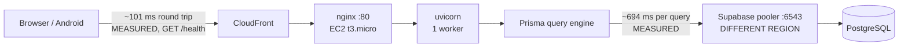
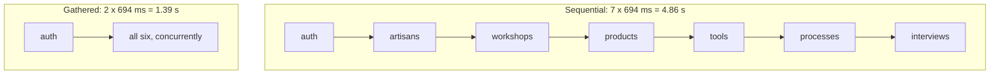
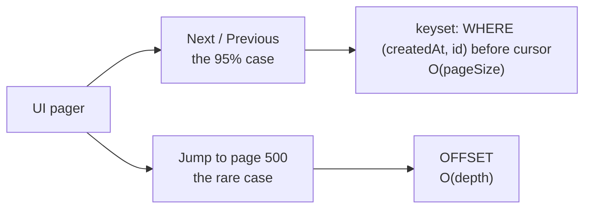
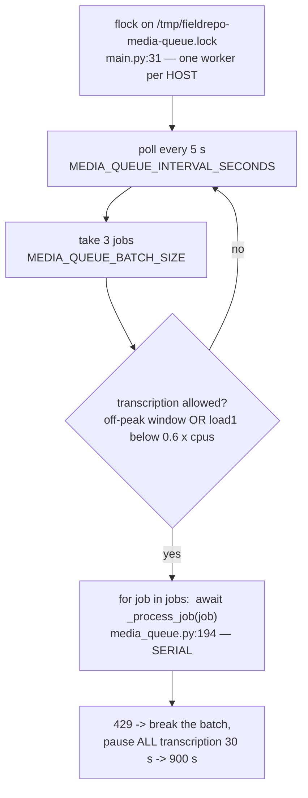
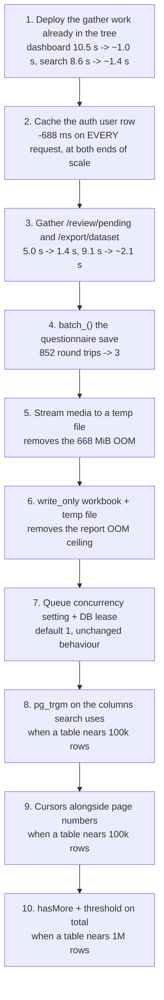

# Scalability: what breaks first, and what it costs to fix

What this system runs into as it grows, ranked by *when* each thing starts to hurt rather than by
how interesting it is. Every entry carries the evidence it rests on, the scale at which it begins
to bite, the fix, and — because this deployment is a 1 GiB EC2 box and must stay one — what the fix
costs the small case.

Sister documents:

- [docs/ARCHITECTURE.md](ARCHITECTURE.md) — what the components are and how a request flows.
- [docs/MEDIA_PIPELINE.md](MEDIA_PIPELINE.md) — upload, transcription and the processing queue.
- [docs/ENVIRONMENT.md](ENVIRONMENT.md) — every environment variable, per service.
- [backend/DEPLOY_AWS.md](../backend/DEPLOY_AWS.md) — the EC2/S3/CloudFront side.

The governing constraint, stated once so every recommendation below can be checked against it:

> **Nothing here may make the 1 GiB pilot harder to run.** A mandatory Redis, a search cluster or a
> message broker would speed up the large case and make the small one impossible. Anything
> infrastructural must be optional and must degrade to an in-process default. Fixes that help at
> *both* ends — removing a round trip, adding an index, collapsing sequential awaits — always win.

---

## 0. How to read the numbers

Two labels appear throughout, and they mean strictly different things.

| Label | Meaning |
|---|---|
| **MEASURED** | I ran it and recorded the result. The endpoint measurements are medians of 3–7 samples against the live production API on 2026-07-26; the memory measurements are `tracemalloc` on this machine. Section 8 says how to reproduce each one. |
| **MODELLED** | An extrapolation from a measured constant. Every one is arithmetic on a number labelled MEASURED, and the arithmetic is shown. None of them has been observed. |
| **NOT MEASURED** | Named explicitly where I could not measure something, rather than quietly modelling it and hoping. |

Where a figure came from someone else's work in this repository it is attributed to that file, and
labelled with whichever of the two it is.

Production volumes at the time of measurement, from the live API: **16 artisans, 18 products,
74 tools, 925 media files, 9 crafts, 4 processes, 1 workshop, 25 questionnaire interviews.** Media
totals **6.66 GiB** across 568 audio, 305 image and 52 video objects (MEASURED, §5.1).

---

## 1. The one measurement that explains almost everything

The database is in a different AWS region from the web box. That single fact dominates every other
performance property of this system, and it does so in a way that is exactly, boringly linear.



### 1.1 The model

Fitting latency against the number of database queries a route issues **one after another**:

> **T ≈ 98 ms + 694 ms × (number of sequential database round trips)**
>
> MEASURED. Least squares over six endpoints whose query count is unambiguous from the source
> (`/health` = 0, `/health/ready` = 1, `/api/me` = 1, `/reference/address` = 1, `/review/pending` = 7,
> `/dashboard/stats` = 15). **R² = 0.999999.**

The three anchor points that make it trustworthy are the ones where the code leaves no room for
interpretation:

- `GET /health` (`backend/app/main.py:412`) touches no database at all → **101 ms MEASURED**. That
  is the network, TLS and CloudFront floor.
- `GET /reference/address` (`backend/app/api/routes/reference.py:23`) has a docstring that says
  *"The payload is a pure constant — no database read"* — and it takes **789 ms MEASURED**. All
  688 ms of the difference is the `db.user.find_unique` inside `get_current_user`
  (`backend/app/core/deps.py:127`). An endpoint that reads nothing costs one round trip because
  authentication reads something.
- `GET /review/pending` (`backend/app/api/routes/review.py:139`) loops over six record types issuing
  one `find_many` each (`review.py:141-147`). It returns **22 bytes** — the queue is empty — and takes
  **4,958 ms MEASURED**. That is 7.00 implied round trips against a model that predicted 7.

### 1.2 The measured table

All medians, live production, 2026-07-26. "Trips" is `(T − 98) / 694` — the model inverted.

| Endpoint | MEASURED | Trips | Bytes | What the trips are |
|---|---:|---:|---:|---|
| `GET /health` | 101 ms | 0.00 | 15 | nothing |
| `GET /health/ready` | 796 ms | 1.01 | 52 | `SELECT 1` |
| `GET /api/me` | 786 ms | 0.99 | 1,010 | auth |
| `GET /reference/address` | 789 ms | 1.00 | 1,214 | auth (payload is a constant) |
| `GET /data/tree` | 790 ms | 1.00 | 1,099 | auth |
| `GET /users/directory` | 1,484 ms | 2.00 | 2,250 | auth + users |
| `GET /crafts?pageSize=20` | 2,137 ms | 2.94 | 5,491 | auth + count + page |
| `GET /tasks?pageSize=20` | 2,203 ms | 3.03 | 55 | |
| `GET /search?q=ram&types=artisans` | 2,159 ms | 2.97 | 5,761 | auth + count + page |
| `GET /questionnaire/questions` | 2,466 ms | 3.41 | 112,820 | |
| `GET /media?pageSize=1` | 2,744 ms | 3.81 | 15,595 | |
| `GET /processes?pageSize=20` | 3,023 ms | 4.22 | 30,075 | |
| `GET /artisans?pageSize=20` | 3,055 ms | 4.26 | 64,110 | |
| `GET /media?pageSize=20` | 3,124 ms | 4.36 | 380,249 | |
| `GET /workshops?pageSize=20` | 3,520 ms | 4.93 | 9,983 | |
| `GET /products?pageSize=20` | 3,780 ms | 5.31 | 209,150 | |
| `GET /tools?pageSize=20` | 4,228 ms | 5.95 | 245,010 | |
| `GET /questionnaire/interviews?pageSize=20` | 4,482 ms | 6.32 | 1,593,765 | |
| `GET /review/pending` | 4,958 ms | 7.00 | **22** | auth + 6 tables, sequentially |
| `GET /search?q=ram` (5 buckets) | 8,559 ms | 12.19 | 184,302 | auth + 5 counts + 5 pages |
| `GET /export/dataset` | 9,105 ms | 12.98 | 475,897 | 6 tables + media |
| `GET /dashboard/stats` | 10,504 ms | 15.00 | **1,896** | auth + 14 reads |
| `GET /data/report?format=json` | 13,289 ms | 19.01 | 2,748,089 | 19 tables/queries |

Two rows deserve to be read twice. `/review/pending` spends **five seconds** producing twenty-two
bytes. `/dashboard/stats` spends **ten and a half seconds** producing 1.9 kB. Neither number has
anything to do with how much data exists.

### 1.3 Rows do not matter; relations do

| Comparison | MEASURED |
|---|---|
| `/media?pageSize=1` → `pageSize=100` (100× the rows, 2.0 MB payload) | 2,875 ms → 3,571 ms (**+696 ms**) |
| `/tools?pageSize=1` → `pageSize=100` | 3,805 ms → 5,323 ms (**+1,518 ms**) |
| `/crafts` (1 relation) → `/tools` (7 relations), both 20 rows | 2,137 ms → 4,228 ms (**+2,091 ms**) |

Regressing list latency on the number of relations each route declares (crafts 1, artisans 4,
processes 4, products 6, tools 7):

> **346 ms per declared relation** — half a round trip each. MEASURED, R² = 0.9916.

A hundred-fold increase in *rows* costs less than one round trip. Six extra *relations* cost three.
This is the single most important shape in the system, and it is why every recommendation below is
about the count of sequential queries and almost never about query efficiency.

### 1.4 Production is running the pre-optimisation build

The working tree contains substantial round-trip work by other streams —
`backend/app/services/concurrency.py` (`gather_reads`), `records.py::hydrate_relations` and
`count_and_page`, and a gathered `/dashboard/stats` and `/search`. **None of it is deployed.** Two
measurements prove that:

- `/dashboard/stats` measures **15.00** implied trips, exactly the fourteen-sequential-reads shape
  the current docstring describes as the *old* behaviour (`dashboard.py:52-58`).
- `/search?q=ram` across five buckets measures **12.19** trips against **2.97** for a single bucket.
  If the ten bucket queries were gathered, five buckets would cost roughly what one costs. They cost
  five times as much, so they are still sequential in production.

So the deployed latencies in §1.2 are the *un-fixed* baseline. That is useful — it is the honest
"before" for a paper — but nothing below should be read as "already solved" merely because a fix
exists in the tree.

**I did not measure the un-deployed build.** Doing so would mean starting the app against the
production database, which also starts the media-queue worker; the brief forbids that, and it is the
right rule.

---

## 2. Ranked inventory

Ranked by *when* it bites, not by size of eventual win.

| # | Bottleneck | Evidence | Starts to hurt at | Fix | Cost to the 1 GiB pilot |
|---|---|---|---|---|---|
| 1 | **Sequential round trips per request** | §1.1–1.3, MEASURED | **Now**, at 16 artisans | Gather independent reads; batch relations; delete queries outright | None — strictly faster, no new memory |
| 2 | **One auth read on every request** | `deps.py:127`; `/reference/address` = 789 ms MEASURED | **Now**, every call | In-process TTL cache of the user row | ~200 KB RAM; role changes lag by the TTL |
| 3 | **Whole media objects read into RAM** | `s3.py:243`; largest live object **668 MiB** MEASURED | **Now** — that file already exists | Stream to a temp file; cap by free memory, not a constant | Disk instead of RAM; a few lines |
| 4 | **Write-path N+1** | `questionnaire.py:216-258` = 3 queries per answer | **Now**, at ~14 answers in one save | `db.batch_()` / `create_many` — one round trip | None; strictly fewer queries |
| 5 | **Connection pool under burst** | Knee at 8 concurrent, MEASURED §6 | **Now**, at ~8 simultaneous users | Remove queries (see 1, 2); make the pool a knob | None |
| 6 | **Reports and manifests built entirely in RAM** | 284 B/cell MEASURED; caps allow 2.1 M cells | ~10–20× today's records | `write_only` workbook to a temp file; stream rows | Column widths become fixed, not content-fitted |
| 7 | **Queue throughput: one worker, serial batch** | `media_queue.py:194-213`; `main.py:31` | ~5–10× today's audio | Concurrency as a setting (default 1); DB lease instead of `flock` | None at default |
| 8 | **Unbounded aggregate responses** | `review.py:139` (no paging), `data_browser.py:132,143` | ~200 pending per type | Paginate; stream the manifest | None |
| 9 | **Multi-column `ILIKE '%term%'`** | `records.py:231-244`, 57 call sites | ~100–150 k rows in a searched table, MODELLED | `pg_trgm` GIN indexes — inside Postgres, no new service | Index build + write amplification; kilobytes today |
| 10 | **OFFSET pagination depth** | `pagination.py:10` | ~100 k rows **and** deep paging, MODELLED | Cursor alongside page numbers, not instead | None; additive field |
| 11 | **Exact `COUNT(*)` per list response** | `records.py:451-454` | ~1 M rows, MODELLED | Fetch `pageSize + 1`; report `hasMore` above a threshold | None until the threshold |

Items 9, 10 and 11 are the three the brief asked about most pointedly, and they rank **last**. That
is the finding, not an oversight; §7 shows the arithmetic.

---

## 3. Sequential round trips (rank 1)

### The evidence

`GET /review/pending` returning 22 bytes in 4,958 ms is the cleanest example in the codebase:

```python
# backend/app/api/routes/review.py:140-147
for record_type, delegate, label_fields in _PENDING_SOURCES:   # six record types
    rows = await delegate.find_many(...)                       # one round trip each, in series
```

Six tables, no dependency between them, awaited one at a time. On a database next door this is
free. Here it is 4.2 seconds.

`GET /export/dataset` (`export.py:153-170`) does the same with six `find_many` calls plus a media
query — 12.98 trips MEASURED. `/data/report` does it nineteen times — 19.01 trips MEASURED.

### The fix, and why it is the right shape



`backend/app/services/concurrency.py::gather_reads` already implements exactly this, bounded by the
Prisma pool so one request cannot drain it. Routes still to convert, from the measurements above:
`review.py:139` (7 → 2 trips), `export.py:153` (13 → 3), `media.py` list (`count` then `find_many`
then `_interview_labels`, still sequential at `media.py` list route), and the nineteen queries behind
`/data/report`.

**Cost to the small deployment: none.** Fewer wall-clock seconds for the same queries, the same
memory, no new dependency. This is the fix the brief's design rule was written for.

### The caveat that matters for rank 5

Gathering reduces **latency**. It does not reduce **load**. Six queries gathered still occupy six
pool connections and still cost six connection-seconds; they just overlap. A route converted from
7 sequential trips to 2 waves gets 3.5× faster *and* asks for up to six connections at once instead
of one. On a pool of ten that is fine for one request and interesting for three. See §6.

The fixes that improve throughput as well as latency are the ones that **delete** queries: caching
the auth read (§4), the `group_by` that replaced four count pairs in `dashboard.py:59-82`, and
`hydrate_relations`' one-query-per-relation batching in `records.py:392`.

---

## 4. One database read on every authenticated request (rank 2)

### The evidence

```python
# backend/app/core/deps.py:127
user = await db.user.find_unique(where={"id": user_id})
```

Every authenticated route depends on `get_current_user`. **MEASURED:** `/reference/address`, whose
own docstring promises no database read, costs 789 ms; `/api/me` costs 786 ms; the floor is 101 ms.
The user lookup is **688 ms of flat tax on every single API call**, and one connection-second of
pool occupancy with it.

### The fix

A per-process TTL cache of the user row, keyed by user id, default TTL 10 s, invalidated
immediately on any write to that user. `backend/app/scale/memory_cache.py` (present in the tree,
not yet wired — see §9) is the right home: it is bounded by both entry count and bytes, which is
what a 1 GiB box needs.

Sizing: a user row is on the order of 1 kB, so **200 users ≈ 200 kB** (MODELLED from the 1,010-byte
`/api/me` payload). This is the cheapest cache in the system by a wide margin and the only one whose
hit rate approaches 100 %.

### The cost, stated plainly

A deleted or demoted account stays valid for up to the TTL. That is a real security property being
traded for 688 ms, so it should be a short TTL (10 s), the invalidation on user writes should be
unconditional, and the trade should be written down in `docs/SECURITY.md` rather than discovered.
With one uvicorn worker the invalidation is exact; with two it is exact only in the worker that
performed the write, which is an argument for keeping one web worker (which `backend/app/worker.py`
already documents as load-bearing for other reasons).

A second, smaller instance of the same shape: `records.py::visibility_where` (line 262) reads the
grant table on every list request for every user below professor. Same cache, TTL 30 s, keyed by
user id. Admins pay nothing today because `has_rank(user, "PROFESSOR")` returns an empty filter
without querying — which is why the measurements in §1.2, taken as an admin, do *not* include it.
**Every researcher pays 694 ms per list request that these numbers do not show.**

---

## 5. Memory on a 1 GiB box

### 5.1 Whole media objects in RAM (rank 3) — biting now

**MEASURED**, live media table, all 925 rows sampled:

| | |
|---|---|
| Total stored | 6,815 MiB |
| Median object | 2.01 MiB |
| p90 | 14.28 MiB |
| p99 | 97.07 MiB |
| **Largest** | **668.44 MiB** |
| Five largest | 131.2, 151.4, 156.0, 240.0, 668.4 MiB |
| Type mix | 568 AUDIO, 305 IMAGE, 52 VIDEO |

Every transcription reads the whole object into the process heap:

```python
# backend/app/services/s3.py:243-249
def get_object_bytes(object_key: str) -> bytes:
    response = _client().get_object(...)
    return response["Body"].read()          # the entire object
```

called from `media_queue.py:364` and `:243`. It is then handed to the provider as a multipart
field — `files={"file": (filename, content, mime_type)}` at `ai.py:71` and `:87` — and `requests`
assembles that multipart body as a second contiguous bytes object. For the 668 MiB file that is
**~1.34 GiB of live heap on a 1 GiB box** (MODELLED from the MEASURED file size; the doubling is how
`requests` builds multipart bodies). ElevenLabs' declared ceiling is 1000 MiB (`ai.py:58`), so
nothing in the code refuses it.

Worse if the chain falls through to Whisper. Above 24 MiB (`ai.py:55`) `_split_audio_into_chunks`
decodes the entire file to uncompressed PCM via pydub and materialises **every** chunk into a list
before transcribing any of them (`ai.py:126-152`). Decoded PCM is several times the compressed
size; for a multi-hundred-megabyte input this cannot fit and never will.

The same pattern sits in the *web* process: `/data/media/{id}/download?format=mp4` reads the object
whole and re-encodes it, guarded only by `MAX_CONVERT_BYTES = 200 MiB` (`data_browser.py:141`).
Three live files (131, 151, 156 MiB) are under that cap.

**Fix, all of which keep the small case working:**

1. Stream the S3 object to a `NamedTemporaryFile` instead of `.read()`; hand the provider an open
   file handle, which `requests` streams rather than buffers. Peak heap becomes the chunk size.
2. Make `_split_audio_into_chunks` a generator, and let pydub read from the temp file path so
   ffmpeg streams from disk rather than from a `BytesIO` of the whole input.
3. Replace `MAX_CONVERT_BYTES` with a limit derived from free memory, and lower the constant to
   something a t3.micro can actually hold (32 MiB) until then.

**Cost to the pilot:** disk instead of RAM (the box has disk; it does not have RAM), and one extra
temp-file lifecycle. No new service, no new dependency.

### 5.2 The report workbook and the manifest (rank 6)

**MEASURED**, `tracemalloc` on this machine, openpyxl in the same non-`write_only`, styled
configuration `services/xlsx_report.py` uses:

| Sheet size | Heap after building cells | Peak heap | Bytes/cell (peak) |
|---|---:|---:|---:|
| 1,000 × 30 = 30 k cells | 6.2 MiB | 8.5 MiB | 296 |
| 5,000 × 30 = 150 k cells | 29.7 MiB | 40.6 MiB | 284 |

`build_report_workbook` (`xlsx_report.py:325-347`) holds the whole workbook as live `Cell` objects,
saves into a `BytesIO`, then `buffer.getvalue()` copies the bytes again, and `data_browser.py:2903`
wraps that copy in another `BytesIO`. Before any of that, `_rendered()` (`data_browser.py:2850`)
copies every prose row.

The caps allow fourteen sheets at `REPORT_TAKE = 5000` rows each (`data_browser.py:143`,
`:2050-2088`). At the measured ~30 columns:

> 14 × 5,000 × 30 = **2.1 M cells × 284 B ≈ 597 MiB** of workbook alone, plus the Python row lists
> that fed it, plus two copies of the serialised payload. **MODELLED** from the measured bytes/cell.

That does not fit in 1 GiB alongside uvicorn and the Prisma engine. Today it is invisible because
the whole repository is a few thousand cells — `/data/report?format=json` returns 2.75 MB
(MEASURED), which is perhaps 20 k cells. **The existing row caps are already above what the box can
render**; only the data being small is holding it up.

`GET /export/dataset` is the same story in JSON: it loads six tables (each ≤ 5,000 rows, with
relation includes) plus up to `MEDIA_TAKE = 20000` media rows (`export.py:26-28`) and returns one
list of every file path. **MEASURED today: 9,105 ms, 476 kB.** At 100× the media it is a ~48 MB JSON
response assembled entirely in memory (MODELLED, linear in row count).

One genuine relief: **the server never builds a ZIP.** There is no `zipfile` import anywhere in
`backend/` — the manifest is a list of `{path, url}` and the *client* downloads each object straight
from S3 and zips it locally (`export.py:39-51`). That is already the right architecture and should
be preserved, not replaced with server-side archiving.

**Fix:**

- `Workbook(write_only=True)` plus `wb.save(temp_path)` and a `FileResponse`. Peak heap drops to
  roughly one row.
- Feed sheets from a generator that pages the query in batches rather than materialising every row.
- For the manifest, stream NDJSON (`{"path":…,"url":…}` per line) behind a `?stream=1` flag, keeping
  the existing JSON shape as the default so no client breaks.

**Cost to the pilot:** `write_only` cannot measure content to size columns after the fact, so column
widths become fixed rather than content-fitted, and the Overview sheet must be written first from
row counts already known. That is a small, visible cosmetic trade for removing an OOM class. It is
worth naming rather than hiding, because the workbook styling in `xlsx_report.py` is deliberate work.

---

## 6. Connection pool and burst (rank 5)

### What is configured

- `DATABASE_CONNECTION_LIMIT = 10` per process (`config.py:94`), cut from 40 after a documented
  pooler-exhaustion incident.
- Runtime traffic goes through the Supabase **transaction** pooler on :6543 with `pgbouncer=true`
  (`db.py:15-65`). Session mode pinned one of a small number of server connections per client and
  crash-looped the service; transaction mode returns the connection after each statement.
- One web process (uvicorn, single worker) plus one separate queue process
  (`backend/app/worker.py`), so **20 client connections** in steady state.
- `pool_timeout` is unset, so Prisma's default 10 s applies (`config.py:96`).
- The pooler's ceilings quoted in `config.py:88-93` and `db.py:20-28` are **200 client connections**
  multiplexed over **~15 server connections**. Those are the comments' numbers; I did not
  independently verify them against the Supabase project.

### What it actually sustains — MEASURED

Concurrent `GET /api/artisans?pageSize=1` from a thread pool:

| Concurrency | Wall time | Median request | Slowest | Errors |
|---:|---:|---:|---:|---|
| 1 | 2,695 ms | 2,693 ms | 2,693 ms | none |
| 4 | 2,734 ms | 2,723 ms | 2,725 ms | none |
| 8 | 3,679 ms | 2,717 ms | 3,643 ms | none |
| 12 | 4,084 ms | 3,131 ms | 4,005 ms | none |

Flat to 4. The knee is at **8**, where the slowest request is 35 % above the median. At 12 the
median has moved too. No connection errors at any level, which is the reassuring half of the result.

### The model, and where it breaks

A request that issues *n* sequential round trips occupies a pool connection for roughly
`n × 694 ms`, because with a cross-region link essentially all of a query's duration is network.

> `/tools?pageSize=20` = 5.95 trips ≈ **4.1 connection-seconds per request**.
> Pool of 10 ⇒ **≈ 2.4 requests/second** of that endpoint before the pool is the limit. **MODELLED.**

The measured knee at 8 concurrent single-row reads (≈ 2.6 connection-seconds each ⇒ demand ≈ 10
connections) lands exactly on the configured pool of 10, which is decent corroboration for a crude
model.

Past saturation the failure mode is not graceful: requests queue inside the engine for up to the
10 s `pool_timeout` and then raise `P2024`. The watchdog in `main.py:90-93` correctly recognises
`P2024` as "saturated by load, not broken" and refuses to reconnect — that guard is load-bearing and
must survive any pool change.

### What to do

1. **Reduce trips per request** (§3, §4). This is the only change that raises the ceiling rather
   than reshuffling it. Removing the auth read alone takes `/tools` from 4.1 to 3.4 connection-
   seconds — a ~17 % throughput gain, for free, at both ends of scale.
2. **Set `DATABASE_POOL_TIMEOUT` explicitly** (5 s). Ten seconds of queueing on a link where a
   healthy request is 3 s means a saturated pool presents as a hang, not as an error, and CloudFront
   times out before the client learns anything.
3. **Do not raise `connection_limit` to fix a burst.** The pooler multiplexes over ~15 server
   connections; more client connections past that point buy queueing, not concurrency — and this is
   precisely the mistake the 40 → 10 cut was reverting.
4. **`gather_reads` is bounded by `pool_width()`** (`concurrency.py:25-32`), which means one request
   may legitimately ask for the entire pool. That is safe at one concurrent dashboard request and
   self-throttling at several. Worth keeping the bound at the pool size and never above it.

---

## 7. The three the brief asked about — and why they rank last

### 7.1 OFFSET pagination (rank 10)

`normalize_pagination` computes `skip = (page - 1) * page_size` (`pagination.py:10`) and every list
route passes it to `find_many`. The concern is correct in general: `OFFSET n` makes Postgres produce
and discard *n* rows.

**MEASURED**, holding the payload constant at one row so only the offset varies, over the 925-row
media table:

| Page (pageSize=1) | MEASURED |
|---:|---:|
| 1 | 2,744 ms |
| 100 | 2,987 ms |
| 300 | 2,686 ms |
| 600 | 2,743 ms |
| 900 | 3,273 ms |
| 925 | 3,253 ms |

Roughly 500 ms between the shallowest and deepest page — less than a single round trip, and not
cleanly separable from the fact that different pages carry different relation sets. **At 925 rows,
OFFSET is not measurable against the 694 ms constant.**

**MODELLED threshold.** The index-coverage migration in this tree
(`backend/prisma/migrations/20260726200000_index_coverage/migration.sql:53-56`) reports a MEASURED
figure from a 100× copy: an index scan that *discarded 49,404 rows* to find 500 took 56 ms — about
**1.1 µs per discarded row**. Therefore:

- OFFSET reaches 100 ms of cost at depth ≈ **91,000 rows**.
- OFFSET reaches one round trip (694 ms) at depth ≈ **630,000 rows**.

So OFFSET becomes the dominant term only when a single table is in the hundreds of thousands of rows
*and* users page deep into it. Both conditions matter: page 3 of a 10 M-row table is still free.

**The fix that keeps page numbers.** Yes — and the answer is *additive*, not a replacement:



Keep `{items, total, page, pageSize, pages}` exactly as it is and **add** `nextCursor` / `prevCursor`.
A client that walks sequentially sends the cursor and gets keyset performance; a client that jumps to
an arbitrary page sends `page` and pays the OFFSET it asked for. Real users overwhelmingly page
sequentially, so this captures nearly all of the benefit with **zero contract break** — the Android
app and the web app keep working unchanged, and neither has to be released in lockstep.

One correctness note for whoever implements it: every list orders by `createdAt desc`
(`records.py:250` and siblings), and `createdAt` is **not unique**. A stable cursor must be the
compound `(createdAt, id)`, and the supporting index should be `(createdAt DESC, id DESC)` rather
than the bare `createdAt` the index migration adds. Otherwise two records saved in the same
millisecond will duplicate or skip across a page boundary.

**Cost to the pilot:** one extra field in a response body. Nothing else.

### 7.2 Exact `COUNT(*)` on every list response (rank 11)

`count_and_page` (`records.py:451-454`) issues `delegate.count(where=where)` alongside the page —
and, importantly, *concurrently* with it in the tree version. Two consequences:

- While the count is faster than the page query, it costs **zero wall-clock time**. On the deployed
  sequential build it costs a full 694 ms; gathering it (§3) removes that without touching the
  count itself.
- An exact count with a filter that no index covers is a scan. At the 1.1 µs/row figure above, a
  filtered count is ~100 ms at 91 k rows and ~1.1 s at 1 M rows (**MODELLED**).

So the honest recommendation is: **do nothing yet.** When a table passes roughly a million rows,
switch to the cheap pattern rather than an approximate count:

1. Fetch `pageSize + 1` rows; `hasMore = len(rows) > pageSize`; return `pageSize` of them.
2. Return `total` exactly while it is under a threshold (say 10,000), and `null` above it, with a new
   `totalIsExact: bool`. The UI shows "1–20 of 4,312" or "1–20 of many".
3. If a number is genuinely required above the threshold, cache it per `(user, filter)` for 30 s —
   nobody needs a per-request-fresh count of 400,000 rows.

`pg_class.reltuples` is deliberately *not* recommended: it is only meaningful for an unfiltered
table, and every list here filters by visibility, workshop or status.

**Cost to the pilot:** none, because the threshold means the small deployment never leaves the exact
path. That is the whole point of expressing it as a threshold rather than a mode.

### 7.3 Text search: multi-column `ILIKE '%term%'` (rank 9)

**What the code does today**, confirmed:

```python
# backend/app/services/records.py:231-244
def contains(value: str) -> dict[str, Any]:
    return {"contains": value.translate(_UNSEARCHABLE), "mode": "insensitive"}
```

`mode: "insensitive"` + `contains` compiles to `ILIKE '%term%'`. The docstring records **57 call
sites**. `/search` applies it across 3–6 columns per bucket (`search.py:105-123`); `/tools` applies
it across nine columns (`tools.py:85-95`). A btree cannot answer a leading-wildcard pattern at all,
which the index migration verified directly and acted on by **dropping eleven text-column btree
indexes** that could never be used (`migration.sql:131-149`).

**The 8,920 ms search is not an ILIKE problem.** MEASURED:

| | MEASURED |
|---|---:|
| `/search?q=ram&types=artisans` | 2,159 ms |
| `/search?types=artisans` (no query at all) | 2,159 ms |
| `/search?q=ram` (all five buckets) | 8,559 ms |

Adding the text predicate costs **nothing measurable** at today's volumes; adding four more buckets
costs 6.4 seconds. The 8.9 s search is ten sequential round trips wearing a text-search costume.
Fix §3 first and the same search lands near 1.4 s with the ILIKE untouched.

**When ILIKE does start to matter — MODELLED.** From the same 1.1 µs/row scan figure, with 5 columns
scanned per bucket, the predicate costs one round trip (694 ms) at roughly **125,000 rows** in a
searched table, and about 5 s per bucket at 1 M rows.

**The fix, and why it satisfies the no-new-infrastructure rule.** `pg_trgm` lives *inside* Postgres:

```sql
CREATE EXTENSION IF NOT EXISTS pg_trgm;
CREATE INDEX CONCURRENTLY "Artisan_name_trgm_idx"
  ON "Artisan" USING gin ("name" gin_trgm_ops);
```

Trigram GIN indexes serve `LIKE`, `ILIKE`, `~` and `~*` including leading wildcards, so **the query
semantics do not change at all** — `contains()` keeps working, no route changes, no client changes.
That property is worth more than raw speed here: the alternative, `tsvector` full-text search, is
smaller and faster but matches *lexemes*, so searching "ram" would stop finding "Sitaram". For
finding a name someone half-remembers, substring matching is the correct behaviour, and pg_trgm is
the only option that preserves it.

| Option | New service? | Semantics change? | Index size | Verdict |
|---|---|---|---|---|
| Status quo (`ILIKE`, no index) | no | — | 0 | Fine to ~125 k rows |
| **`pg_trgm` GIN** | **no** | **none** | ~30–60 % of the indexed text (MODELLED) | **Recommended** |
| `tsvector` + GIN | no | yes — word/prefix, not substring | ~20–30 % of text | Rejected: breaks "Sitaram" |
| External search cluster | yes | yes | n/a | **Forbidden by the constraint** |

**Cost to the pilot:** at 16 artisans and 925 media rows the indexes are kilobytes and build
instantly. The real cost is write amplification — GIN maintenance on insert and update — which at a
handful of records per day is unmeasurable. Two caveats worth writing into the migration: build with
`CREATE INDEX CONCURRENTLY` from `psql` (the migration file in this tree already documents the
`prisma migrate deploy` transaction-block trap at `migration.sql:6-20`), and note that a trigram
index cannot help a search term shorter than three characters, which will still scan.

**Add them lazily.** Index the columns a search actually uses often — `Artisan.name`,
`Artisan.place`, `ToolDocumentation.toolkitName`, `ProductDocumentation.productName`,
`MediaFile.originalFilename` — not all 57 call sites. Every index is a write cost forever.

---

## 8. Write paths, and O(n) where O(1) would do (ranks 4, 8)

### 8.1 The questionnaire save — three round trips per answer

```python
# backend/app/api/routes/questionnaire.py:216-258
for response in responses:
    await require_record(db.questionnairequestion, response.questionId)   # trip 1
    existing = await db.questionnaireresponse.find_unique(...)            # trip 2
    await db.questionnaireresponse.upsert(...)                            # trip 3
```

The question bank holds **284 questions across 24 sections** (MEASURED, counted from
`app/data/questionnaire_questions.json`). At 694 ms per trip:

| Answers saved in one request | Round trips | MODELLED time |
|---:|---:|---:|
| 10 | 30 | 20.8 s |
| 14 | 42 | **29.2 s** — the edge of CloudFront's origin timeout |
| 50 | 150 | 104 s |
| 284 | 852 | 9.9 minutes |

**This bites today, at pilot scale, with pilot data.** It is not a scale projection.

**Fix, in three round trips regardless of answer count:**

1. Validate every `questionId` in one query — `find_many(where={"id": {"in": ids}})` — and compare
   the returned set against the requested set.
2. Load every existing response for this interview in one query, and run the
   "only the original contributor may change this" check in Python against that map.
3. Write with `db.batch_()`, which prisma-client-py 0.15.0 supports (verified in the installed
   client) and which sends every statement in **one** round trip. `create_many` covers the pure-insert
   case. **Neither appears anywhere in `backend/` today** — that is the single largest unused lever
   in the codebase.

The same shape, smaller, at `questionnaire.py:201` and `:210`, `tools.py:203` and `:215`,
`workshops.py:135`, `:141`, `:348`, `:582`, `:594`, and `data_access.py:129`: join rows created one
at a time in a loop. Every one of them is a `create_many` or a `batch_`.

**Cost to the pilot:** none. Strictly fewer queries and the same semantics; `batch_` is a single
transaction, which is arguably *more* correct than a partially-applied loop.

### 8.2 Whole tables loaded to compute something small

| Site | What it loads | What it needs |
|---|---|---|
| `review.py:139` | up to 200 rows × 6 tables, no pagination; `total = len(items)` | one page of a merged queue |
| `export.py:153-225` | 6 tables (≤5,000 each, with includes) + ≤20,000 media | a streamed list of paths |
| `data_browser.py:132` `TAKE = 500` | 500 rows per folder query | one screen of a tree |
| `records.py:262` | every grant row for the user, then `{"in": [ids]}` | a predicate |
| `app_settings.py:25` | the singleton settings row, on **every** queue tick (5 s) and several routes | a cached value |

`/review/pending` is the one to fix first: it has no `page`/`pageSize` at all, so the response grows
with the backlog until the per-type cap of 200 truncates it — at which point `total` is silently
wrong and a reviewer's oldest work becomes unreachable. Give it the same
`{items, total, page, pageSize, pages}` envelope every other list uses, and gather the six queries.

Two things in this codebase already do it right and are worth copying rather than reinventing:
`media.py::_interview_labels` (one batched query for a whole page's worth of two-hop labels) and
`records.py::hydrate_relations` (one batched query per relation, all issued together).

---

## 9. Caching: what genuinely helps, and the shape it must take

### The rule

> **Default: an in-process TTL cache with no extra service. Optional: a shared backend, off unless
> configured. A mandatory Redis is forbidden.**

The tree already contains the right skeleton, written by another stream and **not yet wired** —
`backend/app/scale/flags.py` reads `settings().scale_cache_enabled`, and `backend/app/core/config.py`
does not define it, so nothing in `app/scale/` is reachable today. Treat the package as the intended
destination, not as a working feature:

| File | What it provides |
|---|---|
| `scale/memory_cache.py` | TTL + LRU store bounded by **both** entry count and bytes — the right bound for a 1 GiB box |
| `scale/keys.py` | Per-user audience in every key, and generation counters so invalidation is one atomic increment rather than a keyspace scan |
| `scale/singleflight.py` | One in-flight load per key, so an expiring hot key does not produce N identical queries |
| `scale/flags.py` | Every flag returns `False` on a fresh clone; nothing is imported until it is on |

Two properties of `keys.py` are not optional and must survive any redesign: **a list response is not
the same for two callers** (visibility is per-user, and `public_encode` masks Aadhaar per viewer), so
every key carries the user id; and **invalidation must not enumerate keys**, so it is a generation
counter, not a scan.

### Where a cache genuinely helps

Ranked by value on *this* deployment, which has few users and slow queries — the opposite of the
usual caching profile.

| What | Key | TTL | Saving per hit | Hit rate | Verdict |
|---|---|---|---|---|---|
| **Auth user row** | user id | 10 s | **688 ms + 1 conn-sec**, MEASURED | ~100 % | **Do this first** |
| `visibility_where` grants | user id | 30 s | 694 ms per list request, for every non-professor | ~100 % | **Do this second** |
| `load_app_settings()` | singleton | 30 s | 694 ms per queue tick and per settings read | ~100 % | Cheap, obvious |
| `/questionnaire/questions` | role | 300 s | 2,368 ms MEASURED, 113 kB | high — it changes rarely | Good |
| `/dashboard/stats` | user id | 30 s | up to 10,400 ms MEASURED | low with few users, high with many | Good **with single-flight** |
| `/reference/address` | none | — | already a constant; free once auth is cached | — | Don't bother |

### Where a cache does **not** help, and should not be added

- **Record list pages.** The key is user × filter × page, so the hit rate is low and the memory cost
  is high — `/media?pageSize=100` is a 2 MB payload (MEASURED). Fix these with §3, not with a cache.
- **Search results.** Same reason, more so: the query string multiplies the key space.
- **Anything the user just wrote.** A researcher who saves an artisan and does not see it is a bug
  report, and the generation counter must be bumped on the write path before the response returns.

### Sizing for 1 GiB

Defaults should be chosen so that the cache is invisible in the memory budget: **32 MiB total,
2 MiB per entry, 512 entries.** The per-entry ceiling matters more than it looks — refusing one
oversized response is better than evicting several hundred small ones to fit it, which is exactly
what `memory_cache.set` already does (`memory_cache.py:67-85`).

### The optional shared backend

Redis, if configured, and only then. It buys one thing: a cache shared across processes, which
matters when there is more than one web process — and there is deliberately exactly one today
(`backend/app/worker.py:7-15` explains why, and it is a good reason). So the honest statement is:
**Redis is worth configuring at the point where you add a second web box, and not before.** Until
then it is a service to operate for no benefit. The generation-counter scheme in `keys.py` works
identically in both backends, which is what makes the switch a configuration change rather than a
rewrite.

---

## 10. The media queue (rank 7)

### What the ceiling actually is



Three structural limits, all readable straight from the source:

1. **Concurrency is exactly one.** The batch loop at `media_queue.py:194-213` awaits each job in
   turn, and the election at `main.py:31-47` guarantees one worker per host. Batch size 3 controls
   how many jobs are *claimed*, not how many run at once.
2. **A single 429 stops everything.** `except RateLimited: … break` (`media_queue.py:204-209`) exits
   the batch and enters a process-global cooldown of 30 s doubling to 900 s
   (`media_queue.py:34-35, 68-75`). One throttled clip pauses transcription for every clip.
3. **Transcription only runs in the off-peak window or when the box is idle**
   (`media_queue.py:177-183`), where idle means 1-minute load average below 0.6 × CPU count. On a
   2-vCPU burstable instance under any real traffic, that gate is often shut.

### Throughput

**NOT MEASURED.** I did not run the queue — the brief forbids enabling it, correctly. What can be
stated without measuring is the shape: throughput is `1 / (mean job duration)`, and mean job
duration is S3 fetch + provider round trip, both of which are minutes for the large files in §5.1.

**MODELLED**, at a placeholder 60 s per clip: 60 clips/hour while the gate is open. Today's 568 audio
files are ~9.5 hours of continuous work. At 100× the data that is **39 days**, and it does not
improve by making the box faster, because the box is not the bottleneck — the serial loop is.

The queue also has a correctness property that depends on the concurrency being one: the cooldown
state is module-level globals (`media_queue.py:41-42`, with a comment saying exactly this). The
durable half is already right — `_defer_rate_limited_job` writes `runAfter` on the job row
(`media_queue.py:216-230`) — so a second worker would degrade to "backs off per job" rather than
"stampedes", which is tolerable.

### Fix, keeping the small case identical

- `MEDIA_QUEUE_CONCURRENCY`, **default 1**. At 1 the code path is what runs today. Above 1, run the
  batch through `asyncio.gather` with a semaphore.
- Replace the host-local `flock` election with a **lease row** in the database — a worker id and an
  expiry that the holder renews. Same single-worker behaviour on one box; a second box can take a
  second lease when there is one. The `flock` cannot see another host at all, so it silently caps
  the whole system at one worker forever.
- Move the rate-limit cooldown into the same lease row (or into a settings row) so it coordinates
  across workers instead of relying on there being only one.
- Split the cooldown **per provider**. The chain is ElevenLabs → Deepgram → Whisper
  (`config.py:166-175`); a 429 from one should not idle the other two.

**Cost to the pilot:** none at the defaults — one worker, one lease, identical behaviour. The lease
row adds one write per renewal interval.

---

## 11. What already scales, and should not be "improved"

Worth recording, because the temptation in a scale review is to touch everything.

- **Media bytes never pass through the API.** Uploads are presigned PUTs and presigned multipart
  parts (`s3.py:136, 192, 209`); the browser and the phone talk to S3 directly. Downloads redirect
  (`data_browser.py:2994`). The 6.66 GiB in the bucket has never touched the t3.micro's network
  budget, and the ZIP is assembled client-side (`export.py:39-51`). This is the single best scaling
  decision in the system.
- **The index coverage work in the tree** (`migrations/20260726200000_index_coverage/`) adds 15
  indexes matching real query shapes and drops 34 that no query can reach, with EXPLAIN evidence on a
  100× copy for each. Adding `(createdAt DESC, id DESC)` for keyset (§7.1) is the only amendment
  I would make.
- **`hydrate_relations`** (`records.py:392`) is the correct answer to the relation cost in §1.3: one
  batched query per relation, all issued together, three waits per page regardless of relation count.
- **`/health` deliberately does not touch the database** (`main.py:412-424`), so a recovering pooler
  cannot cost the box its CloudFront origin health. Do not "improve" this into a real check.
- **The `P2024` guard in the watchdog** (`main.py:90-93`) prevents a saturated pool from being
  mistaken for a broken connection and torn down. Any pool change must keep it.

---

## 12. What I could not measure

Stated so nothing here is mistaken for an observation:

- **The un-deployed build.** Every latency in this document is the code that is live, which is the
  pre-`gather_reads` build (§1.4). Measuring the tree's version means running the app against the
  production database, which also starts the media-queue worker.
- **Queue throughput.** Never ran a job. §10 is structure, not stopwatch.
- **Actual RSS on the production box.** No shell access from here (the deployment notes record that
  the ISP blocks SSH and SSM is the route in). The memory ceilings in §5 are measured on this machine
  and extrapolated by cell and byte counts, not observed on the t3.micro.
- **`pg_trgm` speedups.** Creating an extension and an index on production is DDL, which the brief
  forbids. The threshold in §7.3 is arithmetic on another author's measured scan rate.
- **Pooler internals.** The 200-client / 15-server figures come from comments in `config.py` and
  `db.py`. I did not query `pg_stat_activity` to confirm them.
- **Anything above 12 concurrent requests.** I stopped the burst test at 12 rather than push a live
  pilot serving real researchers.

---

## 13. Reproducing the measurements

All read-only. The only non-GET is the login that mints a token.

```bash
# 1. The round-trip constant. Compare an endpoint with no DB read against one with exactly one.
curl -s -o /dev/null -w '%{time_total}\n' https://d2b34i3e92al6i.cloudfront.net/health
curl -s -o /dev/null -w '%{time_total}\n' https://d2b34i3e92al6i.cloudfront.net/health/ready

# 2. A token.
TOKEN=$(curl -s -X POST https://d2b34i3e92al6i.cloudfront.net/api/auth/login \
  -H 'content-type: application/json' \
  -d '{"email":"admin@example.com","password":"..."}' | python -c 'import json,sys;print(json.load(sys.stdin)["accessToken"])')

# 3. The 7-round-trip endpoint that returns 22 bytes.
curl -s -o /dev/null -w '%{time_total} %{size_download}\n' \
  -H "authorization: Bearer $TOKEN" https://d2b34i3e92al6i.cloudfront.net/api/review/pending

# 4. Relations, not rows: same one row, different relation counts.
for p in crafts artisans products tools; do
  curl -s -o /dev/null -w "$p %{time_total}\n" \
    -H "authorization: Bearer $TOKEN" "https://d2b34i3e92al6i.cloudfront.net/api/$p?pageSize=20"
done

# 5. ILIKE costs nothing today: with and without a query term.
curl -s -o /dev/null -w 'with-q    %{time_total}\n' -H "authorization: Bearer $TOKEN" \
  'https://d2b34i3e92al6i.cloudfront.net/api/search?q=ram&types=artisans'
curl -s -o /dev/null -w 'without-q %{time_total}\n' -H "authorization: Bearer $TOKEN" \
  'https://d2b34i3e92al6i.cloudfront.net/api/search?types=artisans'
```

The openpyxl memory figure (§5.2) is `tracemalloc` around a 5,000 × 30 styled `Workbook`, saved to a
`BytesIO` and then `getvalue()`d — the exact sequence `xlsx_report.py:325-347` performs. The media
size distribution (§5.1) is every row of `GET /api/media?pageSize=100` paged to exhaustion, taking
`sizeBytes` and `mediaType`.

---

## 14. The order to do them in



Steps 1 to 7 make the **pilot** faster and lighter, today, with no new infrastructure and no new
dependency. Steps 8 to 10 are the ones that only matter later, and each is written so that the
small deployment never takes the expensive path. That ordering is not a compromise between the two
cases — it is what happens when you rank by evidence instead of by which problem sounds biggest.
