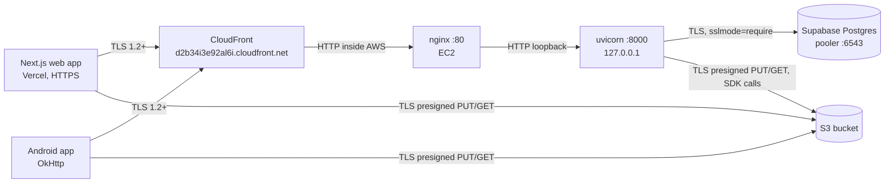

# Security: data in transit and at rest

How field data — artisan PII, GPS points, photographs, interview recordings and their transcripts —
is protected between the capture device and storage, what protects it once stored, and the risks
that are still open. Everything marked **ACTION** needs a human in a console; the code side is
already in the repository.

Audience: whoever operates the deployment (AWS + Supabase + Vercel consoles) and whoever reviews
changes to `backend/app/core/*` and the Android network configuration.

---

## 1. Transport



| Hop | Protection | Where it is enforced |
|---|---|---|
| Browser / phone → API | TLS 1.2+ terminated at CloudFront | `android/app/build.gradle.kts` default `apiBaseUrl`, Vercel `NEXT_PUBLIC_API_URL` |
| CloudFront → nginx (EC2 origin) | **Plaintext HTTP inside AWS** — see risk P1 | CloudFront origin protocol policy |
| nginx → uvicorn | Plaintext on loopback (never leaves the box) | `ExecStart … --host 127.0.0.1` |
| Client → S3 (media bytes) | TLS; presigned URLs are always `https://` | `backend/app/services/s3.py` builds `https://s3.dualstack.<region>.amazonaws.com` |
| API → Postgres | TLS, **no plaintext fallback** | `sslmode=require` injected in `backend/app/core/config.py` |
| API → AI providers | TLS (vendor SDKs/HTTP clients) | `backend/app/services/ai.py` |

### 1.1 Database TLS

Supabase's pooler speaks TLS, but libpq and Prisma's Postgres connector default to
`sslmode=prefer`, which attempts TLS and then **silently falls back to plaintext** if the handshake
fails. A downgrade — a broken proxy, a hostile network — would then ship the database password and
every row in the clear, with nothing in the logs to show for it.

`Settings._harden_database_url` therefore appends `sslmode=require` to `DATABASE_URL` as soon as
settings load, so both the pooler rewrite in `core/db.py` and any script inherit it. The rule:

- **Remote host** (Supabase pooler, RDS, anything not loopback/private) → `sslmode=require`.
- **Local host** (`localhost`, `127.0.0.1`, a private/RFC1918 address, a docker-compose service
  name) → left alone, because the docker-compose Postgres ships no certificate and `require` would
  break local development and the test suite.
- **Already configured** (`sslmode`/`sslaccept`/`sslcert`… already in the URL) → left alone; an
  explicit operator choice always wins.
- `DATABASE_REQUIRE_SSL=true|false` forces either answer.

`prisma migrate deploy` is unaffected: it reads `DATABASE_URL` straight from the environment, not
from this Settings object. Add `?sslmode=require` to the deployed `.env` value if you want
migrations covered too (harmless — Supabase supports it on both pooler ports).

### 1.2 Security response headers

`SecurityHeadersMiddleware` in `backend/app/main.py` is registered last, which makes it the
**outermost user middleware**, so it stamps route responses, CORS preflights and the responses
produced by exception handlers (including the JSON 4xx/5xx bodies FastAPI raises). It is pure ASGI
(no `BaseHTTPMiddleware`), so it adds nothing to streaming responses or request cancellation, and it
never overwrites a header a route already set.

**One response is not covered.** Starlette's `ServerErrorMiddleware` — the last-resort handler for an
exception that escapes every user middleware — sits *outside* the whole user middleware stack, so its
bare `Internal Server Error` 500 goes out unstamped. That response carries no data and no
`Access-Control-Allow-Origin` either, so it is not a disclosure path; it is simply the one gap in
"every response". Do not read the table below as covering it.

| Header | Value | Why |
|---|---|---|
| `Strict-Transport-Security` | `max-age=63072000; includeSubDomains` | Browser refuses plaintext to this host for 2 years. **Only sent when the request arrived over TLS** (`scheme == https`, `X-Forwarded-Proto`, `CloudFront-Forwarded-Proto`, `X-Forwarded-Ssl`), so a local `http://` dev server never poisons a developer's browser. |
| `X-Content-Type-Options` | `nosniff` | Stops a JSON error body being sniffed into HTML/JS and executed. |
| `X-Frame-Options` | `DENY` | Clickjacking defence for browsers predating CSP `frame-ancestors`. |
| `Content-Security-Policy` | `default-src 'none'; frame-ancestors 'none'; base-uri 'none'; form-action 'none'` | A JSON API loads nothing and may not be framed. |
| `Referrer-Policy` | `strict-origin-when-cross-origin` | Keeps record ids and query strings out of the `Referer` sent to S3/MapTiler/Google. |
| `Permissions-Policy` | camera/mic/geolocation/… all `()` | Denies every powerful browser feature on this origin. |
| `X-Permitted-Cross-Domain-Policies` | `none` | No Flash-era cross-domain policy file is honoured. |

`/docs`, `/docs/oauth2-redirect` and `/redoc` are real HTML pages that load Swagger-UI / ReDoc from
jsdelivr, so they receive a narrower-but-workable CSP instead of the API one. Everything else gets
the strict policy. Whether those pages are served *at all* is now a setting — see §1.4.

### 1.4 The interactive docs and the OpenAPI schema

FastAPI serves `/docs`, `/redoc` and `/openapi.json` to anyone by default, and **on this deployment
they are currently reachable unauthenticated.** Verified 2026-07-27:

```
/docs          200
/redoc         200
/openapi.json  200   ~190 KB
```

The schema names every route, every query parameter and every field of every model, including the
ones behind admin-only roles. That is a map of the API handed to whoever asks, and it is worth
nothing to the researchers this app is for, none of whom read an OpenAPI schema.

`BACKEND_EXPOSE_DOCS` now controls all three, and it defaults to **`False`**. The default is closed
rather than open because the production `.env` lives in a GitHub secret this repository cannot read,
so a default-on flag would leave the docs exposed exactly where it matters. **The fix is in the tree
and not yet deployed**; the next backend deploy closes them. Local development opts back in with
`BACKEND_EXPOSE_DOCS=true`, which `.env.example` ships commented in.

**HSTS in production.** The viewer's TLS terminates at CloudFront, and nginx overwrites
`X-Forwarded-Proto` with its own (plaintext) scheme, so the app usually cannot tell that the viewer
used HTTPS. Set `SECURITY_FORCE_HSTS=true` in the EC2 `.env` to emit HSTS unconditionally.
`SECURITY_HSTS_ENABLED=false` disables the header entirely; `SECURITY_HSTS_MAX_AGE` tunes the age.

`preload` is deliberately **not** in the header. The API is served from a shared
`*.cloudfront.net` domain; submitting a shared domain to the HSTS preload list is not ours to do.
Once the API moves to a dedicated domain, adding `preload` becomes reasonable.

### 1.3 CORS

`BACKEND_CORS_ORIGINS` is an explicit allow-list, parsed defensively (comma **or** newline
separated, tolerant of pasted quotes/brackets, trailing slashes stripped because an `Origin` is only
ever `scheme://host[:port]`, duplicates dropped).

If the list contains `*`, `Settings.cors_allow_credentials` turns **false** and `create_app()` logs
an error. Reason: browsers reject a literal `Access-Control-Allow-Origin: *` alongside
`Allow-Credentials: true`, and Starlette works around that rejection by echoing the *caller's*
origin when the request carries cookies — turning a lazily-configured `*` into "any website may
call this API as the signed-in user". Keep `BACKEND_CORS_ORIGINS` set to the exact Vercel origin.

### 1.4 Android

`android/app/src/main/res/xml/network_security_config.xml`:

- `base-config cleartextTrafficPermitted="false"` — TLS required for every host not named below.
- Cleartext is permitted **only** for `10.0.2.2` (emulator → host machine), `127.0.0.1` and
  `localhost`. The production EC2 origin (`ec2-15-207-145-174….compute.amazonaws.com`,
  `15.207.145.174`) was **removed**: it is a production host reachable only over plaintext HTTP, and
  keeping it listed meant one line in `local.properties` could ship bearer tokens and field data in
  the clear.
- Trust anchors are `system` only, so a user-installed CA (corporate MITM root, mitmproxy) cannot
  silently decrypt app traffic. `debug-overrides` re-adds `user` for debuggable builds only, so
  proxy debugging still works during development.
- `AndroidManifest.xml` sets `android:usesCleartextTraffic="false"`. The XML config takes precedence
  on every supported API level (minSdk 26); the manifest flag states the same intent for platform
  APIs that read it directly.

Developing against a LAN backend from a real phone: add your machine's private IP as an extra
`<domain>` **temporarily** and do not commit it.

---

## 2. At rest

### 2.1 S3 (media: photos, video, audio, documents, transcodes, APK releases)

| Path | Encryption | Mechanism |
|---|---|---|
| Multipart upload (large files) | Explicit SSE-S3 (AES-256) | `create_multipart_upload(..., ServerSideEncryption=…)` — `AWS_S3_SSE_ALGORITHM`, default `AES256` |
| Single presigned PUT (most web uploads) | **Bucket default encryption** | Applied server-side by S3 regardless of what the client sends |

**Why the single-PUT path cannot set the header in code.** Adding `ServerSideEncryption` to the
presign parameters puts `x-amz-server-side-encryption` into the SigV4 *signed headers*, which makes
it mandatory for the client: any PUT without that exact header fails with `SignatureDoesNotMatch`.
Both clients send only the headers `/media/presign` returns (`Content-Type`), and Android builds
already installed in the field can never be retrofitted — so signing it would break every upload,
including from phones that will never be updated. Bucket default encryption achieves the same
result with no client cooperation, which is why it is the load-bearing control here.

**ACTION — enable bucket default encryption** (S3 console → your bucket → Properties → Default
encryption → Edit): *Server-side encryption with Amazon S3 managed keys (SSE-S3)*, Bucket Key
enabled. Buckets created after January 2023 have this on by default — **verify** rather than assume,
and note it only applies to objects written *after* it is switched on. Re-encrypt anything older
with an in-place copy:

```bash
aws s3 cp s3://YOUR_BUCKET/media/ s3://YOUR_BUCKET/media/ \
  --recursive --sse AES256 --metadata-directive REPLACE
```

**ACTION — deny plaintext access to the bucket.** Add this statement to the bucket policy (S3
console → Permissions → Bucket policy). It rejects any request that did not arrive over TLS, which
covers the public media reads as well as the presigned PUTs:

```json
{
  "Sid": "DenyInsecureTransport",
  "Effect": "Deny",
  "Principal": "*",
  "Action": "s3:*",
  "Resource": [
    "arn:aws:s3:::YOUR_BUCKET",
    "arn:aws:s3:::YOUR_BUCKET/*"
  ],
  "Condition": { "Bool": { "aws:SecureTransport": "false" } }
}
```

Keep the existing `PublicReadMedia` allow statement (see `backend/DEPLOY_AWS.md` §4) — an explicit
`Deny` always wins over an `Allow`, so ordering does not matter.

**Do NOT add** the "deny unencrypted object uploads" statement
(`s3:x-amz-server-side-encryption` `Null: true`) that hardening guides usually pair with this. It
would reject exactly the presigned single PUTs described above and break all small-file uploads.
Default encryption already covers them.

**Media objects under `media/*` are world-readable.** The bucket policy grants `s3:GetObject` to
`Principal: "*"`, so anyone who learns an object URL can fetch the file without any token — the
object key (`media/<user-id>/<uuid>/<filename>`) is the only secret. Encryption at rest does not
change this; SSE-S3 protects the physical disks, not URL holders. See risk P0.

### 2.2 Supabase Postgres

- Supabase encrypts the underlying storage volumes and automated backups at the platform level
  (AES-256); no application configuration is required or possible.
- Passwords are stored as bcrypt hashes (`passlib`, `CryptContext(schemes=["bcrypt"])`). Google
  sign-in accounts have no password hash at all.
- **Nothing is encrypted at the column level.** Artisan names, phone numbers, addresses, GPS
  coordinates, interview transcripts and researcher notes are plaintext columns. Anyone with the
  database URL, a Supabase dashboard login, or a `DATABASE_URL` leak reads all of it. Treat the
  Supabase credentials as the crown jewels.
- Row Level Security is **not** in use: the API connects as the owning role and enforces every
  access rule in application code (`backend/app/core/deps.py`). A SQL-injection bug or a leaked
  connection string bypasses the entire RBAC ladder in one step. Prisma's parameterised queries are
  what stand between the two; keep raw SQL (`db.query_raw`) free of string interpolation.

### 2.3 What is *not* encrypted, anywhere

| Data | Where it sits | State |
|---|---|---|
| Media object keys / public URLs | `MediaFile.url` in Postgres, and in every client | Plaintext, and the URL alone grants read access |
| Auth token (web) | `localStorage["field_repo_token"]` | Plaintext, readable by any script on the origin |
| Auth token (Android) | `SharedPreferences("field_repository_auth")`, `MODE_PRIVATE` | Plaintext file in app-private storage; readable on a rooted device, and `android:allowBackup="true"` means it can leave the device in a backup |
| `.env` on EC2 | `/home/ubuntu/app/backend/.env`, `EnvironmentFile=` | Plaintext on an unencrypted-by-default EBS volume; holds `DATABASE_URL`, `JWT_SECRET`, AWS keys, every AI provider key |
| Temporary media during processing | `tempfile` on the EC2 disk (ffmpeg/transcription) | Plaintext; removed after the job |
| CSV / dataset exports | Streamed to the downloader | Plaintext; once downloaded the data is outside every control in this document |

---

## 3. Authentication and sessions

### 3.1 Tokens

| Property | Value | Enforced in |
|---|---|---|
| Algorithm | HS256 (HMAC), **pinned on decode** | `decode_access_token(..., algorithms=[settings.jwt_algorithm])` |
| Allowed algorithms | HS256 / HS384 / HS512 only | `Settings._normalise_jwt_algorithm` — `JWT_ALGORITHM=none` refuses to start |
| Expiry | `JWT_EXPIRES_MINUTES`, default 10080 (7 days) | `create_access_token`; `verify_exp` + `require_exp` on decode |
| Subject | `sub` = user id, required | `require_sub` on decode, re-checked in `deps.get_current_user` |
| Secret | ≥ 32 characters, never the example placeholder | `verify_jwt_configuration()` at `create_app()` |

Pinning the algorithm closes **algorithm confusion**: without it, a token whose header says
`alg: none` is unsigned-but-accepted, and one that says `alg: RS256` is verified with our shared
secret treated as a public key. Requiring `exp` closes the "token with no expiry claim lives
forever" variant.

**The API refuses to start** if `JWT_SECRET` is the `.env.example` placeholder, is empty, or is
shorter than 32 characters — a guessable HMAC secret lets anyone mint a master-admin token, so it
must fail visibly on deploy rather than silently in production. `ALLOW_WEAK_JWT_SECRET=true`
downgrades the refusal to a `CRITICAL` log line for local development only.

Generate a real one with:

```bash
python -c "import secrets; print(secrets.token_urlsafe(48))"
```

### 3.2 Known weaknesses (accepted, with mitigations listed in §5)

- **Token storage is `localStorage` on the web.** Any successful XSS on the frontend origin reads
  the token and impersonates the user for up to 7 days. `HttpOnly; Secure; SameSite` cookies would
  make the token unreadable to script, at the cost of a CSRF defence and a change to both clients.
  The strict CSP on API responses does not help here — the risk lives on the *frontend* origin.
- **No refresh tokens and no revocation.** A token is valid until `exp`. Deleting or demoting a
  user does not invalidate their existing token for role checks embedded in the token; note that
  `get_current_user` re-loads the user row on every request, so a *deleted* user is rejected
  immediately and a *demoted* user loses privileges immediately — the role in the token is not
  trusted for authorisation. Rotating `JWT_SECRET` invalidates every token at once and is the
  break-glass response to a suspected theft.
- **7-day lifetime** is long for a token that cannot be revoked. It is a deliberate trade for field
  work with intermittent connectivity.
- **Android backup.** `android:allowBackup="true"` lets the auth token and preferences travel
  through Google's backup. Excluding them needs a `dataExtractionRules` / `fullBackupContent`
  resource, or moving the token to `EncryptedSharedPreferences`.

### 3.3 Google sign-in

Google ID tokens are verified server-side against Google's keys with the audience restricted to
the configured client ids (`GOOGLE_CLIENT_ID`, `GOOGLE_ANDROID_CLIENT_ID`). Brand-new self-registered
accounts land on `DEFAULT_SIGNUP_ROLE`, which defaults to the **lowest** tier
(`CROWDSOURCE_VOLUNTEER`) so an unknown Google account cannot read or write as a researcher until an
admin elevates it.

---

## 4. Authorisation: the six-tier ladder

Defined in `backend/app/core/deps.py`. Higher ranks inherit everything below them.

**The full capability matrix, the review state machine and the three layered access systems are
[PERMISSIONS.md](PERMISSIONS.md).** This section states only the security-relevant properties, so
that the matrix has exactly one home and cannot disagree with itself.

| Rank | Role | Security-relevant powers |
|---|---|---|
| 60 | `MASTER_ADMIN` | Everything, **plus the three nobody else has**: read/set provider key values, repository settings, publish OTA releases. The only account that may act on a peer. |
| 50 | `ADMIN` | Delete records, create/delete accounts, grant workshop access, approve **late** submissions |
| 40 | `PROFESSOR` | Manage crafts/workshops/questionnaire, download the dataset, view and promote users |
| 30 | `RESEARCHER` | **Create** records; edit own; review contributors and volunteers |
| 20 | `FIELD_CONTRIBUTOR` | Populate existing records; review volunteers. **Cannot create records.** |
| 10 | `CROWDSOURCE_VOLUNTEER` | Media, questionnaire answers and comments on existing records only |

Three corrections to what this table said previously, each of which mattered:

- **A Field Contributor cannot create records.** `can_create_records` requires rank ≥ `RESEARCHER`.
- **An admin cannot edit another admin's record.** `can_edit_others_record` composes
  `has_rank(PROFESSOR)` **and** `can_review_record`, and the latter requires *strictly* below. Rank 50
  is not strictly below rank 50. "Edit anyone's records" was wrong; "edit records created by anyone
  ranked below them" is right.
- **`canManageCrafts` and `canManageWorkshops` are no longer read.** They are still columns on
  `User`, and `users.py` still writes them, but no decision consults them: craft and workshop
  management is Professor **by rank alone**. The reason is a security one and is worth stating here
  rather than only in the docstring — a grant that lifts a researcher over the *taxonomy* is
  invisible in the role column, so nobody auditing the user table can see who holds it. Listing them
  as live grantable flags overstated the attack surface in one direction and understated the audit
  problem in the other.

Live grantable flags, therefore: **`canReview`, `canDownloadDataset`, `canManageQuestionnaire`,
`canViewProvenance`**.

Record-level rules layered on top of the ladder:

- `assert_can_contribute_fields` — a non-owner, non-admin may fill *empty* fields but may never
  change or clear a populated one. (An earlier version skipped incoming empty values, which let
  anyone **blank out** a populated field. Both directions are guarded now.)
- `can_review_record` — you may only review work created by someone **strictly below** you; the
  master admin reviews everyone.
- Object keys are namespaced `media/<user-id>/…` and a user may only manage their own staged uploads;
  `DELETE /media/object` additionally 409s on an object a record already points at.
- Cross-researcher access is tiered (download / comment / edit) with request+grant flows and an
  append-only `RecordRevision` audit trail recording `{field: {old, new}}` per edit.
- A record submitted outside its workshop's dates is stamped by the **server** (a
  `workshopSubmission` key arriving from the client is replaced, never trusted), pinned to `PENDING`,
  and approvable only by an admin. The stamp survives an edit and survives a re-link to an in-window
  workshop — both are laundering paths that were closed deliberately.

Authorisation is **entirely application-side** (see §2.2 on RLS).

### 4.1 The token is not the authority

`create_access_token` puts `email` and `role` into the JWT, and **neither is trusted for
authorisation**. `get_current_user` re-reads the user row and every rank check reads *that*. This is
the revocation mechanism: tokens live seven days and cannot be revoked, so a role claim minted before
a demotion would otherwise stay valid for a week.

The identity cache (`AUTH_USER_CACHE_*`) shortens that revocation window; it does not remove it.
Five seconds by default, sized to collapse the burst of parallel requests one page load makes.
Explicit invalidation runs on every write that changes a user's authority — `users.py` create/update/
delete, the Google sign-in upsert in `auth.py`, and `scripts/seed_admin.py` — so in-process a
demotion takes effect on the very next request. A **miss is never cached**, so a deleted account 401s
every time rather than for a TTL. An epoch counter is bumped by every invalidation and compared
before the result is stored, so a query already in flight when a role was revoked cannot write the
pre-revocation row back.

`AUTH_USER_CACHE_ENABLED=false` restores one-query-per-request with a restart and no deploy. That
kill switch is the point of the flag: if the cache is ever suspected of serving a stale role during an
incident, it can be removed without shipping code.

---

## 4A. Personal data

The archive is about people, and two columns are direct government identifiers.

### 4A.1 Aadhaar

`Artisan.aadhaarNumber` is stored as the bare twelve digits and is `@unique` — it is the
**deduplication key**, which is what stops the same person being entered twice under two spellings
across two workshops. Handling, in `backend/app/services/artisan_identity.py`:

| Function | Does |
|---|---|
| `normalize_aadhaar` | strips the spacing people type (`"1234 5678 9012"`) to the 12 stored digits |
| `verhoeff_ok` | validates the UIDAI check digit — catches every single-digit error and every adjacent transposition, the two ways a 12-digit number is misread |
| `mask_aadhaar` | renders `XXXX XXXX 9012` for **every shared surface**: the Data Browser, the `.xlsx` report, CSV exports |
| `is_masked_aadhaar` | recognises a mask posted back unchanged from an edit form, so saving without touching the field is a no-op rather than a validation error |

Anything shorter than a full number is masked **entirely** rather than partially revealed, so a
malformed legacy value cannot leak more than a well-formed one.

**Masking is applied at the encoder, not at the call sites.** It used to be per-call-site, and a
surface that forgot to call it leaked the full number — which is exactly what happened. Masking at
the boundary means a new export surface is masked by default and has to opt *out* to leak.

Callers that legitimately need the full value read the raw column. Nothing writes it to a log.

`pehchanCardNumber` (the PM Vishwakarma artisan ID) is an ordinary government reference number,
normalised to uppercase alphanumerics, `@unique`, required exactly when the artisan says they hold
one. It is not masked.

### 4A.2 Everything else about a person

Names, phone numbers, email addresses, stated addresses, GPS coordinates, interview recordings and
their transcripts are **plaintext columns**, and the recordings themselves are **world-readable
objects** (§5, P0). The Aadhaar masking is a real control; it is not a general PII control, and it
should not be read as one.

**Location is two things, and conflating them is a privacy question as well as a data-quality one.**
The provenance group (`latitude`, `longitude`, `accuracy`, …) records **where the device was** — in
practice, where the researcher was sitting. The stated-address group (`state`, `district`, `village`,
`pincode`) records where the *subject* is. Publishing the first as though it were the second
misrepresents the subject's location; publishing it at all discloses the researcher's. See
[DATA_MODEL.md §2.4](DATA_MODEL.md).

---

## 5. Open risks, in priority order

Each item names the exact console action a human must take. Nothing here can be fixed by the
repository alone.

### P0 — Media objects are public to anyone holding a URL

`media/*` is world-readable, and object URLs are stored in the database, embedded in exports and
shared in comments. A leaked URL is a permanent, unauthenticated read of an interview recording or a
photograph of a person.

**Action (S3 + CloudFront console):** remove the `PublicReadMedia` statement and serve media through
either (a) presigned GET URLs minted by the API after the same RBAC checks that guard the record, or
(b) a CloudFront distribution in front of the bucket using Origin Access Control plus signed URLs.
Option (b) is console-only but needs the key pair managed. Until then, treat every media URL as
public.

**Option (a) is now closer than this document used to say.** `s3.py` already has
`presign_get_url(object_key, *, filename, mime_type, expires_in=900)` — it was added for APK release
downloads and is used by `app_release.py`. The remaining work is switching `public_url_for_key`'s
callers on the media paths and deciding the URL lifetime the clients need, not writing the primitive.

### P1 — CloudFront → EC2 origin hop is plaintext HTTP

The viewer's TLS ends at CloudFront; the request then crosses the AWS network to nginx on port 80 in
the clear, bearer token included.

**Action (CloudFront console → Origins → edit the EC2 origin):** put a certificate on the origin
(`certbot --nginx -d api.yourdomain.com`, which needs a domain pointed at the Elastic IP) and set
*Origin protocol policy* to **HTTPS only**. Then set `SECURITY_FORCE_HSTS=false` again, because
`X-Forwarded-Proto` will finally be truthful. Add a shared-secret header
(*Origin custom headers* + an nginx check) so the origin cannot be hit directly, and restrict the
EC2 security group's port 80 to the CloudFront managed prefix list `com.amazonaws.global.cloudfront.origin-facing`.

### P2 — Verify CloudFront is not caching authenticated responses

If the distribution caches API responses without keying on `Authorization`, one user's JSON can be
served to another. This is a data-leak class bug, not a performance one.

**Action (CloudFront console → Behaviors → the `/api/*` behavior):** confirm *Cache policy* is
**CachingDisabled** and *Origin request policy* forwards the `Authorization` header (e.g.
`AllViewerExceptHostHeader`). Confirm the origin response timeout is ≥ 60 s while you are there
(the upload 504 fix depends on it).

### P3 — `.env` and EBS at rest on EC2

`/home/ubuntu/app/backend/.env` holds `DATABASE_URL`, `JWT_SECRET` and every provider key in
plaintext, on a volume that AWS does not encrypt unless asked.

**Actions:**
1. **EC2 console → Volumes:** check *Encrypted*. If `Not encrypted`, snapshot → copy snapshot with
   encryption enabled → create a volume from the copy → attach (requires a stop/start window). Set
   *Account attributes → EBS encryption by default* so future volumes are covered.
2. Move secrets to **AWS Systems Manager Parameter Store (SecureString)** or Secrets Manager and
   have the deploy fetch them at start, rather than writing a plaintext `.env`.
3. `chmod 600 /home/ubuntu/app/backend/.env` (systemd `EnvironmentFile=` reads it as root).

### P4 — Web token in `localStorage`

See §3.2. **Action:** none in a console; a frontend + backend change to `HttpOnly` cookies with CSRF
protection. Interim mitigation: keep `JWT_EXPIRES_MINUTES` no longer than the field workflow needs,
and rotate `JWT_SECRET` on any suspicion of theft (this logs everyone out).

### P5 — Android local storage and backup

The auth token sits in plain `SharedPreferences` with `allowBackup="true"`.

**Action (code, in the Android app):** switch `TokenStore` to `EncryptedSharedPreferences`, and add a
`dataExtractionRules`/`fullBackupContent` resource excluding `field_repository_auth`.

### P6 — Secret rotation hygiene

`JWT_SECRET`, the media IAM access key and the AI provider keys have no rotation schedule, and the
Terraform state file in `infra/terraform/` contains the generated secret key (gitignored — keep it
that way).

**Actions:** rotate the IAM access key (IAM console → the media user → Security credentials →
create new key, update `BACKEND_ENV`, deploy, delete the old key) on a schedule; enable **S3 server
access logging** or CloudTrail data events on the bucket so an object-URL leak is at least
detectable; enable **MFA** on the AWS root and Supabase accounts.

---

## 6. Configuration reference (security-relevant environment variables)

| Variable | Default | Effect |
|---|---|---|
| `JWT_SECRET` | — (required) | HMAC signing key. Must be ≥ 32 chars and not the placeholder, or the API refuses to start. |
| `JWT_EXPIRES_MINUTES` | `10080` (7 days) | Token lifetime. There is no revocation, so shorter is safer. |
| `JWT_ALGORITHM` | `HS256` | Restricted to HS256/384/512. |
| `ALLOW_WEAK_JWT_SECRET` | `false` | Development-only override for the startup secret guard. |
| `DATABASE_REQUIRE_SSL` | unset (auto) | `true`/`false` forces or disables `sslmode=require`; auto = require for remote hosts only. |
| `BACKEND_CORS_ORIGINS` | `http://localhost:3000` | Explicit origin allow-list. A `*` disables credentialed CORS and logs an error. |
| `SECURITY_HSTS_ENABLED` | `true` | Emit `Strict-Transport-Security` on TLS requests. |
| `SECURITY_HSTS_MAX_AGE` | `63072000` | HSTS max-age in seconds (2 years). |
| `SECURITY_FORCE_HSTS` | `false` | Emit HSTS even when the origin hop looks like plain HTTP (set `true` behind CloudFront). |
| `AWS_S3_SSE_ALGORITHM` | `AES256` | SSE algorithm for API-initiated (multipart) uploads. Set empty for local MinIO without KMS. |
| `BACKEND_EXPOSE_DOCS` | `false` | Serve `/docs`, `/redoc` and `/openapi.json`. Closed by default; see §1.4. |
| `AUTH_USER_CACHE_ENABLED` | `true` | The authenticated-identity cache. `false` restores one database read per request — the break-glass switch if a stale role is ever suspected. See §4.1. |
| `AUTH_USER_CACHE_TTL_SECONDS` | `5.0` | How long a demoted or deleted account can keep working after a write **this process cannot see** (psql, the seed script, another worker). In-process writes invalidate explicitly and have no window. |
| `AUTH_USER_CACHE_MAX_ENTRIES` | `512` | LRU ceiling, so worst-case memory is a number chosen here rather than one decided by how many people log in. |
| `SECRETS_ENCRYPTION_KEY` | derived from `JWT_SECRET` | Fernet key for `ManagedSecret`. **Set it explicitly before you ever rotate `JWT_SECRET`** — otherwise rotation makes every stored provider key undecryptable and each must be re-entered. |

---

## 7. Reporting

Suspected exposure of `JWT_SECRET`, `DATABASE_URL` or the AWS keys: rotate first, investigate second.
Rotating `JWT_SECRET` and redeploying invalidates every session immediately and costs users nothing
but a re-login.

**One caveat before rotating `JWT_SECRET`.** If `SECRETS_ENCRYPTION_KEY` was never set explicitly, it
is *derived from* `JWT_SECRET` — so rotating the JWT secret also makes every provider key in
`ManagedSecret` undecryptable, and each has to be re-entered in the Settings hub. In a real incident
that is an acceptable cost; knowing it in advance is the difference between a planned re-entry and a
transcription outage nobody can explain.

---

## How this document is kept true

Security documentation decays in a specific way: a risk gets fixed and the entry stays, or a control
is removed and the entry stays. Both teach the reader to trust the wrong thing. Two defences.

**Every entry carries a state, and the states are distinct:**

| State | Means |
|---|---|
| **open** | nothing mitigates it today |
| **fixed in tree, not deployed** | the code is right and production is not — §1.4 is here now |
| **mitigated** | a control exists; the row says where, so it can be checked rather than believed |
| **accepted** | a deliberate trade, with the cost written down |

**Every claim names its check:**

| Section | Kept true by |
|---|---|
| §1 transport | `infra/terraform/user_data.sh` (nginx), the CloudFront console (**UNVERIFIED from here**), `network_security_config.xml`. |
| §1.1 database TLS | `Settings._harden_database_url` in `backend/app/core/config.py`. |
| §1.2 response headers | `SecurityHeadersMiddleware` in `backend/app/main.py`. Check live: `curl -sI https://d2b34i3e92al6i.cloudfront.net/health`. |
| §1.4 docs exposure | `curl -s -o /dev/null -w "%{http_code}" https://d2b34i3e92al6i.cloudfront.net/openapi.json`. **This entry closes when that returns 404**, not when the code changes. |
| §3 tokens | `backend/app/core/security.py`; the startup guard is `verify_jwt_configuration`. |
| §4 the ladder | [PERMISSIONS.md](PERMISSIONS.md), which is itself checked — `docs/tools/check-docs.mjs` fails if the backend and web role ladders diverge. |
| §4.1 identity cache | `backend/app/core/deps.py`, and `backend/tests/test_user_identity_cache.py`. |
| §4A Aadhaar | `backend/app/services/artisan_identity.py`. The encoder-level masking is the property to re-check after any new export surface: add one, then confirm the number arrives masked. |
| §5 risk register | Each entry names a console screen. None can be confirmed from this repository. |
| §6 variables | `backend/app/core/config.py` is the only source; [ENVIRONMENT.md](ENVIRONMENT.md) is the full table. |

**Review triggers:** `backend/app/core/config.py`, `backend/app/core/security.py`,
`backend/app/core/deps.py`, `backend/app/main.py`, `backend/app/services/artisan_identity.py`,
`android/app/src/main/res/xml/network_security_config.xml`, or any new export/download route.

**Audit cadence:** re-walk §5 quarterly and after any infrastructure change. Every P-numbered risk is
a console action, so the register is only as current as the last time somebody opened the console —
which is why each is marked **UNVERIFIED from here** rather than presented as observed state.
